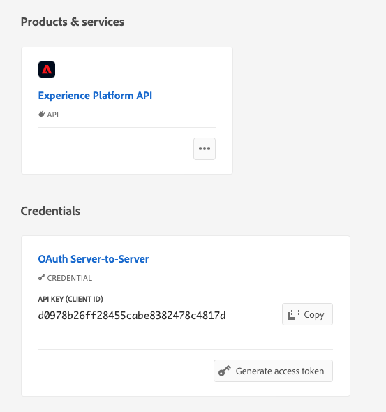
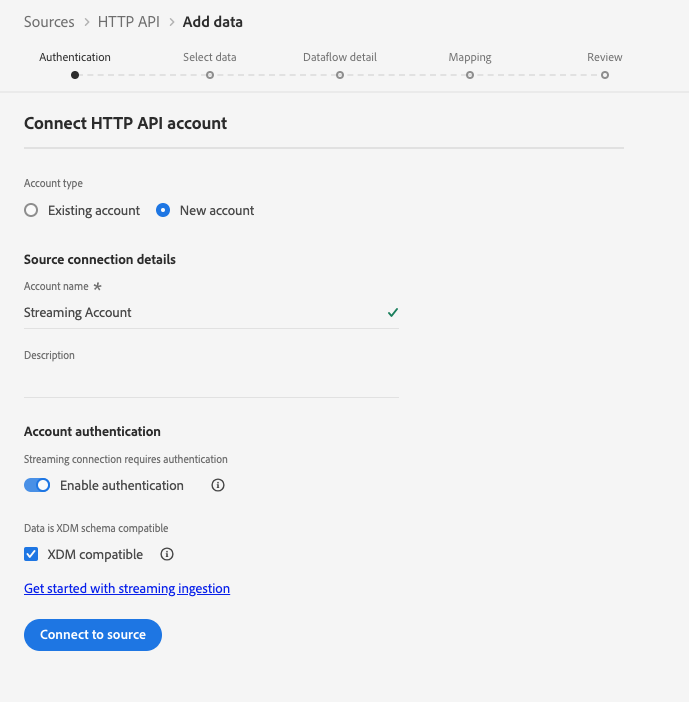
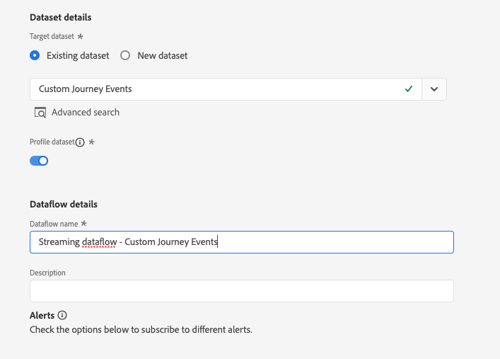
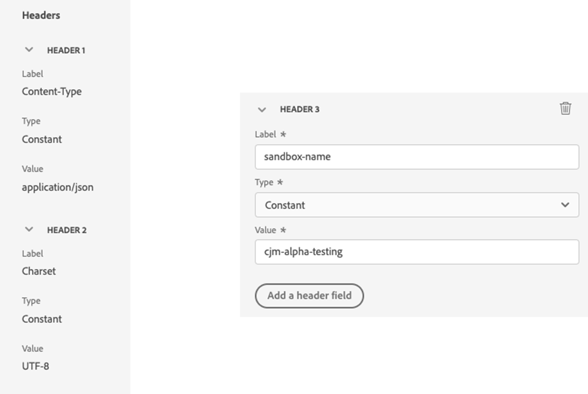
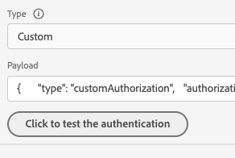
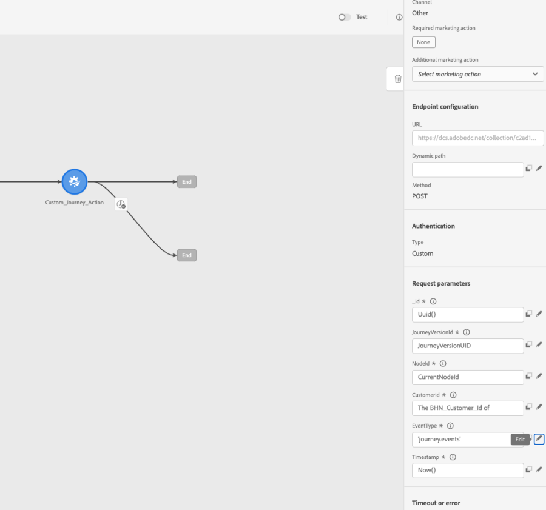

# 使用自訂動作在 Experience Platform 中編寫歷程事件 {#custom-action-aep}

此使用案例說明如何使用自訂動作和已驗證的呼叫，將自訂事件從歷程寫入[!DNL Adobe Experience Platform]。

## 設定開發人員專案 {#custom-action-aep-IO}

1. 在Adobe Developer Console中，按一下&#x200B;**專案**&#x200B;並開啟您的IO專案。

1. 在&#x200B;**認證**&#x200B;區段中，按一下&#x200B;**OAuth伺服器對伺服器**。

   

1. 按一下&#x200B;**檢視cURL命令**。

   ![[!DNL Adobe Experience Platform]動作型別選擇](assets/custom-action-aep-2.png)

1. 複製cURL命令並儲存client_id、client_secret、grant_type和scope。

```
curl -X POST 'https://ims-na1.adobelogin.com/ims/token/v3' -H 'Content-Type: application/x-www-form-urlencoded' -d 'grant_type=client_credentials&client_id=1234&client_secret=5678&scope=openid,AdobeID,read_organizations,additional_info.projectedProductContext,session'
```

>[!CAUTION]
>
>在Adobe Developer Console上建立專案後，請務必授予具有正確許可權的開發人員和API存取控制。 在[[!DNL Adobe Experience Platform] 檔案](https://experienceleague.adobe.com/en/docs/experience-platform/landing/platform-apis/api-authentication#grant-developer-and-api-access-control){target="_blank"}中進一步瞭解

## 使用HTTP API入口設定來源

1. 在[!DNL Adobe Experience Platform]中建立端點以寫入歷程中的資料。

1. 在[!DNL Adobe Experience Platform]中，按一下左側功能表中&#x200B;**連線**&#x200B;下的&#x200B;**來源**。 在&#x200B;**HTTP API**&#x200B;下，按一下&#x200B;**新增資料**。

   ![的[!DNL Adobe Experience Platform]](assets/custom-action-aep-3.png)沙箱選取下拉式清單

1. 選取&#x200B;**新帳戶**&#x200B;並啟用驗證。 選取&#x200B;**連線至Source**。

   

1. 選取&#x200B;**下一步**&#x200B;以及您要寫入資料的資料集。 按一下&#x200B;**下一步**&#x200B;和&#x200B;**完成**。

   

1. 開啟新建立的資料流。 複製結構描述承載並將其儲存在記事本中。

```
{
"header": {
"schemaRef": {
"id": "https://ns.adobe.com/<your_org>/schemas/<schema_id>",
"contentType": "application/vnd.adobe.xed-full+json;version=1.0"
},
"imsOrgId": "<org_id>",
"datasetId": "<dataset_id>",
"source": {
"name": "Custom Journey Events"
}
},
"body": {
"xdmMeta": {
"schemaRef": {
"id": "https://ns.adobe.com/<your_org>/schemas/<schema_id>",
"contentType": "application/vnd.adobe.xed-full+json;version=1.0"
}
},
"xdmEntity": {
"_id": "test1",
"<your_org>": {
"journeyVersionId": "",
"nodeId": "", "customer_Id":""
},
"eventMergeId": "",
"eventType": "",
"producedBy": "self",
"timestamp": "2018-11-12T20:20:39+00:00"
}
}
}
```

## 設定自訂動作 {#custom-action-config}

自訂動作設定在[此頁面](../action/about-custom-action-configuration.md)上詳細說明。

在此範例中，請遵循下列步驟：

1. 開啟[!DNL Adobe Journey Optimizer]，然後按一下左側功能表中&#x200B;**管理**&#x200B;下的&#x200B;**組態**。 在&#x200B;**動作**&#x200B;下，按一下&#x200B;**管理**，然後按一下&#x200B;**建立動作**。

1. 設定URL並選取Post方法。

   `https://dcs.adobedc.net/collection/<collection_id>?syncValidation=false`

1. 請確定已設定標題(Content-Type、Charset、sandbox-name)。

   

### 設定驗證 {#custom-action-aep-authentication}

1. 選取&#x200B;**Type**&#x200B;做為&#x200B;**Custom**，並包含下列承載。

1. 貼上client_secret、client_id、scope和grant_type （來自以前使用的IO專案裝載）。

   ```
   {
   "type": "customAuthorization",
   "authorizationType": "Bearer",
   "endpoint": "https://ims-na1.adobelogin.com/ims/token/v3",
   "method": "POST",
   "headers": {},
   "body": {
   "bodyType": "form",
   "bodyParams": {
   "grant_type": "client_credentials",
   "client_secret": "********",
   "client_id": "<client_id>",
   "scope": "openid,AdobeID,read_organizations,additional_info.projectedProductContext,session"
   }
   },
   "tokenInResponse": "json://access_token",
   "cacheDuration": {
   "duration": 28000,
   "timeUnit": "seconds"
   }
   }
   ```

1. 使用&#x200B;**按一下以測試驗證**&#x200B;按鈕以測試連線。

   

### 設定裝載 {#custom-action-aep-payload}

1. 在&#x200B;**Request**&#x200B;與&#x200B;**Response**&#x200B;欄位中，貼上先前使用之來源連線的裝載。

   ```
   {
   "xdmMeta": {
   "schemaRef": {
   "id": "https://ns.adobe.com/<your_org>/schemas/<schema_id>",
   "contentType": "application/vnd.adobe.xed-full+json;version=1.0"
   }
   },
   "xdmEntity": {
   "_id": "/uri-reference",
   "<your_org>": {
   "journeyVersionId": "Sample value",
   "nodeId": "Sample value",
   "customer_Id":""
   },
   "eventMergeId": "Sample value",
   "eventType": "advertising.completes,
   "producedBy": "self",
   "timestamp": "2018-11-12T20:20:39+00:00"
   }
   }
   ```

1. 將欄位組態從&#x200B;**常數**&#x200B;變更為&#x200B;**變數**，以動態方式填入欄位。

1. 儲存自訂動作。

## 歷程

1. 最後，在歷程中使用此自訂動作來撰寫自訂歷程事件。

1. 根據您的使用案例填入歷程版本ID、節點ID、節點名稱和其他屬性。

   複雜欄位對應的
