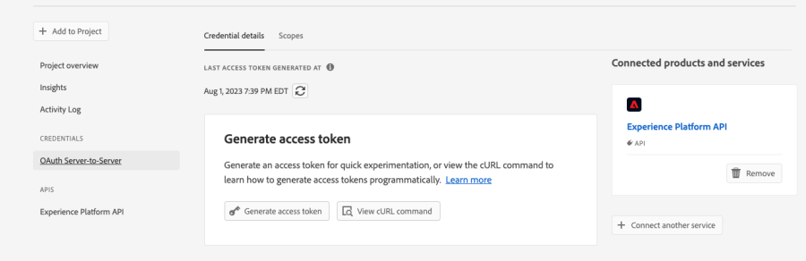
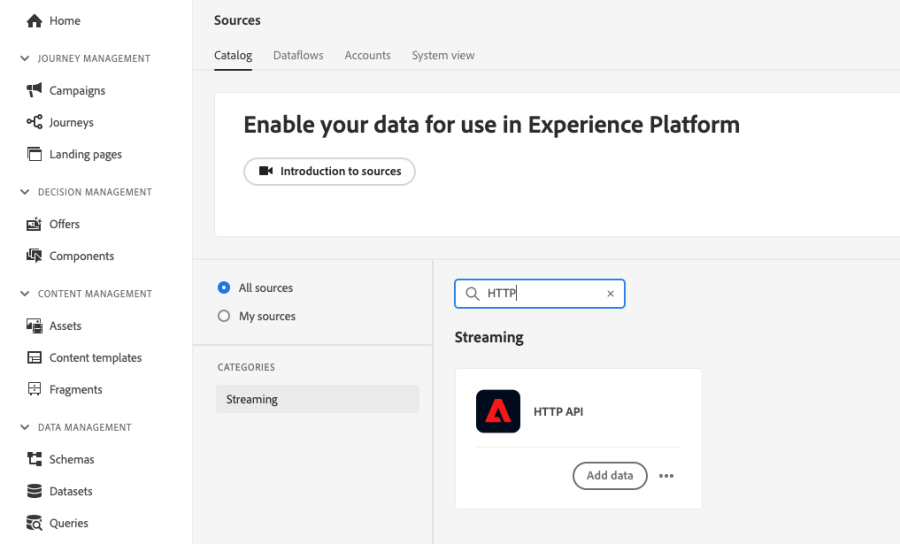

# 使用案例：使用自訂動作在Experience Platform中寫入歷程事件{#custom-action-aep}

此使用案例說明如何使用自訂動作和已驗證的呼叫，將自訂事件從歷程寫入Adobe Experience Platform。

## 設定IO專案

1. 在Adobe Developer主控台中，按一下 **專案** 並開啟您的IO專案。

1. 在 **認證** 區段，按一下 **OAuth伺服器對伺服器**.

   

1. 按一下 **檢視cURL命令**.

   

1. 複製cURL命令並儲存client_id、client_secret、grant_type和scope。

```
curl -X POST 'https://ims-na1.adobelogin.com/ims/token/v3' -H 'Content-Type: application/x-www-form-urlencoded' -d 'grant_type=client_credentials&client_id=1234&client_secret=5678&scope=openid,AdobeID,read_organizations,additional_info.projectedProductContext,session'
```

## 使用HTTP API入口設定來源

1. 在Adobe Experience Platform中建立端點，從歷程寫入資料。

1. 在Adobe Experience Platform中，按一下 **來源**，下 **連線** 在左側功能表中。 在 **HTTP API**，按一下 **新增資料**.

   

1. 選取 **新帳戶** 並啟用驗證。 按一下 **連線到來源**.

   

1. 按一下 **下一個** 並選取您要寫入資料的資料集。 按一下 **下一個** 和 **完成**.

   

1. 開啟新建立的資料流。 複製結構描述承載並將其儲存在記事本中。

```
{
"header": {
"schemaRef": {
"id": "https://ns.adobe.com/<your_org>/schemas/<schema_id>",
"contentType": "application/vnd.adobe.xed-full+json;version=1.0"
},
"imsOrgId": "<org_id>",
"datasetId": "<dataset_id>",
"source": {
"name": "Custom Journey Events"
}
},
"body": {
"xdmMeta": {
"schemaRef": {
"id": "https://ns.adobe.com/<your_org>/schemas/<schema_id>",
"contentType": "application/vnd.adobe.xed-full+json;version=1.0"
}
},
"xdmEntity": {
"_id": "test1",
"<your_org>": {
"journeyVersionId": "",
"nodeId": "", "customer_Id":""
},
"eventMergeId": "",
"eventType": "",
"producedBy": "self",
"timestamp": "2018-11-12T20:20:39+00:00"
}
}
}
```

## 設定自訂動作

1. 開啟Adobe Journey Optimizer，然後按一下 **設定**，下 **管理** 在左側功能表中。 在 **動作**，按一下 **管理** 並按一下 **建立動作**.

1. 設定URL並選取Post方法。

   `https://dcs.adobedc.net/collection/<collection_id>?syncValidation=false`

1. 請確定已設定標題(Content-Type、Charset、sandbox-name)。

   

### 設定驗證

1. 選取 **型別** 作為 **自訂** 並搭配以下裝載。

1. 貼上client_secret、client_id、scope和grant_type （來自以前使用的IO專案裝載）。

   ```
   {
   "type": "customAuthorization",
   "authorizationType": "Bearer",
   "endpoint": "https://ims-na1.adobelogin.com/ims/token/v3",
   "method": "POST",
   "headers": {},
   "body": {
   "bodyType": "form",
   "bodyParams": {
   "grant_type": "client_credentials",
   "client_secret": "********",
   "client_id": "<client_id>",
   "scope": "openid,AdobeID,read_organizations,additional_info.projectedProductContext,session"
   }
   },
   "tokenInResponse": "json://access_token",
   "cacheDuration": {
   "duration": 28000,
   "timeUnit": "seconds"
   }
   }
   ```

1. 使用 **按一下以測試驗證** 按鈕以測試連線。

   

### 設定裝載

1. 在 **請求** 和 **回應** 欄位，貼上以前使用的來源連線的裝載。

   ```
   {
   "xdmMeta": {
   "schemaRef": {
   "id": "https://ns.adobe.com/<your_org>/schemas/<schema_id>",
   "contentType": "application/vnd.adobe.xed-full+json;version=1.0"
   }
   },
   "xdmEntity": {
   "_id": "/uri-reference",
   "<your_org>": {
   "journeyVersionId": "Sample value",
   "nodeId": "Sample value",
   "customer_Id":""
   },
   "eventMergeId": "Sample value",
   "eventType": "advertising.completes,
   "producedBy": "self",
   "timestamp": "2018-11-12T20:20:39+00:00"
   }
   }
   ```

1. 變更欄位設定 **常數** 至 **變數** 適用於會動態填入的欄位。 儲存自訂動作。

## 歷程

1. 最後，在歷程中使用此自訂動作來撰寫自訂歷程事件。

1. 根據您的使用案例填入歷程版本ID、節點ID、節點名稱和其他屬性。

   


