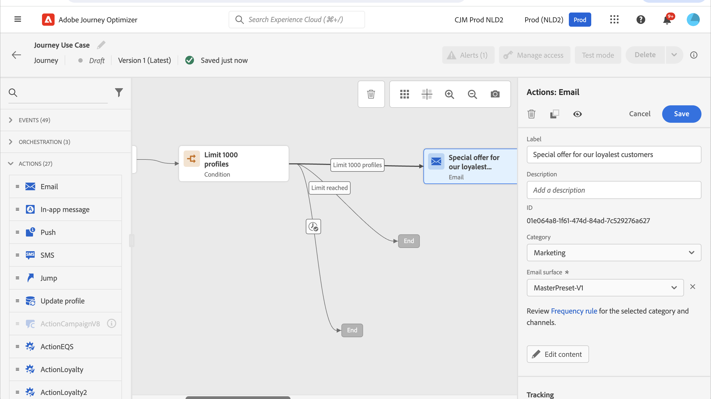

# 使用案例：建立自訂動作以將資料傳送至[!DNL Adobe Experience Platform]{#send-data-to-aep}

如果您最近移至其他電子郵件服務提供者、IP位址或電子郵件網域或子網域，請建立您的寄件者信譽。 否則，可能會封鎖傳遞或將其移至收件者的垃圾郵件資料夾。 如需指引，請參閱[傳遞能力最佳實務指南](https://experienceleague.adobe.com/docs/deliverability-learn/deliverability-best-practice-guide/additional-resources/generic-resources/increase-reputation-with-ip-warming.html?lang=zh-Hant){target="_blank"}。

若要熱身IP，您可以逐步增加傳遞數量。 深入瞭解[在Journey Optimizer](../reports/deliverability.md)中最佳化傳遞能力。

此使用案例的目的是建立歷程，以加快電子郵件傳遞速度。 若要設定此歷程，請遵循下列步驟：

1. 建立歷程。 [閱讀全文](journey-gs.md)。

1. 將&#x200B;**[!UICONTROL 條件]**&#x200B;活動新增至歷程。 [閱讀全文](condition-activity.md)。

1. 在&#x200B;**[!UICONTROL 條件]**&#x200B;活動設定中，設定傳遞的收件者數目上限：

   1. 在&#x200B;**[!UICONTROL 條件]**&#x200B;活動設定中，將&#x200B;**[!UICONTROL 型別]**&#x200B;欄位設定為&#x200B;**[!UICONTROL 設定檔上限]**。 [閱讀全文](condition-activity.md#profile_cap)。

   1. 將&#x200B;**[!UICONTROL 限制]**&#x200B;欄位設定為此傳遞的收件者數目上限。

   

   您可以逐漸提高此限制，最多可達您的訂閱者總數。

1. 在&#x200B;**[!UICONTROL 條件]**&#x200B;活動之後，將&#x200B;**[!UICONTROL 電子郵件]**&#x200B;動作活動新增至名義路徑。

   

   當歷程執行時，會傳送訊息給輸入的設定檔，最多為您指定的設定檔數量上限。 當達到此限制時，輸入的設定檔會採用替代路徑。

1. 使用您選擇的活動完成歷程。

IP啟動後，您就可以移除此條件。
