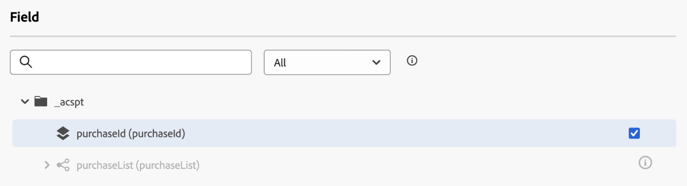
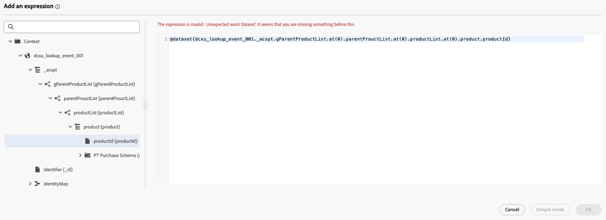

# 在歷程中使用[!DNL Adobe Experience Platform]資料 {#datalookup}

>[!CONTEXTUALHELP]
>id="ajo_journey_dataset_lookup"
>title="資料集查詢活動"
>abstract="**[!UICONTROL 資料集查詢]**&#x200B;活動可讓您在執行階段動態擷取[!DNL Adobe Experience Platform]記錄資料集的資料。 透過運用此功能，您可以存取輪廓或事件裝載內容中可能未駐留的資料，確保客戶互動相關且及時。"

**[!UICONTROL 資料集查詢]**&#x200B;活動可讓您在執行階段動態擷取[!DNL Adobe Experience Platform]記錄資料集的資料。 透過運用此功能，您可以存取輪廓或事件裝載內容中可能未駐留的資料，確保客戶互動相關且及時。

主要優點：

* **即時個人化**：使用擴充資料量身打造客戶體驗。
* **動態決策**：使用外部資料來驅動歷程邏輯和動作。
* **增強型資料存取**：擷取產品中繼資料、訂價表格或與特定金鑰繫結的關聯式資料。

>[!AVAILABILITY]
>
>此活動僅適用於一組組織 (有限可用性)。若想取得存取權，請聯絡您的 Adobe 代表。

## 必讀 {#must-read}

在設定資料集查詢之前，請先檢閱這些需求。

### 資料集啟用

必須在[!DNL Adobe Experience Platform]中啟用資料集以進行查詢。 本節中有詳細資訊： [使用 [!DNL Adobe Experience Platform] 資料](../data/lookup-aep-data.md)。

### 限制和限制

* 每個歷程最多10個資料集查詢活動。
* 最多20個選取的欄位。
* 查詢鍵陣列中最多可有50個鍵。
* 擴充的資料大小上限為10KB。

### 其他效能考量事項

以下建議是避免傳遞延遲的指引：

| 考量 | 建議的限制 | 說明 |
| ------- | ------- | ------- |
| 每個查詢的屬性 | 最多20 | 單一查閱活動中每筆記錄擷取的資料欄位數。 |
| 查詢活動 | 每個歷程最多5個 | 每個歷程最多可包含5個個別的查詢活動。 每個查詢都可以鎖定不同的資料集。 |

## 設定資料集查詢活動 {#configure}

若要設定&#x200B;**[!UICONTROL 資料集查詢]**&#x200B;活動，請遵循下列步驟：

1. 展開&#x200B;**[!UICONTROL 協調流程]**&#x200B;類別，並將&#x200B;**[!UICONTROL 資料集查詢]**&#x200B;活動拖放到畫布中。

   歷程![[!DNL Adobe Experience Platform]中的](assets/aep-data-activity.png)資料集查詢活動

1. 新增標籤和說明。

1. 在&#x200B;**[!UICONTROL 資料集]**&#x200B;欄位中，選取具有所需屬性的資料集。

   >[!NOTE]
   >
   >如果您要尋找的資料集未顯示在清單中，請確定您已啟用它以進行查詢。 如需詳細資訊，請參閱[必須讀取](#must-read)區段。

1. 選取您要從資料集擷取的特定欄位。

   * 您只能選取葉節點（位於結構描述最低層級的欄位）。 欄位必須是基本值（字串、數字、布林值、日期等）。

   * 無法選取清單（陣列）和地圖（機碼值物件）。

   +++範例

   

   +++

1. 在&#x200B;**[!UICONTROL 查閱索引鍵]**&#x200B;欄位中，選擇同時存在於決定專案屬性和資料集中的加入索引鍵。 系統使用此索引鍵來搜尋所選資料集。

   * 金鑰可以是衍生自歷程內容的運算式，例如SKU、電子郵件ID或其他識別碼。 範例： `@profile.email`或`list(@event{purchase_event.products.sku})`。

   * 只支援&#x200B;**字串**&#x200B;或&#x200B;**字串清單**。

   +++範例

   

   +++

## 在歷程中使用擴充的資料

**[!UICONTROL 資料集查詢]**&#x200B;活動擷取的資料會以物件陣列的形式儲存在Journey內容中。 它可在歷程運算式編輯器和個人化編輯器中使用，以根據擴充的資料啟用條件式邏輯和個人化傳訊。

* **歷程運算式編輯器**：

  存取&#x200B;**[!UICONTROL 進階模式]**&#x200B;編輯器並使用語法： `@datasetLookup{MyDatasetLookUpActivity1.entities}`。 [瞭解如何使用進階運算式編輯器](../building-journeys/expression/expressionadvanced.md)

* **Personalization編輯器**：

  使用語法： `{{context.journey.datasetLookup.1482319411.entities}}`。

>[!NOTE]
>
>擴充資料是暫時性的，僅在歷程執行階段以及個人化傳出活動（電子郵件、推播、簡訊等）時可用

## 使用案例範例

+++產品類別型篩選

**案例**:Send&#x200B;給家庭產品花費超過$40的使用者優惠券。

**歷程流程**：

1. **購買事件**：從使用者的購物車擷取SKU。

1. **資料集查詢活動**：

   * 資料集： `products-dataset` （SKU作為主索引鍵）。
   * 查閱金鑰： `list(@event{purchase_event.products.sku})`。
   * 要傳回的欄位： `["SKU", "category", "price"]`。

1. **條件活動**：

   * 篩選類別為「家庭」的SKU。

     ```
     @event{purchase_event.products.all( in(currentEventField.sku, @datasetlookup{MyDatasetLookupActivity1.entities.all(currentDatasetLookupField.category == 'household').sku} ) )} 
     ```

   或

   * 彙總家庭產品的總支出，並將其與$40的臨界值進行比較。

     ```
     sum(@event{purchase_event.products.all( in(currentEventField.sku, @datasetlookup{MyDatasetLookUpActivity1.entities.all(currentDatasetLookupField.category == 'household').sku} ) )}.price}, ',', true ) > 40
     ```

1. **Personalization編輯器**：

   使用擴充資料來個人化電子郵件內容：

   ```
   
   {{#each journey.datasetlookup.3709000.entities as |product|}}
   
   
   {{/each}}
   "Hi, thanks for spending " +  + " on household products. Here is your reward!"
   ```

+++

+++使用外部忠誠度資料的Personalization

**案例**：識別設定檔的哪個電子郵件帳戶具有「白金」忠誠度狀態。 在這種情況下，忠誠度帳戶會與電子郵件ID相關聯，而標準設定檔查詢存放區中不會提供忠誠度資料。

**歷程流程**：

1. **設定檔事件觸發器**：從設定檔或事件內容擷取電子郵件ID。

1. **資料集查詢活動**：
   * 資料集： `loyalty-member-dataset` （以電子郵件作為主索引鍵）。
   * 查閱金鑰： `@profile.email`。
   * 要傳回的欄位： `["email", "loyaltyTier"]`。

1. **條件活動**：

   根據忠誠度等級來分支歷程：

   ```
   @datasetLookup{MyDatasetLookUpActivity1.entity.loyaltyMember.loyaltyTier} == 'Platinum'
   ```

1. **Personalization編輯器**：

   使用擴充的熟客層級資料來個人化傳出通訊：

   ```
   {{context.journey.datasetLookup.1482319411.entity.loyaltyMember.loyaltyTier}}
   ```
