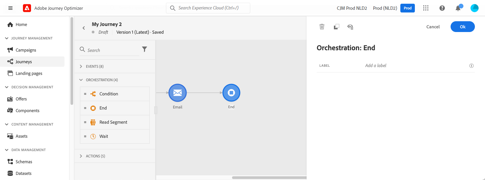

# 結束活動{#end-activity}

>[!CONTEXTUALHELP]
>id="ajo_journey_end"
>title="結束活動"
>abstract="結束活動可讓您標記歷程的每條路徑的終點。這並非強制性，但為了視覺清晰度建議使用。確實如此，如果歷程有多個結束活動，我們建議您為每個結束加上標籤，以使報表更易於閱讀。"

**[!UICONTROL End]**&#x200B;活動可讓您標籤歷程每個路徑的結尾。 這並非強制性，但為了視覺清晰度建議使用。事實上，如果歷程具有數個結束活動，我們建議您為各結尾新增標籤，讓報告更易於閱讀。 請參閱[此頁面](../reports/live-report.md)。

