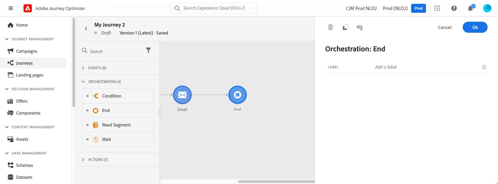

# 結束活動{#end-activity}

>[!BEGINSHADEBOX]

**在此頁面上：**&#x200B;瞭解如何使用結束活動來標籤每個歷程路徑的結尾，並新增標籤，讓您的歷程報告更容易閱讀。

>[!ENDSHADEBOX]

>[!CONTEXTUALHELP]
>id="ajo_journey_end"
>title="結束活動"
>abstract="結束活動可讓您標記歷程的每條路徑的終點。 這並非強制性，但為了視覺清晰度建議使用。 確實如此，如果歷程有多個結束活動，我們建議您為每個結束加上標籤，以使報表更易於閱讀。"

**[!UICONTROL End]**&#x200B;活動可讓您標籤歷程每個路徑的結尾。 這並非強制性，但為了視覺清晰度建議使用。 確實如此，如果歷程有多個結束活動，我們建議您為每個結束加上標籤，以使報表更易於閱讀。 請參閱[此頁面](../reports/live-report.md)。

<!--

-->

+++ AI知識參考

本節包含結構化知識，用於支援與本主題相關的解譯、擷取和問答。

如需完整瞭解，此資訊應結合本頁的檔案。 兩者皆非獨立來源；頁面說明功能，本節提供額外內容，以協助去除術語、意圖、適用性和限制條件的歧義。

* **TL；DR：**&#x200B;此頁面說明Journey Optimizer中的「結束」活動，這是放置在每個歷程路徑結尾的視覺標籤，雖然這是選用專案，但建議用於提高報表可讀性。

**意圖：**

* 新增結束活動以標籤歷程路徑的結論
* 標籤結束活動，以改善歷程報告可讀性
* 使用標籤的結束節點以視覺化方式區分多個歷程路徑

**字彙表：**

* **結束活動**：以視覺化方式標示歷程路徑結尾的歷程節點；它不是強制性的，但有助於清楚明瞭&#x200B;*（產品特定）*

**護欄：**

* 結束活動不是強制性的；沒有它歷程會運作。
* 建議在歷程有多個路徑時，為每個「結束」活動新增標籤，以便更輕鬆解讀即時報表。

**術語：**

* 正式名稱：結束活動 — 縮寫：n/a — 變體：結束節點、結束標籤
* 請勿混淆：「結束活動」≠「結束標籤」 — 「結束標籤」是在歷程編寫期間顯示的自動產生節點，而「結束」活動是可放置的元件

**常見問題集：**

* **問：發佈歷程是否需要結束活動？**  — 不需要，並非強制性，但為求視覺清晰度，建議使用。
* **問：為何要標示結束活動？**  — 當歷程有多個路徑時，標籤有助於在歷程報告中區分它們。
* **問：我可以在哪裡看到「結束」活動標籤的影響？**  — 標籤會出現在歷程即時報告中，以便更輕鬆地追蹤路徑層級的效能。

+++
