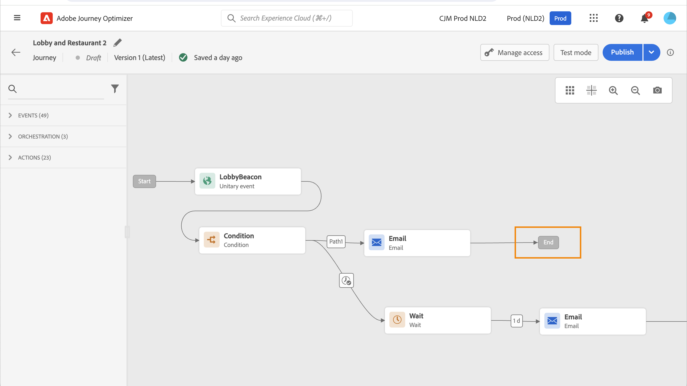
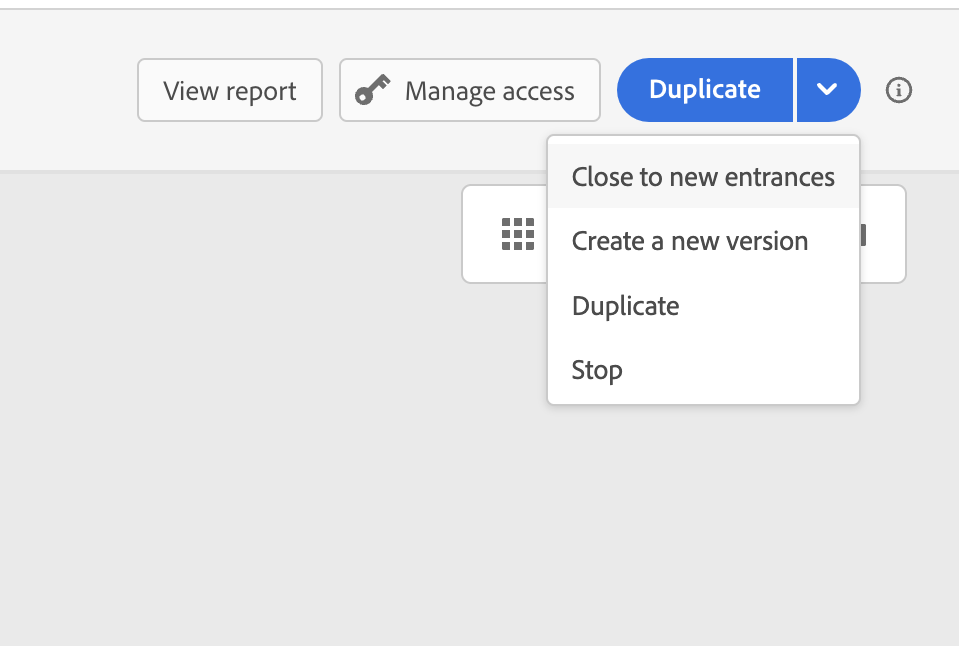
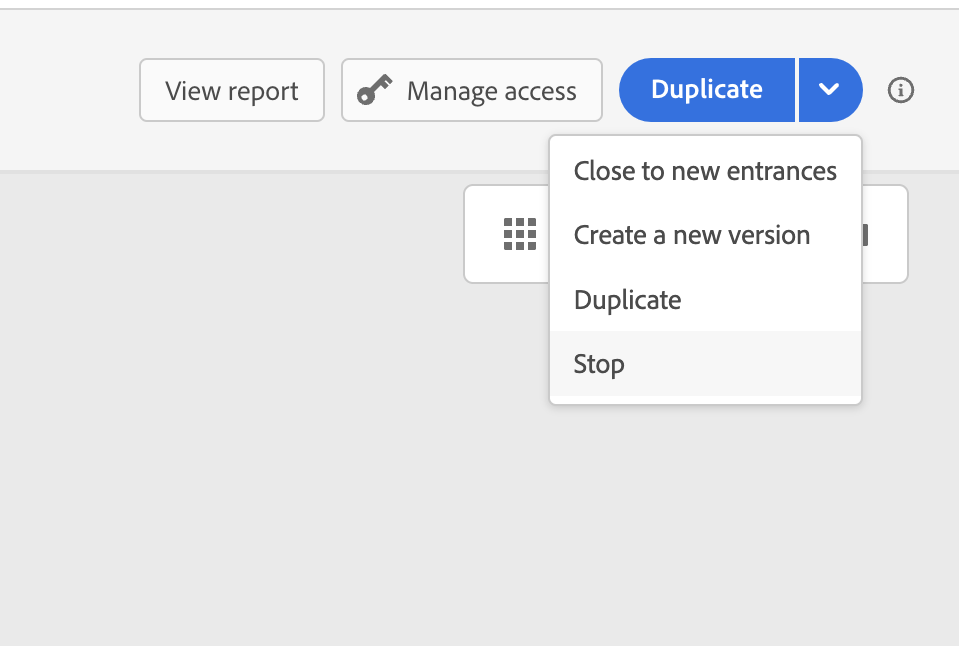

# 結束歷程 {#journey-ending}

## 即時歷程的結束方式

當達到全域歷程逾時時，或在上次發生循環以對象為基礎的歷程後，歷程會關閉。 [瞭解歷程如何結束](#close-journey)。

如果您需要終止即時歷程，建議[您手動將其關閉](#close-to-new-entrances)。 接著，新客戶進入歷程時會被封鎖。 已進入歷程的個人檔案能夠體驗到結尾。

您也可以[停止歷程](#stop-journey)，但僅限於緊急情況下且必須立即結束所有歷程處理時。 已進入歷程的人員都在進度中停止。

>[!IMPORTANT]
>
>* 您無法重新啟動或刪除[已關閉](#close-journey)或[已停止](#stop-journey)歷程。 您可以[建立其新版本](publish-journey.md#journey-versions)或[複製它](journey-ui.md#duplicate-a-journey)。
>
>* 只能刪除已完成的歷程。

## 設定檔如何結束歷程

歷程在兩個特定情境中為個人結束：

* 個人到達路徑的最後一個活動，然後移至[結束標籤](#end-tag)。
* 個人達到&#x200B;**條件**&#x200B;活動（或具有條件的&#x200B;**等待**&#x200B;活動），但不符合任何條件。

如果允許重新進入，個人可以重新進入歷程。 [進一步瞭解進入/重新進入管理](../building-journeys/journey-properties.md#entrance)

## 歷程結束標籤 {#end-tag}

製作歷程時，每個路徑的結尾都會顯示「結束」標籤。 此節點無法由使用者新增、無法移除，而且只能變更其標籤。 它會標籤歷程每個路徑的結尾。

如果歷程有數個路徑，我們建議您在每個結尾新增標籤，讓報告更易於閱讀。 深入瞭解[歷程報告](../reports/live-report.md)。

## 關閉歷程 {#close-journey}

歷程可以關閉，原因如下：

* 已完成執行且達到全域逾時91天的單次區段型歷程。
* 在最後一次發生循環對象歷程後。
* 歷程已透過[**[!UICONTROL 關閉新入口]**](#close-to-new-entrances)按鈕手動關閉。

在&#x200B;**91天歷程全域逾時**&#x200B;後，「讀取」對象歷程會切換為&#x200B;**已完成**&#x200B;狀態。 此行為僅會設定91天，因為有關進入歷程的設定檔的所有資訊都會在進入91天後移除。 仍在歷程中的人員會自動受到影響。 他們在91天逾時後退出歷程。  深入瞭解[歷程全域逾時](../building-journeys/journey-properties.md#global_timeout)。

>[!TIP]
>
>單次區段歷程在執行一次後仍會維持&#x200B;**即時**&#x200B;狀態。 設定檔一旦完成即無法重新輸入，但歷程會維持在&#x200B;**即時**&#x200B;狀態，直到預設全域逾時過期為止。 您可以使用&#x200B;**關閉新入口**&#x200B;選項，更早手動關閉入口。

### 關閉新入口 {#close-to-new-entrances}

手動關閉歷程可確保已進入歷程的客戶完成其路徑，但新使用者無法進入歷程。 歷程關閉時（基於上述任何原因），其狀態為&#x200B;**[!UICONTROL 已關閉]**。 歷程停止讓新個人進入歷程。 已在歷程中的設定檔可以正常完成歷程。 預設全域逾時91天後，歷程將切換為&#x200B;**已完成**&#x200B;狀態。

若要從歷程清單關閉歷程，請按一下歷程名稱右側的&#x200B;**[!UICONTROL 省略符號]**&#x200B;按鈕，並選取&#x200B;**[!UICONTROL 關閉新入口]**。

您也可以：

1. 在&#x200B;**[!UICONTROL 歷程]**&#x200B;清單中，按一下您要關閉的歷程。
1. 在右上方，按一下向下箭頭。

   {width="50%" align="left" zoomable="yes"}

1. 按一下&#x200B;**[!UICONTROL 關閉新入口]**，然後在對話方塊中確認。

## 停止歷程 {#stop-journey}

如果您需要停止歷程中所有個人的進度，可以停止它。 停止歷程逾時歷程中的所有個人。 但是，停止歷程涉及已經進入歷程的人都在他們的進度中停止。 歷程已基本關閉。 如果您想要結束歷程，最佳實務是[關閉歷程](#close-journey)。

例如，如果行銷人員發現歷程鎖定了錯誤的對象，或應該傳送訊息的自訂動作無法正常運作，則可以停止歷程。 若要從歷程清單停止歷程，請按一下歷程名稱右側的&#x200B;**[!UICONTROL 省略符號]**&#x200B;按鈕，並選取&#x200B;**[!UICONTROL 停止]**。

您也可以：

1. 在&#x200B;**[!UICONTROL 歷程]**&#x200B;清單中，按一下您要停止的歷程。
1. 在右上方，按一下向下箭頭。

   {width="50%" align="left" zoomable="yes"}

1. 按一下&#x200B;**[!UICONTROL 停止]**，然後在對話方塊中確認。

停止時，歷程狀態會設為&#x200B;**[!UICONTROL 已停止]**。

>[!CAUTION]
>
>停止歷程的許可權僅限於具有&#x200B;**[!DNL Manage journeys]**&#x200B;高階許可權的使用者。 在[!DNL Journey Optimizer]本節[中進一步瞭解如何管理](../administration/permissions-overview.md)使用者的存取權。