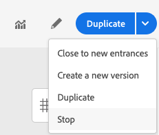

# 結束歷程 {#journey-ending}

>[!TIP]
>
>正在尋找設定檔何時及如何結束歷程的實用指引？ 請參閱我們的[歷程登入與退出條件完整指南](entry-exit-criteria-guide.md)，其中包括真實世界的退出案例、最佳實務和設定指南。

## 即時歷程的結束方式

當達到全域歷程逾時時，或在上次發生循環以對象為基礎的歷程後，歷程會關閉。 [瞭解歷程如何結束](#close-journey)。

如果您需要終止即時歷程，建議[您手動將其關閉](#close-to-new-entrances)。 接著，新客戶進入歷程時會被封鎖。 已進入歷程的個人檔案能夠體驗到結尾。

您也可以[停止歷程](#stop-journey)，但僅限於緊急情況下且必須立即結束所有歷程處理時。 已進入歷程的人員都在進度中停止。

>[!IMPORTANT]
>
>* 您無法重新啟動或刪除[已關閉](#close-journey)或[已停止](#stop-journey)歷程。 您可以[建立其新版本](publish-journey.md#journey-versions)或[複製它](journey-ui.md#duplicate-a-journey)。
>
>* 只能刪除已完成的歷程。

## 設定檔如何結束歷程

歷程在兩個特定情境中為個人結束：

* 個人到達路徑的最後一個活動，然後移至[結束標籤](#end-tag)。
* 個人達到&#x200B;**條件**&#x200B;活動（或具有條件的&#x200B;**等待**&#x200B;活動），但不符合任何條件。

如果允許重新進入，個人可以重新進入歷程。 [進一步瞭解進入/重新進入管理](../building-journeys/journey-properties.md#entrance)

## 歷程結束標籤 {#end-tag}

製作歷程時，每個路徑的結尾都會顯示「結束」標籤。 此節點無法由使用者新增、無法移除，而且只能變更其標籤。 它會標籤歷程每個路徑的結尾。

如果歷程有數個路徑，我們建議您在每個結尾新增標籤，讓報告更易於閱讀。 深入瞭解[歷程報告](../reports/live-report.md)。

## 關閉歷程 {#close-journey}

歷程可以關閉，原因如下：

* 一旦最後一個設定檔結束歷程，非循環讀取對象歷程&#x200B;**就會自動停止**。 [了解更多](#auto-stop-non-recurring)
* 在最後一次發生循環對象歷程後。
* 歷程已透過[**[!UICONTROL 關閉新入口]**](#close-to-new-entrances)按鈕手動關閉。
* 已達到91天的全域歷程逾時。

在&#x200B;**91天歷程全域逾時**&#x200B;後，「讀取」對象歷程會切換為&#x200B;**已完成**&#x200B;狀態。 此行為僅會設定91天，因為有關進入歷程的設定檔的所有資訊都會在進入91天後移除。 仍在歷程中的人員會自動受到影響。 他們在91天逾時後退出歷程。  深入瞭解[歷程全域逾時](../building-journeys/journey-properties.md#global_timeout)。

### 非循環對象的自動歷程停止 {#auto-stop-non-recurring}

**非循環讀取對象歷程**&#x200B;現在會在最後一個設定檔退出歷程時，自動轉換成&#x200B;**[!UICONTROL 已停止]**&#x200B;狀態。 如此可免除先前非循環讀取對象歷程一直保持&#x200B;**即時**&#x200B;狀態直到91天全域逾時過期的行為，即使沒有設定檔在積極地流過。

**運作方式：**

1. 歷程會執行，並處理對象中的所有設定檔。
1. 當每個設定檔達到歷程結尾時，就會正常結束。
1. 當&#x200B;**最後一個使用中的設定檔結束**&#x200B;時，歷程會自動轉換成&#x200B;**[!UICONTROL 已停止]**&#x200B;狀態。

此行為僅適用於&#x200B;**非循環讀取對象歷程**。 循環歷程不受影響。

>[!NOTE]
>
>此自動停止行為&#x200B;**不**&#x200B;適用於包含造成等候期間之節點的非週期性歷程，例如&#x200B;**等待**&#x200B;節點（以計時器為基礎）、**回應**&#x200B;節點（等候電子郵件開啟或點按之類的事件），或事件觸發的轉變。 這些歷程仍受標準91天全域逾時的約束。

>[!NOTE]
>
>您仍然可以使用&#x200B;**[!UICONTROL 關閉新入口]**&#x200B;選項，隨時手動關閉非循環讀取對象歷程。 自動停止行為可確保歷程在不再需要時自動停止，無需手動干預。

### 何時歷程會視為「已完成」？ {#journey-finished-definition}

「已完成」的定義會依歷程型別而異：

| 歷程型別 | 週期性？ | 有結束日期嗎？ | 「已完成」的定義 |
|--------------|------------|---------------|--------------------------|
| 讀取客群 | 無 | 不適用 | 當最後一個設定檔退出時（自動停止） |
| 讀取客群 | 是 | 無 | 上次發生開始後91天 |
| 讀取客群 | 是 | 是 | 達到結束日期時 |
| 事件觸發的歷程 | 不適用 | 是 | 達到結束日期時 |
| 事件觸發的歷程 | 不適用 | 無 | 在UI中或透過API關閉時 |

### 關閉新入口 {#close-to-new-entrances}

手動關閉歷程可確保已進入歷程的客戶完成其路徑，但新使用者無法進入歷程。 歷程關閉時（基於上述任何原因），其狀態為&#x200B;**[!UICONTROL 已關閉]**。 歷程停止讓新個人進入歷程。 已在歷程中的設定檔可以正常完成歷程。 預設全域逾時91天後，歷程將切換為&#x200B;**已完成**&#x200B;狀態。

若要從歷程清單關閉歷程，請按一下歷程名稱右側的&#x200B;**[!UICONTROL 省略符號]**&#x200B;按鈕，並選取&#x200B;**[!UICONTROL 關閉新入口]**。

您也可以：

1. 在&#x200B;**[!UICONTROL 歷程]**&#x200B;清單中，按一下您要關閉的歷程。
1. 在右上方，按一下向下箭頭。

   {width="50%" zoomable="yes"}

1. 按一下&#x200B;**[!UICONTROL 關閉新入口]**，然後在對話方塊中確認。

## 停止歷程 {#stop-journey}

如果您需要停止歷程中所有個人的進度，可以停止它。 停止歷程逾時歷程中的所有個人。 但是，停止歷程涉及已經進入歷程的人都在他們的進度中停止。 歷程已基本關閉。 如果您想要結束歷程，最佳實務是[關閉歷程](#close-journey)。

例如，如果行銷人員發現歷程鎖定了錯誤的對象，或應該傳送訊息的自訂動作無法正常運作，則可以停止歷程。 若要從歷程清單停止歷程，請按一下歷程名稱右側的&#x200B;**[!UICONTROL 省略符號]**&#x200B;按鈕，並選取&#x200B;**[!UICONTROL 停止]**。

您也可以：

1. 在&#x200B;**[!UICONTROL 歷程]**&#x200B;清單中，按一下您要停止的歷程。
1. 在右上方，按一下向下箭頭。

   {width="50%" zoomable="yes"}

1. 按一下&#x200B;**[!UICONTROL 停止]**，然後在對話方塊中確認。

停止時，歷程狀態會設為&#x200B;**[!UICONTROL 已停止]**。

>[!CAUTION]
>
>停止歷程需要&#x200B;**[!DNL Manage journeys]**&#x200B;許可權。 如果歷程包含內嵌行銷活動或訊息節點，使用者還需要&#x200B;**行銷活動>發佈行銷活動**&#x200B;許可權。 如果歷程使用資產（例如在電子郵件中），使用者必須擁有這些資產資料夾的存取權。 在[本節](../administration/permissions-overview.md)中進一步瞭解如何管理[!DNL Journey Optimizer]使用者的存取權。

## 相關主題

* [歷程登入與退出條件指南](entry-exit-criteria-guide.md) — 包含真實世界範例和最佳實務的完整指南
* [設定檔入口管理](entry-management.md) — 設定設定檔進入歷程的方式
* [設定退出條件](journey-properties.md#exit-criteria) — 設定從歷程自動移除設定檔
* [暫停歷程](journey-pause.md) — 暫時停止歷程執行