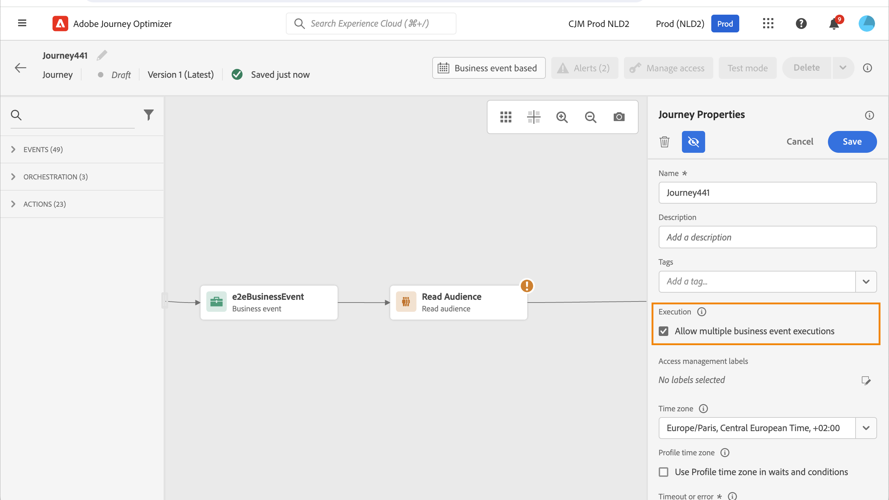

# 輪廓入口管理 {#entry-management}

設定檔入口管理取決於歷程型別。

## 歷程型別 {#types-of-journeys}

您可以使用Adobe Journey Optimizer建立下列型別的歷程：

* **單一事件**&#x200B;歷程：這些歷程始於單一事件。 收到事件時，關聯的設定檔會進入歷程。 [閱讀全文](#entry-unitary)

* **商務事件**&#x200B;歷程：這些歷程的開頭為商務事件，緊接著是&#x200B;**讀取對象**&#x200B;活動。 收到事件時，屬於目標對象的設定檔會進入歷程。 系統會為每個設定檔建立一個歷程例項。 [閱讀全文](#entry-business)

* **讀取對象**&#x200B;歷程：這些歷程以&#x200B;**讀取對象**&#x200B;活動開始。 執行歷程時，屬於目標對象的設定檔會進入歷程。 系統會為每個設定檔建立一個歷程例項。 這些歷程可以是循環或「單次」。 [閱讀全文](#entry-read-audience)

* **對象資格**&#x200B;歷程：這些歷程以對象資格事件開始。 這些歷程會監聽對象中設定檔的入口和出口。 發生此情況時，關聯的設定檔會進入歷程。 [閱讀全文](#entry-unitary)

在所有歷程型別中，設定檔無法在同一歷程中同時出現多次，適用於歷程的所有作用中[版本](publish-journey.md#journey-versions)。 若要檢查某人是否在歷程中，則會將設定檔身分識別當作金鑰。 系統不允許相同的索引鍵（例如索引鍵`CRMID=3224`）位於相同歷程中的不同位置。

## 歷程處理率 {#journey-processing-rate}

歷程處理率受多個因素影響，這些因素決定設定檔如何流經歷程：

### 設定檔進入率 {#profile-entrance-rate}

設定檔輸入歷程的方式及其預期費率取決於使用的第一個活動：

* **讀取對象**&#x200B;歷程（批次案例，您定位設定檔對象並觸發該完整對象的歷程）：最大為20,000 TPS （每秒交易數），這是&#x200B;**沙箱層級**&#x200B;可用的配額。 如果您在該沙箱上同時執行多個歷程，可能無法達成20,000 TPS。 將此最大值視為最佳案例。

* **對象資格**&#x200B;歷程（單一案例，您想在設定檔符合或不符合串流對象資格時觸發歷程）：最大為5,000 TPS。 請注意，這是以事件開始的歷程的共用限制，也會在&#x200B;**組織層級**&#x200B;的歷程間共用。

* **單一事件**&#x200B;歷程（單一案例，您想要在從設定檔發出事件時觸發歷程）：與上述相同，都共用相同的5,000 TPS限制。 有關歷程事件輸送量的詳細資訊，請參閱[本節](../event/about-events.md#event-thoughput)。

* **業務事件**&#x200B;歷程（基本上是批次情境的單一專案，因為業務事件後面一律有讀取對象）：業務事件也會計入5,000 TPS配額，但之後讀取對象活動將具有與以讀取對象(20,000 TPS)開始的歷程相同的限制。

### 歷程中的事件和受眾資格 {#events-inside-journeys}

進入之後，您可以在歷程中使用&#x200B;**單一事件**&#x200B;或&#x200B;**對象資格**&#x200B;活動。 設定檔可以輸入上述4種歷程型別中的任一種，並等待事件發出或等待此設定檔符合對象資格。 這些單一事件和受眾資格將計入上述配額中。 例如：如果您以讀取對象（最多20,000 TPS）開始歷程，並在之後有事件，則此事件最多為5,000 TPS。

### 等待活動影響 {#wait-activities-impact}

歷程中的&#x200B;**等待**&#x200B;活動也會影響在特定時間流經歷程的個人檔案數。 等待活動通常以相對時間為基礎（例如：在進入等待2小時後退出，因此所有設定檔都不會同時退出）。 不過，如果在該等待活動上定義了固定時間，則多個設定檔可能會同時退出該歷程。 不建議使用此做法。 然後可以看到大量磁碟區，並且從此點開始TPS可以超過20,000 TPS。

### 動作活動 {#action-activities-impact}

最後，**動作**&#x200B;活動（電子郵件、簡訊、推播等原生頻道、傳出或傳入、自訂動作、將設定檔傳送到其他歷程的跳躍、更新將資料傳送到統一設定檔服務的設定檔等）可能會受到歷程產生的設定檔載入影響，但也會影響處理速率。 例如，以具有較高回應時間的外部端點為目標的自訂動作將會減慢歷程處理速度。

對於自訂動作，預設的上限為每分鐘300,000次呼叫，這可以用自訂上限原則變更。 在[本節](../configuration/external-systems.md#capping)中進一步瞭解自訂動作上限。

## 單一事件和受眾資格歷程{#entry-unitary}

在&#x200B;**單一事件**&#x200B;和&#x200B;**對象資格**&#x200B;歷程中，您可以啟用或停用重新進入：

* 如果啟用重新進入，設定檔可以進入歷程多次，但必須完全退出歷程的上一個執行個體，才能進入。

* 如果停用重新進入，則設定檔無法在全域歷程逾時期間內多次進入相同歷程。 請參閱[本章節](../building-journeys/journey-properties.md#global_timeout)。

依預設，歷程允許重新進入。 啟動&#x200B;**允許重新進入**&#x200B;選項時，會顯示&#x200B;**重新進入等待期間**&#x200B;欄位。 它可讓您定義允許設定檔再次進入歷程之前的等待時間。 這可防止同一事件多次錯誤觸發歷程。預設情況下，欄位會設為 5 分鐘。 持續時間上限為91天（[全域逾時](journey-properties.md#global_timeout)）。

<!--
When a journey ends, its status is **[!UICONTROL Closed]**. New individuals can no longer enter the journey. Persons already in the journey automatically exit the journey. 
-->

在重新進入期間後，設定檔可以重新進入歷程。 為避免此情況，並完全停用這些設定檔的重新進入，您可以使用設定檔或受眾資料，新增條件以測試是否已輸入設定檔。

<!--
Due to the 30-day journey timeout, when journey reentrance is not allowed, we cannot make sure the reentrance blocking will work more than 91 days. Indeed, as we remove all information about persons who entered the journey 91 days after they enter, we cannot know the person entered previously, more than 91 days ago. -->

## 業務歷程 {#entry-business}

<!--
Business events follow reentrance rules in the same way as for unitary events. If a journey allows reentrance, the next business event will be processed.
-->

在&#x200B;**商業歷程**&#x200B;中，若要允許多個商業事件執行，請在歷程屬性的&#x200B;**[!UICONTROL 執行]**&#x200B;區段中啟動對應的選項。

若是業務事件，對於特定歷程，第一次執行所擷取的對象資料會在1小時時段內重複使用。

個人資料可能在同一歷程中同時出現多次，但在不同業務事件的情境下會出現。

如需詳細資訊，請參閱此[區段](../event/about-creating-business.md)

## 讀取對象歷程 {#entry-read-audience}

**讀取對象**&#x200B;歷程可以是週期性或「一次性」：

* 對於非循環/「單次」歷程：設定檔在歷程中只進入一次。

* 對於循環歷程：依預設，屬於對象的所有設定檔都會在每次循環時進入歷程。 使用者必須先完成歷程，才能在另一個發生次數中重新進入。

有數個選項可用於循環讀取受眾歷程。 如需詳細資訊，請參閱[在歷程中使用對象](../building-journeys/read-audience.md)區段。

<!--
After 91 days, a Read audience journey switches to the **Finished** status. This behavior is set for 91 days only (i.e. journey timeout default value) as all information about profiles who entered the journey is removed 91 days after they entered. Persons still in the journey automatically are impacted. They exit the journey after the 30 day timeout. 
-->
