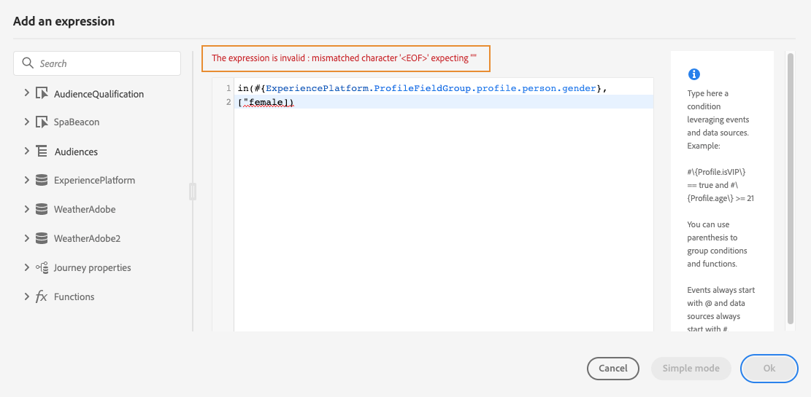

# 使用進階運算式編輯器 {#about-the-advanced-expression-editor}

>[!CONTEXTUALHELP]
>id="ajo_journey_expression_advanced"
>title="關於進階運算式編輯器"
>abstract="使用進階運算式編輯器在介面的不同畫面中建置進階運算式。例如，您可以在設定和使用歷程時以及定義資料來源條件時建置運算式。"

使用Journey進階運算式編輯器，在介面的各種畫面中建置進階運算式。 例如，您可以在設定和使用歷程時以及定義資料來源條件時建置運算式。

此外，您每次必須定義需要特定資料處理的動作參數時，都可以使用它。您可以善用來自事件的資料或是從資料來源擷取的其他資訊。在歷程中，顯示的事件欄位清單會與情境相關，而且會根據歷程中新增的事件而有所不同。

進階運算式編輯器提供一組內建函式和運算子，讓您得以控制值並定義特別符合您需求的運算式。進階運算式編輯器也可讓您定義外部資料來源引數的值、控制對應欄位和集合。

>[!NOTE]
>
>歷程進階運算式編輯器中可用的功能和功能，與[個人化編輯器](../../personalization/functions/functions.md)中可用的功能和功能不同。

## 存取進階運算式編輯器 {#accessing-the-advanced-expression-editor}

進階運算式編輯器可用於：

* 建立[資料來源](../condition-activity.md#about_condition)及事件資訊的進階條件
* 定義自訂[等待活動](../wait-activity.md#custom)
* 定義動作參數對應

可能的話，您可以使用&#x200B;**[!UICONTROL 進階模式]** / **[!UICONTROL 簡單模式]**&#x200B;按鈕，在兩個模式之間切換。 [此處](../condition-activity.md#about_condition)會說明簡單模式。

>[!NOTE]
>
>* 可在簡單或進階運算式編輯器中定義條件。它們一律會傳回布林值類型。
>
>* 藉由選取欄位或透過進階運算式編輯器，以定義動作參數。他們會根據其運算式傳回特定資料類型。

您可以透過不同方式存取進階運算式編輯器：

* 當您建立資料來源條件時，可以按一下&#x200B;**[!UICONTROL 進階模式]**&#x200B;來存取進階編輯器。

  

* 建立自訂計時器時，會直接顯示進階編輯器。
* 當您對應動作引數時，請按一下&#x200B;**[!UICONTROL 進階模式]**。

## 探索介面 {#discovering-the-interface}

此畫面可讓您手動編寫運算式。

在畫面左側，會顯示可用的欄位和函式：

* **[!UICONTROL 事件]**：選擇從傳入事件接收的其中一個欄位。 顯示的事件欄位清單會與情境相關，而且會根據歷程中新增的事件而有所不同。 [閱讀全文](../../event/about-events.md)

  >[!CAUTION]
  >
  >不支援使用體驗事件建立運算式。 使用體驗事件建立運算式/邏輯的替代方法和最佳實務已參考[這裡](../../building-journeys/exp-event-lookup.md)

* **[!UICONTROL 對象]**：如果您已卸除&#x200B;**[!UICONTROL 對象資格]**&#x200B;事件，請選擇您要在運算式中使用的對象。 [閱讀全文](../condition-activity.md#using-a-segment)
* **[!UICONTROL 資料來源]**：從資料來源欄位群組中的可用欄位清單中選擇。 [閱讀全文](../../datasource/about-data-sources.md)
* **[!UICONTROL 歷程屬性]**：此區段會將與特定設定檔之歷程相關的技術欄位重新分組。 [閱讀全文](journey-properties.md)
* **[!UICONTROL 函式]**：從允許執行複雜篩選的內建函式清單中選擇。 函式會依類別組織。 [閱讀全文](functions.md)

自動完成機制會顯示內容建議。

語法驗證機制會檢查程式碼的完整性。錯誤會顯示在編輯器上方。

>[!TIP]
>
>在進階運算式編輯器中建立條件時，請確定您的運算式不包含隱藏或不可列印的字元。 此外，請使用單行運算式，以避免剖析錯誤。

**使用進階運算式編輯器建立條件時，需要使用參數**

如果您從外部資料來源選取需要呼叫引數的欄位（請參閱[此頁面](../../datasource/external-data-sources.md)），右側會出現新索引標籤，讓您指定此引數。 引數值可能來自位於歷程或Experience Platform資料來源中的事件（而非其他外部資料來源）。 例如，在天氣相關資料來源中，常用的參數為 &quot;city&quot;。因此，您必須選擇要取得此城市參數的位置。也可將函式套用至參數，以執行格式變更或串聯。

對於更複雜的使用案例，如果您想將資料來源的參數包含在主運算式中，則可使用 &quot;params&quot; 關鍵字來定義其值。請參閱[此頁面](../expression/field-references.md)。
