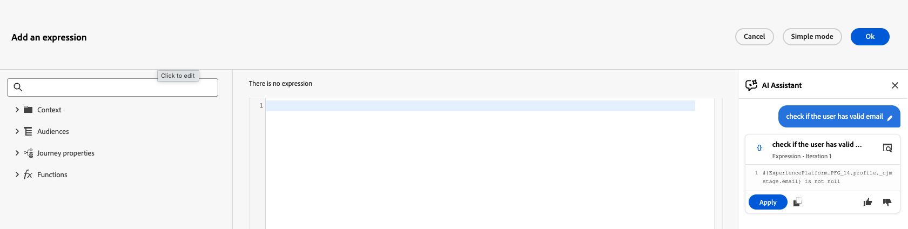

# 使用 AI 產生運算式 {#generate-expression}

>[!CONTEXTUALHELP]
>id="journeyExpAI"
>title="使用 AI 產生運算式"
>abstract="使用 AI 在歷程進階運算式編輯器中直接建立及產生運算式。 例如：在條件、**最佳化**&#x200B;活動、或使用自訂日期的&#x200B;**等待**&#x200B;活動中。 當您以簡單明瞭的語言描述您所需的內容時，AI 就會為您產生對應的運算式。"

>[!IMPORTANT]
>
>在使用此功能之前，請先閱讀適用於Journey Optimizer中產生AI功能的相關[護欄和限制](../../content-management/gs-generative.md#generative-guardrails)。

此AI支援的功能，內建在Journey進階運算式編輯器中，可幫助您從純語言提示產生有效的運算式。

在歷程&#x200B;**[!UICONTROL 進階運算式編輯器]**&#x200B;開啟的任何位置，都可以使用它。 例如，當您在&#x200B;**[最佳化活動](../optimize.md)**&#x200B;中設定條件和路由，或當您設定使用自訂日期的[**[!UICONTROL 等待&#x200B;]**活動](../wait-activity.md)，而您需要`dateTimeOnly`運算式時。

## 產生運算式 {#generate}

若要使用AI產生運算式：

1. 開啟歷程中的&#x200B;**[!UICONTROL 進階運算式編輯器]**，例如，從分支條件、**[!UICONTROL 最佳化]**&#x200B;活動或具有自訂日期的&#x200B;**[!UICONTROL 等待]**&#x200B;活動。

   

1. 在文字欄位中，以純文字描述您要產生的運算式。 例如：

   * *&quot;來自美國的使用者年齡超過18歲&quot;*
   * *「過去30天內購買過的客戶」*

   請參閱此頁面結尾的[範例提示](#example-prompts)以取得想法。

1. 按一下&#x200B;**[!UICONTROL 產生]**&#x200B;提交您的提示。

   助理開始產生對應的運算式，並在產生過程中顯示進度狀態訊息。

   >[!NOTE]
   >
   >如果助理無法產生有效的運算式（例如，如果您的提示參考可用資料來源中不存在的欄位），便會出現錯誤訊息。 發生此情況時，請修訂您的提示，使用歷程設定中可用的欄位名稱和資料來源，然後再次產生。

1. 一旦運算式準備就緒，便可在面板中檢閱結果。

   

   * 在套用之前，請按一下圖示，以檢閱您要求的案例的助理輸出。

   * 按一下&#x200B;**[!UICONTROL 套用]**，將產生的運算式直接插入進階運算式編輯器中（與您手動貼入的位置相同）。
   * 使用複製控制項來抓取建議的運算式文字，並視需要將其貼到其他位置。

## 提示範例 {#example-prompts}

以下清單僅為提示性想法。 它們不會顯示產生的運算式語法，確切的輸出取決於歷程中定義的欄位和活動。

### 歷程事件和自訂動作 {#example-prompts-event-action}

* 訂單總價超過100的&#x200B;**
* *「過去7天內建立訂單的事件」*
* *&quot;事件型別為商務購買的事件&quot;*
* *&quot;在過去一小時內建立訂單的事件&quot;*
* 訂單總價超過200的&#x200B;*&quot;事件，且動作回應具有狀態代碼&quot;*

### 等待活動運算式 {#example-prompts-datetime}

當&#x200B;**[!UICONTROL 等待]**&#x200B;活動使用自訂日期時，您可以透過在&#x200B;**[!UICONTROL 進階運算式編輯器]**&#x200B;中建置`dateTimeOnly`運算式來定義設定檔何時繼續。 例如，來自設定檔屬性、事件時間戳記、區段資格資料，或計算的目前時間位移。 如需如何設定自訂等待和適用的限制，請參閱[自訂等待](../wait-activity.md#custom)。

* *「僅將客戶的上次訂購日期作為日期時間」*
* *「使用同意電子郵件時間作為僅日期時間」*
* *「將區段會籍上次資格取得時間轉換為僅日期時間」*
* *「等待節點：2024年聖誕節後一週，僅日期時間」*
* *「等待節點：從現在起的30天下午10點，僅日期時間」*
* *&quot;等到UTC時區的今天上午9點，僅傳回為日期時間&quot;*

### 對象成員資格提示 {#example-prompts-audience}

以簡單的語言說明您要進行的對象成員資格檢查。 例如：

* *「檢視設定檔是否在Gold Loyalty對象中」*

## 相關資源 {#related}

* [使用進階運算式編輯器](expressionadvanced.md) — 運算式編輯器介面的概覽和支援的語法。
* [開始使用Journey Optimizer中的產生內容](../../content-management/gs-generative.md) — 產生AI功能的一般護欄、存取和設定。

{{$include /help/_includes/do-not-localize/building-journeys/ai-augmented-expression-generate-expression.md}}
