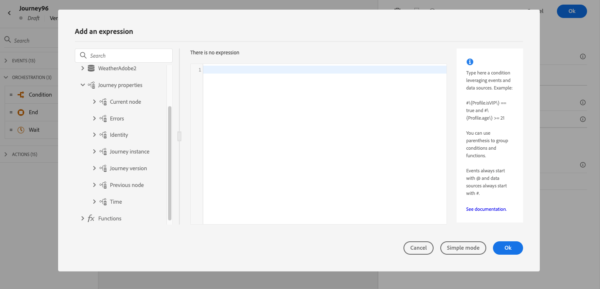

# 歷程屬性 {#journey-properties}

在[簡單運算式編輯器](../conditions.md#about_condition)和[進階運算式編輯器](../expression/expressionadvanced.md)中，**事件**&#x200B;和&#x200B;**資料來源**&#x200B;類別下方，您可以存取&#x200B;**歷程屬性**&#x200B;類別。 此類別包含與特定設定檔的歷程相關的技術欄位。 這是系統從即時歷程擷取的資訊，例如歷程ID或遇到的特定錯誤。

它包含資訊，例如：

* 歷程版本：歷程uid、歷程版本uid、執行個體uid等。
* 錯誤：資料擷取、動作執行等。
* 目前步驟、上一個目前步驟等。
* 捨棄的設定檔

  此區段](#journey-properties-fields)中的欄位清單為[。

您可以使用這些欄位來建立運算式。 在歷程執行期間，系統會直接從歷程擷取值。

以下是一些使用案例的範例：

* **記錄捨棄的設定檔**：您可以傳送上限規則從訊息中排除的所有設定檔至協力廠商系統，以進行記錄。 為此，您可以設定發生逾時和錯誤時的路徑，並新增條件以篩選特定錯誤型別，例如：「藉由上限規則來捨棄人員」。 接著，您就可以透過自訂動作，將捨棄的設定檔推送至協力廠商系統。

* **發生錯誤時傳送警示**：每次訊息發生錯誤時，您都可以傳送通知給協力廠商系統。 您可以針對此專案設定路徑，以預防發生錯誤、新增條件和自訂動作。 例如，您可以在Slack頻道上傳送通知，並附上所遇到錯誤的說明。

* **調整報告中的錯誤** ：您可以針對每個錯誤型別定義條件，而不只是讓一個路徑存放錯誤的訊息。 這可讓您調整報告並檢視所有錯誤型別資料。

## 欄位清單 {#journey-properties-fields}

| 類別 | 欄位名稱 | 標籤 | 說明 |
|---|---|---|------------|
| 歷程版本 | journeyUID | 歷程識別碼 | |
| | journeyVersionUID | 歷程版本識別碼 | |
| | journeyVersionName | 歷程版本名稱 | |
| | journeyVersionDescription | 歷程版本說明 | |
| | journeyVersion | 歷程版本 | |
| 歷程執行個體 | instanceUID | 歷程執行個體識別碼 | 執行個體的ID |
| | externalKey | 外部金鑰 | 觸發歷程的個別識別碼 |
| | organizationId | 組織識別碼 | 品牌組織 |
| | sandboxName | 沙箱名稱 | 沙箱的名稱 |
| 身分識別 | profileId | 設定檔識別碼 | 歷程中設定檔的識別碼 |
| | namespace | 設定檔身分名稱空間 | 歷程中設定檔的名稱空間（範例：ECID） |
| 目前節點 | currentNodeId | 目前節點識別碼 | 目前活動（節點）的識別碼 |
| | currentNodeName | 目前節點名稱 | 目前活動的名稱（節點） |
| 上一個節點 | previousNodeId | 上一個節點識別碼 | 上一個活動（節點）的識別碼 |
| | previousNodeName | 前一個節點名稱 | 上一個活動的名稱（節點） |
| 錯誤 | lastNodeUIDInError | 最後一個錯誤的節點識別碼 | 最新錯誤活動（節點）的識別碼 |
| | lastNodeNameInError | 最後一個錯誤的節點名稱 | 發生錯誤的最新活動（節點）的名稱 |
| | lastNodeTypeInError | 最後一個錯誤的節點型別 | 發生錯誤的最新活動（節點）的錯誤型別。 可能的型別：<ul><li>事件：事件、回應、SQ （範例：對象資格）</li><li>流量控制：結束、條件、等待</li><li>動作：ACS動作、跳轉、自訂動作</li></ul> |
| | lastErrorCode | 上一錯誤碼 | 最新錯誤活動（節點）的錯誤代碼。 可能的錯誤： <ul><li>HTTP錯誤碼</li><li>上限</li><li>timedOut</li><li>錯誤(範例：發生意外錯誤時的預設。 不應/極少數發生)</li></ul> |
| | lastExecutedActionErrorCode | 最後執行動作的錯誤碼 | 最新錯誤動作的錯誤碼 |
| | lastDataFetchErrorCode | 上次資料擷取的錯誤碼 | 從資料來源擷取的最新資料之錯誤代碼 |
| 時間 | lastActionExecutionElapsedTime | 執行最後一個動作經過的時間 | 執行最新動作所花費的時間 |
| | lastDataFetchElapsedTime | 擷取上次資料經過的時間 | 從資料來源執行最新資料擷取所花的時間 |

+++ AI知識參考

本節包含結構化知識，用於支援與本主題相關的解譯、擷取和問答。

如需完整瞭解，此資訊應結合本頁的檔案。 兩者皆非獨立來源；頁面說明功能，本節提供額外內容，以協助去除術語、意圖、適用性和限制條件的歧義。

* **TL；DR：**&#x200B;此頁面說明運算式編輯器中的「歷程屬性」類別 — 一組關於即時歷程執行個體（識別碼、錯誤、目前/先前的節點、經歷時間）的技術欄位，可用來建立用於記錄、警示和錯誤特定報告的運算式。

**意圖：**

* 存取簡單或進階運算式編輯器中的歷程屬性欄位，以參考即時歷程中繼資料
* 建立條件，依錯誤型別篩選已捨棄的設定檔，以將它們路由至第三方記錄系統
* 參考自訂動作中的最後一個錯誤碼和節點名稱，將錯誤警報傳送至外部通道（例如Slack）
* 使用`lastNodeTypeInError`和`lastErrorCode`為每個錯誤型別建立個別條件路徑，以精簡歷程錯誤報告
* 在用於追蹤和稽核的運算式中參考歷程版本識別碼、執行個體識別碼和沙箱名稱

**字彙表：**

* **歷程屬性**：運算式編輯器中的類別，包含目前歷程執行個體&#x200B;*（產品特定）*&#x200B;的技術中繼資料欄位
* **instanceUID**：特定設定檔執行&#x200B;*（產品特定）*&#x200B;之歷程執行個體的唯一識別碼
* **lastErrorCode**：歷程中最近一次失敗活動的錯誤碼；可能的值包括HTTP代碼、`capped`、`timedOut`和`error` *（產品特定）*
* **lastNodeTypeInError**：發生錯誤的最後一個活動的型別；可以是事件、流程控制或動作&#x200B;*（產品特定）*
* **externalKey**：觸發歷程執行個體&#x200B;*（產品特定）*&#x200B;的個別識別碼（例如設定檔識別碼）

**護欄：**

* 歷程屬性欄位值在執行時直接從即時歷程擷取 — 無法用於執行前驗證
* `lastErrorCode`欄位使用預先定義的值： HTTP錯誤碼、`capped`、`timedOut`和`error`
* 歷程屬性在簡單和進階運算式編輯器中，位於歷程屬性類別下

**術語：**

* 正式名稱：歷程屬性 — 首字母縮寫：none — 變體：歷程技術欄位，歷程中繼資料欄位
* 同義字： &quot;Journey Properties&quot; = &quot;journey technical fields&quot;； &quot;instanceUID&quot; = &quot;journey instance identifier&quot;
* 請勿混淆： journeyUID （識別歷程定義）≠instanceUID （識別特定設定檔的歷程執行）

**常見問題集：**

* **問：在運算式編輯器中哪裡可以找到歷程屬性欄位？**  — 它們會顯示在歷程屬性類別下方的簡單和進階運算式編輯器中，位於事件和資料來源下方。
* **問：如何記錄上限規則捨棄的設定檔？**  — 在`lastErrorCode == "capped"`上新增錯誤路徑條件篩選，並透過自訂動作將這些設定檔推送到協力廠商系統。
* **問：`journeyUID`與`instanceUID`之間有何差異？** — `journeyUID`會識別歷程定義；`instanceUID`會識別指定設定檔的特定執行例項。
* **問：針對非預期的系統錯誤傳回了哪些錯誤碼？** — `error`程式碼，此程式碼會作為未預期錯誤的預設值，很少發生。
* **問：我可以使用歷程屬性欄位在動作失敗時傳送Slack警示嗎？**  — 是；在自訂動作中參考`lastNodeNameInError`和`lastErrorCode`，以便在Slack通知中包含錯誤詳細資料。

+++
