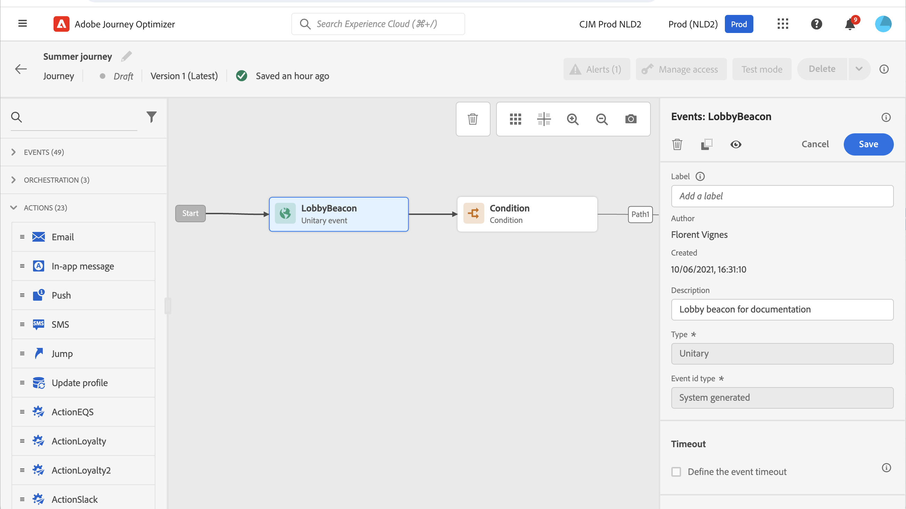
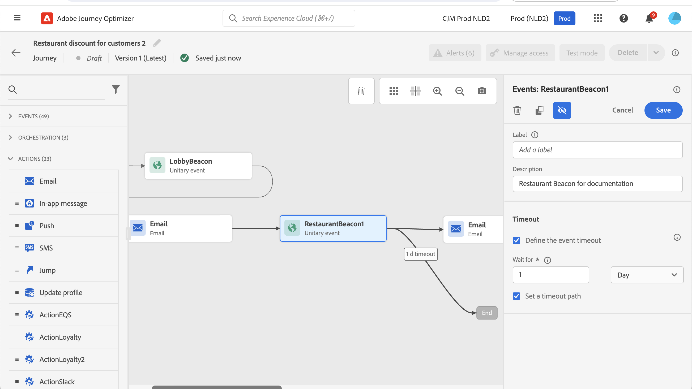
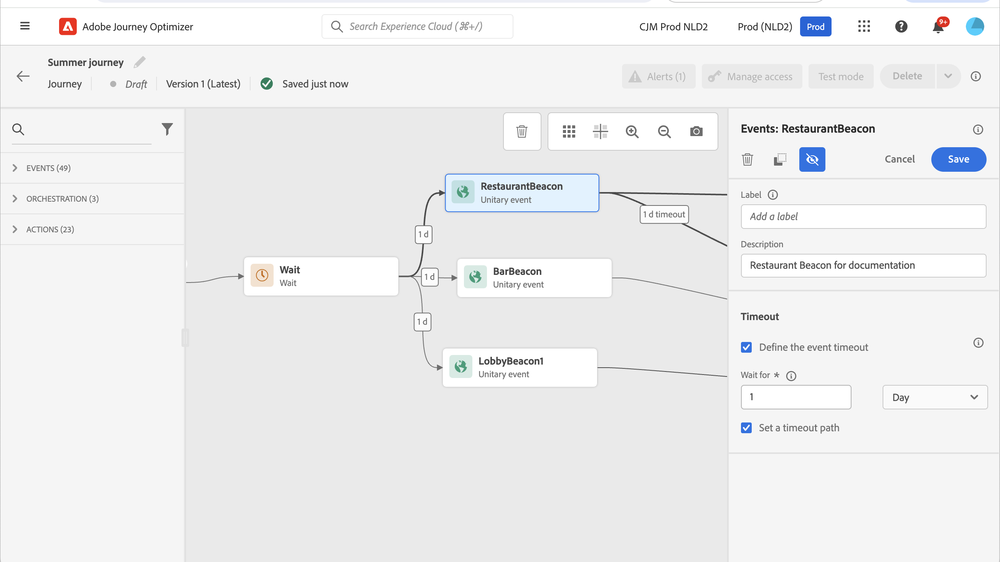

# 一般事件 {#general-events}

>[!CONTEXTUALHELP]
>id="ajo_journey_event_custom"
>title="單一事件"
>abstract="事件可讓您一致性地觸發歷程，以即時傳送訊息給流入歷程的個人。對於這類事件，您只能新增標籤和說明。事件設定由資料工程師執行，並且無法編輯。"

>[!CONTEXTUALHELP]
>id="ajo_journey_event_business_canvas"
>title="商業事件"
>abstract="這些事件讓您可以使用非設定檔相關的事件開始一個歷程。該事件觸發時，您就能夠向設定檔的對象傳送訊息。對於這類事件，您只能新增標籤和說明。事件設定由技術使用者執行，而且無法編輯。"

事件可讓您一直觸發歷程，以即時傳送訊息給流入歷程的個人。

對於這類事件，您只能新增標籤和說明。無法編輯其餘的組態。 它由技術使用者執行。 請參閱[此頁面](../event/about-events.md)。

當您卸除商務活動時，它會自動新增&#x200B;**讀取對象**&#x200B;活動。 如需商務活動的詳細資訊，請參閱[本節](../event/about-events.md)

## 在特定時間接聽事件 {#events-specific-time}

位於歷程中的事件活動會無限期監聽事件。 若要只在特定時間監聽事件，您必須為事件設定逾時。

接著，歷程會在逾時中指定的時間接聽事件。 若在該期間收到事件，則人員會進入事件路徑。 如果沒有，客戶會進入逾時路徑（如果已定義），或繼續該歷程。

如果未定義逾時路徑，則逾時設定會當作等待活動，讓設定檔等候一段時間，如果事件發生在該等待結束之前，便會停止該時間。 如果您想要在逾時後從歷程中排除設定檔，您必須設定逾時路徑。

若要設定事件逾時，請遵循下列步驟：

1. 從事件屬性啟動&#x200B;**[!UICONTROL 定義事件逾時]**&#x200B;選項。

1. 指定歷程將等待事件的時間長度。 持續時間上限為&#x200B;**90天**。

1. 在指定的逾時內未收到任何事件時，最佳實務是將個人傳送至逾時路徑。 為此，請啟用&#x200B;**[!UICONTROL 設定逾時路徑]**&#x200B;選項。 在這種情況下，一旦達到逾時，個人就會繼續歷程。 建議您一律啟用&#x200B;**[!UICONTROL 設定逾時路徑]**&#x200B;選項。

   

在此範例中，歷程會在客戶進入大廳後，傳送第一封歡迎電子郵件給客戶。 然後，只有在客戶隔天進入餐廳時，才會傳送餐點折扣電子郵件。 因此，我們將餐廳事件設定為1天逾時：

* 如果在歡迎電子郵件後不到1天收到餐廳事件，則會傳送餐點折扣電子郵件。
* 如果在隔天未收到餐廳事件，則人員會流經逾時路徑。

請注意，如果您想要在&#x200B;**[!UICONTROL 等待]**&#x200B;活動之後放置的多個事件上設定逾時，您只需要在這些事件之一上設定逾時。

定義的逾時會套用至&#x200B;**[!UICONTROL 等待]**&#x200B;活動之後放置的所有事件：

* 如果在逾時期間內收到一個事件，則個別事件會流入收到事件的路徑。
* 如果在逾時期間內未收到任何事件，則個別會流入已定義逾時之事件的逾時分支。

