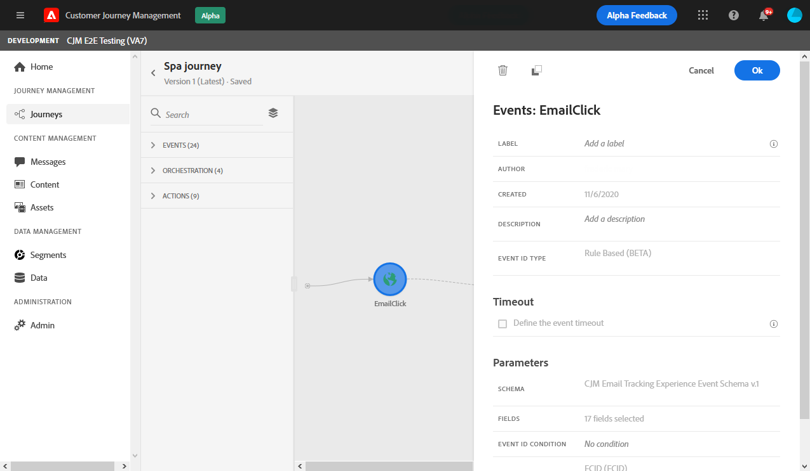
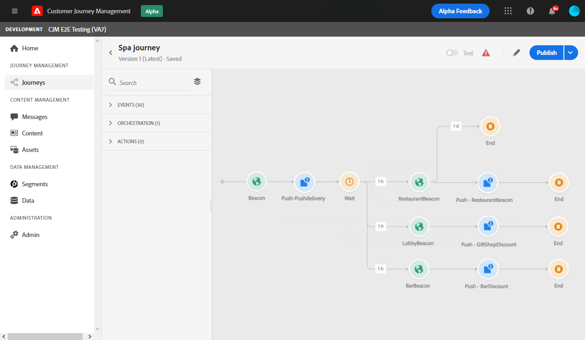

# 一般事件 {#section_ofg_jss_dgb}

對於此類型的事件，您只能新增標籤和說明。 無法編輯其餘的配置。 由技術使用者執行。 請參閱[此頁面](../event/about-events.md)。

當您刪除業務事件時，會自動新增 **讀取區段** 活動。 有關業務事件的詳細資訊，請參閱 [本節](../event/about-events.md)

## 在特定時間內接聽事件 {#events-specific-time}

位於歷程中的事件活動會無限期監聽事件。 若要僅在特定時間監聽事件，您必須為事件設定逾時。

然後，歷程會在逾時中指定的時間內監聽事件。 若在該期間收到事件，則人員將會流入事件路徑。 否則，客戶會流入逾時路徑，或結束其歷程。

若要設定事件的逾時，請執行下列步驟：

1. 啟動 **[!UICONTROL Define the event timeout]** 選項。

1. 指定歷程等待事件的時間長度。

1. 如果您想在指定逾時內未收到任何事件時，將個人傳送至逾時路徑，請啟用 **[!UICONTROL Set a timeout path]** 選項。 如果未啟用此選項，一旦逾時，個別的歷程就會結束。

   

在此範例中，歷程會傳送第一個歡迎推播給客戶。 然後，只有在客戶在隔天內進入餐廳時，才會傳送餐點折扣推播。 因此，我們已將餐廳事件設定為1天逾時：

* 如果在歡迎推播後不到1天收到餐廳事件，則會傳送餐點折扣推播活動。
* 如果隔天內未收到餐廳事件，則人員會透過逾時路徑流動。

請注意，如果您想在 **[!UICONTROL Wait]** 活動中，您只需要對其中一個事件設定逾時。

逾時會套用至 **[!UICONTROL Wait]** 活動。 如果在指定的逾時前未收到任何事件，則個人會流入單一逾時路徑，或結束其歷程。

