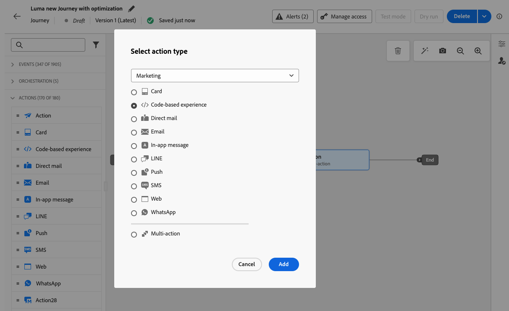
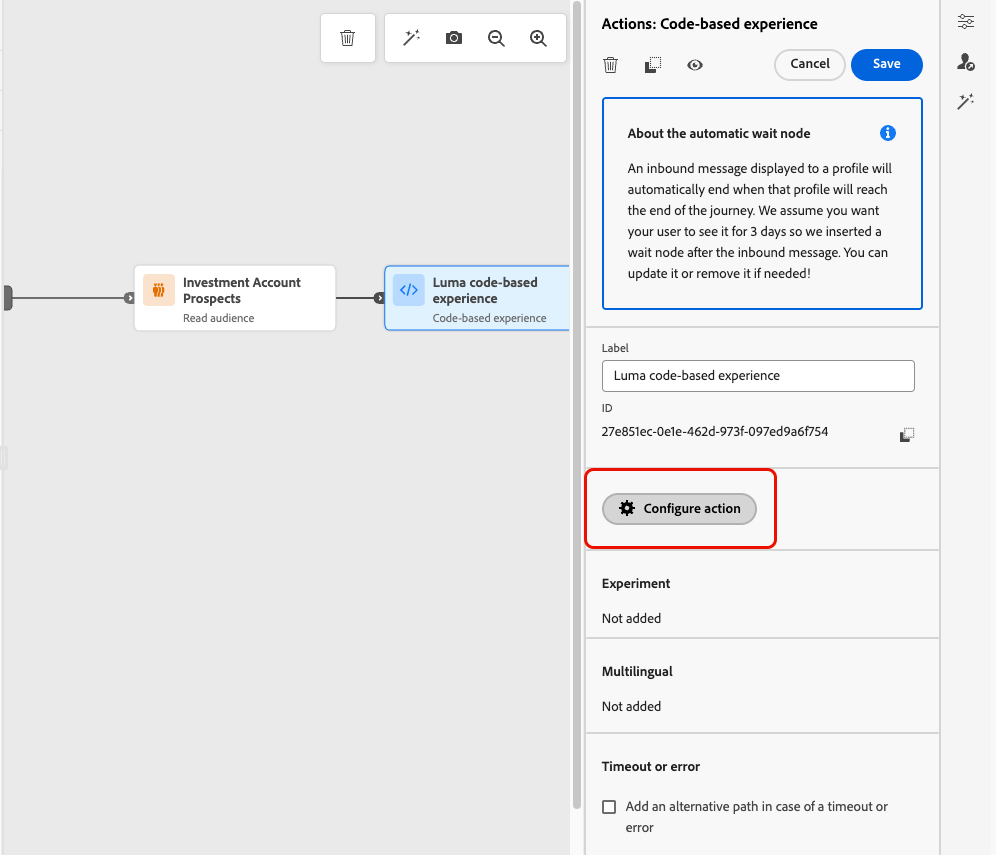
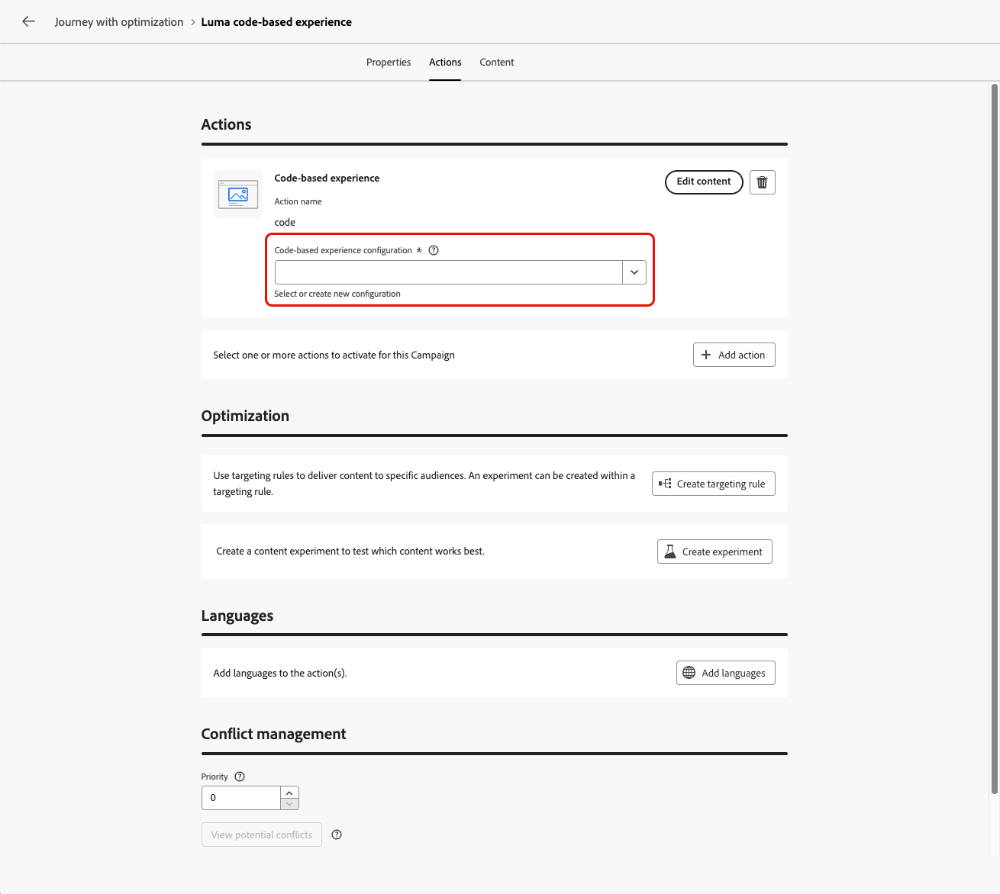
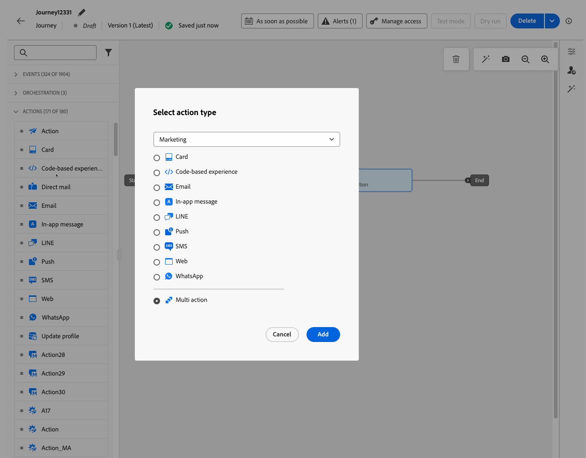
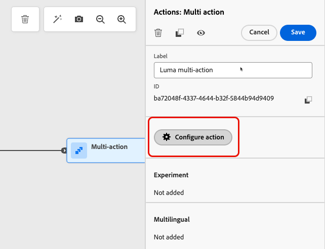
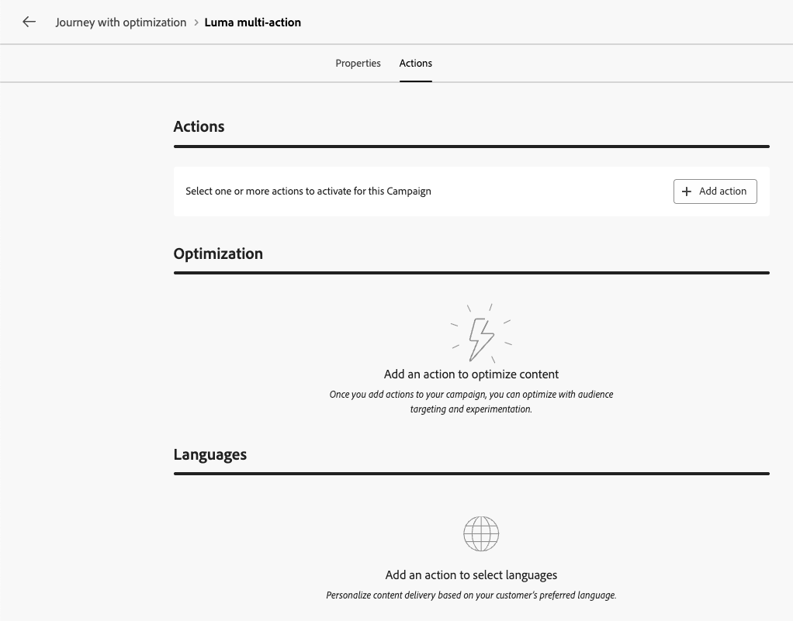
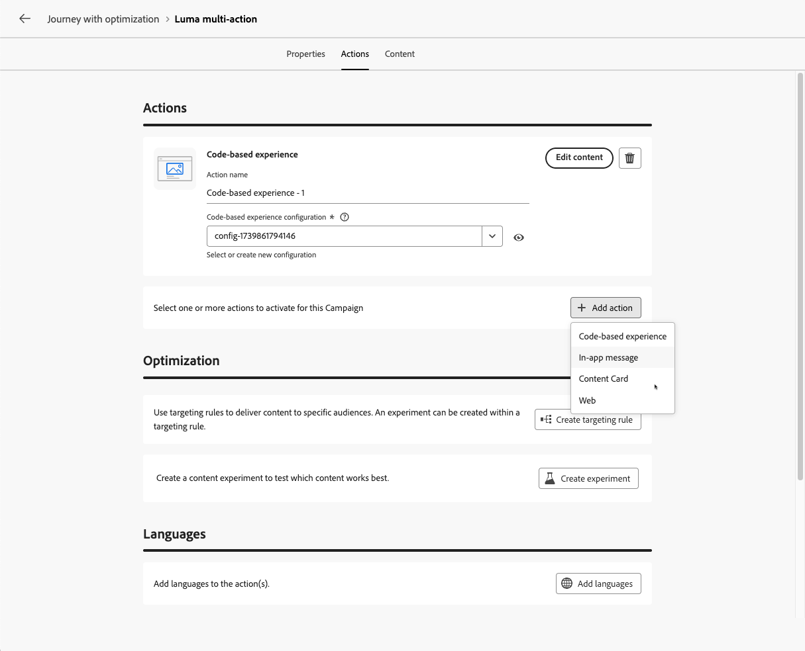

# 使用動作活動 {#add-a-message-in-a-journey}

>[!CONTEXTUALHELP]
>id="ajo_action_activity"
>title="動作活動"
>abstract="您可以透過通用的&#x200B;**動作**&#x200B;活動設定單一原生通道動作和多項入站活動，且可以在任何內建的通道動作中加入最佳化功能。"

>[!AVAILABILITY]
>
>此功能為「有限可用性」的狀態。請聯絡您的 Adobe 代表以取得存取權。

[!DNL Journey Optimizer]隨附新的通用&#x200B;**Action**&#x200B;活動，可設定單一內建頻道動作以及多個傳入活動。

它允許：

* 簡化歷程畫布中的原生動作設定。
* 容量用來建立多動作傳入動作群組。
* 能夠將最佳化新增至任何內建管道動作。

>[!NOTE]
>
>您也可以設定自訂動作，以便在[!DNL Journey Optimizer]中傳送訊息。 [了解更多](#recommendation)

## 將動作新增至歷程  {#add-action}

若要將內建頻道動作新增至歷程，請遵循下列步驟。

1. 以[事件](general-events.md)或[讀取對象](read-audience.md)活動來開始您的歷程。

1. 從浮動視窗的&#x200B;**[!UICONTROL 動作]**&#x200B;區段，將&#x200B;**[!UICONTROL 動作]**&#x200B;活動拖放到畫布中。

1. 選取您要在歷程中善用的內建頻道活動。

   

1. 新增標籤至您的動作，並選取&#x200B;**[!UICONTROL 設定動作]**。

   {width="80%"}

1. 您將被導向歷程動作設定畫面的&#x200B;**[!UICONTROL 動作]**&#x200B;索引標籤。

   選取用於所選頻道的設定。

   顯示自訂和Adobe動作的[管理]功能表中的

1. 如果您選取入站頻道，則可新增多個動作。 [了解更多](#multi-action)

1. 根據所選管道設定您的活動。 瞭解如何在[本節](journeys-message.md)中設定內建頻道動作。

1. 使用&#x200B;**[!UICONTROL 最佳化]**&#x200B;區段來執行內容實驗、運用鎖定目標規則，或使用實驗和鎖定目標的進階組合。

   這些不同的選項和要遵循的步驟在[本節](../content-management/gs-message-optimization.md)中有詳細說明。

1. 使用&#x200B;**[!UICONTROL 語言]**&#x200B;區段，在您的歷程動作中以多種語言建立內容。 若要這麼做，請按一下&#x200B;**[!UICONTROL 新增語言]**&#x200B;按鈕，然後選取所需的&#x200B;**[!UICONTROL 語言設定]**。

   有關如何設定及使用多語言功能的詳細資訊，請參閱[本節](../content-management/multilingual-gs.md)。

根據所選的通訊通道，有其他設定可供使用。 請展開下列各節以取得詳細資訊。

+++**套用上限規則** （電子郵件、直接郵件、推播、簡訊）

在&#x200B;**[!UICONTROL 商業規則]**&#x200B;下拉式清單中，選取要套用上限規則至歷程動作的規則集。

運用管道規則集，可讓您根據通訊型別設定頻率上限，以防止訊息相似的客戶超載。

[瞭解如何使用規則集](../conflict-prioritization/rule-sets.md)

+++

+++**追蹤參與** （電子郵件、簡訊）。

使用&#x200B;**[!UICONTROL 動作追蹤]**&#x200B;區段來追蹤收件者對您的電子郵件或簡訊傳遞的反應。

執行歷程後，即可從歷程報表存取追蹤結果。

[進一步瞭解歷程報告](../reports/journey-global-report-cja.md)

+++

+++**啟用快速傳遞模式** （推播）。

快速傳送模式是[!DNL Journey Optimizer]附加元件，允許透過行銷活動以非常快的速度傳送大量推送訊息。

當您想要在行動電話上傳送緊急推播警報（例如傳送重大新聞給已安裝您新聞頻道應用程式的使用者）時，如果訊息傳送延遲對業務至關重要，則會使用快速傳送。

瞭解如何在此頁面[啟用推播通知](../push/create-push.md#rapid-delivery)的快速傳遞模式。

如需使用快速傳遞模式時的效能詳細資訊，就請參閱 [Adobe Journey Optimizer 產品說明](https://helpx.adobe.com/tw/legal/product-descriptions/adobe-journey-optimizer.html){target="_blank"}。

+++

+++**指派優先順序分數** （網頁、應用程式內、程式碼型）

在&#x200B;**[!UICONTROL 衝突管理]**&#x200B;區段中，您可以為歷程動作指派優先順序分數，讓您可以在有多個歷程動作或行銷活動使用相同管道設定時，為傳入動作設定優先順序。

預設情況下，動作的優先順序分數會繼承歷程的整體優先順序分數。

[瞭解如何將優先順序分數指派給管道動作](../conflict-prioritization/priority-scores.md#priority-action)

+++

+++**設定其他傳遞規則** （內容卡）

對於內容卡歷程，您可以啟用其他傳送規則，以選擇觸發訊息的事件和條件。

[瞭解如何建立內容卡](../content-card/create-content-card.md)

+++

+++**定義觸發程式** （應用程式內）

針對應用程式內訊息，您可以使用&#x200B;**[!UICONTROL 編輯觸發器]**&#x200B;按鈕，選擇觸發訊息的事件和條件。

[瞭解如何建立應用程式內訊息](../in-app/create-in-app.md)

+++

## 新增多項入站動作 {#multi-action}

>[!CONTEXTUALHELP]
>id="ajo_multi_action_journey"
>title="新增多項入站動作"
>abstract="您可以在單一歷程中選取多項入站動作。您可以利用這項功能同時向不同位置傳遞多個程式碼型體驗、應用程式內訊息、內容卡片或是網頁動作，且每個動作都包含特定內容。"

若要簡化歷程協調，您可以在單一歷程動作中定義數個傳入動作。

>[!NOTE]
>
>此容量僅適用於傳入頻道。 目前不支援傳出頻道，例如電子郵件。

此容量可讓您同時將各種程式碼型體驗、應用程式內訊息、內容卡片或網頁動作傳送至不同位置，而不需要建立多個歷程動作。 這可讓您的歷程部署更輕鬆，並允許更流暢的報告，將所有資料整合到一個歷程中。

例如，您可以將程式碼型體驗傳送至內容稍有不同的多個端點。 若要這麼做，請在相同歷程動作中建立多個程式碼型動作，每個動作都具有不同的端點設定。

若要在單一歷程動作節點中定義數個傳入動作，請遵循下列步驟。

1. 以[事件](general-events.md)或[讀取對象](read-audience.md)活動來開始您的歷程。

1. 從浮動視窗的&#x200B;**[!UICONTROL 動作]**&#x200B;區段，將&#x200B;**[!UICONTROL 動作]**&#x200B;活動拖放到畫布中。

1. 選取&#x200B;**[!UICONTROL 多重動作]**&#x200B;作為動作型別。

   在協調流程下的歷程浮動視窗中

1. 視需要新增標籤，並選取&#x200B;**[!UICONTROL 設定動作]**。

   {width="60%"}

1. 您將被導向歷程動作設定畫面的&#x200B;**[!UICONTROL 動作]**&#x200B;索引標籤。

   {width="70%"}

1. 從&#x200B;**動作**&#x200B;區段選取輸入動作（**程式碼型體驗**、**應用程式內訊息**、**內容卡**&#x200B;或&#x200B;**[!UICONTROL 網頁]**）。

1. 選取管道設定，並定義該動作的特定內容。

1. 使用&#x200B;**[!UICONTROL 新增動作]**&#x200B;按鈕，從下拉式清單中選取其他輸入動作。

   {width="80%"}

1. 以類似方式繼續以新增更多動作。 您最多可以在歷程動作群組中新增10個傳入動作。

一旦歷程為[即時](publish-journey.md)，所有動作就會同時啟動。
<!--
## Next steps {#next}

Once your action is configured, you can design its content. [Learn more]-->
