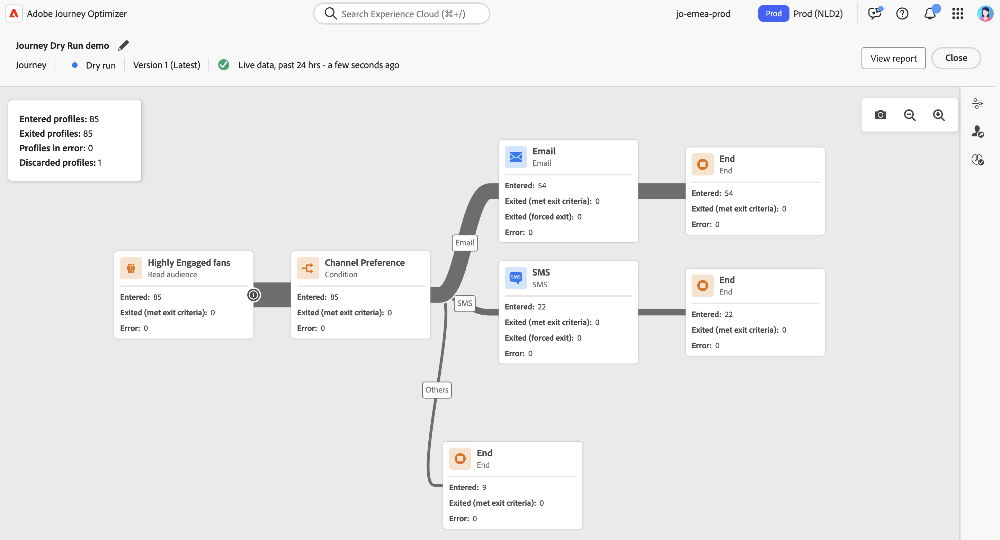
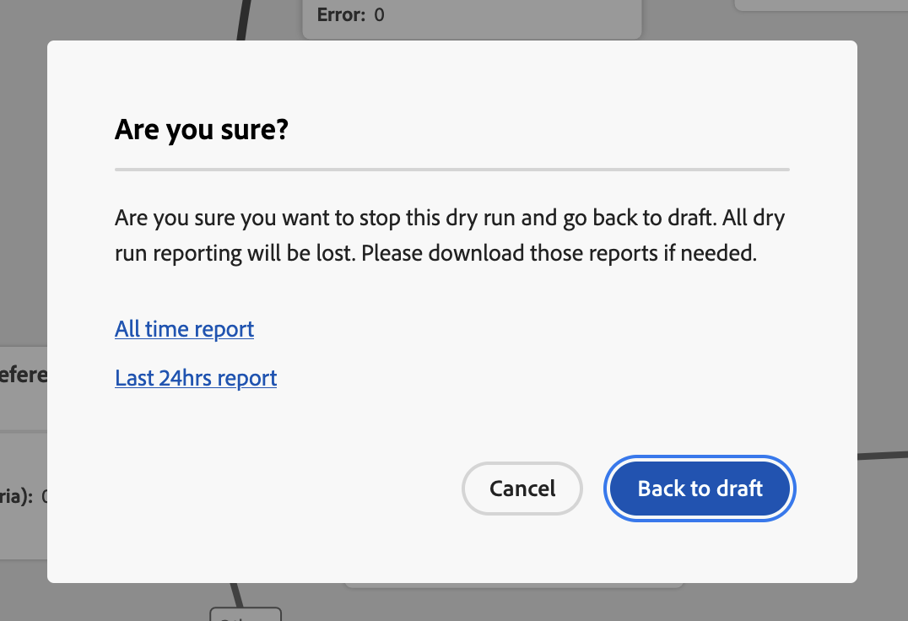

# 歷程試運行 {#journey-dry-run}

>[!CONTEXTUALHELP]
>id="ajo_journey_dry_run"
>title="試執行模式"
>abstract="本次歷程處於試執行階段。 歷程試運行是 [!DNL Adobe Journey Optimizer] 中的特殊歷程發佈模式，允許歷程實踐者使用真實的生產資料測試歷程，而無需聯絡真實客戶或更新輪廓資訊。  此功能可協助歷程從業人員，針對歷程設計、客群目標市場選擇，累積信心，然後再將歷程發佈上線。"

>[!CONTEXTUALHELP]
>id="ajo_journey_dry_run_start"
>title="在試執行模式中發佈歷程"
>abstract="歷程試運行是 [!DNL Adobe Journey Optimizer] 中的特殊歷程發佈模式，允許歷程實踐者使用真實的生產資料測試歷程。 設計歷程後，練習會確認其運作正常，並確保步驟正確。 此發布模式可讓您煙霧測試歷程，無需傳送通訊給任何輪廓。"

歷程試運行是 [!DNL Adobe Journey Optimizer] 中的特殊歷程發佈模式，允許歷程實踐者使用真實的生產資料測試歷程，而無需聯絡真實客戶或更新輪廓資訊。  此功能可協助歷程從業人員，針對歷程設計、客群目標市場選擇，累積信心，然後再將歷程發佈上線。

➡️ [在此影片中進一步瞭解歷程練習](#dry-run-video)

## 主要優點 {#journey-dry-run-benefits}

Journey Diry run使用真實的生產資料對客戶歷程進行安全、資料導向的測試，免除聯絡客戶或變更設定檔資訊的風險，進而提高從業人員信心和歷程成功。 此功能讓歷程從業人員在上線前驗證受眾觸及範圍和分支邏輯，確保歷程與其預期業務目標一致。

有了歷程練習，您就能根據實際資料（而非假設）及早識別問題、最佳化鎖定目標策略，以及改善歷程設計。 練習版直接整合至歷程畫布，提供直覺式報告功能，並洞察關鍵績效指標，讓團隊充滿信心地反複交流，並簡化核准工作流程。 如此可提升營運效率、降低上市風險，並帶來更佳的客戶參與成果。

最終，此功能可改善實現價值的時間並減少歷程失敗。

Journey Dirun提供：

1. **安全測試環境**：未連絡處於試執行模式的設定檔，確保沒有傳送通訊或影響即時資料的風險。
1. **對象深入分析**：歷程從業人員可以預測不同歷程節點上的對象可達性，包括根據歷程條件選擇退出和排除。
1. **即時回饋**：量度會直接顯示在歷程畫布中，類似即時報告，讓歷程參與者能夠調整其歷程設計。

## 試執行執行邏輯 {#journey-dry-run-exec}

在練習期間，歷程會在模擬模式下執行，套用下列特定行為至每個歷程活動，而不會觸發實際動作：

* 未執行&#x200B;**頻道動作**&#x200B;節點，包括電子郵件、簡訊或推播通知。
* **自訂動作**&#x200B;已在試執行期間停用，而且其回應設定為Null。

  為了增強可讀性，自訂動作和管道活動在執行「練習」時會顯示為灰色。

  {width="80%"}

* **資料來源** （包括外部資料來源）和&#x200B;**等待**&#x200B;活動預設為於試執行期間停用。 不過，在啟動試執行模式[&#128279;](#journey-dry-run-start)時，您可以變更此行為。

* **回應**&#x200B;節點未執行：進入它的所有設定檔都將成功結束。 但是，下列優先順序規則適用：

   * 如果&#x200B;**回應**&#x200B;節點同時搭配一或多個&#x200B;**單一事件**&#x200B;節點使用，則設定檔將一律透過回應事件。
   * 如果&#x200B;**反應**&#x200B;節點同時與一或多個&#x200B;**反應事件**&#x200B;節點一起使用，則設定檔將一律通過畫布中的第一個節點（頂端的節點）。

>[!CAUTION]
>
>* 啟動試回合的許可權僅限於具有&#x200B;**[!DNL Publish journeys]**&#x200B;高階許可權的使用者。 停止練習的許可權僅限於具有&#x200B;**[!DNL Manage journeys]**&#x200B;高階許可權的使用者。 在[本節](../administration/permissions-overview.md)中進一步瞭解如何管理[!DNL Journey Optimizer]使用者的存取權。
>
>* 開始使用試執行功能之前，[請先閱讀護欄和限制](#journey-dry-run-limitations)。

## 開始試用 {#journey-dry-run-start}

您可以在任何草稿歷程中使用練習功能，不會發生錯誤。

若要啟動「試執行」，請遵循下列步驟：

1. 開啟您要測試的歷程。
1. 選取&#x200B;**[!UICONTROL 試執行]**&#x200B;按鈕。

   

1. 如果您要啟用或停用&#x200B;**等待**&#x200B;活動和&#x200B;**外部資料來源**&#x200B;呼叫，請選取，並確認試執行出版物。

   {width="50%"}

   轉換發生時，會出現狀態訊息&#x200B;**[!UICONTROL 啟動試用]**。

1. 一旦啟動，歷程就會進入&#x200B;**[!UICONTROL 試執行]**&#x200B;模式。

## 監視練習 {#journey-dry-monitor}

啟動乾模式發佈後，您可以視覺化歷程執行以及設定檔如何通過歷程分支和節點進展。

量度會直接顯示在歷程畫布中。 在歷程畫布的[即時報告中，進一步瞭解歷程即時報告和量度](report-journey.md)。

您也可以存取&#x200B;**過去24小時的報告**&#x200B;和&#x200B;**所有時間報告**&#x200B;來試用。 若要存取這些報告，請按一下歷程畫布右上角的&#x200B;**檢視報告**&#x200B;按鈕。

>[!CAUTION]
>
> 報告資料僅在試執行為&#x200B;**作用中**&#x200B;時可用。  停止後，將無法再存取報表資料。 使用報表上方的&#x200B;**匯出**&#x200B;按鈕，視需要下載報表。

## 停止試用 {#journey-dry-run-stop}

14天後，練習歷程會自動轉換到&#x200B;**[!UICONTROL 草稿]**&#x200B;狀態。

也可以手動停止練習歷程。 若要停用「試執行」模式，請執行下列步驟：

1. 開啟您要停止的練習歷程。
1. 選取&#x200B;**[!UICONTROL 關閉]**&#x200B;按鈕以結束測試。
確認畫面中提供過去24小時與所有時間報表的連結。

   {width="50%"}

1. 按一下&#x200B;**[!UICONTROL 返回草稿]**&#x200B;以進行確認。

## 護欄與限制 {#journey-dry-run-limitations}

* 處於試執行模式的設定檔計入[可參與的設定檔](../audience/license-usage.md)
* 處於試執行模式的歷程計入即時歷程配額
* 練習歷程不會影響商業規則
  <!--* When creating a new journey version, if a previous journey version is **Live**, then the Dry run activation is not allowed on the new version.-->
* 在練習中未啟用&#x200B;**跳轉**&#x200B;動作。
當來源歷程觸發到目的地歷程的&#x200B;**跳轉**&#x200B;事件時，該跳轉事件將不適用於練習歷程版本。舉例來說，如果歷程的最新版本為模擬執行，而上一個版本為&#x200B;**即時**，則跳轉事件會忽略模擬執行版本，僅適用於&#x200B;**即時**&#x200B;版本。

## 歷程步驟事件與練習 {#journey-step-events}

歷程練習產生&#x200B;**stepEvents**。 這些stepEvents具有特定標幟和Dirun ID： `inDryRun`和`dryRunID`。

* 當歷程處於試執行模式時，`_experience.journeyOrchestration.stepEvents.inDryRun`會傳回`true`，而測試或即時歷程（非試執行）會傳回`null`。
* 在試執行模式時，`_experience.journeyOrchestration.stepEvents.dryRunID`會傳回試執行個體的識別碼；對於測試或即時歷程，則是`null`。

如果您將stepEvent資料匯出至&#x200B;**外部系統**，則可以使用`inDryRun`標幟來篩選試執行專案。

使用[!DNL Adobe Experience Platform]查詢服務分析&#x200B;**歷程報告量度**&#x200B;時，必須排除練習產生的步驟事件。 若要這麼做，請排除`inDryRun`為`true`的步驟事件（亦即僅包含`inDryRun`為`null`或`false`的事件）。

## 作法影片 {#dry-run-video}

透過此影片瞭解如何練習您的歷程。

>[!VIDEO](https://video.tv.adobe.com/v/3464693/?captions=chi_hant&learn=on&enablevpops)
