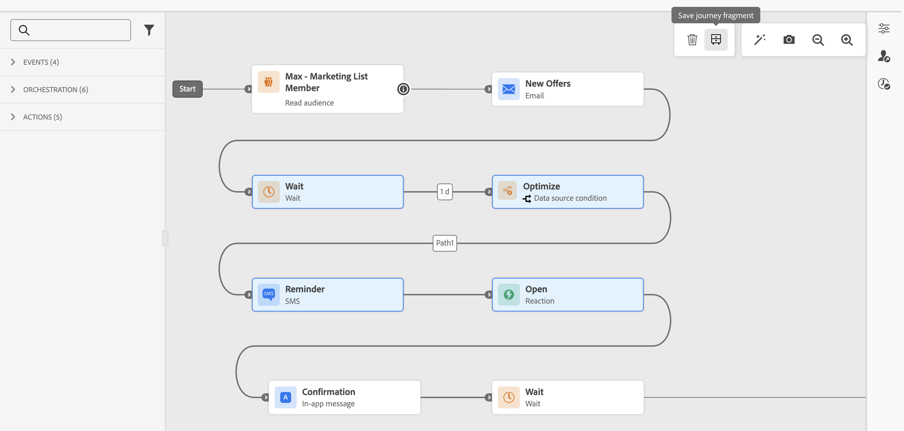
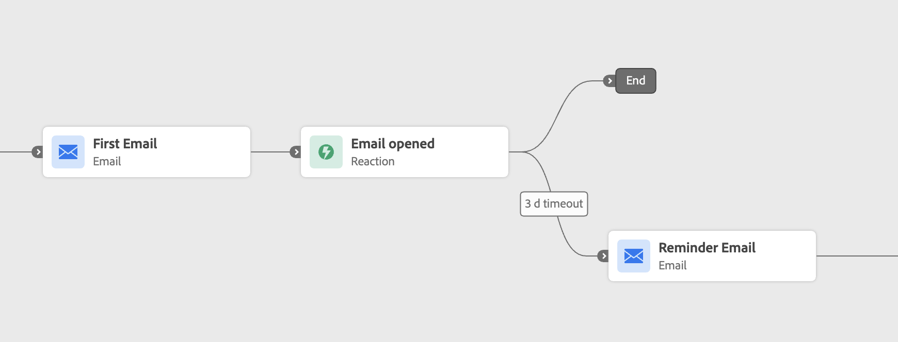

# 歷程片段 {#journey-fragments}

>[!AVAILABILITY]
>此功能目前處於「有限可用性」。 如欲請求存取權，請和您的 Adobe 代表聯絡。

歷程片段是可重複使用的歷程節點集合，您可以只建置一次，然後放入您的沙箱的任何歷程中。 無論是資格檢查、偏好的管道路由邏輯或歡迎順序，片段都有助於團隊更快移動並保持一致，而不會每次從頭開始重建相同的邏輯。 [檢視使用案例範例。](#examples)

建立後，片段會儲存在專用的&#x200B;**[!UICONTROL 片段詳細目錄]**&#x200B;中，並可使用&#x200B;**[!UICONTROL 歷程片段]**&#x200B;活動插入任何歷程。

>[!NOTE]
>在此第一個版本中，歷程片段使用&#x200B;**複製行為**：將片段插入歷程中，會建立原始節點的靜態副本。 對原始片段所做的任何更新都不會自動反映在已使用它的歷程中。

## 權限 {#journey-fragments-permissions}

若要使用歷程片段，您需要下列[許可權](../administration/permissions.md)：

* **管理歷程** — 需要建立、編輯和刪除片段。
* **發佈歷程** — 需要啟動片段。

## 存取片段詳細目錄 {#journey-fragments-inventory}

可從&#x200B;**[!UICONTROL 歷程]**&#x200B;區段存取歷程片段。 開啟&#x200B;**[!UICONTROL 片段]**&#x200B;索引標籤以瀏覽沙箱中所有可用的片段。

您可以依片段名稱、狀態、建立日期、建立者、上次修改日期或標籤來篩選清單。

## 建立歷程片段 {#create-journey-fragment}

>[!CONTEXTUALHELP]
>id="ajo_journey_fragment_create_canvas"
>title="另存為歷程片段"
>abstract="為您的片段輸入唯一名稱，然後按一下「儲存」。 所選節點將儲存為可重複使用的片段，並在「片段清單」中提供使用。"

您可以兩種方式建立歷程片段：直接從歷程畫布（建議）或從片段詳細目錄。

>[!BEGINTABS]

>[!TAB 從歷程畫布]

若要直接從歷程畫布將歷程節點儲存為片段：

1. 開啟歷程並在畫布上選取一或多個連線的節點。
1. 按一下工具列中的&#x200B;**[!UICONTROL 另存為片段]**&#x200B;圖示。

   

1. 為您的沙箱中的片段輸入唯一名稱。

   從歷程畫布

1. 按一下&#x200B;**[!UICONTROL 儲存]**。 片段會儲存為草稿。

>[!TIP]
>如果您從歷程建立片段，請在儲存片段之前[測試您的歷程](testing-the-journey.md) ****，以確保選取的節點如預期般運作。

>[!TAB 來自片段詳細目錄]

若要直接從詳細目錄建立片段：

1. 導覽至&#x200B;**[!UICONTROL 歷程]** > **[!UICONTROL 片段]**&#x200B;索引標籤。
1. 按一下&#x200B;**[!UICONTROL 建立片段]**。
1. 在片段製作畫布中，新增並設定歷程活動。
1. 完成時，按一下&#x200B;**[!UICONTROL 儲存]**，將片段儲存為草稿。

>[!CAUTION]
>測試模式在片段編輯器中無法使用。 這表示在啟動片段並將其插入歷程之前，您無法驗證已設定活動的行為。 對於邏輯正確性至關重要的片段，請考慮先在完整歷程](testing-the-journey.md)中建置並測試節點[，然後從上方的畫布索引標籤將其儲存為片段。

>[!ENDTABS]

## 編輯片段 {#edit-journey-fragment}

>[!CONTEXTUALHELP]
>id="ajo_journey_fragment_properties"
>title="歷程片段屬性"
>abstract="從清單中開啟片段，以便修改其節點、屬性、標記或標籤。 已啟用的片段必須先停用，才能進行編輯。"

若要編輯片段，請按一下其名稱，從&#x200B;**[!UICONTROL 片段詳細目錄]**&#x200B;中開啟該片段。 在片段編寫UI中，您可以：

* 新增、移除或修改活動。
* 設定或更新片段屬性：名稱、標籤和標籤。

>[!NOTE]
>
>* 只能編輯&#x200B;**[!UICONTROL 草稿]**&#x200B;片段。 若要修改&#x200B;**[!UICONTROL 作用中]**&#x200B;片段，請先將其停用。
>
>* 測試模式在片段編輯器中無法使用。 將節點儲存為片段之前，請先在完整歷程中測試任何歷程層級邏輯。
>
>* 片段內不允許[跳轉](jump.md)活動。

## 管理片段 {#manage-journey-fragments}

### 片段狀態 {#fragment-statuses}

歷程片段會遵循兩個狀態的生命週期：

| 狀態 | 說明 |
|---|---|
| **[!UICONTROL 草稿]** | 片段正在編寫中，且尚不可用於歷程。 |
| **[!UICONTROL 作用中]** | 片段已準備好在歷程中使用。 |

若要啟動&#x200B;**[!UICONTROL 草稿]**&#x200B;片段，請開啟並使用&#x200B;**[!UICONTROL 啟動]**&#x200B;圖示。 若要停用&#x200B;**[!UICONTROL 作用中]**&#x200B;片段，請開啟並使用&#x200B;**[!UICONTROL 停用]**&#x200B;圖示。

### 片段動作 {#fragment-actions}

從片段詳細目錄，您可以對片段執行下列動作：

* **[!UICONTROL 開啟]**：按一下片段名稱以編輯片段。
* **[!UICONTROL 複製]**：從&#x200B;**[!UICONTROL 更多動作]** (...)建立片段的復本 圖示。
* **[!UICONTROL 刪除]**：從作用中詳細目錄刪除&#x200B;**[!UICONTROL 更多動作]** (...)的片段 圖示。
* **[!UICONTROL 編輯標籤]** — 從&#x200B;**[!UICONTROL 更多動作]** (...)新增或移除片段的標籤 圖示。

## 在歷程中使用片段 {#use-journey-fragment}

>[!CONTEXTUALHELP]
>id="ajo_journey_fragment_add"
>title="新增歷程片段"
>abstract="選擇器中僅提供&#x200B;**[!UICONTROL 「已啟用」]**&#x200B;片段。 插入片段會建立其節點的&#x200B;**靜態副本**：原始片段之後的所有更新，都不會反映在該歷程中。"

若要將片段插入歷程：

1. 開啟您的歷程，然後從左側邊欄拖曳&#x200B;**[!UICONTROL 歷程片段]**&#x200B;活動。
1. 將其拖放到現有分支中。 片段選擇器隨即出現。
1. 瀏覽或搜尋您要使用的片段。 您可以預覽片段，或在插入片段之前在其他索引標籤中將其開啟。
1. 選取片段。 其節點會複製到拖放點的畫布中。

>[!NOTE]
>選擇器中僅提供&#x200B;**[!UICONTROL 「已啟用」]**&#x200B;片段。 插入片段會建立其節點的&#x200B;**靜態副本**：原始片段之後的所有更新，都不會反映在該歷程中。

## 護欄與限制 {#guardrails}

以下護欄適用於歷程片段：

**片段建立**

* 每個沙箱&#x200B;**的片段名稱必須是**&#x200B;唯一。
* 片段只能有&#x200B;**個專案路徑**。 有一個以上進入點的選取專案無法儲存為片段。
* 只有&#x200B;**個連線的節點**&#x200B;可以一起儲存為片段。
* 片段&#x200B;**不能包含[跳轉](jump.md)活動**。
* 片段最多可包含&#x200B;**個20個節點**。
* 一個沙箱最多可以有&#x200B;**個200個使用中的片段**。

**片段使用方式**

* 只能將&#x200B;**[!UICONTROL 作用中]**&#x200B;片段插入歷程中。
* 插入片段會建立其節點的&#x200B;**靜態復本**。 對原始片段的更新不會傳播到已使用它的歷程。
* 片段必須插入畫布中的&#x200B;**現有分支**。

**一般**

* 可使用&#x200B;**[!UICONTROL 歷程片段]**&#x200B;類別下的[整合式搜尋](../start/search-filter-categorize.md)列找到片段。
* 片段支援[標籤](tags.md)和&#x200B;**標籤**。
* 支援[稽核記錄](../privacy/audit-logs.md)。
* 在舊棧疊上執行的歷程（使用內嵌行銷活動）不支援歷程片段。 在使用此功能之前，複製此類歷程以移動到新棧疊。

## 使用案例範例 {#examples}

以下範例說明可儲存並重複用作歷程片段的常見歷程模式。

**資格檢查**

標準輸入模式（例如[讀取對象](read-audience.md)節點，後面接著適用性篩選器）可以封裝到片段中。 這可讓團隊維持設定檔進入歷程方式的一致性，同時縮短設定時間。 片段只能是[Condition](condition-activity.md)，或是同時為Read Audience和Condition。

**偏好的管道**

片段可以評估設定檔的偏好通訊通道（電子郵件、推播或簡訊），並據此路由設定檔。 此邏輯可跨任何涉及傳出訊息的歷程重複使用，以確保一致的管道偏好設定管理。 片段可以包含[條件](condition-activity.md)和所有三個管道分支。

**上線歡迎序列**

計時的歡迎序列（例如介紹產品或服務的一系列三條訊息）可以儲存為片段。 這對於在不同受眾區段或產品線中入門新使用者非常有用。 片段可以包含[等待](wait-activity.md)活動和訊息節點。

**回應式等待與提醒**

片段可以封裝電子郵件活動，然後是[回應](reaction-events.md)，等待設定檔在設定天數內開啟電子郵件，如果未開啟，則傳送提醒。 此邏輯通常在培養歷程及嘗試轉換流程中重複使用。 片段可以包含電子郵件和回應活動。

