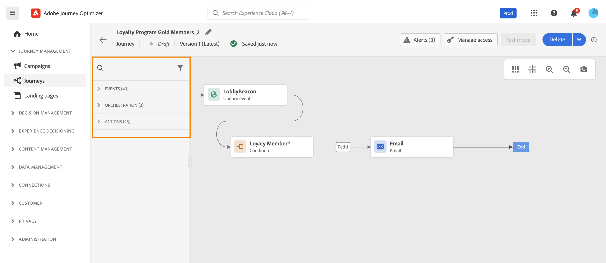

# Journey Orchestration — 完整指南{#journey-orchestration-guide}

Adobe Journey Optimizer 中的歷程可讓您建立個人化的多步驟客戶歷程，並即時因應客群的行為和需求。使用直覺式的拖放畫布，您可以跨多個管道協調訊息和動作，運用情境資料和受眾目標定位以發揮最大影響。

無論您是探索即時觸發器、管理歷程屬性，還是使用自訂動作和運算式等進階工具，本指南都提供清晰的藍圖，讓您自信地設計和調整歷程，提供有意義、及時的客戶體驗。

## 什麼是歷程？

使用 [!DNL Journey Optimizer] 可讓您善用儲存在事件或資料來源中的內容相關資料，建立即時協調流程使用案例。設計多步驟進階情境，即時回應客戶行為和業務事件。

Journey Optimizer 歷程設計工具提供行銷人員和歷程實踐者所需的一切，能夠跨頻道協調多步驟 1:1歷程。 這包括直覺式的拖放畫布，用以協調歷程的每個步驟、定義目標對象，並包含目標對象成員將根據行為、情境資料和業務事件看到的跨頻道訊息、優惠和內容。

**準備好開始建置嗎？**&#x200B;在[此頁面](journey-gs.md)瞭解如何建立及設計您的第一個歷程。

## 歷程快速入門 {#section-getting-started}

探索Adobe Journey Optimizer中精通Journey Orchestration的關鍵區域。

>[!BEGINTABS]

>[!TAB 建立您的第一個歷程]

瞭解如何從頭開始建立及設計您的第一個歷程，包括設定事件、新增活動以及在發佈前測試。

>[!TAB 重要功能]

探索您可以使用歷程做什麼：即時傳送、情境資料、內建和自訂動作、視覺化設計人員和測試功能。

>[!TAB 使用案例]

探索真實世界的歷程範例，包括歡迎電子郵件、傳送時間最佳化、加速傳遞和工作日目標定位。

>[!TAB 學習資源]

存取影片教學課程、逐步指南和檔案，以掌握歷程建立和疑難排解。

>[!ENDTABS]

## 主要功能 {#capabilities}

:::: landing-cards-container

:::

**即時和批次傳遞**

傳送在收到事件時觸發的即時&#x200B;**單一傳遞**，或使用 Adobe Experience Platform 客群&#x200B;**批次**&#x200B;傳遞。

[瞭解歷程登入](entry-management.md)
:::

:::

**內容資料**

利用來自事件的&#x200B;**情境資料** 、來自 Adobe Experience Platform 的資訊，或來自第三方 API 服務的資料。

[使用資料來源](../datasource/about-data-sources.md)
:::

:::

**內建動作**

使用&#x200B;**內建頻道動作**，透過電子郵件、推播、簡訊/多媒體簡訊等傳送在[!DNL Journey Optimizer]中設計的訊息。

[在歷程中傳送訊息](journeys-message.md)
:::

:::

**自訂動作**

如果您使用協力廠商系統來傳送訊息或連線到外部API，請建立&#x200B;**自訂動作**。

[設定自訂動作](../action/about-custom-action-configuration.md)
:::

:::

**視覺化歷程設計工具**

使用&#x200B;**歷程設計工具**，建置多步驟使用案例：輕鬆拖放進入事件或讀取客群活動、新增條件及傳送個人化訊息。

[探索歷程設計器](using-the-journey-designer.md)
:::

:::

**測試與最佳化**

發佈前先測試您的歷程、監控其效能，並使用進階功能（例如傳送時間最佳化）最佳化傳送。

[測試並發佈歷程](testing-the-journey.md)
:::

::::

## 使用案例和範例 {#use-cases}

在歷程設計工具中，行銷人員可以在事件發生時，透過任何頻道，傳送即時觸發的 1:1 訊息。 例如，當客戶訂閱服務時，它可以[觸發歡迎電子郵件](message-to-subscribers-uc.md)，鼓勵他們第一次登入應用程式並設定其偏好設定。 完成購買、開啟電子郵件和登入應用程式等操作，可用於推動新客戶完成其歷程。

[歷程設計器](using-the-journey-designer.md)提供[內建頻道操作](journeys-message.md)，可支援輸出訊息，例如電子郵件、推播通知和 SMS/MMS，以及傳入頻道，包括行動應用程式、網站和直接在 Journey Optimizer 建立的程式碼型體驗。 您也可以使用協力廠商系統來傳送訊息 — Journey Optimizer包含[自訂動作](using-custom-actions.md)，以允許這些系統直接從歷程設計器整合到歷程中。

:::: landing-cards-container

:::

**歡迎新訂閱者**

當客戶訂閱您的服務時，傳送個人化的歡迎歷程，引導他們完成入門步驟。

[了解更多](message-to-subscribers-uc.md)
:::

:::

**最佳化電子郵件傳送時間**

使用AI支援的傳送時間最佳化，在每個客戶最有可能參與時傳送電子郵件。

[了解更多](send-time-optimization.md)
:::

:::

**加速傳遞**

逐步增加訊息量，以提升您的傳送信譽並避免傳遞能力問題。

[了解更多](ramp-up-deliveries-uc.md)
:::

:::

**依據工作日**&#x200B;鎖定目標

根據客戶進入您歷程的星期幾傳送不同內容。

[了解更多](weekday-email-uc.md)
:::

:::

**透過使用案例學習**

探索全面的端對端歷程使用案例，展示真實世界的實作和最佳作法。

[探索所有使用案例](jo-use-cases.md)
:::

:::

**歷程常見問題集**

尋找有關歷程建立、疑難排解和最佳實務的常見問題解答。

[檢視常見問題集](journey-faq.md)
:::

::::

>[!NOTE]
>
>更多有關歷程護欄與限制的資訊可參閱[此頁面](../start/guardrails.md)

## 學習資源 {#learning-resources}

:::: landing-cards-container

:::

**建立和管理歷程**

設計、測試、發佈和追蹤客戶歷程的逐步指南，以建立個人化的全管道行銷活動。

[探索歷程建立](/help/rp_landing_pages/create-journey-landing-page.md) | [學習歷程管理](/help/rp_landing_pages/manage-journey-landing-page.md)
:::

:::

**歷程活動**

探索如何在歷程中設定和使用活動，例如觸發程序、決策步驟、客群管理和個人化訊息。

[探索活動](/help/rp_landing_pages/about-journey-building-landing-page.md)
:::

:::

**運算式與條件**

掌握如何使用強大的工具和語法為動態工作流程、資料操控和進階歷程協調建立運算式。

[了解運算式](/help/rp_landing_pages/building-advanced-conditions-journeys-landing-page.md)
:::

:::

**疑難排解和監視**

診斷並解決歷程執行問題，包括工具、錯誤代碼以及偵錯和最佳化的最佳實務。

[疑難排解指南](/help/rp_landing_pages/troubleshoot-journey-landing-page.md)
:::

:::

**歷程設計工具總覽**

瞭解歷程畫布、浮動視窗，以及如何使用視覺化介面設計客戶歷程。

[瞭解設計工具](using-the-journey-designer.md)
:::

:::

**測試與發佈**

發佈歷程之前，請先徹底測試歷程，確保歷程如預期般運作並提供適當的體驗。

[測試指南](testing-the-journey.md)
:::

::::

### 教學課程影片 {#video}

探索歷程的元件，並瞭解在畫布中建立歷程的基本概念。

>[!VIDEO](https://video.tv.adobe.com/v/3424996?quality=12)

### 其他資源

* **[錯誤碼參考](error-codes-reference.md)** - 歷程錯誤碼和疑難排解步驟
* **[警示](../reports/alerts.md)** - 設定歷程監視的警示
* **[疑難排解](troubleshooting.md)** - 常見歷程問題和解決方案
* **[歷程教學課程](https://experienceleague.adobe.com/zh-hant/docs/journey-optimizer-learn/tutorials/journeys/journey-designer-overview){target="_blank"}** — 透過實作影片教學課程瞭解如何建立歷程

