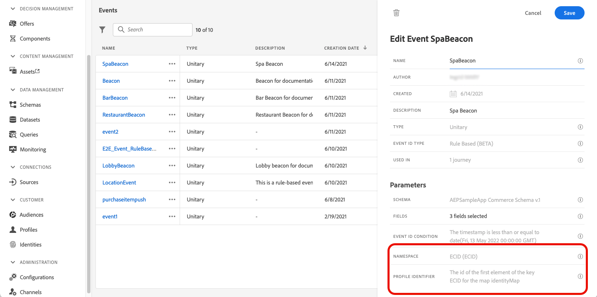
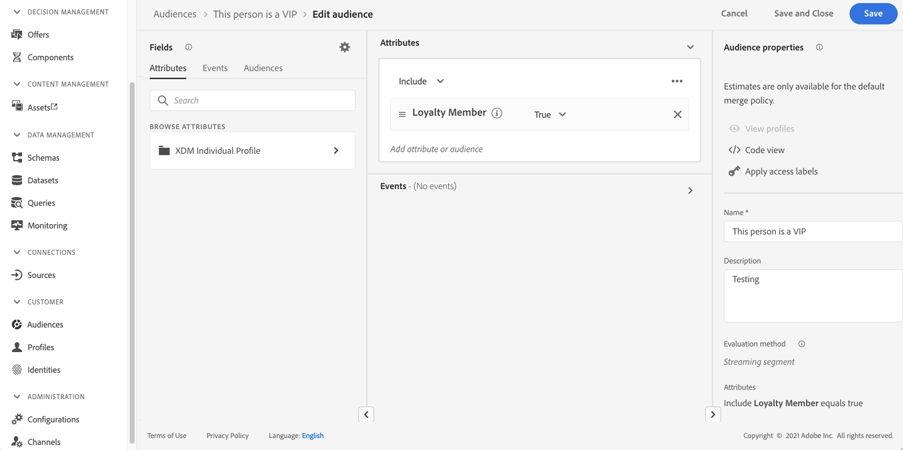
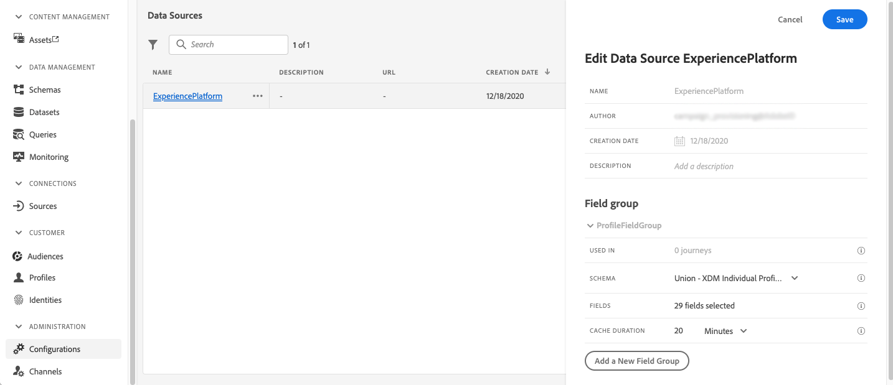
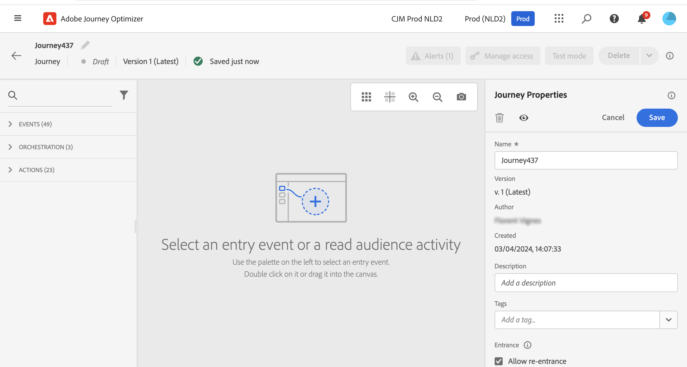
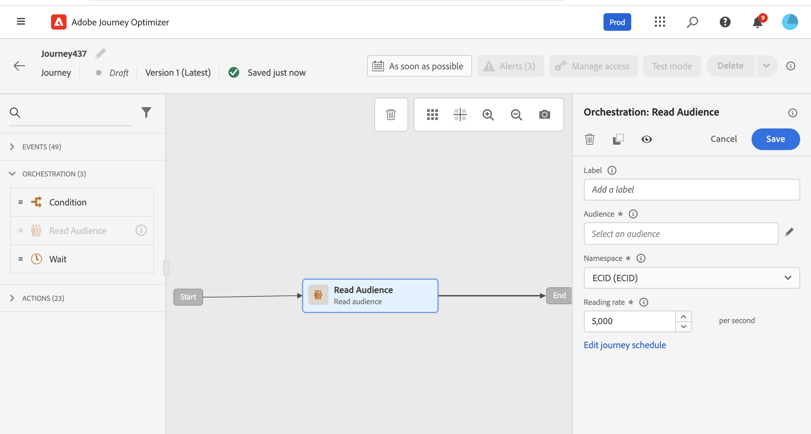
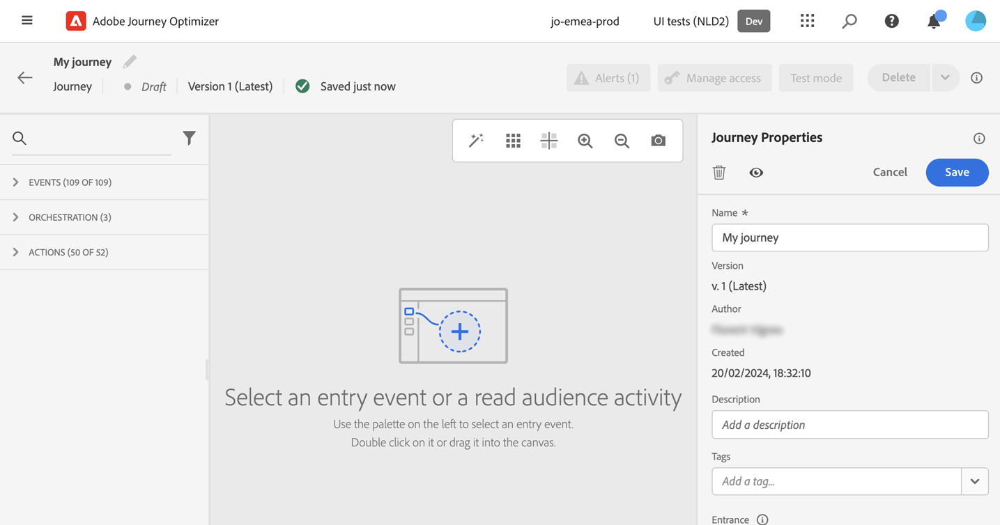

# 開始使用歷程{#jo-quick-start}

## 先決條件

為了隨行程發送消息，需要以下配置：

1. **配置事件**:如果希望在收到事件時觸發整個行程，則需要配置事件。 定義預期資訊及其處理方法。 此步驟由&#x200B;**技術使用者**&#x200B;執行。[閱讀全文](../event/about-events.md)。

   

1. **建立段**:您的旅程還可以監聽Adobe Experience Platform段，以便將郵件批量發送到指定的一組配置檔案。 為此，需要建立段。 [閱讀全文](../segment/about-segments.md)。

   

1. **配置資料源**:您可以定義到系統的連接，以檢索將在您的行程中使用的附加資訊，例如在您的條件中。 佈建時也會設定內建的 Adobe Experience Platform 資料來源。如果您只會運用歷程中事件的資料，則不需要執行此步驟。此步驟由&#x200B;**技術使用者**&#x200B;執行。[閱讀全文](../datasource/about-data-sources.md)

   

1. **配置操作**:Journey Optimizer郵件功能是內置的，您只需設計內容並發佈郵件即可。 請參閱[本節](../messages/get-started-content.md)。如果您使用第三方系統發送消息，則可以建立自定義操作。 瞭解更多資訊 [節](../action/action.md)。 此步驟由&#x200B;**技術使用者**&#x200B;執行。

   

## 構建您的旅程{#jo-build}

此步驟由 **業務用戶**。 這是你建立旅程的地方。 結合不同的事件、協調和動作活動，以建立您的多步驟跨管道情境。

以下是通過行程發送消息的主要步驟：

1. 在「行程管理」(JOURNEY MANAGEMENT)菜單部分，按一下 **[!UICONTROL Journeys]**。 將顯示行程清單。

   

1. 按一下 **[!UICONTROL Create Journey]** 創造新的旅程。

1. 在右側顯示的設定窗格中，編輯歷程的屬性。瞭解更多資訊 [節](journey-gs.md#change-properties)。

   

1. 通過拖放事件或 **讀取段** 活動從元件面板到畫布。 要瞭解有關行程設計的詳細資訊，請參閱 [此部分](using-the-journey-designer.md)。

   

1. 拖放個人將遵循的後續步驟。 例如，可以添加一個條件，然後添加一條消息。 要瞭解有關活動的詳細資訊，請參閱 [此部分](using-the-journey-designer.md)。

1. 使用test配置檔案test您的旅程。 瞭解更多資訊 [節](testing-the-journey.md)

1. 發佈您的行程以激活它。 瞭解更多資訊 [節](publishing-the-journey.md)。

   

1. 使用專用報告工具監控您的旅程，以衡量您的旅程的效果。 瞭解更多資訊 [節](../reports/live-report.md)。

   

## 變更屬性 {#change-properties}

>[!CONTEXTUALHELP]
>id="ajo_journey_properties"
>title="歷程屬性"
>abstract="您可以更改行程名稱、添加說明、允許重新進入、選擇開始和結束日期，並定義超時和錯誤持續時間（如果您是管理員）。"

按一下右上角的鉛筆表徵圖以訪問行程的屬性。

您可以更改行程名稱、添加說明、允許重新進入、選擇起始日期和終止日期並定義 **[!UICONTROL Timeout and error]** 持續時間（如果您是管理員）。

對於即時行程，此螢幕顯示發佈日期和發佈行程的用戶的名稱。

的 **複製技術詳細資訊** 允許您複製支援團隊用於故障排除的旅程的技術資訊。 將複製以下資訊：JourneyVersion UID、OrgID、orgName、sandboxName、lastDeployedBy、lastDeployedAt。

### 入口{#entrance}

預設情況下，新旅程允許重新進入。 您可以取消選中「一次性」旅程選項，例如，如果您想在人員進入商店時提供一次性禮物。 在這種情況下，您不希望客戶能夠重新進入行程並再次收到優惠。

當旅程「結束」時，它將具有 **[!UICONTROL Closed]**。 旅程將停止讓新人進入旅程。 已經在旅途中的人將正常完成旅程。

在預設全局超時30天後，該行程將切換到 **已完成** 狀態。 查看 [節](../building-journeys/journey-gs.md#global_timeout)。

### 行程活動超時和出錯 {#timeout_and_error}

編輯操作或條件活動時，您可以在出現錯誤或超時時定義替代路徑。 如果查詢第三方系統的活動的處理超過行程的屬性中定義的超時持續時間(**[!UICONTROL Timeout and  error]** 欄位)，將選擇第二個路徑以執行可能的回退操作。

授權值介於1到30秒之間。

我們建議你定義一個 **[!UICONTROL Timeout and error]** 值（如果您的行程是時間敏感型的）(例如：對人的即時位置進行響應)，因為您不能將操作延遲超過幾秒鐘。 如果您的行程對時間不太敏感，則可以使用較長的值為調用的系統提供更多時間，以發送有效響應。

行程還使用全局超時。 查看 [下一部分](#global_timeout)。

### 全局行程超時 {#global_timeout}

除 [超時](#timeout_and_error) 在行程活動中使用，還有一個全局行程超時，該超時不顯示在介面中，無法更改。 此超時將阻止個人在進入後30天內的進度。 這意味著一個人的旅程不能超過30天。 在30天超時期後，將刪除個人的資料。 在超時期結束時仍在旅途中流動的個人將被停止，並將他們作為報告錯誤加以考慮。

>[!NOTE]
>
>旅程不會直接對隱私選擇退出、訪問或刪除請求做出反應。 但是，全局超時可確保個人在任何行程中停留的時間不超過30天。

由於30天的行程超時，當不允許再入行程時，無法確保再入阻塞工作超過30天。 事實上，當我們刪除有關在他們進入旅程30天後進入旅程的所有資訊時，我們無法知道之前在30多天前輸入的人。

### 時區和配置檔案時區 {#timezone}

時區在行程級別定義。

您可以輸入固定時區或使用Adobe Experience Platform配置檔案定義行程時區。

有關時區管理的詳細資訊，請參見 [此頁](../building-journeys/timezone-management.md)。

### 突發模式 {#burst}

突發模式是一種付費附加模式，它允許以非常快的速度發送大量的推送消息。 它用於包括讀取段和簡單推送消息的簡單行程。 當消息傳遞的延遲對業務至關重要時，當您想在行動電話上發送緊急推送警報時，例如向已安裝新聞頻道應用的用戶發送突發新聞時，將使用Burst。

限制:

* 旅程必須以讀段開始。 不允許發生事件。
* 下一步必須是推送消息。 不允許其他活動或步驟（可選的結束活動除外）:
   * 僅推送通道
   * 消息中不允許個性化
   * 消息必須小(&lt;2KB)

重要說明：

如果任何要求未滿足，在行程中將不提供突發模式。

要激活「拆分」模式，請開啟行程並按一下右上角的鉛筆表徵圖，以訪問行程的屬性。 然後，激活 **啟用拆分模式** 切換。

如果修改突發行程並添加與突發不符的活動（消息、任何其他操作、事件等），突發模式將被停用。 將顯示一條消息。

然後test並正常發佈你的旅程。 Test模式消息不通過突發模式發送。

## 結束旅程

一次旅行可能會因個人而結束，原因有二：

* 該人到達了路徑的最後一個活動。 最後一個活動可以是結束活動或其他活動。 沒有義務用結束活動結束路徑。 請參閱[此頁面](../building-journeys/end-activity.md)。
* 此人到達條件活動（或具有條件的等待活動），且與任何條件都不匹配。

如果允許重新進入，則人員可以重新進入旅程。 請參閱 [此頁](../building-journeys/journey-gs.md#change-properties)

行程可能會關閉，原因如下：

* 通過 **[!UICONTROL Close to new entrances]** 按鈕
* 已完成執行的基於單次段的行程。
* 上次出現基於週期段的行程之後。

當行程關閉時（出於以上任何原因），它將具有 **[!UICONTROL Closed]**。 旅程將停止讓新人進入旅程。 已經在旅途中的人將正常完成旅程。 在預設全局超時30天後，該行程將切換到 **已完成** 狀態。 查看 [節](../building-journeys/journey-gs.md#global_timeout)。

如果你需要阻止所有人在旅途中的進步，你可以阻止它。 停止行程將超時行程中的所有人。

以下是手動關閉或停止行程的方式：

的 **[!UICONTROL Stop]** 和 **[!UICONTROL Close to new entrances]** 選項允許您終止 **活** 旅程。 結束旅程需要 **新客戶在旅途中的抵達被阻止** 而且已經進入旅程的顧客能夠體驗到它的結束。 這是結束旅程的最推薦方法，因為它為客戶提供了最佳體驗。 停止旅行意味著已經踏上旅程的人都會停止前進。 旅程基本上被關閉了。

>[!NOTE]
>
>請注意，您無法恢復已關閉或已停止的行程。

### 結束行程

您可以手動結束行程，以確保已輸入行程的客戶可以完成其路徑，但新用戶無法進入行程。

關閉時，行程將具有 **[!UICONTROL Closed]**。 在預設全局超時30天後，該行程將切換到 **已完成** 狀態。 查看 [節](../building-journeys/journey-gs.md#global_timeout)。

無法重新啟動或刪除已結束的行程版本。 您可以建立新版本或複製該版本。 只能刪除已完成的行程。

要從旅程清單中關閉行程，請按一下 **[!UICONTROL Ellipsis]** 按鈕，選擇 **[!UICONTROL Close to new entrances]**。

您也可以：

1. 在 **[!UICONTROL Journeys]** 清單中，按一下要關閉的行程。
1. 在右上角，按一下向下箭頭。

   

1. 按一下「**[!UICONTROL Close to new entrances]**」。對話方塊隨即顯示。
1. 按一下 **[!UICONTROL Close to new entrances]** 確認。

### 停止旅程

當發生緊急情況並且所有處理都需要在旅途中立即結束時，您可以停止旅程。

無法重新啟動已停止的行程版本。

停止時，行程將具有狀態 **[!UICONTROL Stopped]**。

例如，如果營銷人員意識到此行程針對的是錯誤的受眾，或者傳遞消息的自定義操作不能正常工作，您就可以停止此行程。 要停止從行程清單中的行程，請按一下 **[!UICONTROL Ellipsis]** 按鈕，選擇 **[!UICONTROL Stop]**。

您也可以：

1. 在 **[!UICONTROL Journeys]** 清單中，按一下要停止的行程。
1. 在右上角，按一下向下箭頭。

1. 按一下「**[!UICONTROL Stop]**」。對話方塊隨即顯示。
1. 按一下 **[!UICONTROL Stop]** 確認。
