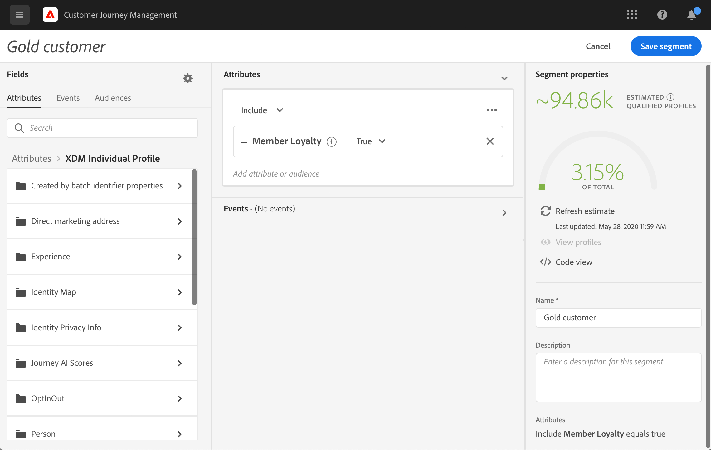

# 開始使用歷程{#jo-quick-start}

## 先決條件

若要隨歷程傳送訊息，需要下列設定：

1. **設定事件**:如果您想要在收到事件時一直觸發歷程，則需要設定事件。您可以定義預期的資訊，以及處理資訊的方式。 此步驟由&#x200B;**技術使用者**&#x200B;執行。[閱讀全文](../event/about-events.md).

   

1. **建立區段**:您的歷程也可以監聽Adobe Experience Platform區段，以便將訊息批次傳送至指定的一組設定檔。為此，您需要建立區段。 [閱讀全文](../segment/about-segments.md).

   

1. **設定資料來源**:您可以定義與系統的連線，以擷取將用於歷程的其他資訊，例如在您的條件中。佈建時也會設定內建的 Adobe Experience Platform 資料來源。如果您只會運用歷程中事件的資料，則不需要執行此步驟。此步驟由&#x200B;**技術使用者**&#x200B;執行。[閱讀全文](../datasource/about-data-sources.md)

   

1. **設定動作**:Journey Optimizer訊息功能是內建的，您只需要設計內容並發佈訊息即可。請參閱[本節](../get-started-content.md)。如果您使用協力廠商系統來傳送訊息，則可建立自訂動作。 了解更多[小節](../action/action.md)。 此步驟由&#x200B;**技術使用者**&#x200B;執行。

   

## 建立您的歷程{#jo-build}

此步驟由&#x200B;**業務用戶**&#x200B;執行。 這是您建立歷程的位置。 結合不同的事件、協調和動作活動，以建立您的多步驟跨管道情境。

以下是透過歷程傳送訊息的主要步驟：

1. 在「歷程管理」功能表區段中，按一下&#x200B;**[!UICONTROL Journeys]**。 歷程清單隨即顯示。

   

1. 按一下&#x200B;**[!UICONTROL Create Journey]**&#x200B;以建立新歷程。

1. 在右側顯示的設定窗格中，編輯歷程的屬性。了解更多[小節](journey-gs.md#change-properties)。

   

1. 首先，從浮動視窗拖放事件或&#x200B;**讀取區段**&#x200B;活動至畫布。 若要深入了解歷程設計，請參閱[本區段](using-the-journey-designer.md)。

   

1. 拖放個人將遵循的後續步驟。 例如，您可以新增條件，後接訊息。 若要進一步了解活動，請參閱[本區段](using-the-journey-designer.md)。

1. 使用測試設定檔測試您的歷程。 了解更多[小節](testing-the-journey.md)

1. 發佈您的歷程以啟用它。 了解更多[小節](publishing-the-journey.md)。

   

1. 使用專用的報告工具監控您的歷程，以評估您歷程的成效。 了解更多[小節](../reports/live-report.md)。

   

## 變更屬性 {#change-properties}

按一下右上角的鉛筆圖示，以存取歷程的屬性。

您可以變更歷程的名稱、新增說明、允許重新進入、選擇開始和結束日期，以及定義&#x200B;**[!UICONTROL Timeout and error]**&#x200B;持續時間（如果您是管理員）。

對於即時歷程，此畫面會顯示發佈日期以及發佈歷程的使用者名稱。

**複製技術詳細資訊**&#x200B;可讓您複製支援團隊可用於疑難排解的歷程相關技術資訊。 會複製下列資訊：JourneyVersion UID, OrgID, orgName, sandboxName, lastDeployedBy, lastDeployedAt。

### 入口{#entrance}

依預設，新歷程允許重新進入。 您可以取消勾選「一次性」歷程的選項，例如當某人進入商店時，如果您想要提供一次性禮品。 在此情況下，您不會希望客戶能夠重新進入歷程並再次收到優惠方案。

歷程「結束」時，其狀態會是&#x200B;**[!UICONTROL Closed]**。 歷程將停止讓新人進入歷程。 已在歷程中的人員會正常完成歷程。

在30天的預設全域逾時後，歷程會切換為&#x200B;**已完成**&#x200B;狀態。 請參閱此[節](../building-journeys/journey-gs.md#global_timeout)。

### 歷程活動的逾時和錯誤 {#timeout_and_error}

編輯動作或條件活動時，您可以定義替代路徑以防發生錯誤或逾時。 如果詢問協力廠商系統的活動處理超過歷程屬性（**[!UICONTROL Timeout and  error]**&#x200B;欄位）中定義的逾時期間，則會選擇第二個路徑以執行潛在的備援動作。

授權值介於1到30秒之間。

如果您的歷程具有時效性，建議您定義非常短的&#x200B;**[!UICONTROL Timeout and error]**&#x200B;值(範例：回應人員的即時位置)，因為您無法將動作延遲超過幾秒。 如果您的歷程不太時間敏感，您可以使用較長的值，讓系統有更多時間呼叫以傳送有效的回應。

歷程也會使用全域逾時。 請參閱[下一節](#global_timeout)。

### 全域歷程逾時 {#global_timeout}

除了歷程活動中使用的[timeout](#timeout_and_error)，還有全域歷程逾時（不會顯示在介面中且無法變更）。 此逾時會在個人進入後30天停止歷程中的進度。 這表示個人的歷程不能持續超過30天。 在30天逾時期間後，會刪除個人的資料。 在逾時期間結束時仍在歷程中流動的個人將會停止，並會將其視為報表中的錯誤列入考量。

>[!NOTE]
>
>歷程不會直接回應隱私權選擇退出、存取或刪除請求。 不過，全域逾時可確保個人在任何歷程中不會停留超過30天。

由於30天的歷程逾時，當不允許歷程重新進入時，我們無法確定重新進入封鎖的作用超過30天。 事實上，由於我們刪除了有關在他們進入30天後進入歷程的所有資訊，因此我們無法知道在超過30天前進入的人。

### 時區和設定檔時區 {#timezone}

時區是在歷程層級定義。

您可以輸入固定時區，或使用Adobe Experience Platform設定檔來定義歷程時區。

有關時區管理的詳細資訊，請參閱本頁](../building-journeys/timezone-management.md)。[

### 突發模式 {#burst}

突發模式是一種付費附加元件，它允許以非常快的速度發送大量推送訊息。 它可用於包含讀取區段和簡單推送訊息的簡單歷程。 當郵件傳送延遲是業務關鍵型時，如果您想在行動電話上傳送緊急推送警報，例如向已安裝您的新聞頻道應用程式的使用者傳送突發新聞，則會使用突發。

限制:

* 歷程必須從讀取區段開始。 不允許事件。
* 下一步必須是推送訊息。 不允許任何其他活動或步驟（可選的結束活動除外）:
   * 僅推播通道
   * 訊息中不允許任何個人化
   * 消息必須小(&lt;2KB)

重要注意事項：

如果任何需求未達成，則歷程中將無法使用突發模式。

若要啟用「突發」模式，請開啟您的歷程，然後按一下右上角的鉛筆圖示，以存取歷程的屬性。 然後，激活&#x200B;**啟用突發模式**&#x200B;切換。

如果修改突發歷程並添加與突發不相容的活動（消息、任何其他操作、事件等），則突發模式將被停用。 將顯示一條消息。

然後正常測試並發佈您的歷程。 測試模式消息不通過突發模式發送。

## 結束歷程

歷程可能會因為兩個原因而結束：

* 人員到達路徑的最後一個活動。 最後一個活動可以是結束活動或其他活動。 沒有義務以結束活動結束路徑。 請參閱[此頁面](../building-journeys/end-activity.md)。
* 人員到達條件活動（或具有條件的等待活動），且不符合任何條件。

如果允許重新進入，則人員可以重新進入歷程。 請參閱[此頁面](../building-journeys/journey-gs.md#change-properties)

歷程可能會關閉，原因如下：

* 透過&#x200B;**[!UICONTROL Close to new entrances]**&#x200B;按鈕手動關閉歷程。
* 已完成執行的單次區段型歷程。
* 上次發生循環區段型歷程後。

歷程關閉時（基於上述任何原因），其狀態將為&#x200B;**[!UICONTROL Closed]**。 歷程將停止讓新人進入歷程。 已在歷程中的人員會正常完成歷程。 在30天的預設全域逾時後，歷程會切換為&#x200B;**已完成**&#x200B;狀態。 請參閱此[節](../building-journeys/journey-gs.md#global_timeout)。

如果您需要停止歷程中所有個人的進度，您可以加以停止。 停止歷程會逾時歷程中的所有個人。

以下是手動關閉或停止歷程的方式：

**[!UICONTROL Stop]**&#x200B;和&#x200B;**[!UICONTROL Close to new entrances]**&#x200B;選項可讓您終止&#x200B;**live**&#x200B;歷程。 結束歷程時，會&#x200B;**阻止新客戶進入歷程**，而且已進入歷程的客戶能夠體驗到到達結束。 這是結束歷程的最建議方式，因為它可為客戶提供最佳體驗。 停止歷程是指已進入歷程的人都停止在進度中。 旅程基本上被關閉了。

>[!NOTE]
>
>請注意，您無法繼續已關閉或已停止的歷程。

### 結束歷程

您可以手動關閉歷程，以確保已進入歷程的客戶可以完成其路徑，但新使用者無法進入歷程。

關閉時，歷程的狀態會是&#x200B;**[!UICONTROL Closed]**。 在30天的預設全域逾時後，歷程會切換為&#x200B;**已完成**&#x200B;狀態。 請參閱此[節](../building-journeys/journey-gs.md#global_timeout)。

無法重新啟動或刪除已關閉的歷程版本。 您可以建立新版本或加以複製。 只能刪除已完成的歷程。

若要從歷程清單關閉歷程，請按一下位於歷程名稱右側的&#x200B;**[!UICONTROL Ellipsis]**&#x200B;按鈕，然後選取&#x200B;**[!UICONTROL Close to new entrances]**。

您也可以：

1. 在&#x200B;**[!UICONTROL Journeys]**&#x200B;清單中，按一下您要關閉的歷程。
1. 按一下右上角的向下箭頭。

   

1. 按一下「**[!UICONTROL Close to new entrances]**」。對話方塊隨即顯示。
1. 按一下&#x200B;**[!UICONTROL Close to new entrances]**&#x200B;以確認。

### 停止歷程

當發生緊急狀況時，您可以停止歷程，而所有處理作業都必須在歷程中立即結束。

無法重新啟動已停止的歷程版本。

停止時，歷程的狀態會是&#x200B;**[!UICONTROL Stopped]**。

例如，如果行銷人員發現歷程鎖定了錯誤的對象或傳送訊息的自訂動作無法正確運作，您就可以停止歷程。 若要從歷程清單中停止歷程，請按一下位於歷程名稱右側的&#x200B;**[!UICONTROL Ellipsis]**&#x200B;按鈕，然後選取&#x200B;**[!UICONTROL Stop]**。

您也可以：

1. 在&#x200B;**[!UICONTROL Journeys]**&#x200B;清單中，按一下您要停止的歷程。
1. 按一下右上角的向下箭頭。

1. 按一下「**[!UICONTROL Stop]**」。對話方塊隨即顯示。
1. 按一下&#x200B;**[!UICONTROL Stop]**&#x200B;以確認。
