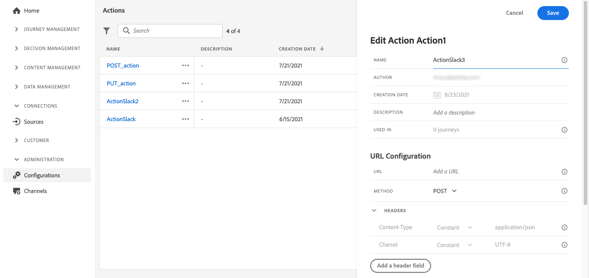

# 開始使用歷程{#jo-quick-start}

## 先決條件{#start-prerequisites}

若要隨歷程傳送訊息，需要下列設定：

1. **設定事件**:如果您想要在收到事件時一直觸發歷程，則需要設定事件。 您可以定義預期的資訊，以及處理資訊的方式。 此步驟由&#x200B;**技術使用者**&#x200B;執行。[閱讀全文](../event/about-events.md)。

   

1. **建立區段**:您的歷程也可以監聽Adobe Experience Platform區段，以便將訊息批次傳送至指定的一組設定檔。 為此，您需要建立區段。 [閱讀全文](../segment/about-segments.md)。

   

1. **設定資料來源**:您可以定義與系統的連線，以擷取將用於歷程的其他資訊，例如在您的條件中。 佈建時也會設定內建的 Adobe Experience Platform 資料來源。如果您只會運用歷程中事件的資料，則不需要執行此步驟。此步驟由&#x200B;**技術使用者**&#x200B;執行。[閱讀全文](../datasource/about-data-sources.md)

   

1. **設定動作**:如果您使用協力廠商系統來傳送訊息，則可建立自訂動作。 了解更多資訊 [節](../action/action.md). 此步驟由&#x200B;**技術使用者**&#x200B;執行。如果您使用Journey Optimizer內建的訊息功能，只需將管道動作新增至歷程並設計內容即可。 請參閱[本節](../messages/get-started-content.md)。

   

## 建立您的歷程{#jo-build}

>[!CONTEXTUALHELP]
>id="ajo_journey_create"
>title="建立您的歷程"
>abstract="此畫面會顯示現有歷程的清單。 開啟歷程或按一下「建立歷程」，然後結合不同的事件、協調和動作活動，以建立您的多步驟跨通道案例。"

此步驟由 **業務使用者**. 這是您建立歷程的位置。 結合不同的事件、協調和動作活動，以建立您的多步驟跨管道情境。

以下是透過歷程傳送訊息的主要步驟：

1. 在「歷程管理」功能表區段中，按一下 **[!UICONTROL 歷程]**. 歷程清單隨即顯示。

   

1. 按一下 **[!UICONTROL 建立歷程]** 來建立新歷程。

1. 在右側顯示的設定窗格中，編輯歷程的屬性。了解更多資訊 [節](journey-gs.md#change-properties).

   

1. 從拖放事件或 **讀取區段** 活動從浮動視窗移入畫布。 若要進一步了解歷程設計，請參閱 [本節](using-the-journey-designer.md).

   

1. 拖放個人將遵循的後續步驟。 例如，您可以新增條件，接著加上通道動作。 若要進一步了解活動，請參閱 [本節](using-the-journey-designer.md).

1. 使用測試設定檔測試您的歷程。 了解更多資訊 [節](testing-the-journey.md)

1. 發佈您的歷程以啟用它。 了解更多資訊 [節](publishing-the-journey.md).

   

1. 使用專用的報告工具監控您的歷程，以評估您歷程的成效。 了解更多資訊 [節](../reports/live-report.md).

   

## 定義您的歷程屬性 {#change-properties}

>[!CONTEXTUALHELP]
>id="ajo_journey_properties"
>title="歷程屬性"
>abstract="本節顯示歷程屬性。 預設情況下，只讀參數會隱藏。 可用的設定視歷程狀態、權限和產品設定而定。"

按一下右上角的鉛筆圖示，以存取歷程的屬性。

您可以變更歷程的名稱、新增說明、允許重新進入、選擇開始和結束日期，以及以管理員使用者的身分定義 **[!UICONTROL 逾時和錯誤]** 持續時間。

對於即時歷程，此畫面會顯示發佈日期以及發佈歷程的使用者名稱。

此 **複製技術詳細資訊** 可讓您複製支援團隊可用於疑難排解的歷程相關技術資訊。 會複製下列資訊：JourneyVersion UID, OrgID, orgName, sandboxName, lastDeployedBy, lastDeployedAt。

### 入口{#entrance}

依預設，新歷程允許重新進入。 您可以取消勾選「一次性」歷程的選項，例如當某人進入商店時，如果您想要提供一次性禮品。 在此情況下，您不會希望客戶能夠重新進入歷程並再次收到優惠方案。

歷程「結束」時，其狀態為 **[!UICONTROL 已關閉]**. 歷程將停止讓新人進入歷程。 已在歷程中的人員會正常完成歷程。

在30天的預設全域逾時後，歷程會切換至 **已完成** 狀態。 看這個 [節](../building-journeys/journey-gs.md#global_timeout).

>[!NOTE]
>
>單一歷程（從事件或區段資格開始）包含防止同一事件多次錯誤觸發歷程的護欄。 設定檔重新進入預設會暫時封鎖5分鐘。 例如，如果某個事件在12:01對特定設定檔觸發歷程，而另一個事件在12:03到達（無論是相同事件或是不同事件觸發相同歷程），該歷程將不會對此設定檔重新開始。

### 歷程活動的逾時和錯誤 {#timeout_and_error}

編輯動作或條件活動時，您可以定義替代路徑以防發生錯誤或逾時。 如果查詢協力廠商系統的活動處理超過歷程屬性中定義的逾時期間(**[!UICONTROL 逾時和錯誤]** 欄位)，則將選擇第二個路徑以執行潛在的備援動作。

授權值介於1到30秒之間。

建議您定義非常短的 **[!UICONTROL 逾時和錯誤]** 值（若您的歷程具時效性）(範例：回應人員的即時位置)，因為您無法將動作延遲超過幾秒。 如果您的歷程不太時間敏感，您可以使用較長的值，讓系統有更多時間呼叫以傳送有效的回應。

歷程也會使用全域逾時。 請參閱 [下一節](#global_timeout).

### 全域歷程逾時 {#global_timeout}

除了 [逾時](#timeout_and_error) 用於歷程活動中，也會有全域歷程逾時，其不會顯示在介面中且無法變更。 此逾時會在個人進入後30天停止歷程中的進度。 這表示個人的歷程不能持續超過30天。 在30天逾時期間後，會刪除個人的資料。 在逾時期間結束時仍在歷程中流動的個人將會停止，並會將其視為報表中的錯誤列入考量。

>[!NOTE]
>
>歷程不會直接回應隱私權選擇退出、存取或刪除請求。 不過，全域逾時可確保個人在任何歷程中不會停留超過30天。

由於30天的歷程逾時，當不允許歷程重新進入時，我們無法確定重新進入封鎖的作用超過30天。 事實上，由於我們刪除了有關在他們進入30天後進入歷程的所有資訊，因此我們無法知道在超過30天前進入的人。

### 時區和設定檔時區 {#timezone}

時區是在歷程層級定義。

您可以輸入固定時區，或使用Adobe Experience Platform設定檔來定義歷程時區。

如果在Adobe Experience Platform設定檔中定義時區，則可在歷程中擷取。

如需時區管理的詳細資訊，請參閱 [本頁](../building-journeys/timezone-management.md).

### 管理存取 {#access}

若要將自訂或核心資料使用量標籤指派至歷程，請按一下 **[!UICONTROL 管理存取]** 按鈕。 [進一步了解對象級訪問控制(OLA)](../administration/object-based-access.md)

