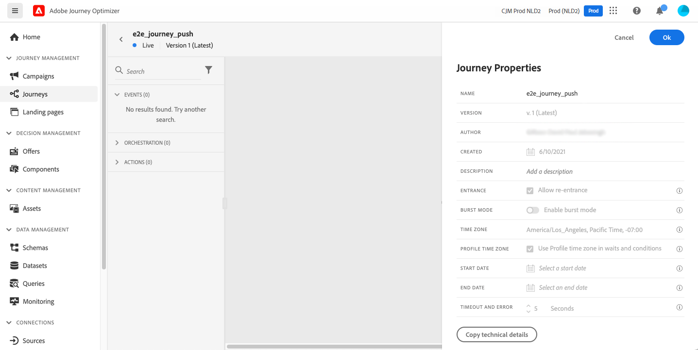
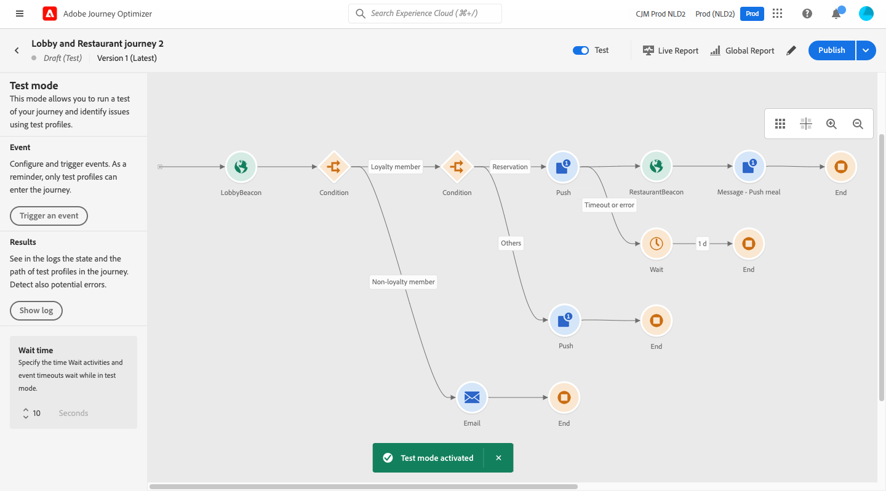
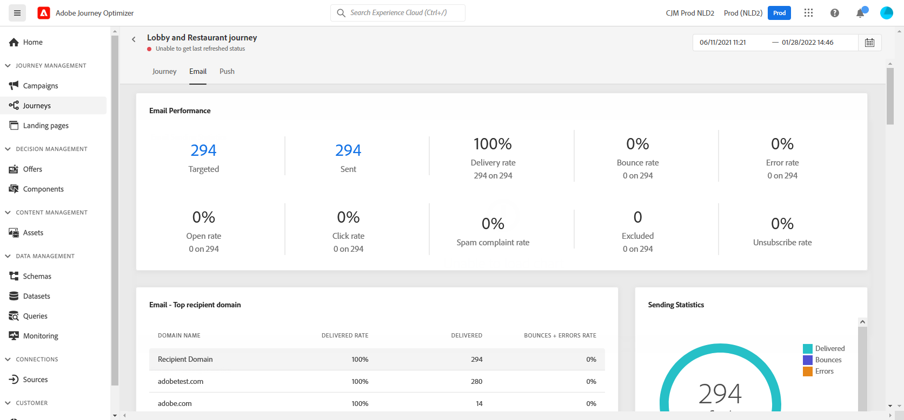

# 建立您的第一個歷程 {#jo-quick-start}

>[!CONTEXTUALHELP]
>id="ajo_homepage_card2"
>title="建立歷程"
>abstract="使用 **[!DNL Adobe Journey Optimizer]** 可讓您善用儲存在事件或資料來源中的內容關聯式資料，建置即時協調流程使用案例。"

>[!CONTEXTUALHELP]
>id="ajo_journey_create"
>title="歷程"
>abstract="設計客戶歷程提供個人化的內容關聯式體驗。Journey Optimizer 可讓您利用儲存在事件或資料來源中內容相關的資料，建置即時協調流程使用案例。**概觀&#x200B;**&#x200B;索引標籤會顯示儀表板，其中包含與您的歷程相關的關鍵量度。**瀏覽&#x200B;**&#x200B;索引標籤會顯示現有歷程的清單。"

[!DNL Adobe Journey Optimizer]包含全通路協調畫布，可讓行銷人員透過一對一客戶參與來協調行銷拓展。 使用者介面可讓您輕鬆將活動從浮動視窗拖放至畫布，以建立您的歷程。 歷程使用者介面在[此頁面](journey-ui.md)上詳細說明。

建立歷程的主要步驟將於本頁詳細說明。 其簡化如下：

在本指南中，您將瞭解：

* 定義歷程進入點 — 對象區段或即時事件
* 跨頻道新增訊息動作（電子郵件、推播或簡訊）
* 在啟用之前使用測試設定檔測試您的歷程
* 發佈您的歷程並監控其效能

建立多步驟客戶歷程，以即時啟動跨管道的互動、優惠方案和訊息順序。 此方法可確保根據客戶的動作和相關業務訊號，在最佳時刻與客戶互動。 Target對象是根據行為、內容資料和業務事件來定義。 先決條件取決於您的使用案例和您正在建置的[歷程型別](entry-management.md#types-of-journeys)。

在[本節](entry-management.md#journey-processing-rate)中進一步瞭解設定檔如何流經歷程及歷程處理率。

<!--
>[!TIP]
>
>Not sure whether to use a journey or a campaign? [Learn how to choose the right approach](../start/journeys-vs-campaigns.md).
-->

## 開始之前 {#prerequisites}

建置之前需要設定的專案取決於觸發歷程的方式。 大部分的歷程始於以下兩個入口點之一：

* **以對象為基礎的專案** — 歷程會在排程的時間針對一組已定義的設定檔執行。 在建立您的歷程之前，先在Adobe Experience Platform中[建立對象](../audience/about-audiences.md)。 如果您不熟悉Journey Optimizer，這是建議的起點。

* **以事件為基礎的專案** — 當個人執行動作（例如購買或註冊）時，會即時觸發歷程。 [設定事件](../event/about-events.md)以定義觸發程式及其所攜帶的資料。

以下元素為選用元素，但視您的使用案例而定，可能是必要元素：

* **資料來源** — 若要使用外部系統的資料擴充歷程條件或個人化，請設定[資料來源](../datasource/about-data-sources.md)。

* **自訂動作** — 如果您透過協力廠商系統而非內建通道傳送訊息，請設定[自訂動作](../action/action.md)。

>[!NOTE]
>
>如果您是負責技術設定（事件、資料來源和動作）的資料工程師，請參閱[本節](../configuration/about-data-sources-events-actions.md)。

>[!NOTE]
>
>在[此頁面](../start/guardrails.md)上詳細說明歷程護欄和限制。

## 建立歷程 {#jo-build}

若要建立多步驟歷程，請遵循下列步驟：

1. 在「歷程管理」功能表區段中，按一下&#x200B;**[!UICONTROL 歷程]**。

1. 按一下&#x200B;**[!UICONTROL 建立歷程]**&#x200B;按鈕以建立新歷程。

1. 編輯歷程的設定窗格以定義歷程的名稱並設定其屬性。 瞭解如何在[此頁面](journey-properties.md)上設定您的歷程屬性。

   >[!TIP]
   >
   >**我應該選擇哪個歷程型別？**&#x200B;如果您是Journey Optimizer的新手，請使用&#x200B;**[!UICONTROL 讀取對象]**&#x200B;活動，從對象歷程開始 — 不需要先前的事件設定，這是熟悉畫布的最簡單方法。 對於事件觸發的即時體驗（例如對購買或表單提交做出反應），請先設定事件並使用事件型專案。 深入瞭解[歷程型別](entry-management.md#types-of-journeys)。

   

接著，您就可以開始設計您的歷程。

## 設計歷程 {#jo-design}

歷程設計器可讓您使用直覺式的拖放介面來建立多步驟歷程。 左側浮動視窗中的活動分為三個類別： **事件**、**協調流程**&#x200B;和&#x200B;**動作**。 如需畫布及其控制項的完整概觀，請參閱[此頁面](using-the-journey-designer.md)。

請依照下列步驟設計您的歷程：

1. **新增進入點** — 將事件或&#x200B;**[!UICONTROL 讀取對象]**&#x200B;活動從調色盤拖曳到畫布上。 這定義了設定檔如何進入歷程：個別即時（以事件為基礎），或一次從定義的對象（以對象為基礎）進入全部。

   

1. **新增訊息動作** — 從浮動視窗的&#x200B;**[!UICONTROL 動作]**&#x200B;區段，將頻道動作拖曳到畫布上，以傳送訊息至流經歷程的設定檔。 動作可用於電子郵件、推播通知、簡訊等。

1. **新增協調活動** — 使用&#x200B;**[!UICONTROL 條件]**&#x200B;活動，根據設定檔屬性或行為將歷程分支為多個路徑。 使用&#x200B;**[!UICONTROL 等待]**&#x200B;活動在步驟之間引入時間延遲。

>[!TIP]
>
>對於具有多個階段或多個接觸點的歷程，請考慮將端對端流程破壞為與&#x200B;**[!UICONTROL 跳轉]**&#x200B;活動連線的較小子歷程。 這樣會降低複雜性，並使每個子歷程更容易獨立測試。 深入瞭解[設計策略：小型子歷程](jump.md#jump-strategy)。

## 測試歷程 {#jo-test}

建立歷程後，請先測試歷程，然後再發佈。 Journey Optimizer提供&#x200B;**測試模式**，以便在測試設定檔在歷程中移動時檢視測試設定檔，並在啟用之前偵測潛在錯誤。 執行快速測試可確保歷程正確運作，因此您可以放心地發佈它們。 在本節[中瞭解如何測試您的歷程](testing-the-journey.md)

您也可以在&#x200B;**試用**&#x200B;中執行您的歷程。 歷程試執行是 Adobe Journey Optimizer 中的特殊歷程發佈模式，允許歷程從業人員使用真實的生產資料測試歷程，而無需聯絡真實客戶或更新輪廓資訊。此功能有助於歷程參與者在發佈其歷程設計和對象鎖定目標之前獲得信心。 在本節[中瞭解如何以試執行模式](journey-dry-run.md)發佈歷程。

## 發佈歷程 {#jo-pub}

您必須發佈歷程才能啟用它，並讓新設定檔可以進入它。 發佈歷程之前，請確認其有效且沒有錯誤。 您無法發佈含有錯誤的歷程。 在此[區段](publish-journey.md)中進一步瞭解歷程發佈。

發佈後，您可以使用專用的報告工具監控您的歷程，以評估歷程的成效。

在此[區段](../reports/live-report.md)中進一步瞭解歷程報告。

## 常見使用實例 {#use-cases}

不確定從何處開始？ 以下是歷程產生最多價值的三種典型案例：

<table style="table-layout:fixed">
  <tr style="border: 0;">
    <td>
      
      
<strong>歡迎系列</strong> 註冊後，使用一系列訊息自動引導新使用者，引導他們瀏覽您的產品或服務。

    </td>
    <td>
      
      
<strong>放棄購買</strong> 傳送包含個人化內容的即時提醒，重新與未完成購買的客戶互動。

    </td>
    <td>
      
      
<strong>重新參與</strong> 根據使用者最後已知的行為，以目標優惠或更新重新贏回非作用中的使用者。

    </td>
  </tr>
  <tr style="border: 0;">
    <td align="center"></td>
    <td align="center"></td>
    <td align="center"></td>
  </tr>
</table>

## 其他資源

* **[歷程設計工具總覽](using-the-journey-designer.md)** — 掌握歷程畫布介面以設計和協調客戶歷程。
* **[歷程活動](about-journey-activities.md)** — 探索所有可用的活動，包括事件、動作和協調流程元件。
* **[測試歷程](testing-the-journey.md)** — 瞭解如何在發佈至生產環境之前，使用測試模式測試您的歷程。
* **[發佈歷程](publish-journey.md)** — 瞭解歷程發佈程式以及如何管理即時歷程。
* **[歷程報告](report-journey.md)** — 透過詳細的量度和見解追蹤和分析歷程績效。
* **[疑難排解歷程](troubleshooting.md)** — 尋找常見歷程問題的解決方案和除錯的最佳實務。
* **[歷程教學課程](https://experienceleague.adobe.com/zh-hant/docs/journey-optimizer-learn/tutorials/journeys/introduction-to-building-a-journey){target="_blank"}** — 探索有關歷程建立和最佳實務的逐步教學課程影片。

