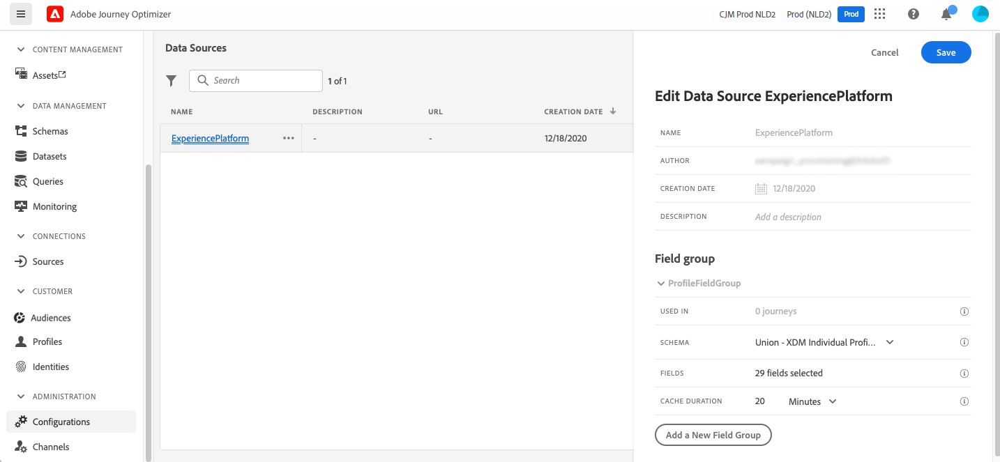
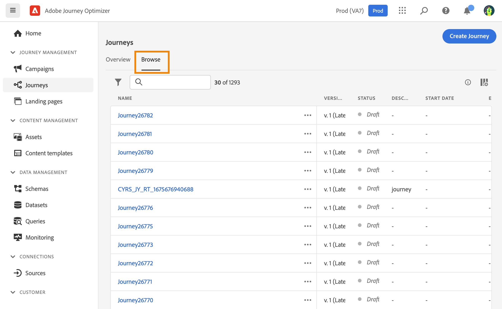

# 建立您的第一個歷程{#jo-quick-start}

>[!CONTEXTUALHELP]
>id="ajo_homepage_card2"
>title="建立歷程"
>abstract="使用 **Adobe Journey Optimizer** 可讓您善用儲存在事件或資料來源中的內容關聯式資料，建置即時協調流程使用案例。"

## 先決條件{#start-prerequisites}

若要在歷程中傳送訊息，需要下列設定：

1. **設定事件**：如果您想要在收到事件時統一觸發歷程，則需要設定事件。 您可以定義預期的資訊及其處理方式。 此步驟由執行 **技術使用者**. [閱讀全文](../event/about-events.md)。

   

1. **建立對象**：您的歷程也可以監聽Adobe Experience Platform對象，以批次傳送訊息至指定的設定檔集。 為此，您需要建立對象。 [閱讀全文](../audience/about-audiences.md)。

   

1. **設定資料來源**：您可以定義系統連線，以擷取將用於歷程的其他資訊，例如在您的條件中。 佈建時也會設定內建的 Adobe Experience Platform 資料來源。如果您只會運用歷程中事件的資料，則不需要執行此步驟。此步驟由執行 **技術使用者**. [閱讀全文](../datasource/about-data-sources.md)

   

1. **設定動作**：如果您使用協力廠商系統來傳送訊息，則可建立自訂動作。 在本節瞭解更多 [區段](../action/action.md). 此步驟由執行 **技術使用者**. 如果您使用Journey Optimizer內建訊息功能，只需將頻道動作新增至歷程並設計內容即可。

   

## 存取歷程 {#journey-access}

>[!CONTEXTUALHELP]
>id="ajo_journey_create"
>title="歷程"
>abstract="設計客戶歷程提供個人化的內容關聯式體驗。Journey Optimizer 可讓您利用儲存在事件或資料來源中的內容關聯式資料，建立即時協調流程使用案例。**概觀**&#x200B;標籤會顯示儀表板，其中包含與您的歷程相關的關鍵量度。**瀏覽**&#x200B;標籤會顯示現有歷程的清單。"

### 關鍵量度和歷程清單 {#access-metrics}

在歷程管理功能表區段中，按一下 **[!UICONTROL 歷程]**. 有兩個標籤可供使用：

**概觀**：此標籤會顯示控制面板，其中包含與您的歷程相關的關鍵量度：

* **設定檔已處理**：過去24小時內處理的設定檔總數
* **即時歷程**：過去24小時內具有流量的即時歷程總數。 即時歷程包括 **單一歷程** （事件型）和 **批次歷程** （讀取對象）。
* **錯誤率**：與過去24小時內輸入的設定檔總數相較之所有錯誤設定檔的比率。
* **捨棄率**：與過去24小時內輸入的設定檔總數相較之下，所有捨棄的設定檔比率。 捨棄的設定檔代表沒有資格進入歷程的人，例如由於名稱空間不正確或重新進入規則所導致。

>[!NOTE]
>
>此儀表板會考慮過去24小時內具有流量的歷程。 只會顯示您有權存取的歷程。 量度每30分鐘會重新整理一次，且僅當有新資料可用時才會重新整理。

**瀏覽**：此索引標籤會顯示現有歷程的清單。 您可以搜尋歷程、使用篩選器並對每個元素執行基本動作。 例如，您可以複製或刪除專案。 如需詳細資訊，請參閱[本區段](../start/user-interface.md#filter-lists)。

### 篩選歷程 {#filter}

在歷程清單中，您可以運用各種篩選器來調整歷程清單，以提高可讀性。

以下是您可以執行的各種篩選作業：

根據歷程的狀態、型別、版本和指派的標籤來篩選歷程，從 **[!UICONTROL 狀態和版本篩選器]**.

型別可以是： **[!UICONTROL 單一事件]**， **[!UICONTROL 對象資格]**， **[!UICONTROL 讀取對象]**， **[!UICONTROL 業務事件]** 或 **[!UICONTROL 高載]**.

該狀態有可能是：

* **已關閉**：歷程已使用 **關閉新入口** 按鈕。 歷程停止讓新個人進入歷程。 已在歷程中的人可以正常完成歷程。
* **草稿**：歷程處於第一個階段。 尚未發佈。
* **草稿（測試）**：測試模式已使用啟動 **測試模式** 按鈕。
* **已完成**：歷程會在預設全域逾時30天後自動切換為此狀態。 歷程中已有的設定檔會正常完成歷程。 新設定檔無法再進入歷程。
* **即時**：歷程已使用發佈 **發佈** 按鈕。
* **已停止**：歷程已使用「 」關閉 **停止** 按鈕。 所有個人會立即退出歷程。

>[!NOTE]
>
>歷程編寫生命週期也包含一組無法篩選的中間狀態：「發佈」（「草稿」與「即時」之間）、「啟用測試模式」或「停用測試模式」(「草稿」與「草稿（測試）」之間)以及「停止」（「即時」與「已停止」之間）。 當歷程處於中介狀態時，其是唯讀。

使用 **[!UICONTROL 建立篩選器]** 若要根據歷程的建立日期或建立歷程的使用者來篩選歷程。

顯示使用來自的特定事件、欄位群組或動作的歷程 **[!UICONTROL 活動篩選器]** 和 **[!UICONTROL 資料篩選器]**.

使用 **[!UICONTROL 發佈篩選器]** 以選取出版日期或使用者。 舉例來說，您可以選擇只顯示昨天發佈之即時歷程的最新版本。

若要根據特定日期範圍篩選歷程，請選取 **[!UICONTROL 自訂]** 從 **[!UICONTROL 已發佈]** 下拉式清單。

此外，在「事件」、「資料來源」和「動作」設定窗格中， **[!UICONTROL 使用位置]** 欄位會顯示使用該特定事件、欄位群組或動作的歷程次數。 您可以按一下&#x200B;**[!UICONTROL 檢視歷程]**&#x200B;按鈕以顯示對應歷程的清單。

## 建置您的歷程{#jo-build}

此步驟由執行 **業務使用者**. 這是您建立歷程的位置。 結合不同的事件、協調和動作活動，以建置您的多步驟跨管道情境。

➡️ [在影片中探索此功能](journey.md#video)

以下是透過歷程傳送訊息的主要步驟：

1. 從 **瀏覽** 標籤，按一下 **[!UICONTROL 建立歷程]** 以建立新的歷程。

1. 在右側顯示的設定窗格中，編輯歷程的屬性。在本節瞭解更多 [區段](journey-gs.md#change-properties).

   

1. 從拖放事件或 **讀取對象** 活動從浮動視窗移入畫布。 若要進一步瞭解歷程設計，請參閱 [本節](using-the-journey-designer.md).

   

1. 拖放個人會遵循的後續步驟。 例如，您可以新增條件，然後新增管道動作。 若要進一步瞭解活動，請參閱 [本節](using-the-journey-designer.md).

1. 使用測試設定檔測試您的歷程。 在本節瞭解更多 [區段](testing-the-journey.md)

1. 發佈您的歷程以啟用。 在本節瞭解更多 [區段](publishing-the-journey.md).

   

1. 使用專屬的報告工具監控您的歷程，以評估歷程的成效。 在本節瞭解更多 [區段](../reports/live-report.md).

   

## 定義您的歷程屬性 {#change-properties}

>[!CONTEXTUALHELP]
>id="ajo_journey_properties"
>title="歷程屬性"
>abstract="本區段會顯示歷程屬性。預設情況下，會隱藏唯讀參數。可用設定會依據歷程的狀態、您的權限和產品設定而定。"

>[!CONTEXTUALHELP]
>id="ajo_journey_exit_criterias"
>title="歷程退出條件"
>abstract="本區段顯示退出條件選項。 您可以為歷程建立一或多個退出條件規則。"

按一下歷程名稱旁的鉛筆圖示，即可存取其屬性。

您可以變更歷程名稱、新增說明、允許重新進入、選擇開始和結束日期，並以管理員使用者身分定義 **[!UICONTROL 逾時和錯誤]** 持續時間。 您也可以將Adobe Experience Platform統一標籤指派給您的歷程。 這可讓您輕鬆分類，並改進行銷活動清單的搜尋。 [了解如何使用標籤](../start/search-filter-categorize.md#tags)

若為即時歷程，此畫面會顯示發佈日期和發佈歷程的使用者名稱。

此 **複製技術細節** 可讓您複製支援團隊可用於疑難排解的歷程相關技術資訊。 已複製下列資訊：JourneyVersion UID、OrgID、orgName、sandboxName、lastDeployedBy、lastDeployedAt。

### 進入和重新進入 {#entrance}

依預設，新歷程允許重新進入。 您可以取消勾選 **允許重新進入** 「單次」歷程的選項，例如，如果您想在某人進入商店時提供一次性禮物。

當 **允許重新進入** 選項已啟用， **重新進入等待期** 欄位。 此欄位可讓您定義在允許設定檔在單一歷程中再次進入歷程 (從事件或對象資格開始) 之前等待的時間。 這可防止同一事件多次錯誤觸發歷程。預設情況下，欄位會設為 5 分鐘。 持續時間上限為29天。

在中進一步瞭解設定檔進入和重入管理 [本節](entry-management.md).

### 管理存取權 {#manage-access}

若要指派自訂或核心資料使用標籤給歷程，請按一下 **[!UICONTROL 管理存取權]** 按鈕。 [深入瞭解物件層級存取控制(OLA)](../administration/object-based-access.md)

### 歷程和設定檔時區 {#timezone}

時區是在歷程層級定義。 您可以輸入固定時區，或使用Adobe Experience Platform設定檔來定義歷程時區。 如果在Adobe Experience Platform設定檔中定義了時區，則可在歷程中擷取該時區。

如需時區管理的詳細資訊，請參閱 [此頁面](../building-journeys/timezone-management.md).

### 開始和結束日期 {#dates}

您可以定義 **開始日期**. 如果您尚未指定，則會在發佈時自動定義。

您也可以新增 **結束日期**. 這可讓設定檔在達到日期時自動退出。 如果未指定結束日期，則設定檔可保留至 [全域歷程逾時](#global_timeout) （通常為30天，若使用Healthcare Shield附加產品，縮短為7天）。 唯一的例外是循環讀取受眾歷程，具有 **在重複時強制重新進入** 已啟用，在下一次事件的開始日期結束。

### 歷程活動中的逾時和錯誤 {#timeout_and_error}

編輯動作或條件活動時，您可以定義替代路徑，以防錯誤或逾時。 如果處理詢問協力廠商系統的活動超過歷程屬性中定義的逾時期間(**[!UICONTROL 逾時和錯誤]** 欄位)，則會選擇第二個路徑來執行潛在的遞補動作。

授權值介於1到30秒之間。

建議您最好定義一個非常簡短的 **[!UICONTROL 逾時和錯誤]** 值（如果您的歷程有時效性，例如：對個人的即時位置有所反應），因為您的動作無法延遲超過幾秒鐘。 如果您的歷程較不有時效性，您可以使用較長的值，讓系統有更多時間呼叫，以傳送有效回應。

歷程也會使用全域逾時。 請參閱 [下一節](#global_timeout).

### 全域歷程逾時 {#global_timeout}

除了 [逾時](#timeout_and_error) 此逾時機制用於歷程活動，但全域歷程逾時機制未顯示在介面中且無法變更。

此全域逾時會停止歷程中個人的進度 **30天** 在他們進入之後。 此逾時已減少為 **7天** 搭配Healthcare Shield附加產品。 這表示個人的歷程不能持續超過30天（或7天）。 在此逾時期間後，個人的資料會被刪除。 在逾時期間結束時仍在歷程中流動的個人將會停止，且將不會在報表中將其列入考量。 因此，您可能會看到更多人進入歷程而不是退出。

>[!NOTE]
>
>歷程不會直接回應隱私權選擇退出、存取或刪除請求。 不過，全域逾時可確保個人在任何歷程中的逗留時間不會超過30天。

由於30天歷程逾時，當歷程不允許重新進入時，我們無法確保重新進入封鎖將超過30天。 事實上，當我們移除在進入歷程30天後進入歷程之人員的所有相關資訊時，我們無法得知該人員先前已進入（超過30天前）。

個人只有在歷程剩餘的時間夠在30天歷程逾時前的等待期間完成時，才能進入等待活動。 請參閱[此頁面](../building-journeys/wait-activity.md)。

## 複製歷程 {#duplicate-a-journey}

您可以從以下位置複製現有歷程： **瀏覽** 標籤。 所有物件和設定都會複製到歷程副本。

請依照下列步驟執行：

1. 導覽至您要複製的歷程，按一下 **更多動作** 圖示（歷程名稱旁的三個點）。
1. 選取「**複製**」。

   

1. 輸入歷程名稱並確認。 您也可以在歷程屬性畫面中變更名稱。 依預設，名稱設定如下： `[JOURNEY-NAME]_copy`

   

1. 新歷程已建立並可在歷程清單中使用。
