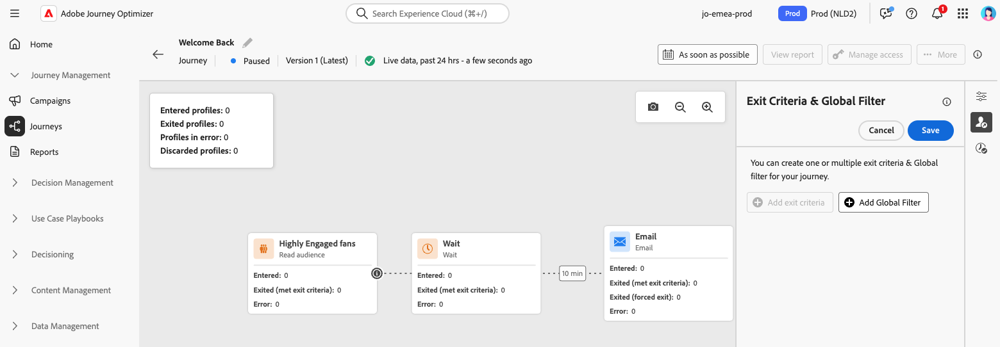

# 暫停歷程 {#journey-pause}

>[!CONTEXTUALHELP]
>id="ajo_journey_pause"
>title="暫停您的歷程"
>abstract="暫停即時歷程以阻止新設定檔進入。 選擇是否捨棄目前歷程中的設定檔，或是將其保留在適當位置。 如果保留，在歷程重新啟動後，他們將在下一個動作活動繼續執行。 最適合更新或緊急停止，而不會失去進度。"

您可以隨時暫停即時歷程、執行所有需要的變更，然後再次繼續。<!--You can choose whether the journey is resumed at the end of the pause period, or whether it stops completely. -->在暫停期間，您可以[套用全域篩選器](#journey-global-filters)以根據其屬性排除設定檔。 歷程會在暫停期間結束時自動繼續。 您也可以[手動](#journey-resume-steps)繼續進行。

>[!AVAILABILITY]
>
>此功能僅適用於一組組織（可用性限制），並將在未來版本中在全球推出。

## 主要優點 {#journey-pause-benefits}

暫停和繼續歷程可讓歷程參與者在不中斷客戶體驗的情況下暫時暫停即時歷程，擁有更優異的控制權和彈性。 暫停時，不會傳送任何通訊，而且設定檔會維持在暫停狀態，直到歷程繼續為止。

此功能減少在錯誤或更新期間（例如：變更訊息內容）傳送意外訊息的風險，支援更安全的歷程管理，並提高從業人員的信心。 直接在UI中檢視暫停的歷程及其狀態，可進一步增強透明度和作業靈敏度。

>[!CAUTION]
>
>* 暫停和恢復歷程的許可權僅限於具有&#x200B;**[!DNL Publish journeys]**&#x200B;高階許可權的使用者。 在[本節](../administration/permissions-overview.md)中進一步瞭解如何管理[!DNL Journey Optimizer]使用者的存取權。
>
>* 開始使用暫停/恢復功能之前，[請先閱讀護欄和限制](journey-pause-guardrails)。

## 如何暫停歷程 {#journey-pause-steps}

您可以暫停任何&#x200B;**即時**&#x200B;歷程。

若要暫停您的歷程，請依照下列步驟進行：

1. 開啟您要暫停的歷程。
1. 按一下歷程畫布右上角的&#x200B;**...更多**&#x200B;按鈕，然後選取&#x200B;**暫停**。

   {width="80%" align="left"}

1. 選取如何管理目前位於歷程中的設定檔。

   {width="50%" align="left"}

   您可以：

   * **保留**&#x200B;設定檔 — 設定檔將等待歷程繼續
   * **捨棄**&#x200B;設定檔 — 設定檔將在下一個動作節點從歷程中排除

1. 按一下&#x200B;**暫停**&#x200B;按鈕確認。

從您的歷程清單中，您可以暫停一或多個&#x200B;**即時**&#x200B;歷程。 若要暫停歷程群組（_大量暫停_），請在清單中選取它們，然後按一下畫面底部藍色列中的&#x200B;**暫停**&#x200B;按鈕。 **暫停**&#x200B;按鈕僅在選取&#x200B;**即時**&#x200B;歷程時可用。

{width="80%" align="left"}

### 暫停歷程中的行為

歷程暫停時，一律會捨棄新的入口，無論保留/捨棄模式為何。

歷程暫停時的設定檔管理取決於活動。 行為方式詳述如下。 如需完整瞭解，另請參閱此[端對端範例](#journey-pause-sample)。

| 歷程活動 | 輪廓管理 | 附註 |
|-------------------------|--------------------------------------------------|------------------------|
| [對象資格](audience-qualification-events.md) | 在第1個節點中：已捨棄 在其他節點中：與即時歷程中的行為相同，但如果對象資格在動作活動後且使用者在該動作上暫停，則會捨棄對象資格。 |          |
| [商務活動](general-events.md) | 已捨棄 |    |
| [單一事件](general-events.md) | 在第一個節點中：已捨棄 在其他節點中：與即時歷程中的行為相同，但如果事件在動作活動之後，且使用者在該動作上暫停，則會捨棄事件。 | 製作您的訊息 |
| [讀取對象](read-audience.md) | 與即時歷程的行為相同，但有一些特性：  如果在讀取對象活動開始後按下暫停，則進入歷程的設定檔將會繼續（直到下一個動作活動）。 當歷程以特定速度讀取對象時，如果完整對象尚未進入，則會捨棄佇列中的剩餘設定檔。 |  — 針對單一執行：如果排程日期在恢復日期之前，則不會在恢復時間顯示任何錯誤。 將會忽略該排程。   — 對於增量歷程：  如果暫停發生在第一次發生之前，則在繼續時，將會播放完整的對象。  例如，如果暫停發生，在每日週期的第4天，並且歷程保持暫停直到第9天，則在繼續時，將會包含從第4天到第9天輸入的所有設定檔 |
| [回應](reaction-events.md) | 與即時歷程中的行為相同，但如果反應在動作活動後且使用者在該動作上暫停，則會捨棄事件。 |
| [等待](wait-activity.md) | 與即時歷程中的行為相同 |           |
| [條件](condition-activity.md) | 與即時歷程中的行為相同 |         |
| 內容決策 | 設定檔會根據使用者在歷程暫停後所選取的內容進行暫留或停用 |            |
| [頻道動作](journeys-message.md) | 設定檔會根據使用者在歷程暫停後所選取的內容進行暫留或停用 |          |
| [自訂動作](../action/action.md) | 設定檔會根據使用者在歷程暫停後所選取的內容進行暫留或停用 |            |
| [更新設定檔](update-profiles.md)與[跳轉](jump.md) |  |       |
| [外部資料Source](../datasource/external-data-sources.md) | 與即時歷程中的行為相同 |           |
| [退出條件](journey-properties.md#exit-criteria) | 與即時歷程中的行為相同 |           |

## 如何繼續暫停的歷程 {#journey-resume-steps}

>[!CONTEXTUALHELP]
>id="ajo_journey_resume"
>title="繼續您的歷程"
>abstract="繼續暫停的歷程，讓新設定檔再次進入。 如果設定檔在暫停期間等待，則會繼續其歷程。 適用於在更新或暫停後安全地重新啟動歷程。"

暫停的歷程會在最大暫停期間14天結束後自動恢復。 可隨時手動繼續進行。 繼續暫停的歷程可讓新設定檔再次進入。 如果設定檔在暫停期間等待，則會繼續其歷程。 適用於在更新或暫停後安全地重新啟動歷程。

若要繼續暫停的歷程並重新開始聆聽歷程事件，請遵循下列步驟：

1. 開啟您要繼續的歷程。
1. 按一下歷程畫布右上角的&#x200B;**...更多**&#x200B;按鈕，然後選取&#x200B;**繼續**。

   歷程會切換至&#x200B;**繼續**&#x200B;狀態。 當歷程繼續時，新進入在一分鐘內開始。 恢復保留的設定檔可能需要一些時間。  由於所有設定檔都必須繼續，歷程才能再次變成&#x200B;**即時**，從&#x200B;**繼續**&#x200B;到&#x200B;**即時**&#x200B;狀態的轉換可能需要一些時間。

1. 按一下「**繼續**」按鈕確認。

從歷程清單中，您可以繼續一或多個&#x200B;**已暫停**&#x200B;歷程。 若要繼續歷程群組（_大量繼續_），請選取它們並按一下畫面底部藍色列中的&#x200B;**繼續**&#x200B;按鈕。 請注意，**繼續**&#x200B;按鈕只有在選取&#x200B;**已暫停**&#x200B;歷程時才可用。

## 將全域篩選器套用至暫停歷程中的設定檔  {#journey-global-filters}

歷程暫停時，您可以根據設定檔屬性套用全域篩選器。 此篩選器可讓您排除與恢復時定義的運算式相符的設定檔。 設定全域篩選器後，該篩選器將套用至動作節點，即使新設定檔入口亦然。 符合條件的設定檔和嘗試輸入的新設定檔，將從他們遇到的下一個動作節點&#x200B;**上的歷程**&#x200B;中排除。

例如，若要從暫停的歷程中排除所有法國客戶，請遵循下列步驟：

1. 瀏覽至您要修改的暫停歷程。

1. 按一下&#x200B;**退出條件與全域篩選器**&#x200B;圖示。

   {width="50%" align="left"}

1. 在&#x200B;**退出條件與全域篩選器**&#x200B;設定中，按一下&#x200B;**新增全域篩選器**&#x200B;根據設定檔屬性定義篩選器。

1. 設定運算式，以排除國家/地區屬性等於「法國」的設定檔。

   {width="50%" align="left"}

1. 儲存您的篩選器，然後按一下&#x200B;**更新歷程**&#x200B;按鈕以套用您的變更。

1. [繼續歷程](#journey-resume-steps)。

   在恢復時，country屬性設定為France的所有設定檔將在下一個動作節點自動從歷程中排除。 任何國家/地區屬性設為France的新設定檔嘗試進入歷程時，會在下一個動作節點遭到封鎖。

請注意，目前歷程中設定檔的設定檔排除和新設定檔的設定檔排除只有在到達動作節點時才會發生。

>[!CAUTION]
>
>* 每個歷程只能設定&#x200B;**一個**&#x200B;全域篩選器。
>
>* 您只能在&#x200B;**已暫停**&#x200B;歷程中建立、更新或刪除全域篩選器。

## 護欄與限制 {#journey-pause-guardrails}

* 歷程版本最多可暫停14天。
* 暫停的歷程會以即時方式納入所有商業規則中。
* 設定檔到達動作活動時，會在暫停的歷程中「捨棄」。 如果他們在歷程暫停期間堅持等待，並在繼續後退出，則會繼續歷程且不會被捨棄。
* 即使暫停後，隨著事件繼續處理，這些事件也會計入每秒的Journey Events數量配額，之後節流會成為單一專案。
* 已進入歷程但在暫停期間被捨棄的設定檔，仍會計為可參與的設定檔。
* 當設定檔在暫停的歷程中保留時，在繼續時會重新整理設定檔屬性
* 條件仍會在暫停的歷程中執行，因此如果歷程因資料品質問題而暫停，則可以使用錯誤的資料評估動作節點之前的任何條件。
* 對於以增量閱聽眾為基礎的讀取閱聽眾歷程，會考慮暫停的持續時間。 例如，對於每日歷程，如果它在2日暫停並在當月5日繼續，則6日的執行將接管從1日到6日符合資格的所有設定檔。 對象資格或事件型歷程則非如此（如果在暫停期間收到對象資格或事件，則會捨棄這些事件）。
* 暫停的歷程計入即時歷程配額。
* 歷程全域逾時仍適用於暫停的歷程。 例如，如果設定檔處於歷程中90天且歷程已暫停，則此設定檔仍將在第91天結束歷程。
* 如果設定檔保留在歷程中，而且此歷程在幾天後自動繼續，則設定檔會繼續歷程且不會捨棄。 如果您想要卸除這些物件，您必須停止歷程。
* 在暫停的歷程中，警示不會針對批次區段警示觸發。
* 歷程的14天暫停狀態終止後，系統中沒有稽核記錄。
* 某些已捨棄的設定檔會顯示在歷程步驟事件中，但不會顯示在報表中。 例如：捨棄讀取對象的業務事件、由於暫停歷程而捨棄讀取對象工作、事件活動在設定檔正在等待的動作之後捨棄事件。
  <!--* There is a guardrail (at an org level) on the max number of profiles that can be held in paused journeys. This guardrail is per org, and is visible in the journey inventory on a new bar (only visible when there are paused journeys).-->

## 端對端範例 {#journey-pause-sample}

以下方以歷程為例：

{width="50%" align="left"}

暫停此歷程時，您選取設定檔是&#x200B;**已捨棄**&#x200B;或&#x200B;**保留**，然後設定檔管理如下：

1. **AddToCart**&#x200B;活動：所有新設定檔入口都已封鎖。 如果設定檔在暫停前已進入歷程，則會繼續前往下一個動作節點。
1. **等待**&#x200B;活動：設定檔繼續在節點上正常等待，而且即使歷程暫停，也會退出節點。
1. **條件**：設定檔會繼續通過條件，並根據條件上定義的運算式，移至正確的分支。
1. **推播**/**電子郵件**&#x200B;活動：在暫停的歷程中，設定檔會開始等待或捨棄（根據使用者在暫停時所做的選擇）下一個動作節點。 因此，設定檔將會開始等待或捨棄在那裡。
1. **事件**&#x200B;在動作節點之後：如果設定檔正在等候動作節點，而且之後有事件，如果引發該事件，則會捨棄設定檔。

根據此行為，您可以看到已暫停歷程中的設定檔數量增加，大多是在動作前的活動中。 例如，在該範例中，會忽略「等待」，以增加通過「條件」活動的設定檔數量。

當您繼續此歷程時：

1. 全新歷程入口在一分鐘內開始
1. 目前在歷程中等待動作活動的設定檔會以5k tps的速率繼續。 接著，他們就會進入等候的動作，並繼續歷程。
