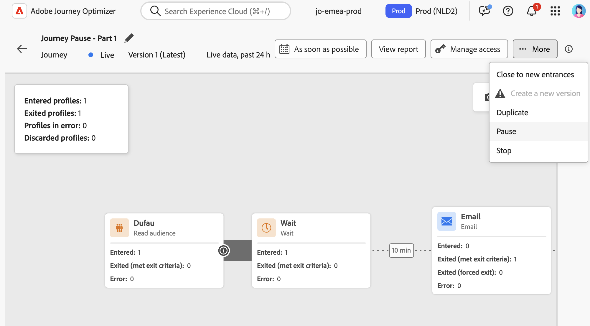
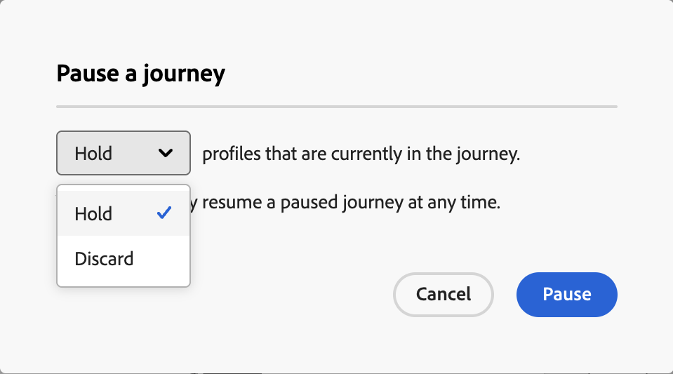
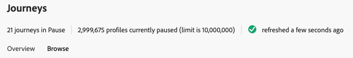
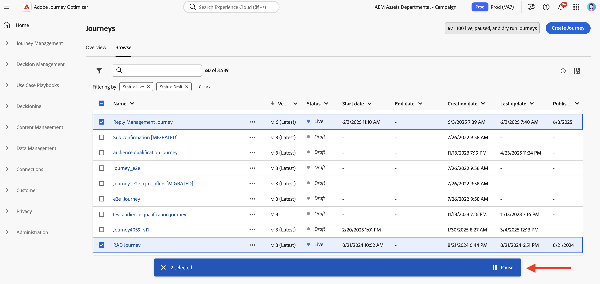
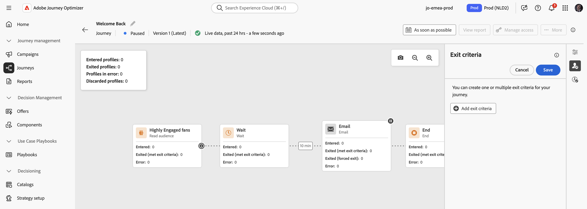
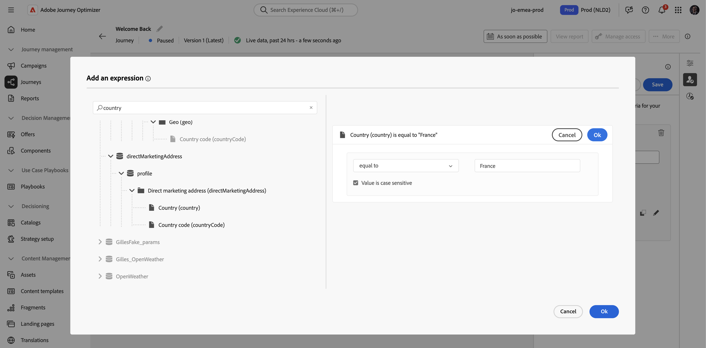
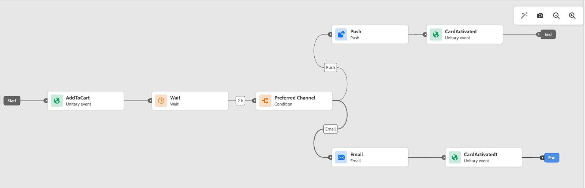

# 暫停歷程 {#journey-pause}

>[!CONTEXTUALHELP]
>id="ajo_journey_pause"
>title="暫停您的歷程"
>abstract="暫停上線的歷程以防止新輪廓進入。選擇是否捨棄目前在歷程當中的輪廓或予以保留。若要保留，一旦歷程重新開始，輪廓將在下一個動作活動中繼續執行。非常適合更新或緊急停止的情況使用，不會遺失任何進度。"

您可以隨時暫停即時歷程、執行所有需要的變更，然後再次繼續。<!--You can choose whether the journey is resumed at the end of the pause period, or whether it stops completely. -->在暫停期間，您可以[套用設定檔屬性退出條件](#journey-exit-criteria)以根據其屬性排除設定檔。 歷程會在暫停期間結束時自動繼續。 您也可以[手動](#journey-resume-steps)繼續進行。

## 主要優點 {#journey-pause-benefits}

暫停和繼續歷程可讓歷程參與者在不中斷客戶體驗的情況下暫時暫停即時歷程，擁有更優異的控制權和彈性。 暫停時，系統就不會傳送任何通訊，設定檔會維持在暫停狀態，直到繼續歷程為止。

此功能減少在錯誤或更新期間（例如：變更訊息內容）傳送意外訊息的風險，支援更安全的歷程管理，並提高從業人員的信心。 直接在UI中檢視暫停的歷程及其狀態，可進一步增強透明度和作業靈敏度。

>[!CAUTION]
>
>* 暫停和恢復歷程的許可權僅限於具有&#x200B;**[!DNL Publish journeys]**&#x200B;高階許可權的使用者。 在[!DNL Journey Optimizer]本節[中進一步瞭解如何管理](../administration/permissions-overview.md)使用者的存取權。
>
>* 開始使用暫停/恢復功能之前，[請先閱讀護欄和限制](#journey-pause-guardrails)。


## 如何暫停歷程 {#journey-pause-steps}

您可以暫停任何&#x200B;**即時**&#x200B;歷程。

若要暫停您的歷程，請依照下列步驟進行：

1. 開啟您要暫停的歷程。
1. 按一下歷程畫布右上角的&#x200B;**...更多**&#x200B;按鈕，然後選取&#x200B;**暫停**。

   

1. 選取如何管理目前位於歷程中的設定檔。

   {width="50%" align="left"}

   您可以：

   * **保留**&#x200B;設定檔 — 設定檔將等候下一個&#x200B;**動作**&#x200B;節點，以繼續歷程
   * **捨棄**&#x200B;設定檔 — 設定檔會在下一個&#x200B;**動作**&#x200B;節點從歷程中排除

1. 按一下&#x200B;**暫停**&#x200B;按鈕確認。

可在您組織的暫停歷程中保留的設定檔最大數量會顯示在歷程詳細目錄中。 只有在至少一個歷程暫停時，它才會顯示。 此指標也會顯示暫停的歷程總數。 每30分鐘重新整理一次。 進一步瞭解[護欄和限制](#guardrails-and-limitations)。

{width="50%" align="left"}

從您的歷程清單中，您可以暫停一或多個&#x200B;**即時**&#x200B;歷程。 若要暫停歷程群組（_大量暫停_），請在清單中選取它們，然後按一下畫面底部藍色列中的&#x200B;**暫停**&#x200B;按鈕。 **暫停**&#x200B;按鈕僅在選取&#x200B;**即時**&#x200B;歷程時可用。



## 暫停的歷程執行邏輯 {#journey-pause-exec}

歷程暫停時，一律會捨棄新的入口，無論保留/捨棄模式為何。

歷程暫停時，設定檔管理和活動執行會根據活動而定。 行為方式詳述如下。 如需完整瞭解，另請參閱此[端對端範例](#journey-pause-sample)。


| 歷程活動 | 歷程暫停時 |
|-------------------------|--------------------------------------------------|
| [對象資格](audience-qualification-events.md) | <ul> <li>在畫布中的第一個節點：會捨棄對象的任何設定檔資格 </li><li>在其他節點中：與即時歷程中的行為相同，但如果對象資格在<strong>動作</strong>活動後且使用者在該動作上暫停，則會捨棄對象資格。 </li></ul> |
| [單一事件](general-events.md) | <ul> <li>在畫布中的第一個節點：會捨棄事件</li><li>在其他節點中：與即時歷程中的行為相同，但如果事件在<strong>動作</strong>活動之後，且使用者在該動作上暫停，則會捨棄事件。 </li></ul> |
| [讀取對象](read-audience.md) | 與即時歷程的行為相同，但有幾項特性： <ol> <li> 如果在<strong>讀取對象</strong>活動開始後按下<strong>暫停</strong>，則已進入歷程的設定檔將會繼續（直到下一個<strong>動作</strong>活動）。 當歷程以特定速度讀取對象時，如果完整對象尚未進入，則會捨棄佇列中的剩餘設定檔。</li><li> 針對單一執行：如果排程日期在繼續日期之前，則恢復時不會顯示錯誤。 將會忽略該排程。</li><li>對於增量歷程： <ul><li>如果暫停發生在第一次發生之前，則在繼續時，將會播放完整的對象。 </li><li>例如，如果暫停發生，在每日週期的第4天，並且歷程保持暫停直到第9天，則在恢復時，將包含從第4天到第9天輸入的所有設定檔  </li></ul></ol> |
| [回應](reaction-events.md) | 與即時歷程中的行為相同，但如果回應是在<strong>動作</strong>活動之後，且使用者在該動作上暫停，則會捨棄回應事件。 |
| [等待](wait-activity.md) | 與即時歷程中的行為相同 |
| [條件](condition-activity.md) | 與即時歷程中的行為相同 |
| [內容決定](content-decision.md) | 當歷程暫停時，會根據使用者選擇的內容暫留或捨棄設定檔 |
| [頻道動作](journeys-message.md) | 當歷程暫停時，會根據使用者選擇的內容暫留或捨棄設定檔 |
| [自訂動作](../action/action.md) | 當歷程暫停時，會根據使用者選擇的內容暫留或捨棄設定檔 |
| [更新設定檔](update-profiles.md)與[跳轉](jump.md) | 當歷程暫停時，會根據使用者選擇的內容暫留或捨棄設定檔 |
| [外部資料Source](../datasource/external-data-sources.md) | 與即時歷程中的行為相同 |
| [退出條件](journey-properties.md#exit-criteria) | 與即時歷程中的行為相同 |


在[本節](#discards-troubleshoot)中瞭解如何疑難排解捨棄。

## 如何繼續暫停的歷程 {#journey-resume-steps}

>[!CONTEXTUALHELP]
>id="ajo_journey_resume"
>title="繼續歷程"
>abstract="繼續暫停的歷程，允許新的輪廓再次進入。如果輪廓在暫停期間是等待狀態，將會繼續其歷程。非常適合在更新或暫停後安全地重新啟動歷程時使用。"

暫停的歷程會在最大暫停期間14天結束後自動恢復。 可隨時手動繼續進行。 繼續暫停的歷程可讓新設定檔再次進入。 如果輪廓在暫停期間是等待狀態，將會繼續其歷程。非常適合在更新或暫停後安全地重新啟動歷程時使用。

若要繼續暫停的歷程並重新開始聆聽歷程事件，請遵循下列步驟：

1. 開啟您要繼續的歷程。
1. 選取歷程畫布右上角的&#x200B;**...更多**&#x200B;按鈕，然後選取&#x200B;**繼續**。

   歷程會切換至&#x200B;**繼續**&#x200B;狀態。 當歷程繼續時，新進入在一分鐘內開始。 恢復保留的設定檔可能需要一些時間 — 設定檔會以5k tps的速率恢復。  由於所有設定檔都必須繼續，歷程才能再次變成&#x200B;**即時**，從&#x200B;**繼續**&#x200B;到&#x200B;**即時**&#x200B;狀態的轉換可能需要一些時間。

1. 按一下「**繼續**」按鈕確認。


從歷程清單中，您可以繼續一或多個&#x200B;**已暫停**&#x200B;歷程。 若要繼續歷程群組（_大量繼續_），請選取它們並按一下畫面底部藍色列中的&#x200B;**繼續**&#x200B;按鈕。 請注意，**繼續**&#x200B;按鈕只有在選取&#x200B;**已暫停**&#x200B;歷程時才可用。


## 在暫停的歷程中套用退出條件 {#journey-exit-criteria}

歷程暫停時，您可以根據設定檔屬性套用退出條件。 此篩選器可讓您排除與恢復時定義的運算式相符的設定檔。 一旦設定了以設定檔屬性為基礎的退出標準，就會在動作節點上強制執行，即使是新設定檔的進入也一樣。 符合條件的現有設定檔和進入歷程的新設定檔，會在它們遇到的下一個動作節點&#x200B;**上，從歷程**&#x200B;中排除。

例如，若要從暫停的歷程中排除所有法國客戶，請遵循下列步驟：

1. 瀏覽至您要修改的暫停歷程。

1. 選取&#x200B;**退出條件**&#x200B;圖示。

   

1. 在&#x200B;**退出條件**&#x200B;設定中，按一下&#x200B;**新增退出條件**&#x200B;以根據設定檔屬性定義篩選器。

1. 設定運算式，以排除國家/地區屬性等於「法國」的設定檔。

   

1. 儲存您的篩選器，然後按一下&#x200B;**更新歷程**&#x200B;按鈕以套用您的變更。

1. [繼續歷程](#journey-resume-steps)。

   在恢復時，country屬性設定為France的所有設定檔將在下一個動作節點自動從歷程中排除。 任何國家/地區屬性設定為France的新設定檔嘗試進入歷程時，也將在下一個動作節點遭到封鎖。

請注意，目前歷程中設定檔的設定檔排除和新設定檔的設定檔排除只會在到達動作節點&#x200B;**時發生**。

>[!CAUTION]
>
>* 您只能為每個歷程設定&#x200B;**一個**&#x200B;設定檔屬性型退出條件。
>
>* 您只能在&#x200B;**已暫停**&#x200B;歷程中建立、更新或刪除以設定檔屬性為基礎的退出條件。
>
>* 在本節[中進一步瞭解設定檔屬性型退出條件](journey-properties.md#profile-exit-criteria)。

## 護欄與限制 {#journey-pause-guardrails}

* 歷程版本最多可暫停&#x200B;**14天**，整個組織的暫停歷程中最多允許&#x200B;**100萬個設定檔**。
每30分鐘檢查一次此限制。 這表示您可能會暫時超過1000萬的臨界值，但一旦系統偵測到，則會自動捨棄任何其他設定檔。

  如果您繼續歷程以將保留的個人檔案數恢復到限制以下，歷程將立即繼續 — 但更新個人檔案計數最多可能需要30分鐘。 在這段期間，系統仍可能將這些設定檔視為已暫停。

* 對於包含[傳入活動](../channels/gs-channels.md#mobile-app-and-web-experiences) （例如，應用程式內、網頁等）的歷程，暫停歷程不會中斷已觸發的通訊。 如果設定檔在暫停前符合入站活動的資格，則仍會傳送相對應的訊息。 若要完全停止所有傳入通訊，您必須停止歷程。
* 暫停的歷程計入即時歷程配額
* 已進入歷程但在暫停期間被捨棄的設定檔，仍會計為可參與的設定檔
* 暫停的歷程會以即時方式納入所有商業規則中
* 歷程全域逾時仍適用於暫停的歷程。 例如，如果設定檔處於歷程中90天且歷程已暫停，則此設定檔仍將在第91天結束歷程
* 設定檔到達動作活動時，會在暫停的歷程中&#x200B;**捨棄**。 如果他們在歷程暫停期間堅持等待，並在繼續後退出，則會繼續歷程且不會被捨棄。 [檢視端對端範例](#journey-pause-sample)
* 即使暫停後，隨著事件繼續處理，這些事件也會計入每秒的Journey Events數量配額，之後節流會成為單一專案
* 當設定檔在暫停的歷程中保留時，在繼續時會重新整理設定檔屬性
* 條件仍會在暫停的歷程中執行，因此如果歷程因資料品質問題而暫停，則可以使用錯誤的資料評估動作節點之前的任何條件
* 對於以&#x200B;**讀取對象**&#x200B;歷程為基礎的增量對象，會考慮暫停的持續時間。 對象資格或事件型歷程則非如此（如果在暫停期間收到對象資格或事件，且他們是歷程中的第一個活動，則捨棄這些事件）
* 如果設定檔保留在歷程中，而且此歷程在幾天後自動繼續，則設定檔會繼續歷程且不會捨棄。 如果您想要卸除這些物件，您必須停止歷程
* 在暫停的歷程中，不會為[批次區段警示觸發警示](../reports/alerts.md#alert-read-audiences)
* 歷程的14天暫停狀態終止後，系統中沒有稽核記錄
* 某些已捨棄的設定檔會顯示在歷程步驟事件中，但不會顯示在報表中。 例如：
   * 捨棄&#x200B;**讀取對象**&#x200B;的商業事件
   * **讀取對象**&#x200B;工作因暫停歷程而捨棄
   * 在&#x200B;**Event**&#x200B;活動在設定檔等待的動作之後時，捨棄事件


## 端對端範例 {#journey-pause-sample}

以下方以歷程為例：

{zoomable="yes"}

暫停此歷程時，您選取設定檔是&#x200B;**已捨棄**&#x200B;或&#x200B;**保留**，然後設定檔管理如下：

1. **AddToCart**&#x200B;活動：所有新設定檔入口都已封鎖。 如果設定檔在暫停前已進入歷程，則會繼續前往下一個動作節點。
1. **等待**&#x200B;活動：設定檔繼續在節點上正常等待，而且即使歷程暫停，也會退出節點。
1. **條件**：設定檔會繼續通過條件，並根據條件上定義的運算式，移至正確的分支。
1. **推播**/**電子郵件**&#x200B;活動：在暫停的歷程中，設定檔會開始等待或捨棄（根據使用者在暫停時所做的選擇）下一個動作節點。 因此，設定檔將會開始等待或捨棄在那裡。
1. **動作**&#x200B;節點之後的&#x200B;**事件**：如果設定檔正在等候&#x200B;**動作**&#x200B;節點，而且之後有&#x200B;**事件**&#x200B;活動，如果觸發該事件，則會捨棄該事件。

根據此行為，您會看到暫停歷程中的設定檔數目增加，大多是在&#x200B;**動作**&#x200B;活動前的活動中。 舉例來說，在該範例中，**等待**&#x200B;活動仍處於啟用狀態，當設定檔結束&#x200B;**條件**&#x200B;活動時，會增加該活動的設定檔數量。

當您繼續此歷程時：

1. 全新的歷程入口在一分鐘內開始。
1. 目前在&#x200B;**動作**&#x200B;活動上等待歷程的設定檔會以5k tps的速率繼續。 接著，他們就可以進入等待的&#x200B;**動作**，然後繼續歷程。

## 疑難排解暫停歷程中的設定檔捨棄 {#discards-troubleshoot}

您可以使用[Adobe Experience Platform查詢服務](https://experienceleague.adobe.com/docs/experience-platform/query/api/getting-started.html){target="_blank"}來查詢步驟事件，這些步驟事件可以根據設定檔放棄發生的時間提供詳細資訊。

* 對於在設定檔進入歷程之前發生的捨棄，請使用下列程式碼：

  ```sql
  SELECT
  TIMESTAMP,
  _experience.journeyOrchestration.profile.ID,
  to_json(_experience.journeyOrchestration)
  FROM
  journey_step_events
  WHERE
  _experience.journeyOrchestration.serviceEvents.dispatcher.eventType = 'PAUSED_JOURNEY_VERSION'
  AND _experience.journeyOrchestration.journey.versionID=<jvId>  
  ```

  這將列出在歷程進入點發生的捨棄：

   1. 當對象歷程正在執行且第一個節點仍在處理時，如果歷程已暫停，則會捨棄所有未處理的設定檔。

   1. 當新的單一事件在歷程暫停時到達開始節點（以觸發入口）時，事件會被捨棄。

* 對於在設定檔已位於歷程中時發生的捨棄，請使用下列程式碼：

  ```sql
  SELECT
  TIMESTAMP,
  _experience.journeyOrchestration.profile.ID,
  to_json(_experience.journeyOrchestration)
  FROM
  journey_step_events
  WHERE
  _experience.journeyOrchestration.serviceEvents.stateMachine.eventType = 'JOURNEY_IN_PAUSED_STATE'
  AND _experience.journeyOrchestration.journey.versionID=<jvId> 
  ```

  此命令會列出設定檔在歷程中時發生的捨棄專案：

   1. 如果歷程暫停，並啟用捨棄選項，而且設定檔已在暫停前輸入，則當該設定檔到達下一個動作節點時，將會捨棄該設定檔。

   1. 如果歷程在選取保留選項的情況下暫停，但設定檔因超過1000萬配額而被捨棄，則這些設定檔在到達下一個動作節點時仍會被捨棄。


