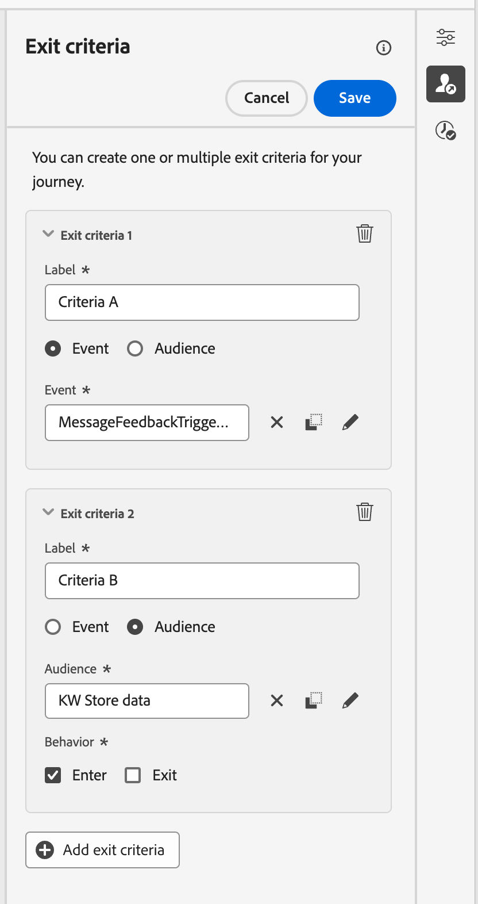

# 設定您的歷程屬性 {#jo-properties}

>[!CONTEXTUALHELP]
>id="ajo_journey_properties"
>title="歷程屬性"
>abstract="本區段會顯示歷程屬性。預設情況下，會隱藏唯讀參數。可用設定會依據歷程的狀態、您的權限及產品設定而定。"

## 存取歷程的屬性 {#access-properties}

歷程的屬性會集中在右邊欄中。 建立新歷程時，預設會顯示此區段。 對於現有歷程，按一下歷程名稱旁的鉛筆圖示以開啟歷程。

從此區段中，定義歷程的名稱、新增說明，並設定您的歷程全域屬性。

您可以：

* 將Adobe Experience Platform統一標籤指派給您的歷程，以輕鬆分類並改善行銷活動清單中的搜尋。 [了解如何使用標籤](../start/search-filter-categorize.md#tags)
* 選取您的歷程量度。 [瞭解如何設定及追蹤您的歷程量度](success-metrics.md)
* 管理[進入和重新進入](#entrance)。 設定檔入口管理取決於歷程型別。 詳細資料可在[此頁面](entry-management.md)上取得
* 管理[資料存取權](#manage-access)
* 選取歷程和設定檔[時區](#timezone)
* 選擇自訂[開始和結束日期](#dates)
* 在歷程活動中定義[逾時期間](#timeout) （僅適用於管理員使用者）
* 使用[衝突管理工具](#conflict)監視衝突並排定您的歷程優先順序

{width="80%"}{zoomable="yes"}

>[!NOTE]
>
>若為即時歷程，此畫面只會顯示發佈日期和發佈歷程的使用者名稱。

**複製技術詳細資料**&#x200B;選項可讓您複製支援團隊可用於疑難排解的歷程相關技術資訊。 已複製下列資訊： `JourneyVersion UID`、`OrgID`、`orgName`、`sandboxName`、`lastDeployedBy`、`lastDeployedAt`。

在本頁[進一步瞭解與特定設定檔之歷程相關的技術欄位，以及如何使用它們](expression/journey-properties.md)。

## 進入與重新進入 {#entrance}

設定檔專案模式是在歷程層級的右側設定窗格中定義。 設定如下所述。

設定檔入口管理取決於歷程型別。 在[此頁面](entry-management.md)上進一步瞭解設定檔進入和重新進入管理。

### 允許重新進入  {#allow-reentrance}

>[!CONTEXTUALHELP]
>id="ajo_journey_properties_entrance"
>title="允許重新進入"
>abstract="預設情況下，新歷程允許重新進入。例如，如果您想在某人進入商店時提供一次性禮物，您可以取消勾選「**允許重新進入**」選項。"
>additional-url="https://experienceleague.adobe.com/zh-hant/docs/journey-optimizer/using/orchestrate-journeys/manage-journey/entry-management" text="輪廓入口管理"

預設情況下，新歷程允許重新進入。您可以取消勾選「單次」歷程的&#x200B;**允許重新進入**&#x200B;選項，例如，如果您想要在某人進入商店時提供一次性禮物。

### 重新進入等待期  {#reentrance-wait}

>[!CONTEXTUALHELP]
>id="ajo_journey_properties_re-entrance_wait"
>title="重新進入等待期"
>abstract="設定允許輪廓在單一歷程中再次進入歷程之前的等待時間。這會防止使用者在選定的期間內重新進入歷程。最長持續時間：90 天。"
>additional-url="https://experienceleague.adobe.com/zh-hant/docs/journey-optimizer/using/orchestrate-journeys/manage-journey/entry-management" text="輪廓入口管理"

啟動&#x200B;**允許重新進入**&#x200B;選項時，會顯示&#x200B;**重新進入等待期間**&#x200B;欄位。 此欄位可讓您定義在允許輪廓在單一歷程中再次進入歷程 (從事件或客群資格篩選開始) 之前等待的時間。 這可防止同一事件多次錯誤觸發歷程。預設情況下，欄位會設為 5 分鐘。 持續時間上限為90天。

## 管理存取權 {#manage-access}

您可以根據存取標籤來限制歷程的存取權。

若要指派自訂資料使用標籤給歷程，請按一下&#x200B;**[!UICONTROL 管理存取標籤]**&#x200B;圖示，並選取一或多個標籤。

[深入瞭解物件層級存取控制(OLAC)](../administration/object-based-access.md)

## 歷程和設定檔時區 {#timezone}

時區是在歷程層級定義。 您可以輸入固定時區，或使用Adobe Experience Platform設定檔來定義歷程時區。 如果在Adobe Experience Platform設定檔中定義了時區，則可在歷程中擷取該時區。

[進一步瞭解時區管理](../building-journeys/timezone-management.md)

## 開始和結束日期 {#dates}

>[!CONTEXTUALHELP]
>id="ajo_journey_properties_start_date"
>title="開始日期"
>abstract="選取設定檔可開始進入此歷程的日期。如果沒有設定開始日期，則會預設為歷程的發佈日期。"

>[!CONTEXTUALHELP]
>id="ajo_journey_properties_end_date"
>title="結束日期"
>abstract="設定歷程結束的日期。在此日期，主要輪廓將自動退出此歷程，且不允許任何新的進入。"

依預設，設定檔發佈後即可進入您的歷程，並可一直保留，直到達到[全域歷程逾時](#global_timeout)。 唯一的例外是循環讀取對象歷程，其中&#x200B;**在循環**&#x200B;上強制重新進入，結束於下一個事件的開始日期。

如有需要，您可以定義自訂&#x200B;**開始日期**&#x200B;和&#x200B;**結束日期**。 這可讓設定檔在特定日期進入您的歷程，並在達到結束日期時自動退出。

## 逾時 {#timeout}

### 歷程活動逾時 {#timeout_and_error}

>[!CONTEXTUALHELP]
>id="ajo_journey_properties_timeout"
>title="逾時或錯誤"
>abstract="在歷程視為逾時之前，指定應嘗試執行動作或評估條件的所需時間。建議值介於 1 至 30 秒之間。"

編輯動作或條件活動時，您可以定義替代路徑，以防錯誤或逾時。 如果處理詢問協力廠商系統的活動超過歷程屬性的&#x200B;**[!UICONTROL 逾時或錯誤]**&#x200B;欄位中定義的逾時期間，將會選擇第二個路徑來執行可能的遞補動作。

建議值介於 1 至 30 秒之間。

如果您的歷程有時效性（例如：對人員的即時位置有所反應），建議您定義非常簡短的&#x200B;**[!UICONTROL 逾時或錯誤]**&#x200B;值，因為您的動作不能延遲超過幾秒鐘。 如果您的歷程較不有時效性，您可以使用較長的值，讓系統有更多時間呼叫，以傳送有效回應。

歷程也會使用全域逾時，如下所述。

### 全域歷程逾時 {#global_timeout}

除了歷程活動中使用的[逾時](#timeout_and_error)之外，還套用全域歷程逾時。 它不會顯示在介面中，且無法變更。

此全域逾時會在個人進入歷程&#x200B;**91天**&#x200B;後停止個人進度。 這表示個人的歷程不能持續超過91天。 在此逾時期間後，個人的資料會被刪除。 在逾時期間結束時仍在歷程中流動的個人將會停止，且將不會在報表中將其列入考量。 因此，您可能會看到更多人進入歷程而不是退出。

由於91天歷程逾時，當歷程不允許重新進入時，我們無法確保重新進入封鎖將超過91天。 事實上，當我們移除在進入歷程91天後進入歷程之人員的所有相關資訊時，我們無法得知此人之前已進入（超過91天前）。

個人只有在歷程剩餘的時間夠在91天歷程逾時前的等待期間完成時，才能進入等待活動。 請參閱[此頁面](../building-journeys/wait-activity.md)。

#### 存留時間(TTL)與資料保留常見問題集 {#timeout-faq}

自2024年6月Adobe Journey Optimizer發行版本開始，歷程全域逾時已從30天移動至91天。 影響會列於以下的常見問題集中：

單一歷程的&#x200B;****

<table style="table-layout:auto">
  <tr style="border: 1;">
    <td>
      
TTL擴充功能推出後發佈的歷程會如何？

    </td>
    <td>
      
進入新歷程的設定檔會自動具有91天的TTL。

    </td>
  </tr>
  <tr style="border: 1;">
    <td>
      
進入TTL擴充功能啟動前所發佈之歷程的個人資料會發生什麼事？

    </td>
    <td>
      
設定檔的TTL為30天（HIPAA為7天），與歷程的初始發佈時間一致。

    </td>
  </tr>
  <tr style="border: 1;">
    <td>
      
啟動TTL擴充功能時，已進入歷程的個人資料會發生什麼事？

    </td>
    <td>
      
根據歷程的原始發佈時間，設定檔將保留30天的TTL （HIPAA為7天）。

    </td>
  </tr>
  <tr style="border: 1;">
    <td>
      
在TTL擴充功能啟動後重新發佈的舊版歷程中的設定檔會有什麼改變？

    </td>
    <td>
      
設定檔將維持30天（HIPAA為7天）的TTL，與原始歷程版本的發佈時間一致。

    </td>
  </tr>
  <tr style="border: 1;">
    <td>
      
在TTL擴充功能啟動後，新設定檔進入重新發佈的歷程版本會發生什麼事？

    </td>
    <td>
      
設定檔的TTL為91天，符合新重新發佈的歷程版本的TTL。

    </td>
  </tr>
</table>

針對區段觸發器歷程&#x200B;****

<table style="table-layout:auto">
  <tr style="border: 1;">
    <td>
      
TTL擴充功能之後發佈的新一次性歷程有什麼改變？

    </td>
    <td>
      
進入新歷程的設定檔會自動擁有91天的TTL。

    </td>
  </tr>
  <tr style="border: 1;">
    <td>
      
在TTL擴充功能之後發佈的新週期性歷程沒有強制重新進入會怎樣？

    </td>
    <td>
      
進入新歷程的設定檔會自動擁有91天的TTL。

    </td>
  </tr>
  <tr style="border: 1;">
    <td>
      
在TTL擴充功能之後發佈的新循環歷程會如何處理，因為會強制重新進入？

    </td>
    <td>
      
進入新歷程的設定檔的TTL將等於週期期間。 例如，如果歷程每日執行，則TTL將為1天。

    </td>
  </tr>
  <tr style="border: 1;">
    <td>
      
進入TTL擴充功能啟動前所發佈之歷程的個人資料會發生什麼事？

    </td>
    <td>
      
設定檔的TTL為30天（HIPAA為7天），與原始發佈時間一致。 對於具有強制重新進入的週期性歷程，TTL將符合週期性期間。

    </td>
  </tr>
  <tr style="border: 1;">
    <td>
      
啟動TTL擴充功能時，透過歷程執行的設定檔會發生什麼事？

    </td>
    <td>
      
根據歷程的原始發佈時間，設定檔將保留30天的TTL （HIPAA為7天）。 對於具有強制重新進入的週期性歷程，TTL將符合週期性期間。

    </td>
  </tr>
  <tr style="border: 1;">
    <td>
      
在TTL擴充功能啟動後重新發佈的先前歷程版本中，執行中的設定檔有何改變？

    </td>
    <td>
      
設定檔將保留30天（HIPPA為7天）的TTL，與原始歷程版本的發佈時間一致。 對於具有強制重新進入的週期性歷程，TTL將符合週期性期間。

    </td>
  </tr>
  <tr style="border: 1;">
    <td>
      
在TTL擴充功能啟動後，新設定檔進入重新發佈的歷程版本會發生什麼事？

    </td>
    <td>
      
設定檔的TTL為91天，符合新重新發佈的歷程版本的TTL。 對於具有強制重新進入的週期性歷程，TTL將符合週期性期間。

    </td>
  </tr>
</table>

## 合併原則 {#merge-policies}

從Adobe Experience Platform擷取設定檔資料時，Adobe Journey Optimizer會使用合併原則。 根據歷程型別，會使用不同的合併原則：

* 在讀取對象或對象資格歷程中：使用來自對象的合併原則
* 在單一事件歷程中：使用預設合併原則
* 在業務事件歷程中：使用以下讀取對象活動中來自目標對象的合併原則

Adobe Journey Optimizer會套用在整個歷程中使用的合併原則。 因此，如果在歷程中使用多個對象（例如使用[`inAudience`函式](functions/functioninaudience.md)中的），這會造成與歷程使用的合併原則不一致、引發錯誤並封鎖發佈。 不過，如果在訊息個人化中使用不一致的對象，則儘管不一致，仍不會引發警報。 因此，強烈建議您在訊息個人化使用此對象時，檢查與對象相關聯的合併原則。

若要深入瞭解合併原則，請參閱[Adobe Experience Platform檔案](https://experienceleague.adobe.com/zh-hant/docs/experience-platform/profile/merge-policies/overview){target="_blank"}。

>[!NOTE]
>
>更新對象合併原則時，必須重新發佈（或複製）任何參照該對象的作用中歷程。 變更合併原則會有效建立「新」對象，而現有歷程無法存取該對象，以確保資料一致性。

## 退出條件 {#exit-criteria}

>[!CONTEXTUALHELP]
>id="ajo_journey_exit_criterias"
>title="退出條件"
>abstract="本區段會顯示退出條件選項。您可以為您的歷程建立一個或多個退出條件規則及篩選器。"

### 歷程退出條件 {#exit-criteria-desc}

透過新增退出標準，一旦出現事件 (例如：購買)，或是符合對象資格時，您就可以馬上讓設定檔退出歷程。這能阻止使用者從歷程處取得任何進一步通訊資料。

當設定檔不再符合歷程的目的時，您可能會想要從歷程中移除設定檔。 這可透過與目標管理密切相關的&#x200B;**全域退出條件**&#x200B;來達成。

**範例使用案例**

行銷人員有一個促銷歷程，其中包含一系列通訊。 每次溝通都是為了促使客戶購買。 一旦完成購買，客戶即不應收到系列中的其餘訊息。 透過定義退出條件，會從歷程中移除購買的任何設定檔。

#### 設定與使用 {#exit-criteria-config}

退出條件是在歷程層級設定。 一個歷程可以有多個退出條件。 如果您已設定多個退出條件，則會使用`OR`邏輯從上到下進行評估。 因此，如果您有退出條件A和退出條件B，則會評估為&#x200B;**或** B。會在歷程的每個步驟中評估條件。

若要&#x200B;**建立**&#x200B;退出條件，請遵循下列步驟：

1. 開啟您的歷程。

1. 按一下位於歷程畫布右上角的 **[!UICONTROL 顯示退出條件]**&#x200B;圖示。

1. 選取&#x200B;**[!UICONTROL 新增退出條件]**。

1. 輸入&#x200B;**標籤**，並選取您的退出條件是否以&#x200B;**事件**&#x200B;或&#x200B;**對象**&#x200B;為基礎。

   * 對於根據事件的退出條件，例如下載應用程式或新增產品至購物車，請僅挑選單一事件。
   * 對於根據對象的退出條件，例如檢查客戶在過去24小時內是否購買的對象，請選取對象。 注意：使用對象的退出條件最多可能需要10分鐘才會生效。

您可以新增多個退出條件。

{width="40%" align="left"}

### 以設定檔屬性為基礎的退出條件 {#profile-exit-criteria}

設定檔屬性型退出條件可讓您定義規則，在歷程恢復之前自動移除特定設定檔，讓您更能掌控暫停的歷程。 您可以根據設定檔屬性（例如位置、狀態或偏好設定）來設定退出條件，以確保只有相關的設定檔會在恢復後繼續進入歷程。

例如，您可以[暫停歷程](journey-pause.md)、新增退出條件以移除位於法國的所有設定檔，以及在瞭解這些設定檔將在下一個動作步驟被排除的情況下繼續歷程。 此邏輯會套用至已在歷程中的設定檔，以及任何在歷程恢復後符合資格的新設定檔。

此功能與暫停/恢復功能搭配使用，可幫助您更安全、更靈活地管理歷程。 它將手動干預降至最低，降低傳送不相關或不相容通訊的風險，並使您的歷程邏輯與目前的業務需求保持一致。

請參閱本節以瞭解如何[在暫停的歷程中使用設定檔屬性退出條件](journey-pause.md#apply-a-global-filter-to-profiles-in-a-paused-journey)。

### 護欄與限制 {#exit-criteria-guardrails}

下列護欄和限制適用於[歷程退出條件](#exit-criteria-desc)功能：

* 退出條件只能在草稿狀態中定義
* 事件和事件型退出條件之間的歷程名稱空間一致性

使用[設定檔屬性型退出條件](#profile-exit-criteria)功能時，會套用下列護欄：

* **退出條件套用在動作層級**\
  「設定檔屬性」退出條件僅在動作步驟中評估。 與其他退出條件型別不同，這些型別不會在整個歷程中全域套用。\
  如果您繼續歷程且某些設定檔符合退出條件，則這些設定檔將在下一個動作節點中排除。\
  如果新設定檔符合條件，則在恢復後進入歷程的設定檔也將在第一個動作節點評估並排除。

* **每個歷程一個設定檔型退出規則**\
  每個歷程只能定義一個「設定檔屬性」退出條件。 此限制有助於保持清晰度並避免歷程邏輯發生衝突。

* **僅可用於暫停的歷程**\
  您只能在歷程暫停時新增或編輯「設定檔屬性」退出條件。

   * 在&#x200B;**草稿歷程**&#x200B;中，*設定檔屬性*&#x200B;選項顯示為停用（唯讀），而&#x200B;*事件*&#x200B;和&#x200B;*對象*&#x200B;選項保持作用中。
   * 在&#x200B;**暫停的歷程**&#x200B;中，*設定檔屬性*&#x200B;選項會變成可編輯，*事件*&#x200B;和&#x200B;*對象*&#x200B;選項會變成唯讀。

## 歷程排程 {#schedule}

**[!UICONTROL 排程]**&#x200B;區段僅在畫布中捨棄&#x200B;**[!UICONTROL 讀取對象]**&#x200B;活動時可用。 它可讓您定義歷程應執行的特定日期/時間和頻率。 [瞭解如何排程讀取對象歷程](../building-journeys/read-audience.md)

## 衝突管理 {#conflict}

歷程屬性中的&#x200B;**[!UICONTROL 衝突管理]**&#x200B;區段可讓您監視衝突並排定歷程的優先順序。 您可以：

* 套用&#x200B;**規則集**&#x200B;以根據上限規則將此歷程排除給部分對象。 [學習如何使用規則集](../conflict-prioritization/rule-sets.md)

* 將&#x200B;**優先順序分數**&#x200B;指派給歷程，範圍從0到100。 分數越高則表示優先順序越高。 此處插入的優先順序值將由這個歷程所包含的任何傳入動作 (例如應用程式內) 繼承。[瞭解如何使用優先順序分數](../conflict-prioritization/priority-scores.md)

  如果遇到其他行銷活動或歷程使用相同傳入管道設定的情況，將為收件者顯示優先順序分數最高的傳入動作。如果多個歷程或行銷活動具有相同的分數，將選擇最近修改的元素。

* **檢視與其他歷程、行銷活動或頻道設定衝突**。 如果您想要識別對象、開始和結束日期、頻道設定、頻道或規則集上的重疊，您可以在此處檢視潛在衝突。 [瞭解如何識別歷程中的潛在衝突](../conflict-prioritization/conflicts.md)
