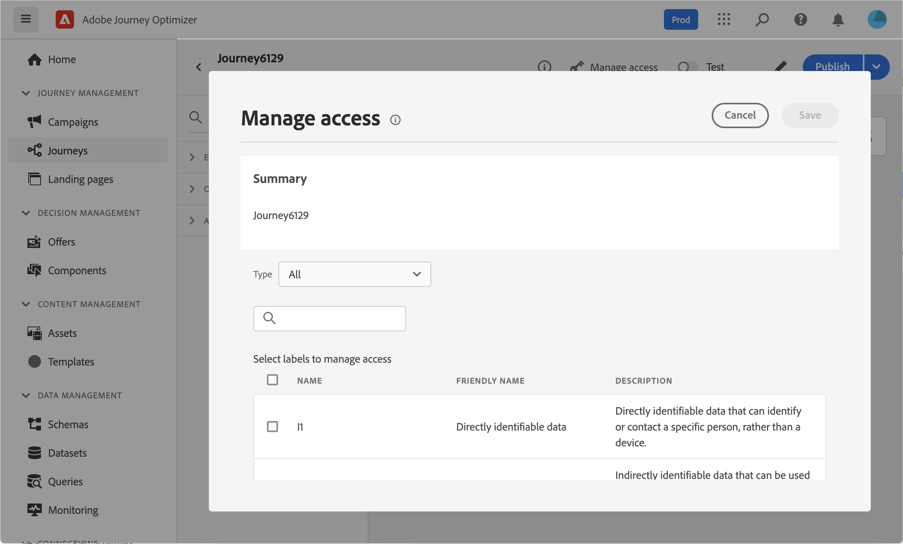

# 設定您的歷程屬性 {#jo-properties}

>[!CONTEXTUALHELP]
>id="ajo_journey_properties"
>title="歷程屬性"
>abstract="本區段會顯示歷程屬性。預設情況下，會隱藏唯讀參數。可用設定會依據歷程的狀態、您的權限和產品設定而定。"

## 存取歷程的屬性 {#access-properties}

歷程的屬性會集中在右邊欄中。 建立新歷程時，預設會顯示此區段。 對於現有歷程，按一下歷程名稱旁的鉛筆圖示以開啟歷程。

從此區段，您可以定義歷程的名稱、新增說明，以及：

* 管理[進入和重新進入](#entrance)，
* 選擇開始和結束[日期](#dates)，
* 管理[資料](#manage-access)的存取權，
* 在歷程活動中定義[逾時期間](#timeout) （僅適用於管理員使用者），
* 選取歷程和設定檔[時區](#timezone)
* 將Adobe Experience Platform統一標籤指派給您的歷程，以輕鬆分類並改善行銷活動清單中的搜尋。 [了解如何使用標籤](../start/search-filter-categorize.md#tags)
* 使用[衝突管理工具](#conflict)監視衝突並排定您的歷程優先順序。

>[!NOTE]
>
>若為即時歷程，此畫面只會顯示發佈日期和發佈歷程的使用者名稱。

**複製技術詳細資料**&#x200B;可讓您複製支援團隊可用於疑難排解的歷程相關技術資訊。 已複製下列資訊： `JourneyVersion UID`、`OrgID`、`orgName`、`sandboxName`、`lastDeployedBy`、`lastDeployedAt`。

在本頁](expression/journey-properties.md)中進一步瞭解與特定設定檔之歷程相關的技術欄位，以及如何使用它們[。

## 進入與重新進入 {#entrance}

設定檔專案模式是在歷程層級的右側設定窗格中定義。 設定如下所述。

設定檔入口管理取決於歷程型別。 在[此頁面](entry-management.md)中進一步瞭解設定檔進入和重新進入管理。

### 允許重新進入  {#allow-reentrance}

>[!CONTEXTUALHELP]
>id="ajo_journey_properties_entrance"
>title="允許重新進入"
>abstract="預設情況下，新歷程允許重新進入。例如，如果您想在某人進入商店時提供一次性禮物，您可以取消勾選「**允許重新進入**」選項。"
>additional-url="https://experienceleague.adobe.com/zh-hant/docs/journey-optimizer/using/orchestrate-journeys/manage-journey/entry-management" text="輪廓入口管理"

預設情況下，新歷程允許重新進入。您可以取消勾選「單次」歷程的&#x200B;**允許重新進入**&#x200B;選項，例如，如果您想要在某人進入商店時提供一次性禮物。

### 重新進入等待期  {#reentrance-wait}

>[!CONTEXTUALHELP]
>id="ajo_journey_properties_re-entrance_wait"
>title="重新進入等待期"
>abstract="設定允許輪廓在單一歷程中再次進入歷程之前等待的時間。這會防止使用者在選定的期間內重新進入歷程。最長持續時間：90 天。"
>additional-url="https://experienceleague.adobe.com/zh-hant/docs/journey-optimizer/using/orchestrate-journeys/manage-journey/entry-management" text="輪廓入口管理"

啟動&#x200B;**允許重新進入**&#x200B;選項時，會顯示&#x200B;**重新進入等待期間**&#x200B;欄位。 此欄位可讓您定義在允許輪廓在單一歷程中再次進入歷程 (從事件或客群資格篩選開始) 之前等待的時間。 這可防止同一事件多次錯誤觸發歷程。預設情況下，欄位會設為 5 分鐘。 持續時間上限為90天。

## 管理存取權 {#manage-access}

若要指派自訂或核心資料使用標籤給歷程，請按一下&#x200B;**[!UICONTROL 管理存取權]**&#x200B;按鈕。 [進一步瞭解物件層級存取控制(OLAC)](../administration/object-based-access.md)

## 歷程和設定檔時區 {#timezone}

時區是在歷程層級定義。 您可以輸入固定時區，或使用Adobe Experience Platform設定檔來定義歷程時區。 如果在Adobe Experience Platform設定檔中定義了時區，則可在歷程中擷取該時區。

如需時區管理的詳細資訊，請參閱[此頁面](../building-journeys/timezone-management.md)。

## 開始和結束日期 {#dates}

>[!CONTEXTUALHELP]
>id="ajo_journey_properties_start_date"
>title="開始日期"
>abstract="選擇歷程可以開始的日期項目。如果未指定開始日期，則會在發佈時自動設定。"

>[!CONTEXTUALHELP]
>id="ajo_journey_properties_end_date"
>title="結束日期"
>abstract="選擇歷程的結束日期。當到達該日期時，該歷程中的輪廓會自動退出，新的輪廓將無法再進入。"

您可以定義&#x200B;**開始日期**。 如果您尚未指定，則會在發佈時自動定義。

您也可以新增&#x200B;**結束日期**。 這可讓輪廓在達到日期時自動退出。 如果未指定結束日期，則設定檔可以保留到[全域歷程逾時](#global_timeout) （通常為91天）為止。 唯一的例外是循環讀取對象歷程，其中&#x200B;**在循環**&#x200B;上強制重新進入，結束於下一個事件的開始日期。

## 逾時 {#timeout}

### 歷程活動逾時或錯誤 {#timeout_and_error}

>[!CONTEXTUALHELP]
>id="ajo_journey_properties_timeout"
>title="逾時"
>abstract="定義歷程嘗試執行動作或驗證條件的時間長度，在此之後視為逾時。"

編輯動作或條件活動時，您可以定義替代路徑，以防錯誤或逾時。 如果處理詢問協力廠商系統的活動超過歷程屬性的&#x200B;**[!UICONTROL 逾時或錯誤]**&#x200B;欄位中定義的逾時期間，將會選擇第二個路徑來執行可能的遞補動作。

授權值介於1到30秒之間。

如果您的歷程有時效性（例如：對人員的即時位置有所反應），建議您定義非常簡短的&#x200B;**[!UICONTROL 逾時或錯誤]**&#x200B;值，因為您的動作不能延遲超過幾秒鐘。 如果您的歷程較不有時效性，您可以使用較長的值，讓系統有更多時間呼叫，以傳送有效回應。

歷程也會使用全域逾時，如下所述。

### 全域歷程逾時 {#global_timeout}

除了歷程活動中使用的[逾時](#timeout_and_error)之外，還套用全域歷程逾時。 它不會顯示在介面中，且無法變更。

此全域逾時會在個人進入歷程&#x200B;**91天**&#x200B;後停止個人進度。 這表示個人的歷程不能持續超過91天。 在此逾時期間後，個人的資料會被刪除。 在逾時期間結束時仍在歷程中流動的個人將會停止，且將不會在報表中將其列入考量。 因此，您可能會看到更多人進入歷程而不是退出。

由於91天歷程逾時，當歷程不允許重新進入時，我們無法確保重新進入封鎖將超過91天。 事實上，當我們移除在進入歷程91天後進入歷程之人員的所有相關資訊時，我們無法得知此人之前已進入（超過91天前）。

個人只有在歷程剩餘的時間夠在91天歷程逾時前的等待期間完成時，才能進入等待活動。 請參閱[此頁面](../building-journeys/wait-activity.md)。

#### 存留時間(TTL)與資料保留常見問題集 {#timeout-faq}

自2024年6月Adobe Journey Optimizer發行版本開始，歷程全域逾時已從30天移動至91天。 影響會列於以下的常見問題集中：

單一歷程的&#x200B;****
<table style="table-layout:auto">
  <tr style="border: 1;">
    <td>
      
TTL擴充功能推出後發佈的歷程會如何？

    </td>
    <td>
      
進入新歷程的設定檔會自動具有91天的TTL。

    </td>
  </tr>
  <tr style="border: 1;">
    <td>
      
進入TTL擴充功能啟動前所發佈之歷程的個人資料會發生什麼事？

    </td>
    <td>
      
設定檔的TTL為30天（HIPAA為7天），與歷程的初始發佈時間一致。

    </td>
  </tr>
  <tr style="border: 1;">
    <td>
      
啟動TTL擴充功能時，已進入歷程的個人資料會發生什麼事？

    </td>
    <td>
      
根據歷程的原始發佈時間，設定檔將保留30天的TTL （HIPAA為7天）。

    </td>
  </tr>
  <tr style="border: 1;">
    <td>
      
在TTL擴充功能啟動後重新發佈的舊版歷程中的設定檔會有什麼改變？

    </td>
    <td>
      
設定檔將維持30天（HIPAA為7天）的TTL，與原始歷程版本的發佈時間一致。

    </td>
  </tr>
  <tr style="border: 1;">
    <td>
      
在TTL擴充功能啟動後，新設定檔進入重新發佈的歷程版本會發生什麼事？

    </td>
    <td>
      
設定檔的TTL為91天，符合新重新發佈的歷程版本的TTL。

    </td>
  </tr>
</table>

針對區段觸發器歷程&#x200B;****

<table style="table-layout:auto">
  <tr style="border: 1;">
    <td>
      
TTL擴充功能之後發佈的新一次性歷程有什麼改變？

    </td>
    <td>
      
進入新歷程的設定檔會自動擁有91天的TTL。

    </td>
  </tr>
  <tr style="border: 1;">
    <td>
      
在TTL擴充功能之後發佈的新週期性歷程沒有強制重新進入會怎樣？

    </td>
    <td>
      
進入新歷程的設定檔會自動擁有91天的TTL。

    </td>
  </tr>
  <tr style="border: 1;">
    <td>
      
在TTL擴充功能之後發佈的新循環歷程會如何處理，因為會強制重新進入？

    </td>
    <td>
      
進入新歷程的設定檔的TTL將等於週期期間。 例如，如果歷程每日執行，則TTL將為1天。

    </td>
  </tr>
  <tr style="border: 1;">
    <td>
      
進入TTL擴充功能啟動前所發佈之歷程的個人資料會發生什麼事？

    </td>
    <td>
      
設定檔的TTL為30天（HIPAA為7天），與原始發佈時間一致。 對於具有強制重新進入的週期性歷程，TTL將符合週期性期間。

    </td>
  </tr>
  <tr style="border: 1;">
    <td>
      
啟動TTL擴充功能時，透過歷程執行的設定檔會發生什麼事？

    </td>
    <td>
      
根據歷程的原始發佈時間，設定檔將保留30天的TTL （HIPAA為7天）。 對於具有強制重新進入的週期性歷程，TTL將符合週期性期間。

    </td>
  </tr>
  <tr style="border: 1;">
    <td>
      
在TTL擴充功能啟動後重新發佈的先前歷程版本中，執行中的設定檔有何改變？

    </td>
    <td>
      
設定檔將保留30天（HIPPA為7天）的TTL，與原始歷程版本的發佈時間一致。 對於具有強制重新進入的週期性歷程，TTL將符合週期性期間。

    </td>
  </tr>
  <tr style="border: 1;">
    <td>
      
在TTL擴充功能啟動後，新設定檔進入重新發佈的歷程版本會發生什麼事？

    </td>
    <td>
      
設定檔的TTL為91天，符合新重新發佈的歷程版本的TTL。 對於具有強制重新進入的週期性歷程，TTL將符合週期性期間。

    </td>
  </tr>
</table>

## 合併原則 {#merge-policies}

Journey在從Adobe Experience Platform擷取設定檔資料時使用合併原則。 根據歷程型別，會使用不同的合併原則：

* 在讀取對象或對象資格歷程中：使用來自對象的合併原則
* 在單一事件歷程中：使用預設合併原則
* 在業務事件歷程中：使用以下讀取對象活動中來自目標對象的合併原則

歷程將遵循在整個歷程中使用的合併原則。 因此，如果歷程中使用多個對象（例如：「inAudience」函式中），導致歷程使用的合併原則不一致，則會引發錯誤並封鎖發佈。 不過，如果在訊息個人化中使用不一致的對象，則儘管不一致，仍不會引發警報。 因此，強烈建議您在訊息個人化使用此對象時，檢查與對象相關聯的合併原則。

若要深入瞭解合併原則，請參閱[Adobe Experience Platform檔案](https://experienceleague.adobe.com/en/docs/experience-platform/profile/merge-policies/overview){target="_blank"}。

## 退出條件 {#exit-criteria}

>[!CONTEXTUALHELP]
>id="ajo_journey_exit_criterias"
>title="歷程結束條件"
>abstract="本區段顯示結束條件選項。您可以為您的歷程建立一個或多個結束條件規則。"

### 說明 {#exit-criteria-desc}

透過新增退出標準，一旦出現事件 (例如：購買)，或是符合對象資格時，您就可以馬上讓設定檔退出歷程。這能阻止使用者從歷程處取得任何進一步通訊資料。

當設定檔不再符合歷程的目的時，您可能會想要從歷程中移除設定檔。 這可透過與目標管理密切相關的&#x200B;**全域退出條件**&#x200B;來達成。

**範例使用案例**

行銷人員有一個促銷歷程，其中包含一系列通訊。 每次溝通都是為了促使客戶購買。 一旦完成購買，客戶即不應收到系列中的其餘訊息。 透過定義退出條件，會從歷程中移除購買的任何設定檔。

### 設定與使用 {#exit-criteria-config}

退出條件是在歷程層級設定。 一個歷程可以有多個退出條件。 如果您已設定多個退出條件，則會使用`OR`邏輯從上到下進行評估。 因此，如果您有退出條件A和退出條件B，則會評估為&#x200B;**或** B。會在歷程的每個步驟中評估條件。

若要&#x200B;**建立**&#x200B;退出條件，請遵循下列步驟：

1. 開啟您的歷程。

1. 按一下位於歷程畫布右上角的&#x200B;**[!UICONTROL 顯示退出條件]**圖示。
   {width="40%" align="left"}
1. 按一下&#x200B;**[!UICONTROL 新增退出條件]**按鈕。
   {width="40%" align="left"}
1. 輸入&#x200B;**標籤**，並選取您的退出條件是否以&#x200B;**事件**&#x200B;或&#x200B;**對象**&#x200B;為基礎。

* 對於根據事件的退出條件，例如下載應用程式或新增產品至購物車，請僅挑選單一事件。
* 對於根據對象的退出條件，例如檢查客戶在過去24小時內是否購買的對象，請選取對象。 注意：使用對象的退出條件最多可能需要10分鐘才會生效。

您可以新增多個退出條件。

{width="40%" align="left"}

### 護欄與限制 {#exit-criteria-guardrails}

下列護欄和限制適用於歷程退出條件功能：

* 退出條件只能在草稿狀態中定義
* 事件和事件型退出條件之間的歷程名稱空間一致性

## 衝突管理 {#conflict}

歷程屬性中的&#x200B;**[!UICONTROL 衝突管理]**&#x200B;區段可讓您監視衝突並排定歷程的優先順序。 您可以：

* 套用&#x200B;**規則集**&#x200B;以根據上限規則將此歷程排除給部分對象。 [瞭解如何使用規則集](../configuration/rule-sets.md)

* 將&#x200B;**優先順序分數**&#x200B;指派給歷程，範圍從0到100。 分數越高則表示優先順序越高。 此處插入的優先順序值將由這個歷程所包含的任何傳入動作 (例如應用程式內) 繼承。[瞭解如何使用優先順序分數](../conflict-prioritization/priority-scores.md)

  如果遇到其他行銷活動或歷程使用相同傳入管道設定的情況，將為收件者顯示優先順序分數最高的傳入動作。如果多個歷程或行銷活動具有相同的分數，將選擇最近修改的元素。

* **檢視與其他歷程、行銷活動或頻道設定衝突**。 如果您想要識別對象、開始和結束日期、頻道設定、頻道或規則集上的重疊，您可以在此處檢視潛在衝突。 [瞭解如何識別歷程中的潛在衝突](../conflict-prioritization/conflicts.md)
