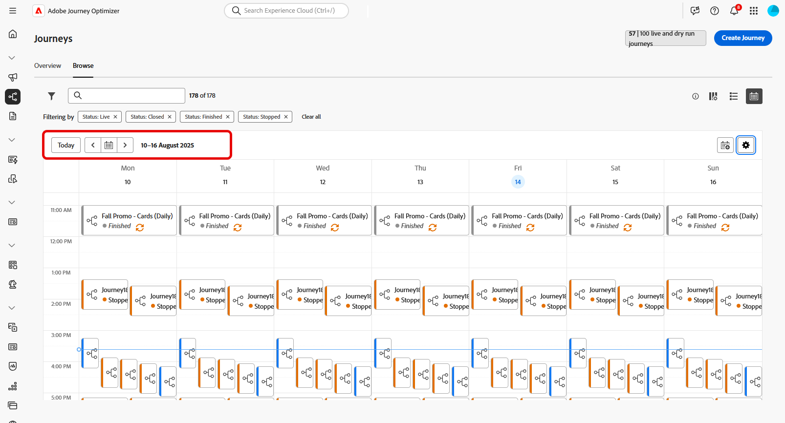
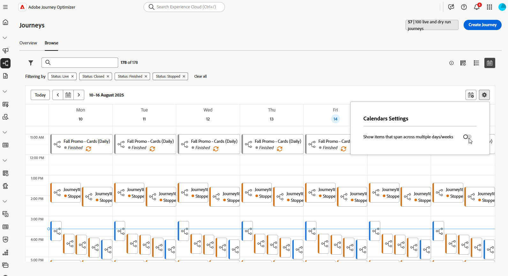
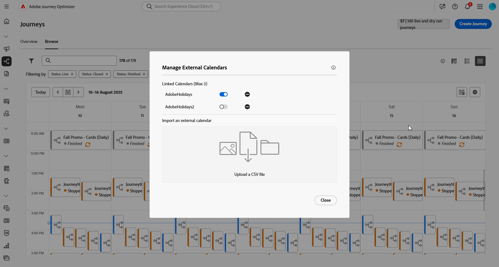
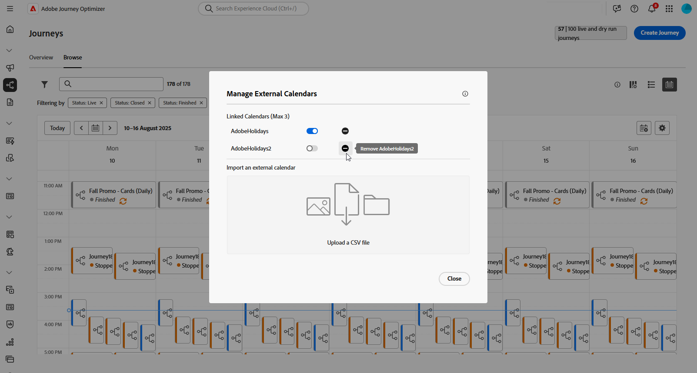
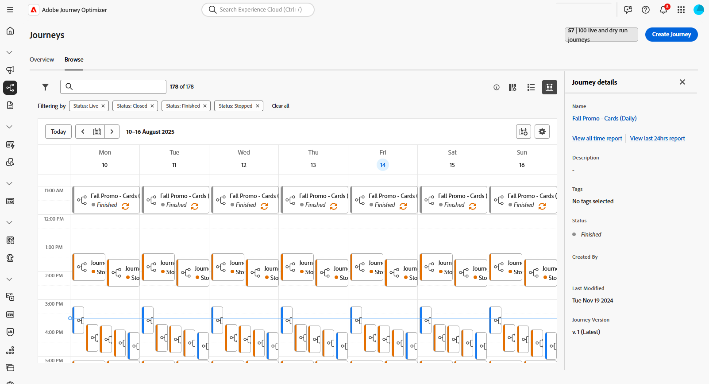
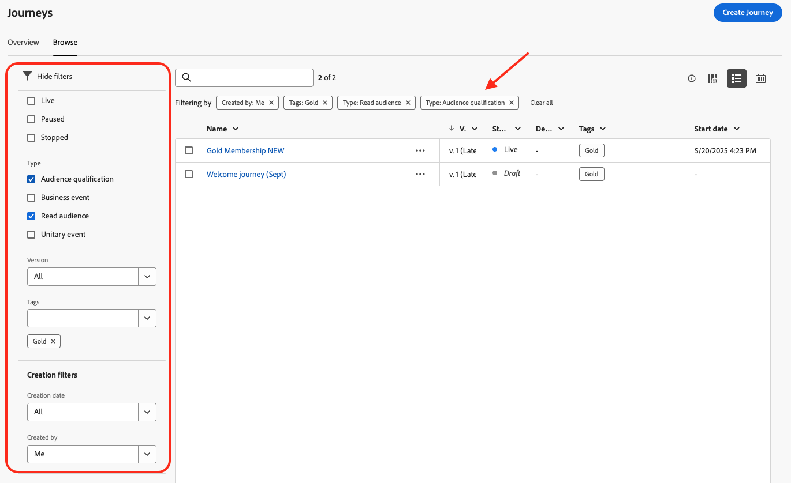
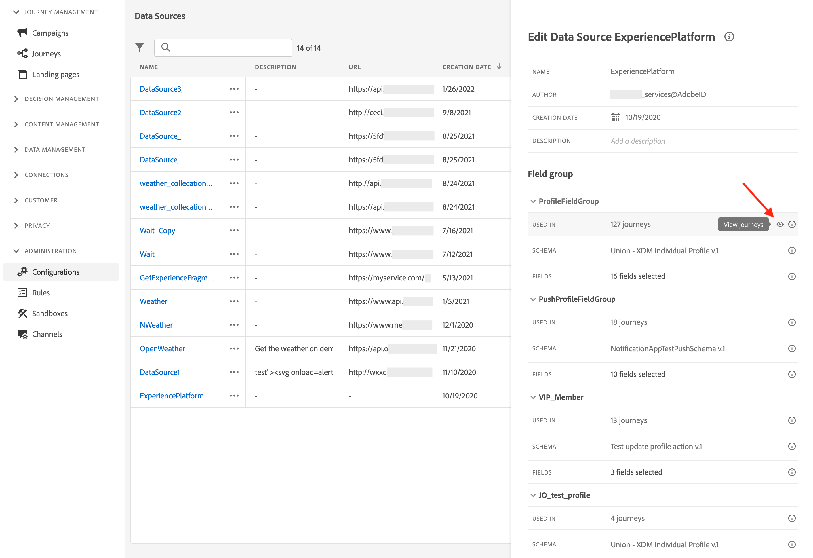

# 瀏覽及篩選您的歷程 {#browse-journeys}

>[!CONTEXTUALHELP]
>id="ajo_journey_view"
>title="歷程清單和行事曆視圖"
>abstract="除了歷程清單之外，[!DNL Journey Optimizer] 還提供歷程的行事曆視圖，以清晰的視覺化方式呈現排程。您可以使用這些按鈕隨時在清單和行事曆視圖之間切換。"

## 歷程儀表板 {#dashboard-jo}

在「歷程管理」功能表區段中，按一下&#x200B;**[!UICONTROL 歷程]**。 有兩個索引標籤可供使用： **[!UICONTROL 概觀]**&#x200B;和&#x200B;**[!UICONTROL 瀏覽]**。

### 歷程概觀

**[!UICONTROL 總覽]**&#x200B;標籤會顯示包含與您的歷程相關之關鍵量度的儀表板。

* **已處理的設定檔**：過去24小時內處理的設定檔總數
* **即時歷程**：過去24小時內具有流量的即時歷程總數。 即時歷程包含&#x200B;**單一歷程** （事件型）和&#x200B;**批次歷程** （讀取對象）。
* **錯誤率**：所有錯誤的設定檔與過去24小時內輸入的設定檔總數之比。
* **捨棄率**：所有捨棄的設定檔與過去24小時內輸入的設定檔總數之比。 捨棄的設定檔代表無權進入歷程的人，例如，由於名稱空間或重新進入規則不正確。

>[!NOTE]
>
>此儀表板會考慮過去24小時內具有流量的歷程。 只會顯示您有權存取的歷程。 量度每30分鐘會重新整理一次，且僅當有新資料可用時才會重新整理。

### 歷程清單

**[!UICONTROL 瀏覽]**&#x200B;索引標籤會顯示現有歷程的清單。 您可以搜尋歷程、使用篩選器並對每個元素執行基本動作。 例如，您可以複製或刪除項目。

在歷程清單中，所有歷程版本都會連同版本號碼一起顯示。當您搜尋歷程時，最新版本會在應用程式首次開啟時出現在清單頂端。然後，您可以定義所需的排序，應用程式會將其保留為使用者偏好設定。歷程的版本也會顯示在畫布上方的歷程版本介面頂端。 深入瞭解[歷程版本管理](publishing-the-journey.md#journey-versions-journey-versions)。

### 歷程行事曆 {#calendar}

除了歷程清單，[!DNL Journey Optimizer]還提供您歷程的行事曆檢視，提供其排程的清晰視覺化呈現。

歷程的顯示方式：

* 依預設，行事曆格線會顯示所選周的所有即時和排程歷程。 其他篩選器選項可顯示已完成、已停止和已完成的啟動或啟動。
* 在測試模式中的草稿歷程和歷程不會顯示。
* 橫跨多天的歷程會顯示在行事曆格線的頂端。
* 如果未指定開始時間，則會使用最接近的手動啟動時間，將其放置在行事曆中。
* 歷程會顯示為1小時時間跨度，但這並不反映實際的傳送或完成時間。

若要在您的「歷程」行事曆中導覽：

1. 若要存取行事曆檢視，請開啟歷程清單，然後按一下圖示。

1. 使用箭頭按鈕或行事曆上方的日期選擇器，在周之間移動。

   行事曆顯示本週排程的所有歷程。

   

1. 按一下圖示，以切換橫跨數天或數週之專案的顯示。

   

1. 按一下圖示以管理和新增最多三個外部行事曆。

   顯示外部行事曆的

1. 拖放包含事件名稱、開始日期和結束日期的CSV檔案。

   上傳的事件會針對您組織中的所有使用者顯示，並顯示在歷程和行銷活動行事曆上。

   +++CSV格式應如下所示：

   | Column1 | Column2 | Column3 |
   |-|-|-|
   | 事件名稱 | 開始日期（mm/dd/yy格式） | 結束日期（mm/dd/yy格式） |

   +++

1. 如有需要，您可以隱藏、取消隱藏或移除新增的外部行事曆。

   顯示外部行事曆的

1. 如需歷程的詳細資訊，請按一下其視覺區塊以開啟並探索其詳細資訊。

   

## 篩選您的歷程 {#journey-filter}

在歷程清單中，使用各種篩選器來調整歷程清單。

您可以根據歷程的[狀態](#journey-statuses)、[型別](#journey-types)、[版本](publishing-the-journey.md#journey-versions-journey-versions)，以及從[狀態和版本篩選器](../start/search-filter-categorize.md#tags)指派的&#x200B;**[!UICONTROL 標籤]**&#x200B;來篩選歷程。

使用&#x200B;**[!UICONTROL 建立篩選器]**，根據歷程的建立日期或建立歷程的使用者來篩選歷程。

顯示使用來自&#x200B;**[!UICONTROL 活動篩選器]**&#x200B;和&#x200B;**[!UICONTROL 資料篩選器]**&#x200B;的特定事件、欄位群組或動作的歷程。

使用&#x200B;**[!UICONTROL 出版物篩選器]**&#x200B;來選取出版物日期或使用者。 舉例來說，您可以選擇只顯示昨天發佈之即時歷程的最新版本。

若要根據特定日期範圍篩選歷程，請從&#x200B;**[!UICONTROL 已發佈]**&#x200B;下拉式清單中選取&#x200B;**[!UICONTROL 自訂]**。

此外，在「事件」、「資料來源」和「動作」設定窗格中，**[!UICONTROL 用於]**&#x200B;欄位會顯示使用該特定事件、欄位群組或動作的歷程次數。 您可以按一下&#x200B;**[!UICONTROL 檢視歷程]**&#x200B;按鈕以顯示對應歷程的清單。

## 歷程型別 {#journey-types}

歷程的型別取決於該歷程中使用的活動。 可以是：

* **[!UICONTROL 單一事件]** — 單一事件歷程已連結至特定設定檔。 事件與人的行為或與人相關的事情有關（例如，某人達到10,000點忠誠點數）。 [了解更多](../event/about-events.md)。
* **[!UICONTROL 商務活動]**。 業務事件歷程以非設定檔相關事件開始。 事件設定由技術使用者執行，且無法編輯。 [了解更多](../event/about-events.md)。
* **[!UICONTROL 對象資格]** — 對象資格歷程會聆聽Adobe Experience Platform對象中設定檔的入口和出口，以便讓個人進入歷程或是在歷程中前進。 [了解更多](audience-qualification-events.md)。
* **[!UICONTROL 讀取對象]** — 在讀取對象歷程中，對象中的所有個人都會進入歷程並接收歷程中包含的訊息。  [了解更多](read-audience.md)。

在[此頁面](entry-management.md)上進一步瞭解歷程型別和相關的專案管理。

## 歷程狀態 {#journey-statuses}

歷程狀態取決於其生命週期。 可以是：

* **已關閉**：歷程已使用&#x200B;**關閉新入口**&#x200B;按鈕關閉。 歷程停止讓新個人進入歷程。 已在歷程中的人可以正常完成歷程。
* **草稿**：歷程處於第一個階段。 行銷活動尚未發佈。
* **草稿（測試）**：已使用&#x200B;**測試模式**&#x200B;按鈕啟動測試模式。
* **已完成**：歷程會在91天[全域逾時](journey-properties.md#global_timeout)後自動切換為此狀態。 歷程中已有的設定檔會正常完成歷程。 新設定檔無法再進入歷程。
* **即時**：歷程已使用&#x200B;**發佈**&#x200B;按鈕發佈。
* **已停止**：歷程已使用&#x200B;**停止**&#x200B;按鈕關閉。 所有個人會立即退出歷程。

>[!NOTE]
>
>* 歷程編寫生命週期也包含一組無法篩選的中繼狀態：「發佈」（「草稿」與「即時」之間）、「啟用測試模式」或「停用測試模式」(「草稿」與「草稿（測試）」之間)以及「停止」（「即時」與「已停止」之間）。 當歷程處於中介狀態時，其是唯讀。
>
>* 如果您需要修改為&#x200B;**即時**&#x200B;歷程，請[建立歷程的新版本](#journey-versions)。

## 複製歷程 {#duplicate-a-journey}

您可以從&#x200B;**瀏覽**&#x200B;索引標籤複製現有歷程。 所有物件和設定都會複製到歷程副本。

請依照下列步驟執行：

1. 導覽至您要複製的歷程，按一下&#x200B;**更多動作**&#x200B;圖示（歷程名稱旁的三個點）。
1. 選取「**複製**」。

   

1. 輸入歷程名稱並確認。 您也可以在歷程屬性畫面中變更名稱。 依預設，名稱設定如下： `[JOURNEY-NAME]_copy`

   

1. 新歷程已建立並可在歷程清單中使用。

## 大量作業 {#bulk-operations}

從您的歷程清單中，您可以暫停多個&#x200B;**即時**&#x200B;歷程。 若要暫停歷程群組（_大量暫停_），請在清單中選取它們，然後按一下畫面底部藍色列中的&#x200B;**暫停**&#x200B;按鈕。 **暫停**&#x200B;按鈕僅在選取&#x200B;**即時**&#x200B;歷程時可用。

您也可以繼續一或多個&#x200B;**已暫停**&#x200B;歷程。 若要繼續歷程群組（_大量繼續_），請選取它們並按一下畫面底部藍色列中的&#x200B;**繼續**&#x200B;按鈕。 請注意，**繼續**&#x200B;按鈕只有在選取&#x200B;**已暫停**&#x200B;歷程時才可用。

[進一步瞭解暫停/繼續歷程](journey-pause.md)。

>[!NOTE]
>
>您可以暫停/繼續操作，直到每個操作10個歷程為止。

