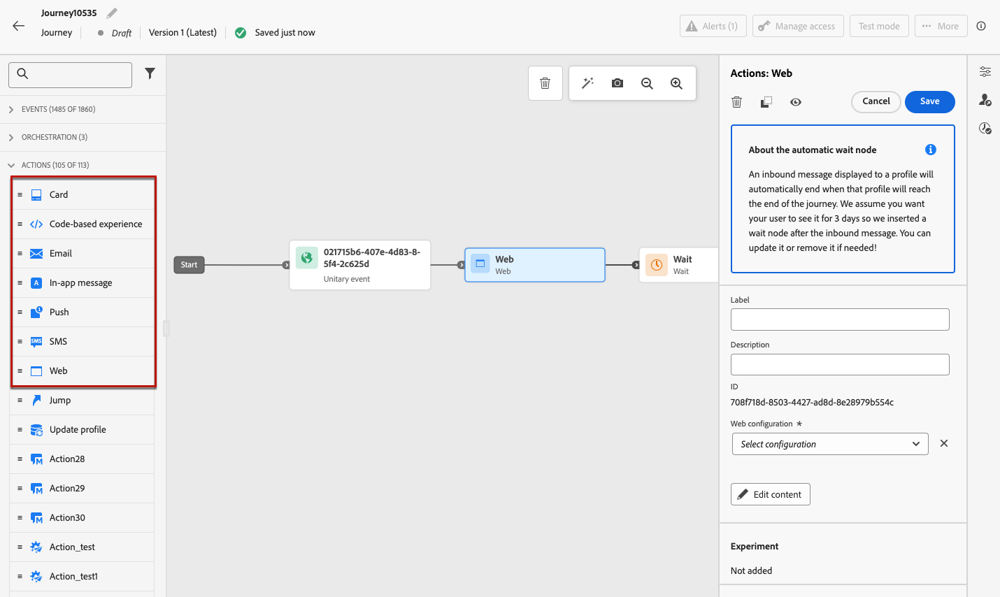
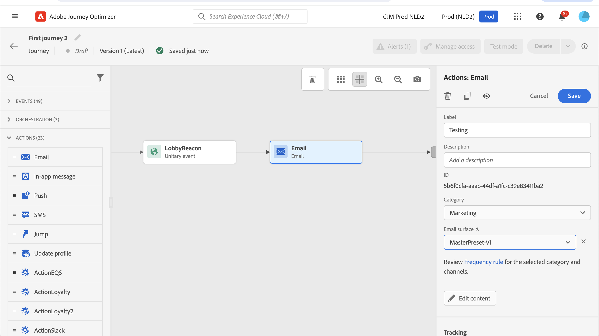

# 使用內建頻道動作 {#add-a-message-in-a-journey}

>[!CONTEXTUALHELP]
>id="ajo_message_activity"
>title="內建頻道動作"
>abstract="Journey Optimizer 內建頻道動作功能。您可以直接在自己的歷程中新增一則訊息 (電子郵件、文字簡訊 (SMS/MMS)、推播) 或傳入體驗 (應用程式內、網頁版、程式碼型體驗、內容卡片) 活動，以及定義設定和內容。接著會根據歷程的內容執行和傳送該活動。"

[!DNL Journey Optimizer]附帶內建頻道動作功能，可用來傳送訊息：當設定檔進入此活動時，會傳送訊息給設定檔。

若要將內建頻道動作新增至您的歷程，請拖放頻道活動，並定義其設定和內容。 接著會根據歷程的內容執行和傳送該活動。

>[!NOTE]
>
>您也可以設定自訂動作，以便在[!DNL Journey Optimizer]中傳送訊息。 [了解更多](#recommendation)

## 在歷程中新增訊息  {#add-msg-in-journey}

透過內建頻道動作，您可以設定傳出或傳入訊息。 支援的傳入頻道包括電子郵件、簡訊(SMS/MMS)和推播通知。 支援的輸出管道包括應用程式內、網頁、程式碼型體驗和內容卡。

若要將內建頻道動作新增至歷程，請遵循下列步驟。

1. 以[事件](general-events.md)或[讀取對象](read-audience.md)活動來開始您的歷程。

1. 從浮動視窗的&#x200B;**動作**&#x200B;區段，將頻道活動拖放至畫布中。

   

1. 您也可以選取&#x200B;**[!UICONTROL 動作]**&#x200B;活動，讓您選取多個輸入動作。 [了解更多](journey-action.md)

1. 設定您的活動。 以下連結提供詳細的設定指南。

   * 瞭解建立傳出動作的詳細步驟，如下所示：

     <table style="table-layout:fixed">
      <tr style="border: 0;">
      <td>
      
      
<a href="../email/create-email.md"><strong>建立電子郵件</strong>
      

      

      </td>
      <td>
      
      

      <a href="../push/create-push.md"><strong>建立推播<strong></a>
      

      

      </td>
      <td>
      
      

      <a href="../sms/create-sms.md"><strong>建立文字訊息（簡訊/多媒體簡訊）</strong></a>
      

      

      </td>
      </tr>
      </table>

   * 瞭解建立傳入動作的詳細步驟，如下所示：

     <table style="table-layout:fixed">
      <tr style="border: 0;">
      <td>
      
      
<a href="../in-app/create-in-app.md"><strong>建立應用程式內訊息</strong>
      

      

      </td>
      <td>
      
      
<a href="../web/create-web.md"><strong>建立網站體驗</strong>
      

      

      </td>
      <td>
      
      
<a href="../content-card/create-content-card.md"><strong>建立內容卡片</strong>
      

      

      </td>
      <td>
      
      

      <a href="../code-based/create-code-based.md"><strong>建立程式碼型體驗<strong></a>
      

      

      </td>
      </tr>
      </table>

   >[!NOTE]
   >
   >* 每個傳入體驗活動都隨附3天&#x200B;**等待**&#x200B;活動。 [了解更多](wait-activity.md#auto-wait-node)
   >
   >* 針對電子郵件與推播通知，您可以啟用傳送時間最佳化。 [了解更多](send-time-optimization.md)

1. 視活動而定，您可以顯示所選管道的特定進階引數，並覆寫某些預設值，例如執行地址。 [了解更多](about-journey-activities.md#advanced-parameters)

   >[!NOTE]
   >
   >如果進階引數已隱藏，請按一下右窗格頂端的&#x200B;**[!UICONTROL 顯示唯讀欄位]**&#x200B;按鈕。

## 更新即時內容 {#update-live-content}

您可以在即時歷程中更新內建頻道動作的內容。

若要這麼做，請開啟您的即時歷程、選取頻道活動並按一下&#x200B;**編輯內容**。

但是，您無法變更個人化中使用的屬性，無論是設定檔屬性或內容資料（來自事件或歷程屬性）。

如果您修改內容資料，將會顯示下列錯誤訊息： `ERR_AUTHORING_JOURNEYVERSION_201`

如果您修改設定檔屬性，將會顯示下列錯誤訊息： `ERR_AUTHORING_JOURNEYVERSION_202`

請注意，針對應用程式內活動，可以在歷程上線時對內容進行任何變更，但無法修改應用程式內觸發器。

## 隨自訂動作傳送 {#recommendation}

您可以使用自訂動作來設定協力廠商系統的連線，以傳送訊息或API呼叫，而不使用內建訊息功能。

* 如果您使用協力廠商系統來傳送訊息，則可建立自訂動作。 [了解更多](../action/action.md)

* 如果您使用Adobe Campaign，請參閱下列章節：

   * [[!DNL Journey Optimizer]和Campaign v7/v8](../action/acc-action.md)
   * [[!DNL Journey Optimizer]與Campaign Standard](../action/acs-action.md)