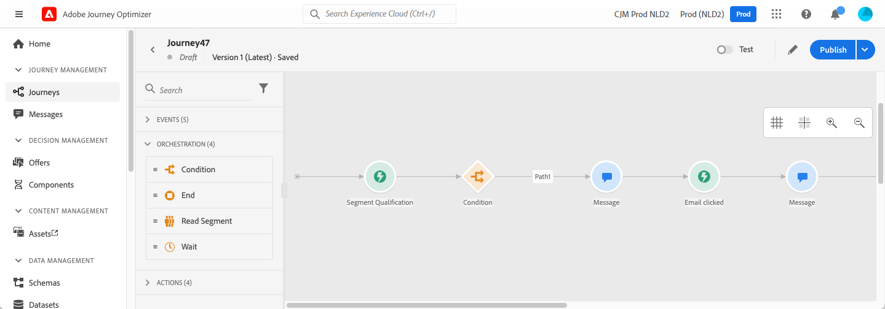
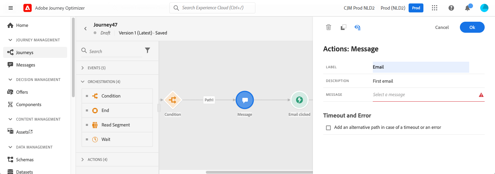
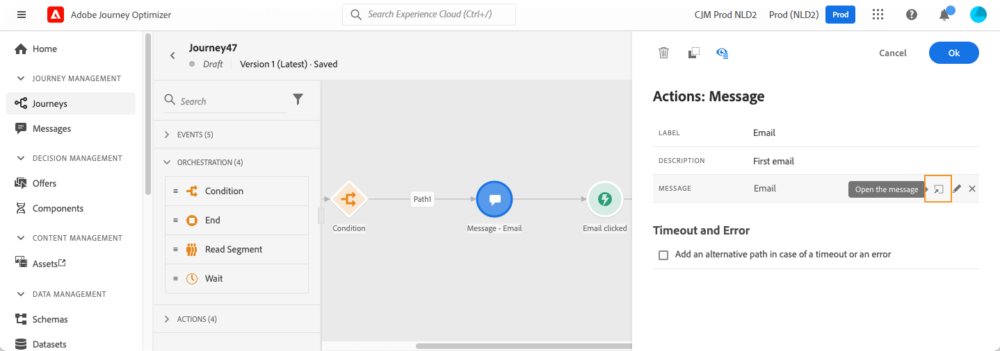
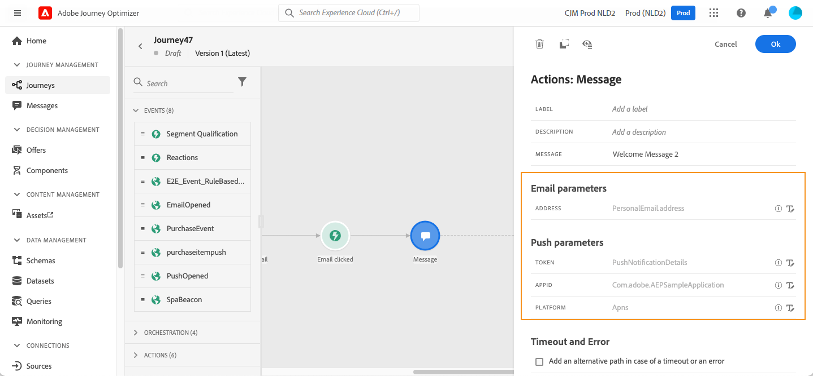

# 在歷程中新增訊息{#add-a-message-in-a-journey}

>[!CONTEXTUALHELP]
>id="ajo_journey_message"
>title="消息活動"
>abstract="「郵件」活動允許您發送推送或電子郵件。 Journey Optimizer消息功能是內置的。 該消息設計並發佈在Journey Optimizer的「消息」菜單中。"

[!DNL Journey Optimizer] 消息功能是內置的，您只需設計內容並發佈消息即可。 請參閱[本節](../messages/get-started-content.md)。然後，你只需在旅途中添加一個使用Journey Optimizer設計的推送或電子郵件。

如果您使用第三方系統發送消息，則可以建立自定義操作。 瞭解更多資訊 [節](../action/action.md)。

## 添加消息活動

1. 一如既往，從一個活動或 **讀取段** 的子菜單。

   

1. 從 **操作** ，拖放 **消息** 的下界。

   

1. 添加標籤和說明。

   

1. 在 **消息** 的子菜單。 將顯示在Journey Optimizer設計的可用消息清單。 您可以按狀態篩選清單。

   

1. 選擇消息並按一下 **選擇**。 也可以通過按一下 **建立消息**。

   

   如果要檢查郵件，可按一下 **開啟郵件** 的 **消息** 的子菜單。 該消息將在新頁籤中開啟。

   

1. 將後續步驟添加到您的旅程中。

## 電子郵件參數和推送參數

的 **[!UICONTROL Email parameters]** 和 **[!UICONTROL Push parameters]** 節顯示只讀欄位。 通常在建立消息時執行此配置。 請參閱[本節](../messages/get-started-content.md)。

要強制指定值，可使用 **啟用參數覆蓋** 表徵圖 此選項可用於各種用途：

* 例如，要test電子郵件，可以添加電子郵件地址。 在您發佈了此旅程後，會向您發送電子郵件。
* 您可以引用清單訂閱者的電子郵件地址。 查看 [用例](message-to-subscribers-uc.md)。

## 傳送時間最佳化{#send-time-optimization}

>[!CONTEXTUALHELP]
>id="jo_bestsendtime_disabled"
>title="關於發送時間優化"
>abstract="Adobe Journey Optimizer的「發送時間優化」功能由Adobe的AI服務提供支援，可以根據歷史開啟和點擊率預測發送電子郵件或推送消息的最佳時間，以最大限度地提高參與度。"

Adobe Journey Optimizer的「發送時間優化」功能由Adobe的AI服務提供支援，可以根據歷史開啟和點擊率預測發送電子郵件或推送消息的最佳時間，以最大限度地提高參與度。 使用我們的機器學習模型為每個用戶安排個性化發送時間，以增加消息的開啟和點擊率。

>[!AVAILABILITY]
>
>此功能目前為測試版本，僅供測試版客戶使用。 若要加入測試版計畫，請連絡 Adobe 客戶服務。

「發送時間優化」模型將接收您的Adobe Journey Optimizer資料，並查看用戶級別的開啟（對於電子郵件和推送），然後按一下（對於電子郵件）速率，以確定客戶最可能在何時開始使用您的消息。 「發送時間優化」要求最少一個月的消息跟蹤資料，以便提供有根據的建議。 對於每個用戶，系統將使用以下分數自動選擇最佳時間：

* 一週中每天的最佳時間，以最大限度地提高參與
* 一週中最好的一天，以最大限度地提高參與
* 一週中最好的一天中的最佳時刻，以最大限度地提高參與

無論您是在打分還是培訓，模型都會有所不同。 培訓每週進行一次，然後每季度進行一次。 評分最初是每週，然後是每月。

* 訓練 — 用於生成分數的算法的開發
* 評分 — 基於已訓練的模型將評分應用於單個配置檔案

此資訊與用戶的配置檔案一起儲存，並在行程執行時被引用，以告知Adobe Journey Optimizer何時發送您的消息。

>[!CAUTION]
>
>* 此功能僅適用於啟用跟蹤的電子郵件和推送的單通道消息。
>* 必須發佈消息。
>* 此功能與拆分模式不相容。

### 激活發送時間優化{#activate-send-time-optimization}

>[!CONTEXTUALHELP]
>id="jo_bestsendtime_email"
>title="激活發送時間優化"
>abstract="選擇是開啟電子郵件時進行優化，還是通過選擇相應的單選按鈕進行電子郵件點擊瀏覽。 您也可以通過在下一個選項中輸入「發送」值來選擇對系統使用的發送時間進行標籤。"

>[!CONTEXTUALHELP]
>id="jo_bestsendtime_push"
>title="激活發送時間優化"
>abstract="推送消息預設為開啟選項，因為按一下不適用於推送消息。 您也可以通過在下一個選項中輸入「發送」值來選擇對系統使用的發送時間進行標籤。"

通過選擇 **發送時間優化** 從「消息」活動參數切換。

對於電子郵件，選擇是開啟電子郵件時進行優化，還是通過選擇相應的單選按鈕進行電子郵件點擊瀏覽。 推送消息預設為開啟選項，因為按一下不適用於推送消息。

您也可以通過為 **在下一個** 的雙曲餘切值。 如果你選擇&quot;六小時&quot;作為值， [!DNL Journey Optimizer] 將檢查每個用戶配置檔案，並在行程執行時間後六小時內選擇最佳發送時間。
