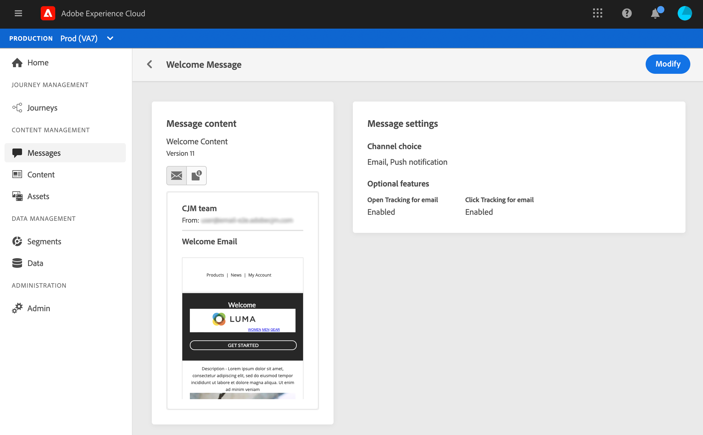
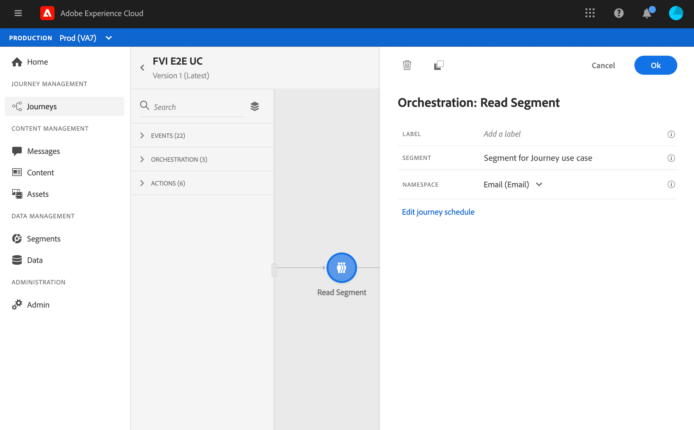

# 用例：發送多通道消息{#send-multi-channel-messages}

本節介紹了一個將「讀取段」、事件、反應事件和電子郵件/推送消息組合在一起的使用案例。

## 用例說明

在此使用情形中，我們要向屬於特定段的所有客戶發送第一封郵件（電子郵件和推送）。

根據他們對第一條消息的反應，我們要發送特定消息。

第一條消息後，我們等待一天，讓客戶開啟推送或電子郵件。 如果沒有反應，我們會給他們發一封后續電子郵件。

然後，我們等待購買併發送推送消息，以感謝客戶。

## 先決條件

要使此用例工作，您需要配置以下內容：

* 這是一個面向所有住在亞特蘭大、舊金山或西雅圖、1980年後出生的顧客的細分市場。
* 購買活動
* 三條消息

### 建立段

在我們的旅程中，我們希望利用特定的客戶群。 所有屬於該段的人員都進入該行程並遵循不同的步驟。 在我們的示例中，我們需要一個面向生活在亞特蘭大、舊金山或西雅圖、1980年後出生的所有客戶的細分市場。

有關段的詳細資訊，請參閱 [頁](../segment/about-segments.md)。

1. 從「客戶」菜單部分，選擇 **[!UICONTROL Segments]**。

1. 按一下 **[!UICONTROL Create segment]** 按鈕。

1. 在 **[!UICONTROL Segment properties]** 的子菜單。

1. 將所需欄位從左窗格拖放到中心工作區中，然後根據需要配置它們。 在此示例中，我們使用 **城市** 和 **出生年份** 屬性欄位。

1. 按一下「**[!UICONTROL Save]**」。

   

此段現已建立，並準備在您的旅途中使用。 使用 **讀取段** 活動，您可以使屬於該段的所有人員進入行程。

### 配置事件

您需要配置在客戶購買時發送給您行程的事件。 當旅程收到活動時，它會觸發「謝謝」消息。

為此，我們使用基於規則的事件。 有關事件的詳細資訊，請參閱 [頁](../event/about-events.md)。

1. 在「管理」(ADMINISTRATION)菜單部分，選擇 **[!UICONTROL Configurations]**，然後按一下 **[!UICONTROL Events]**。 按一下 **[!UICONTROL Create event]** 以建立新事件。

1. 輸入事件名稱。

1. 在 **[!UICONTROL Event ID type]** 欄位中，選取 **[!UICONTROL Rule Based]**。

1. 定義 **[!UICONTROL Schema]** 和有效載荷 **[!UICONTROL Fields]**。 您可以使用幾個欄位，例如，已購買的產品、採購日期和採購標識。

1. 在 **[!UICONTROL Event ID condition]** 欄位，定義系統用於標識觸發行程的事件的條件。 例如，可以 `purchaseMessage` 欄位並定義以下規則： `purchaseMessage="thank you"`

1. 定義 **[!UICONTROL Namespace]** 和 **[!UICONTROL Profile Identifier]**。

1. 按一下「**[!UICONTROL Save]**」。

   

該事件現在已配置並準備在您的旅途中使用。 使用相應的事件活動，您可以在客戶每次購買時觸發活動。

### 建立消息

對於此用例，我們需要建立三條消息：

* 推送和電子郵件首發消息
* 推送「謝謝」資訊
* 電子郵件跟進消息

請參閱此 [節](../segment/about-segments.md) 瞭解如何設計和發佈這些消息。

## 設計行程

1. 從一個 **讀取段** 的子菜單。 選擇以前建立的段。 屬於該段的所有個人均進入該行程。

   

1. 刪除 **消息** 的子郵件。 此消息將發送給旅途中的所有人。

   

1. 將游標置於消息活動上，然後按一下「+」符號以建立新路徑。

1. 在第一條路徑中，添加 **反應** 事件和選擇 **已開啟推送**。 當屬於該段的個人開啟第一消息的推式版本時觸發該事件。

1. 在第二個路徑中，添加 **反應** 事件和選擇 **已開啟電子郵件**。 當個人開啟電子郵件時，將觸發該事件。

1. 在其中一個反應活動中，檢查 **定義事件超時** 框中，定義持續時間（在示例中為1天）並選中 **設定超時路徑**。 這為未開啟推送或電子郵件的個人建立了另一條路徑。

   >[!NOTE]
   >
   >在配置多個事件的超時時（本例中是兩個反應），您只需配置這些事件中的一個的超時。

1. 在超時路徑中，刪除 **消息** 的子郵件。 此郵件將發送給未在第二天開啟電子郵件或推送第一封郵件的個人。

1. 將三條路徑連接到先前建立的採購事件。 當個人進行購買時，將觸發事件。

1. 事件後，刪除 **消息** 並選擇「謝謝」電子郵件。

1. 添加 **結束** 的子菜單。

## 測試並發佈歷程

1. 在測試您的行程之前，請驗證該行程是否有效且無錯誤。

1. 按一下 **Test** 切換（位於右上角）以激活test模式。 定義希望test配置檔案輸入test的方式：一個配置檔案，或一次最多100個。 請參閱此 [節](testing-the-journey.md) 瞭解如何使用test模式。

1. 旅程準備好後，使用 **發佈** 按鈕。
