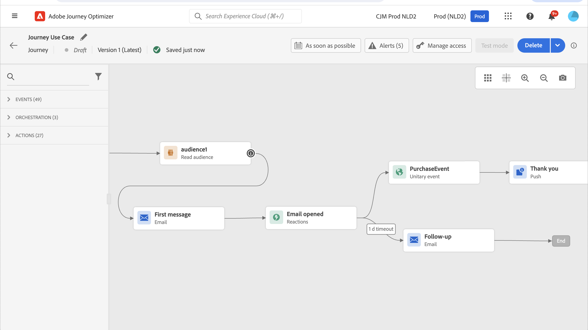
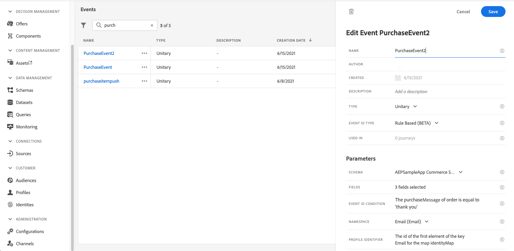
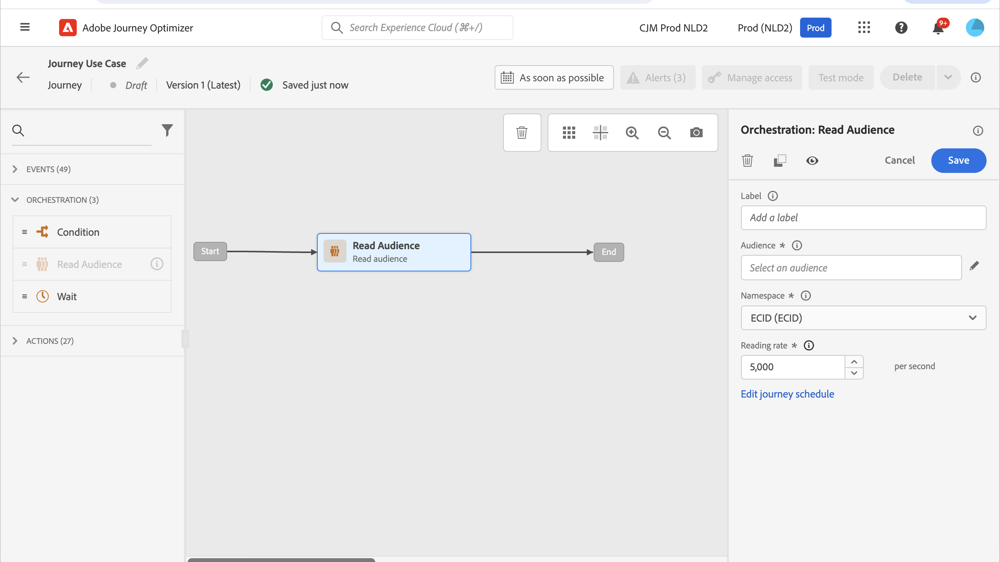
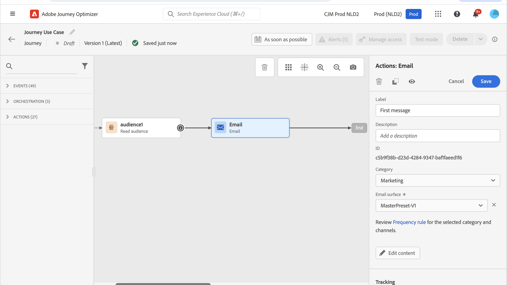

# 傳送多頻道訊息 {#send-multi-channel-messages}

本節介紹結合讀取對象、事件、反應事件和電子郵件/推播訊息的使用案例。

## 使用案例的說明

在此使用案例中，目標是傳送第一封電子郵件訊息給屬於特定對象的所有客戶。

系統會根據使用者對第一條訊息的反應，傳送特定的後續訊息。

如果客戶開啟電子郵件，系統會等待購買，並傳送推播訊息以感謝客戶。

如果沒有回應，則會傳送後續電子郵件。

## 先決條件

為了讓此使用案例發揮作用，請設定下列專案：

* 適用於居住在亞特蘭大、舊金山或西雅圖且出生於1980年後之所有客戶的對象
* 購買事件

### 建立對象

在此歷程中，會運用特定的客戶對象。 屬於對象的所有個人都會進入歷程並遵循不同步驟。 在此範例中，受眾的目標是居住在亞特蘭大、舊金山或西雅圖並在1980年後出生的所有客戶。

如需對象的詳細資訊，[請參閱此頁面](../audience/about-audiences.md)。

1. 從「客戶」功能表區段中，選取&#x200B;**[!UICONTROL 對象]**。
1. 按一下位於對象清單右上角的&#x200B;**[!UICONTROL 建立對象]**&#x200B;按鈕。
1. 在&#x200B;**[!UICONTROL 對象屬性]**&#x200B;窗格中，輸入對象的名稱。
1. 將所需欄位從左窗格拖放至中央工作區，並根據您的需求進行設定。 在此範例中，使用&#x200B;**城市**&#x200B;和&#x200B;**出生年份**&#x200B;屬性欄位。
1. 按一下&#x200B;**[!UICONTROL 儲存]**。

   

對象現在已建立並準備好用於歷程中。 使用&#x200B;**讀取對象**&#x200B;活動，屬於該對象的所有個人都可以進入歷程。

### 設定事件

設定當客戶購買時傳送到歷程的事件。 歷程收到事件時會觸發「感謝您」訊息。

為此，請使用[規則型事件](../event/about-events.md)。

1. 在[管理]功能表區段中，選取&#x200B;**[!UICONTROL 組態]**，然後按一下&#x200B;**[!UICONTROL 事件]**。 按一下&#x200B;**[!UICONTROL 建立事件]**&#x200B;以建立新事件。

1. 輸入事件的名稱。

1. 在&#x200B;**[!UICONTROL 事件識別碼型別]**&#x200B;欄位中，選取&#x200B;**[!UICONTROL 以規則為基礎]**。

1. 定義&#x200B;**[!UICONTROL 結構描述]**&#x200B;和承載&#x200B;**[!UICONTROL 欄位]**。 使用數個欄位，例如購買的產品、購買日期和購買ID。

1. 在&#x200B;**[!UICONTROL 事件ID條件]**&#x200B;欄位中，定義系統用來識別觸發歷程之事件的條件。 例如，新增`purchaseMessage`欄位並定義下列規則： `purchaseMessage="thank you"`

1. 定義&#x200B;**[!UICONTROL 名稱空間]**&#x200B;和&#x200B;**[!UICONTROL 設定檔識別碼]**。

1. 按一下&#x200B;**[!UICONTROL 儲存]**。

   

事件現在已設定完畢，且準備好用於歷程中。 使用相應的事件活動，即可在每次客戶購買時觸發動作。

## 設計歷程

1. 以&#x200B;**讀取對象**&#x200B;活動開始歷程。 選取先前建立的對象。 屬於對象的所有個人都會進入歷程。

   

1. 拖放&#x200B;**電子郵件**&#x200B;動作活動，並定義「第一封郵件」的內容。 此訊息會傳送給歷程中的所有個人。 請參閱此[區段](../email/create-email.md)，瞭解如何設定和設計電子郵件。

   

1. 新增&#x200B;**回應**&#x200B;事件並選取&#x200B;**電子郵件已開啟**。 當屬於閱聽眾的個人開啟電子郵件時，就會觸發事件。

1. 勾選&#x200B;**定義事件逾時**&#x200B;方塊、定義持續時間（在此範例中為1天），並勾選&#x200B;**設定逾時路徑**。 這會為未開啟推送或電子郵件第一則訊息的個人建立另一個路徑。

1. 在逾時路徑中，拖放&#x200B;**電子郵件**&#x200B;動作活動，並定義「後續追蹤」訊息的內容。 此訊息會傳送給隔天未開啟電子郵件或推播第一則訊息的個人。 [瞭解如何設定和設計電子郵件](../email/create-email.md)。

1. 在第一個路徑中，新增先前建立的購買事件。 當個人購買時會觸發事件。

1. 在事件之後，拖放&#x200B;**推播**&#x200B;動作活動，並定義「感謝您」訊息的內容。 請參閱此[區段](../push/create-push.md)，瞭解如何設定和設計推播。

## 測試並發佈歷程

1. 測試歷程之前，請先確認歷程有效且沒有錯誤。

1. 使用位於右上角的&#x200B;**測試**&#x200B;切換以啟動測試模式。 請參閱此[區段](testing-the-journey.md)以瞭解如何使用測試模式。

1. 歷程就緒時，請使用右上角的&#x200B;**發佈**&#x200B;按鈕發佈。
