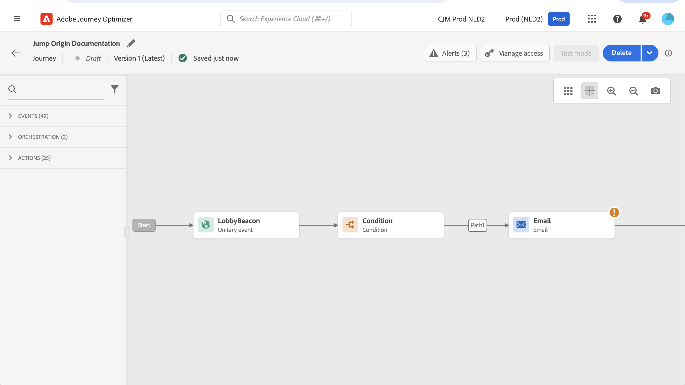
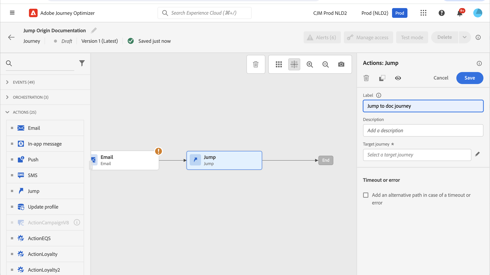
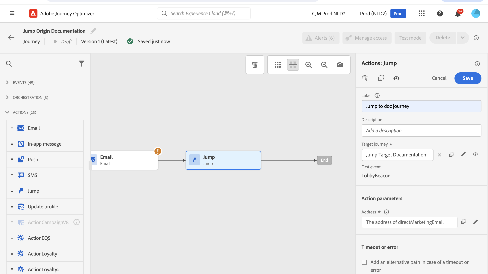
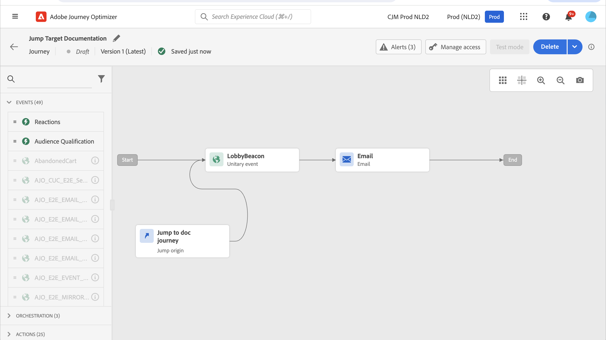
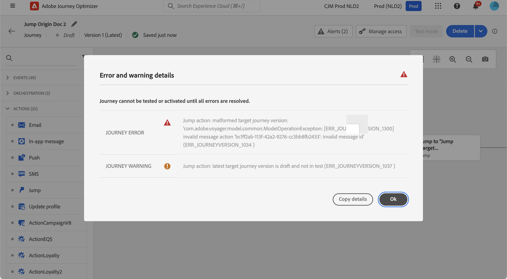

# 從一個歷程跳到另一個歷程 {#jump}

>[!CONTEXTUALHELP]
>id="ajo_journey_jump"
>title="跳轉活動"
>abstract="此跳轉動作活動可讓您將個人從一個歷程推送到另一個歷程。本功能可讓您簡化非常複雜的歷程的設計，並根據常見且可重複使用的歷程模式建置歷程。"

**[!UICONTROL 跳轉]**&#x200B;動作活動可讓您將個人從一個歷程推送到另一個歷程。 此功能可讓您：

* 將複雜歷程分割為數個歷程，以簡化極為複雜的設計
* 根據常見且可重複使用的歷程模式來建立歷程

在來源歷程中，新增&#x200B;**[!UICONTROL 跳轉]**&#x200B;活動並選取目標歷程。 當個人進入&#x200B;**[!UICONTROL 跳轉]**&#x200B;步驟時，會傳送內部事件到目標歷程的第一個事件。 如果&#x200B;**[!UICONTROL 跳轉]**&#x200B;動作成功，個人會繼續進行歷程。 此行為與其他動作類似。

在目標歷程中，**[!UICONTROL 跳轉]**&#x200B;活動在內部觸發的第一個事件會在歷程中產生個別流程。

## 生命週期 {#jump-lifecycle}

假設您已新增歷程A中的&#x200B;**[!UICONTROL 跳轉]**&#x200B;活動至歷程B。歷程A是&#x200B;**來源歷程**，而歷程B是&#x200B;**目標歷程**。

以下是執行流程的不同步驟：

**歷程A**&#x200B;是由外部事件觸發：

1. 歷程A接收與個人相關的外部事件。
1. 個人達到&#x200B;**[!UICONTROL 跳轉]**&#x200B;步驟。
1. 個人會推送至歷程B，並在&#x200B;**[!UICONTROL 跳轉]**&#x200B;步驟後進入歷程A的後續步驟。

在歷程B中，第一個事件是透過歷程A的&#x200B;**[!UICONTROL 跳轉]**&#x200B;活動在內部觸發：

1. 歷程B從歷程A收到內部事件。
1. 個人開始在歷程B中流動。

>[!NOTE]
>
>歷程B也可以透過外部事件觸發。

## 最佳實務和限制 {#jump-limitations}

### 製作 {#jump-limitations-authoring}

* **[!UICONTROL 跳轉]**&#x200B;活動僅適用於使用名稱空間的歷程。
* 您只能跳至使用與來源歷程相同名稱空間的歷程。
* 您無法跳至以&#x200B;**對象資格**&#x200B;事件或&#x200B;**讀取對象**&#x200B;開始的歷程。
* 您無法在同一歷程中擁有&#x200B;**[!UICONTROL 跳轉]**&#x200B;活動和&#x200B;**對象資格**&#x200B;事件或&#x200B;**讀取對象**。
* 您可以在歷程中包含所需數量的跳轉&#x200B;**[!UICONTROL 跳轉]**&#x200B;活動。 在&#x200B;**[!UICONTROL 跳轉]**&#x200B;之後，您可以新增任何需要的活動。
* 您可以視需要擁有任意多個跳轉層級。 例如，歷程A會跳至歷程B，再跳至歷程C，以此類推。
* 目標歷程也可以包含所需數量的跳轉&#x200B;**[!UICONTROL 跳轉]**&#x200B;活動。
* 不支援回圈模式。 無法將兩個或多個歷程連結在一起，這可能會產生無限回圈。 **[!UICONTROL 跳轉]**&#x200B;活動設定畫面會防止您執行此動作。

### 執行 {#jump-limitations-exec}

* 執行&#x200B;**[!UICONTROL 跳轉]**&#x200B;活動時，會觸發目標歷程的最新版本。
* 同一個歷程中只能出現一次不重複個人。 因此，如果從來源歷程推送的個人已在目標歷程中，該個人將不會進入目標歷程。 **[!UICONTROL 跳轉]**&#x200B;活動不會報告任何錯誤，因為這是正常行為。

## 設定跳轉活動 {#jump-configure}

1. 設計您的&#x200B;**來源歷程**。

   

1. 在歷程的任何步驟中，從&#x200B;**[!UICONTROL ACTIONS]**&#x200B;類別新增&#x200B;**[!UICONTROL 跳轉]**&#x200B;活動。 新增標籤和說明。

   

1. 在&#x200B;**目標歷程**&#x200B;欄位內按一下。
清單會顯示草稿、即時或測試模式中的所有歷程版本。 使用不同名稱空間或以&#x200B;**對象資格**&#x200B;事件開頭的歷程無法使用。 也會篩選掉會建立回圈模式的目標歷程。

   

   >[!NOTE]
   >
   >您可以按一下右側的&#x200B;**開啟目標歷程**&#x200B;圖示，在新的索引標籤中開啟目標歷程。

1. 選取您要跳至的目標歷程。
**第一個事件**&#x200B;欄位已預先填入目標歷程第一個事件的名稱。 如果您的目標歷程包含多個事件，**[!UICONTROL 跳轉]**&#x200B;僅允許在第一個事件上。

   

1. **動作引數**&#x200B;區段會顯示目標事件的所有欄位。 將每個欄位與來源事件或資料來源的欄位相對應，就像其他型別的動作一樣。 此資訊將在執行階段傳遞至目標歷程。
1. 新增後續活動以完成您的來源歷程。

   

   >[!NOTE]
   >
   >個人的身分會自動對應。 此資訊在介面中不可見。

您的&#x200B;**[!UICONTROL 跳轉]**&#x200B;活動已設定。 一旦您的歷程為即時或處於測試模式，到達&#x200B;**[!UICONTROL 跳轉]**&#x200B;步驟的個人將被推送到目標歷程。

當在歷程中設定&#x200B;**[!UICONTROL 跳轉]**&#x200B;活動時，會在目標歷程的開頭自動新增&#x200B;**[!UICONTROL 跳轉]**&#x200B;專案圖示。 這可協助您識別歷程是否可從外部觸發，也可從內部從&#x200B;**[!UICONTROL 跳轉]**&#x200B;活動觸發。

## 疑難排解 {#jump-troubleshoot}

發生錯誤的情況：

* 目標歷程已不存在
* 目標歷程為草稿、已關閉或已停止
* 目標歷程的第一個事件已變更，且對應已中斷

