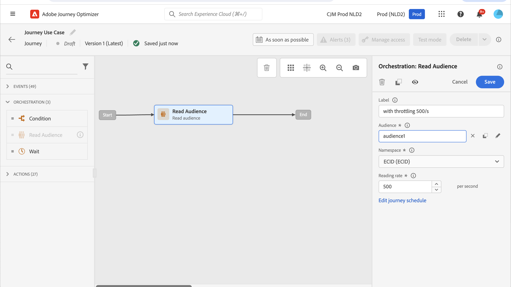
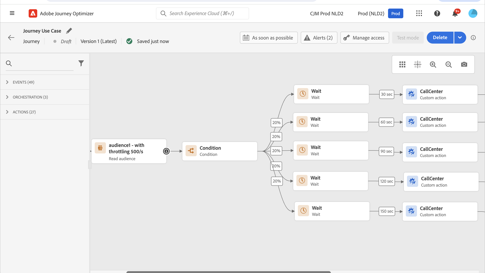

# 使用案例：透過外部資料來源和自訂動作限制輸送量{#limit-throughput}

當外部系統必須處理限定數量的每秒請求時，使用此使用案例可限制歷程處理。

## 使用案例的說明

[!DNL Adobe Journey Optimizer]可讓從業人員透過使用自訂動作和資料來源，將API呼叫傳送至外部系統。

您可以透過完成以下操作：

* **資料來源**：從外部系統收集資訊，並將其用於歷程內容，例如，取得有關設定檔城市的天氣資訊，並據此建立專屬的歷程流程。

* **自訂動作**：傳送資訊給外部系統，例如，使用Journey Optimizer的協調功能以及設定檔資訊、對象資料和歷程內容，透過外部解決方案傳送電子郵件。

>[!NOTE]
>
>現在支援回應，因此您應該針對外部資料來源使用案例使用自訂動作，而非資料來源。 如需回應的詳細資訊，請參閱此[區段](../action/action-response.md)

如果您使用外部資料來源或自訂動作，您可能會想要透過限制歷程輸送量來保護外部系統：單一歷程每秒最多5,000個例項，對象觸發的歷程每秒最多20,000個例項。 在[本節](entry-management.md#journey-processing-rate)中進一步瞭解歷程處理速率和輸送量。

對於自訂動作，可在產品層級使用節流功能。 請參見此[頁面](../configuration/external-systems.md#capping)。

對於外部資料來源，您可以在端點層級定義上限限制，以避免透過Journey Optimizer的上限API壓倒這些外部系統。 不過，達到限制之後會捨棄所有剩餘的請求。 在本節中，您將找到可用來最佳化輸送量的因應措施。

如需有關如何與外部系統整合的詳細資訊，請參閱此[頁面](../configuration/external-systems.md)。

## 實作

針對&#x200B;**受眾觸發的歷程**，您可以定義讀取受眾活動的讀取率，此讀取率將影響歷程輸送量。 [閱讀全文](../building-journeys/read-audience.md)

>[!NOTE]
>
> 這是每秒可以進入歷程的設定檔數目上限。 此費率僅適用於此活動，不適用於歷程中的其他活動。 [閱讀全文](../building-journeys/read-audience.md)

您可以將此值從每秒500個執行個體修改為每秒20,000個執行個體。 如果您需要低於500/s，您還可以新增包含等待活動的「百分比分割」條件，以將您的歷程分割成多個分支，並在特定時間執行這些分支。

讓我們以&#x200B;**受眾觸發的歷程**&#x200B;為例，此歷程使用&#x200B;**10,000個設定檔的母體**，並將資料傳送到支援&#x200B;**100個要求/秒**&#x200B;的外部系統。

1. 您可以以500個設定檔/秒的輸送量定義讀取對象以讀取設定檔，這表示讀取所有設定檔將需要20秒。 在第1頁，您會閱讀其中500本、第2頁500本等等。

1. 然後，您可以新增「百分比分割」條件活動（採用20%分割），以便每個分支中每秒有100個設定檔。

1. 之後，使用每個分支中的特定計時器新增「等待」活動。 我們在這裡設定30秒等候每一個。 每秒鐘有100個設定檔流入每個分支。

   * 在分支1上，它們將等待30秒，這表示：
      * 在第二個1,100個設定檔將等待第二個31
      * 在第二個2,100個設定檔將等待第二個32等。

   * 在分支2上，則會等待60秒，這表示：
      * 在第二個1,100個設定檔將等待第二個61 （1英尺1英吋）
      * 在第二個2,100個設定檔將等待第二個62 （1英尺2英吋）等。

   * 知道我們預計最多需要20秒來讀取所有設定檔，每個分支之間將不會重疊，第二個20是設定檔將流入條件的最後一個。 在第二個31和第二個51之間，將處理分支1中的所有設定檔。 在第二個61 （1&#39;01英吋）和第二個81 （1&#39;21英吋）之間，將處理分支2中的所有設定檔等。

   * 作為護欄，您還可以新增第六個分支，使每個分支少於100個設定檔，特別是如果您的外部系統僅支援100個請求/秒。

>[!IMPORTANT]
>
>和任何因應措施一樣，請在進入生產階段前徹底測試該解決方案，以確保它符合您的需求。

作為額外的護欄，您也可以使用「上限」功能。

>[!NOTE]
>
>與藉由對沙箱的所有歷程全域保護端點的上限功能不同，此因應措施僅適用於歷程層級。 換句話說，如果多個歷程同時執行，且目標為相同的端點，則設計歷程時需將其列入考量。 因此，此因應措施不適用於每個使用案例。
