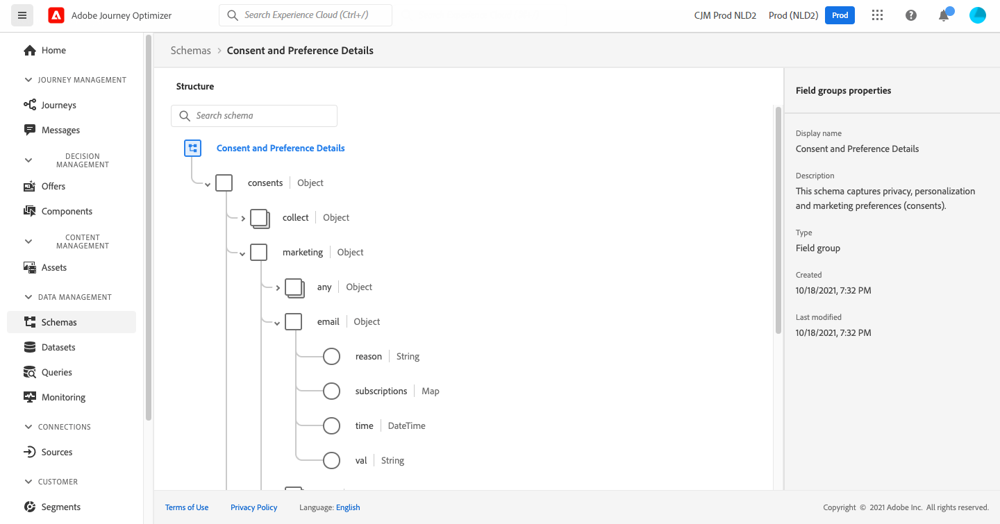

# 傳送訊息給清單的訂閱者

此使用案例的用途是建立歷程，以傳送訊息給清單的訂閱者。

在此範例中， **[!UICONTROL Consent and Preference Details]** 欄位組 [!DNL Adobe Experience Platform] 中所有規則的URL區段。 要查找此欄位組，請從 **[!UICONTROL Data Management]** 菜單，選擇 **[!UICONTROL Schemas]**. 在 **[!UICONTROL Field groups]** 頁簽，在搜索欄位中輸入欄位組的名稱。



若要設定此歷程，請依照下列步驟操作：

1. 建立以 **[!UICONTROL Read]** 活動。 [閱讀全文](journey-gs.md)。
1. 新增 **[!UICONTROL Message]** 活動（透過電子郵件）至歷程。 [閱讀全文](journeys-message.md)。
1. 在 **[!UICONTROL Email parameters]** 區段 **[!UICONTROL Message]** 活動設定，取代預設電子郵件地址(`PersonalEmail.adress`)及清單訂閱者的電子郵件地址：

   1. 按一下 **[!UICONTROL Enable parameter override]** 表徵圖 **[!UICONTROL Address]** 欄位，然後按一下 **[!UICONTROL Edit]** 表徵圖。

      

      若要修改電子郵件地址，您必須先發佈訊息。

   1. 在運算式編輯器中，輸入運算式以擷取訂閱者的電子郵件地址。 [了解詳情](https://experienceleague.adobe.com/docs/journeys/using/building-advanced-conditions-journeys/expressionadvanced.html?lang=zh-Hant){target=&quot;_blank&quot;}。

      此範例顯示包含映射欄位參考的運算式：

      ```json
      #{ExperiencePlatform.Subscriptions.profile.consents.marketing.email.subscriptions.entry('daily-email').subscribers.firstEntryKey()}
      ```

      在此範例中，會使用下列函式：

      | 函數 | 說明 | 範例 |
      | --- | --- | --- |
      | `entry` | 根據選取的命名空間參考對應元素 | 請參閱特定訂閱清單 |
      | `firstEntryKey` | 檢索映射的第一個條目鍵 | 擷取訂閱者的第一個電子郵件地址 |

      在此範例中，訂閱清單的名稱為 `daily-email`. 電子郵件地址定義為 `subscribers` 地圖，連結至訂閱清單地圖。

      深入了解 [欄位參考](https://experienceleague.adobe.com/docs/journeys/using/building-advanced-conditions-journeys/syntax/field-references.html) 在運算式中。

      

   1. 在 **[!UICONTROL Add an expression]** 對話框，按一下 **[!UICONTROL Ok]**.

   

1. 以 **[!UICONTROL End]** 活動。


