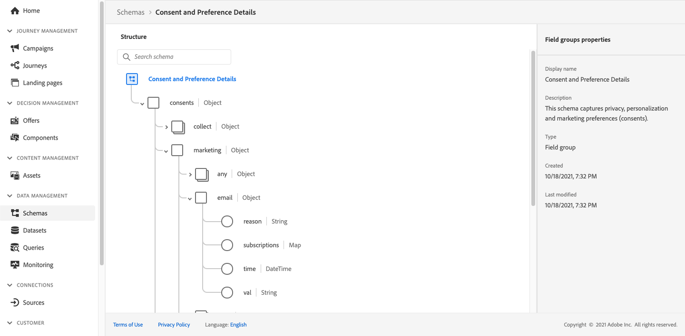
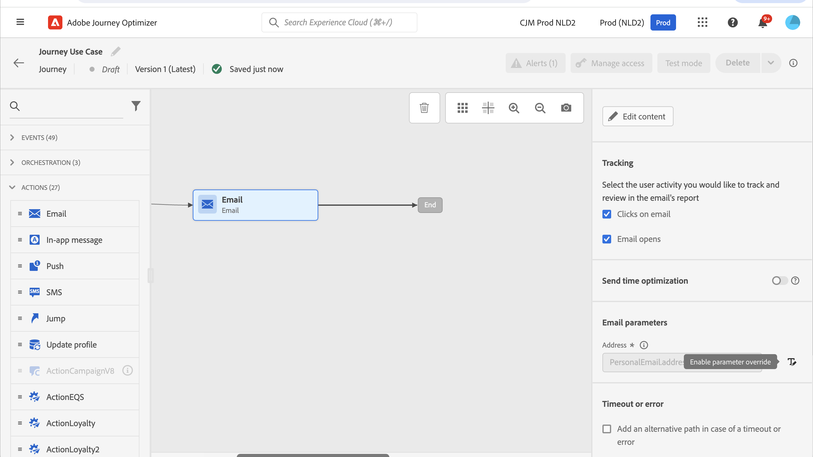

# 傳送訊息給清單的訂閱者 {#send-a-message-to-the-subscribers-of-a-list}

此使用案例的目的是建立歷程，以傳送訊息給清單的訂閱者。

在此範例中，使用&#x200B;**[!UICONTROL 的]**&#x200B;同意和偏好設定詳細資料[!DNL Adobe Experience Platform]欄位群組。 若要尋找此欄位群組，請從&#x200B;**[!UICONTROL 資料管理]**&#x200B;功能表選擇&#x200B;**[!UICONTROL 結構描述]**。 在&#x200B;**[!UICONTROL 欄位群組]**&#x200B;索引標籤上，在搜尋欄位中輸入欄位群組的名稱。



若要設定此歷程，請遵循下列步驟：

1. 建立以&#x200B;**[!UICONTROL 讀取]**&#x200B;活動開始的歷程。 深入瞭解[建立您的第一個歷程](journey-gs.md)。
1. 將&#x200B;**[!UICONTROL 電子郵件]**&#x200B;動作活動新增至歷程。 瞭解如何[使用頻道動作](journeys-message.md)。
1. 在&#x200B;**[!UICONTROL 電子郵件]**&#x200B;活動設定的&#x200B;**[!UICONTROL 電子郵件引數]**&#x200B;區段中，將預設電子郵件地址(`PersonalEmail.adress`)取代為清單訂閱者的電子郵件地址：

   1. 按一下&#x200B;**[!UICONTROL 位址]**&#x200B;欄位右側的&#x200B;**[!UICONTROL 啟用引數覆寫]**&#x200B;圖示，然後按一下&#x200B;**[!UICONTROL 編輯]**&#x200B;圖示。

      

   1. 在運算式編輯器中，輸入運算式以擷取訂閱者的電子郵件地址。 [閱讀全文](expression/expressionadvanced.md)。

      此範例顯示包含對應欄位參照的運算式：

      ```json
      #{ExperiencePlatform.Subscriptions.profile.consents.marketing.email.subscriptions.entry('daily-email').subscribers.firstEntryKey()}
      ```

      在此範例中，會使用下列函式：

      | 函數 | 說明 | 範例 |
      | --- | --- | --- |
      | `entry` | 根據選取的名稱空間參考對應元素 | 請參閱特定訂閱清單 |
      | `firstEntryKey` | 擷取對應的第一個專案索引鍵 | 擷取訂閱者的第一個電子郵件地址 |

      在此範例中，訂閱清單名為`daily-email`。 電子郵件地址在`subscribers`對應中定義為金鑰，此對應連結至訂閱清單對應。

      深入瞭解運算式中欄位[的](expression/field-references.md)參考。

      

   1. 在&#x200B;**[!UICONTROL 新增運算式]**&#x200B;對話方塊中，按一下&#x200B;**[!UICONTROL 確定]**。

>[!CAUTION]
>
>電子郵件地址覆寫僅用於特定使用案例。 在大多數情況下，您不需要變更電子郵件地址，因為&#x200B;**[!UICONTROL 執行欄位]**&#x200B;中定義為主要電子郵件的值才是應該使用的值。 [了解更多](../configuration/primary-email-addresses.md)
