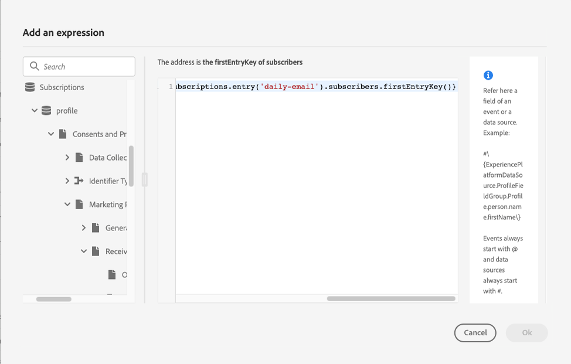

# 傳送訊息給清單的訂閱者 {#send-a-message-to-the-subscribers-of-a-list}

>[!BEGINSHADEBOX]

**在此頁面上：**&#x200B;瞭解如何使用[同意和偏好設定詳細資料]欄位群組，建立傳送訊息給清單訂閱者的歷程。

>[!ENDSHADEBOX]

此使用案例的目的是建立歷程，以傳送訊息給清單的訂閱者。

在此範例中，使用[!DNL Adobe Experience Platform]的&#x200B;**[!UICONTROL 同意和偏好設定詳細資料]**&#x200B;欄位群組。 若要尋找此欄位群組，請從&#x200B;**[!UICONTROL 資料管理]**&#x200B;功能表選擇&#x200B;**[!UICONTROL 結構描述]**。 在&#x200B;**[!UICONTROL 欄位群組]**&#x200B;索引標籤上，在搜尋欄位中輸入欄位群組的名稱。


若要設定此歷程，請遵循下列步驟：

1. 建立以&#x200B;**[!UICONTROL 讀取]**&#x200B;活動開始的歷程。 深入瞭解[建立您的第一個歷程](journey-gs.md)。
1. 將&#x200B;**[!UICONTROL 電子郵件]**&#x200B;動作活動新增至歷程。 瞭解如何[使用頻道動作](journey-action.md)。
1. 在&#x200B;**[!UICONTROL 電子郵件]**&#x200B;活動設定的&#x200B;**[!UICONTROL 電子郵件引數]**&#x200B;區段中，將預設電子郵件地址(`PersonalEmail.adress`)取代為清單訂閱者的電子郵件地址：

   1. 按一下&#x200B;**[!UICONTROL 位址]**&#x200B;欄位右側的&#x200B;**[!UICONTROL 啟用引數覆寫]**&#x200B;圖示，然後按一下&#x200B;**[!UICONTROL 編輯]**&#x200B;圖示。

      

   1. 在運算式編輯器中，輸入運算式以擷取訂閱者的電子郵件地址。 [閱讀全文](expression/expressionadvanced.md)。

      此範例顯示包含對應欄位參照的運算式：

      ```json
      #{ExperiencePlatform.Subscriptions.profile.consents.marketing.email.subscriptions.entry('daily-email').subscribers.firstEntryKey()}
      ```

      在此範例中，會使用下列函式：

      | 函數 | 說明 | 範例 |
      | --- | --- | --- |
      | `entry` | 根據選取的名稱空間參考對應元素 | 請參閱特定訂閱清單 |
      | `firstEntryKey` | 擷取對應的第一個專案索引鍵 | 擷取訂閱者的第一個電子郵件地址 |

      在此範例中，訂閱清單名為`daily-email`。 電子郵件地址在`subscribers`對應中定義為金鑰，此對應連結至訂閱清單對應。

      深入瞭解運算式中欄位](expression/field-references.md)的[參考。

      

   1. 在&#x200B;**[!UICONTROL 新增運算式]**&#x200B;對話方塊中，按一下&#x200B;**[!UICONTROL 確定]**。

>[!CAUTION]
>
>電子郵件地址覆寫僅用於特定使用案例。 在大多數情況下，您不需要變更電子郵件地址，因為&#x200B;**[!UICONTROL 執行欄位]**&#x200B;中定義為主要電子郵件的值才是應該使用的值。 [了解更多](../configuration/primary-email-addresses.md)

+++ AI知識參考

本節包含結構化知識，用於支援與本主題相關的解譯、擷取和問答。

如需完整瞭解，此資訊應結合本頁的檔案。 兩者皆非獨立來源；頁面說明功能，本節提供額外內容，以協助去除術語、意圖、適用性和限制條件的歧義。

* **TL；DR：**&#x200B;此頁面顯示如何使用從同意對應欄位讀取訂閱者地址的運算式，覆寫預設電子郵件地址引數，以建立傳送電子郵件給清單訂閱者的歷程。

**意圖：**

* 使用讀取對象活動建立以特定清單訂閱者為目標的歷程
* 使用運算式編輯器覆寫電子郵件動作活動中的預設電子郵件地址
* 使用`entry`和`firstEntryKey`函式，從同意對應擷取訂閱者電子郵件地址
* 參考「同意和偏好設定詳細資料」欄位群組以存取訂閱清單資料

**字彙表：**

* **電子郵件地址覆寫（引數覆寫）**：歷程電子郵件活動設定，以自訂運算式取代預設設定檔電子郵件地址，用於訂閱清單目標定位等特殊情況。 *（產品特定）*
* **同意和偏好設定詳細資料欄位群組**： Adobe Experience Platform結構描述欄位群組，包含訂閱和同意資料，包括用於儲存訂閱者電子郵件地址的`subscriptions`對應。 *（產品特定）*
* **`entry`函式**：運算式函式，透過其名稱空間索引鍵參照對應專案 — 此處用來參照特定訂閱清單（例如，`daily-email`）。 *（產品特定）*
* **`firstEntryKey`函式**：擷取對應第一個索引鍵的運算式函式 — 在此用來從訂閱清單的訂閱者對應擷取第一個電子郵件地址。 *（產品特定）*

**護欄：**

* 電子郵件地址覆寫僅應用於特定使用案例，例如訂閱清單目標定位；在大多數情況下，應使用執行欄位中定義的主要地址
* 結構描述中必須存在「同意和偏好設定詳細資料」欄位群組，此使用案例才能運作
* 運算式中使用的訂閱清單名稱（例如`daily-email`）必須與資料中設定的名稱完全相符

**術語：**

* 正式名稱：電子郵件地址覆寫 — 縮寫：無 — 變體：引數覆寫，電子郵件引數覆寫
* 同義字： &quot;subscription list&quot; = &quot;subscriber list&quot;
* 請勿混淆：「電子郵件地址覆寫」≠「主要電子郵件地址」 — 主要電子郵件地址是所有歷程中使用的預設地址；覆寫是每個活動的運算式，僅用於特殊情況，例如訂閱清單傳送

**常見問題集：**

* **問：如何傳送電子郵件給訂閱清單的訂閱者，而不是設定檔電子郵件地址？**  — 在電子郵件活動的Address欄位上啟用引數覆寫，並使用`entry`和`firstEntryKey`函式輸入運算式，以從目標訂閱清單的訂閱者對應擷取地址。
* **問：此使用案例需要哪個欄位群組？** — Adobe Experience Platform的「同意和偏好設定詳細資料」欄位群組，其中包含用來儲存訂閱者電子郵件地址的`subscriptions`對應結構。
* **問：目標定位訂閱者時，是否應一律使用電子郵件地址覆寫？**  — 否；電子郵件地址覆寫僅適用於特定使用案例。 在大多數歷程中，應使用執行欄位中定義的主要地址。
* **問：`firstEntryKey`函式在此內容中會做什麼？**  — 它會從與特定訂閱清單相關聯的`subscribers`對應擷取第一個電子郵件地址金鑰，讓歷程能夠向個別訂閱者傳送地址。

+++
