# 活動最佳化 {#journey-path-optimization}

>[!CONTEXTUALHELP]
>id="ajo_journey_optimize"
>title="活動最佳化"
>abstract="藉由將活動&#x200B;**最佳化**，您可以根據特定準則 (包括實驗、目標選擇和特定條件) 建立多條路徑，定義每個個體在您歷程中的進展方式。"

>[!AVAILABILITY]
>
>此功能為「有限可用性」的狀態。請聯絡您的 Adobe 代表以取得存取權。

**最佳化**&#x200B;活動可讓您根據特定條件（包括實驗、目標定位和特定條件）建立多個&#x200B;**路徑**，以定義個人在您的歷程中如何前進 — 確保最大程度的參與和成功，以建立高度自訂且有效的歷程。

歷程&#x200B;**路徑**&#x200B;可由下列任一專案組成：通訊順序、通訊時間、通訊次數或這三個變數的任意組合。

例如，一個路徑可能包含一封電子郵件，另一個路徑可能包含兩則簡訊，而第三個路徑可能包含一封電子郵件、兩個小時的「等待」節點，然後是一則簡訊。

<!--With this feature, [!DNL Journey Optimizer] empowers you with the tools to deliver personalized and optimized paths to your audience, ensuring maximum engagement and success to create highly customized and effective journeys.-->

透過&#x200B;**最佳化**&#x200B;活動，您可以對產生的路徑執行下列動作：

* 執行[路徑實驗](#experimentation)
* 在每個歷程路徑中善用[目標定位](#targeting)規則
* 將[條件](#conditions)套用至您的路徑

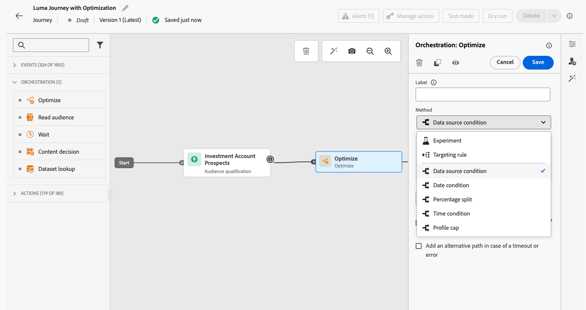

歷程上線後，會根據定義的條件評估設定檔，並根據比對條件，將設定檔從歷程傳送至適當的路徑。

## 使用實驗 {#experimentation}

>[!CONTEXTUALHELP]
>id="ajo_path_experiment_success_metric"
>title="成功量度"
>abstract="成功量度是用於追蹤和評估實驗中表現最佳的處理。"
>additional-url="https://experienceleague.adobe.com/en/docs/journey-optimizer/using/orchestrate-journeys/create-journey/success-metrics" text="設定並追蹤歷程量度"

實驗可讓您根據隨機分割來測試不同路徑，以根據預先定義的成功量度來判斷哪些路徑的執行效果最佳。

若要設定歷程中的路徑實驗，請遵循下列步驟。

假設您想比較三個路徑：

* 一個路徑，一個電子郵件；
* **[!UICONTROL Wait]**&#x200B;節點為兩天的第二個路徑，以及一封電子郵件；
* 第三個路徑，其中包含電子郵件，然後是SMS訊息。

1. 從&#x200B;**[!UICONTROL 協調流程]**&#x200B;區段，將&#x200B;**[!UICONTROL 最佳化]**&#x200B;活動拖放至歷程畫布。

1. 新增選用標籤，這對於在報告和測試模式記錄中識別活動很有用。

1. 從&#x200B;**[!UICONTROL 方法]**&#x200B;下拉式清單中選取&#x200B;**[!UICONTROL 實驗]**。

   {width=65%}

1. 按一下&#x200B;**[!UICONTROL 建立實驗]**。

1. 選取您想要為實驗設定的&#x200B;**[!UICONTROL 成功量度]**。 在[本節](success-metrics.md)中進一步瞭解可用的度量以及如何設定清單。

   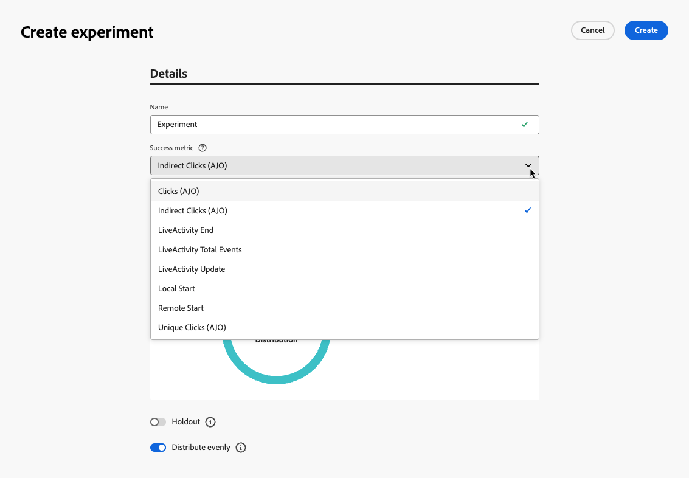{width=80%}的主要和額外量度選擇

1. 您可以選擇將&#x200B;**[!UICONTROL 保留]**&#x200B;群組新增至您的傳遞。 此群組將不會從此實驗輸入任何路徑。

   >[!NOTE]
   >
   >切換列會自動取用母體的10%。 您可以視需要調整此百分比。

   <!--
    DOES THIS APPLY TO PATH EXPERIMENT?
    IMPORTANT: When a holdout group is used in an action for path experimentation, the holdout assignment only applies to that specific action. After the action is completed, profiles in the holdout group will continue down the journey path and can receive messages from other actions. Therefore, ensure that any subsequent messages do not rely on the receipt of a message by a profile that might be in a holdout group. If they do, you may need to remove the holdout assignment.-->

1. 您可以為每個&#x200B;**[!UICONTROL 處理]**&#x200B;分配精確百分比，或直接開啟&#x200B;**[!UICONTROL 平均分配]**&#x200B;切換列。

   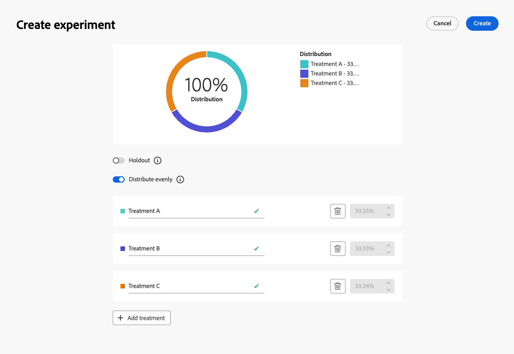{width=80%}

1. 按一下&#x200B;**[!UICONTROL 建立]**。

1. 為從「實驗」產生的每個分支定義您想要的元素，例如：

   * 將[電子郵件](../email/create-email.md)活動拖放至第一個分支（**處理A**）。

   * 拖放兩天的[等待](wait-activity.md)活動到第一個分支，接著拖放[電子郵件](../email/create-email.md)活動（**處理B**）。

   * 將[電子郵件](../email/create-email.md)活動拖放至第三個分支，接著拖放[簡訊](../sms/create-sms.md)活動（**處理C**）。

   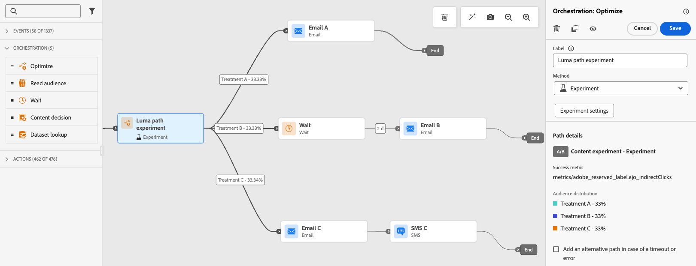{width=100%}

1. 在逾時或發生錯誤時，可選擇使用&#x200B;**[!UICONTROL 新增替代路徑]**&#x200B;來定義遞補動作。 [了解更多](using-the-journey-designer.md#paths)

1. 選取管道動作，並使用&#x200B;**[!UICONTROL 編輯內容]**&#x200B;按鈕來存取設計工具。

   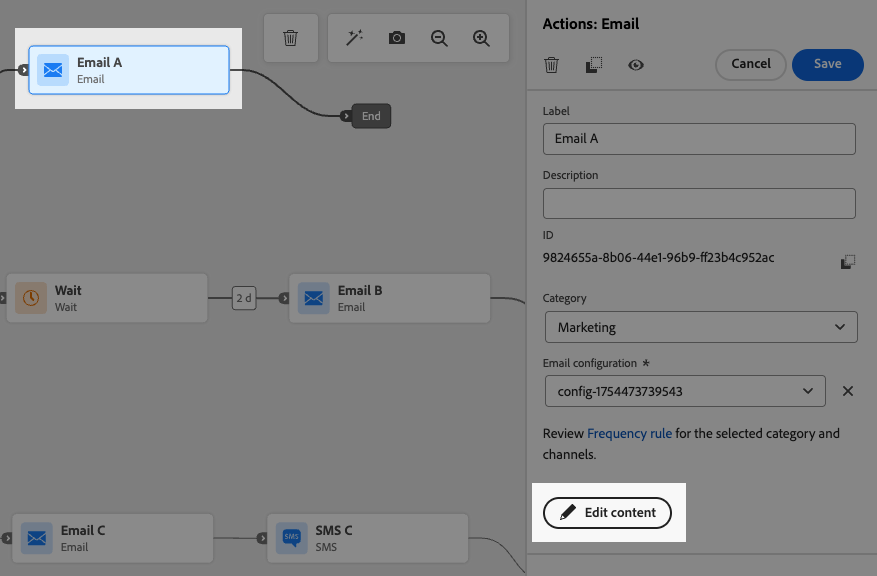{width=70%}

1. 從那裡，您可以使用左窗格針對實驗中的每個動作，在不同的內容之間導覽。 選取每個內容，並視需要加以設計。

   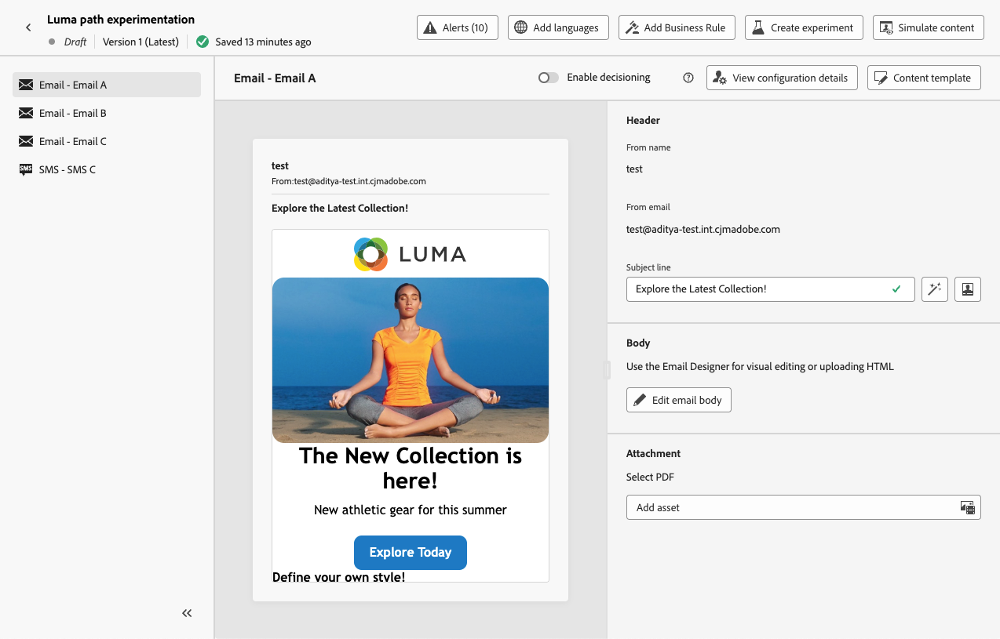{width=100%}處理的內容選取面板

1. [發佈](publish-journey.md)您的歷程。

歷程上線後，會隨機指派使用者沿著不同路徑前進。 [!DNL Journey Optimizer]追蹤哪個路徑執行效果最佳並提供可操作的深入分析。

使用歷程路徑實驗報告追蹤您的歷程是否成功。 [了解更多](../reports/journey-global-report-cja-experimentation.md)

>[!CAUTION]
>
>發佈路徑實驗後，請勿編輯其中繼資料。 編輯中繼資料將會中斷實驗結果的計算和報告。

### 實驗使用案例 {#uc-experiment}

下列範例說明如何將&#x200B;**[!UICONTROL 最佳化]**&#x200B;活動與&#x200B;**[!UICONTROL 實驗]**&#x200B;方法搭配使用，以決定哪一個路徑整體運作最好。

+++管道成效

測試透過電子郵件傳送第一條訊息還是透過簡訊傳送第一條訊息是否會提高轉換率。

➡️使用轉換率作為成功量度（例如：購買、註冊）。

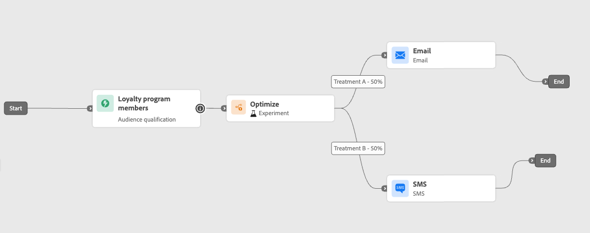

+++

+++訊息頻率

執行實驗，檢查在一週內傳送一封電子郵件還是傳送三封電子郵件是否會造成更多購買。

➡️使用購買或取消訂閱率作為成功量度。

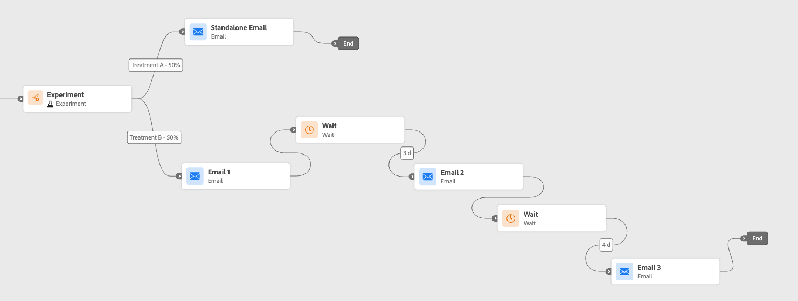

+++

+++通訊之間的等待時間

比較24小時等待和後續追蹤前72小時的等待，以確定哪一個時間可最大化參與。

➡️使用點進率或收入作為成功量度。

+++

## 善用目標選擇 {#targeting}

>[!CONTEXTUALHELP]
>id="ajo_path_targeting_fallback"
>title="什麼是後備路徑？"
>abstract="透過後備路徑，在沒有任何目標選擇規則符合要求時，會讓您的客群進入替代路徑。 如果您未選取此選項，則任何不符合目標選擇規則的客群都不會進入後備路徑，並退出歷程。"

目標規則可讓您根據特定受眾區段<!-- depending on profile attributes or contextual attributes-->，決定客戶必須符合哪些特定規則或資格，才能符合進入其中一個歷程路徑的資格。

實驗是指定路徑的隨機指派，而目標定位則是確定性的，可確保正確的對象或設定檔進入指定的路徑。

<!--With targeting, specific rules can be defined based on:

* **User profile attributes** such as location (eg. geo-targeting), age, or preferences. For example, users in the US receive a "Golden Gate" promotion, while users in France receive an "Eiffel Tower" promotion.

* **Contextual data** such as device type (eg. device-targeting), time of day, or session details. For example, desktop users receive desktop-optimized content, while mobile users receive mobile-optimized content.

* **Audiences** which can be used to include or exclude profiles that have a particular audience membership.-->

若要在歷程中設定鎖定目標，請遵循下列步驟。

1. 從&#x200B;**[!UICONTROL 協調流程]**&#x200B;區段，將&#x200B;**[!UICONTROL 最佳化]**&#x200B;活動拖放至歷程畫布。

1. 新增選用標籤，這對於在報告和測試模式記錄中識別活動很有用。

1. 從&#x200B;**[!UICONTROL 方法]**&#x200B;下拉式清單中選取&#x200B;**[!UICONTROL 目標規則]**。

   在最佳化活動中選取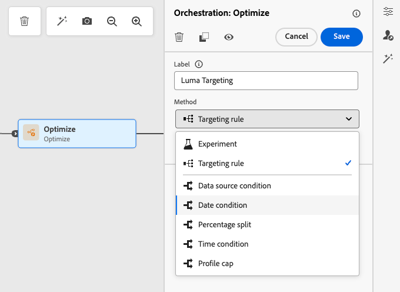{width=60%}

1. 按一下&#x200B;**[!UICONTROL 建立目標規則]**。

1. 按一下「**[!UICONTROL 建立規則]**」>「**[!UICONTROL 新建]**」，然後使用規則產生器來定義您的條件。

   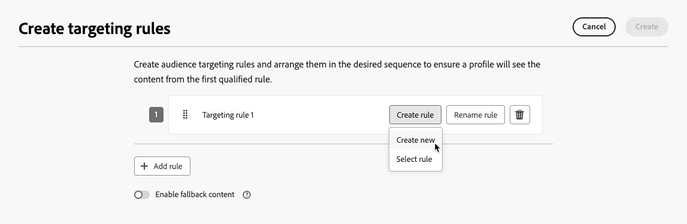{width=100%}

   例如，定義忠誠度計畫的金會員規則(`loyalty.status.equals("Gold", false)`)，以及其他會員規則(`loyalty.status.notEqualTo("Gold", false)`)。

   金級與非金級會員的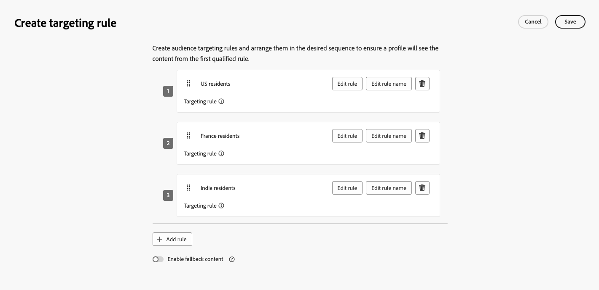

1. 您也可以按一下「建立規則&#x200B;**[!UICONTROL >]**&#x200B;選取規則&#x200B;**[!UICONTROL 」，選取從]**&#x200B;規則&#x200B;**[!UICONTROL 功能表建立的現有目標規則。]**[了解更多](../experience-decisioning/rules.md)

   ![從[規則]功能表選取現有的鎖定目標規則](assets/journey-targeting-select-rule.png){width=70%}

   在此情況下，組成規則的公式只會複製到歷程活動中。 從&#x200B;**[!UICONTROL 規則]**&#x200B;選單對該規則所做的任何後續變更將不會影響歷程的副本。

   >[!AVAILABILITY]
   >
   >[使用專用的](../experience-decisioning/rules.md#create)功能表建立鎖定目標規則[!DNL Journey Optimizer]，目前可供已購買決策附加元件產品的組織使用，其他組織也可依需求使用（可用性限制）。
   >
   >此容量將逐步向所有客戶推出。 與此同時，請聯絡您的Adobe代表以取得存取權。

1. 新增規則後，您仍可加以修改。 選擇&#x200B;**[!UICONTROL 編輯內嵌]**，以使用規則產生器即時更新它，或選擇&#x200B;**[!UICONTROL 選取規則]**&#x200B;以挑選另一個現有的規則。

   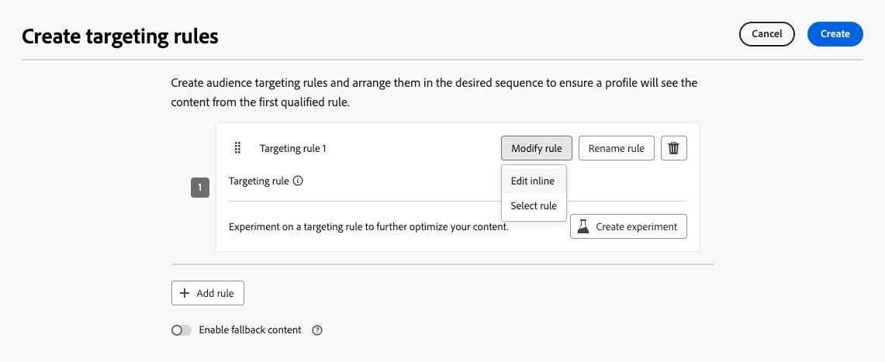{width=100%}

   >[!NOTE]
   >
   >編輯規則內嵌不會影響其源自的現有規則。

1. 視需要選取&#x200B;**[!UICONTROL 啟用遞補路徑]**&#x200B;選項。 此動作會針對不符合上述任何鎖定目標規則的對象建立遞補路徑。

   >[!NOTE]
   >
   >如果您未選取此選項，則任何不符合鎖定目標規則的對象都不會進入後援路徑並退出歷程。

1. 按一下&#x200B;**[!UICONTROL 建立]**&#x200B;以儲存您的目標規則設定。

1. 回到歷程中，拖放特定動作以自訂每個路徑。 例如，建立包含金級忠誠度會員個人化優惠方案的電子郵件，以及所有其他會員的簡訊提醒。

   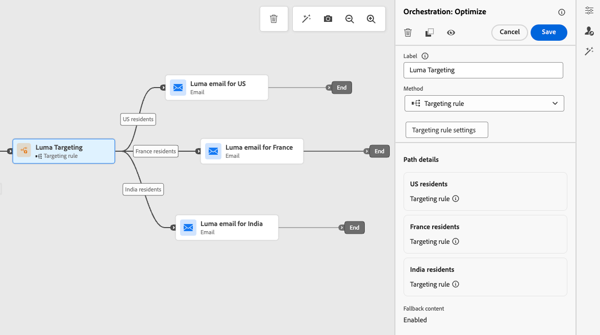

1. 如果您在定義規則設定時選取了&#x200B;**[!UICONTROL 啟用遞補內容]**&#x200B;選項，請為自動新增的遞補路徑定義一或多個動作。

   不合格設定檔的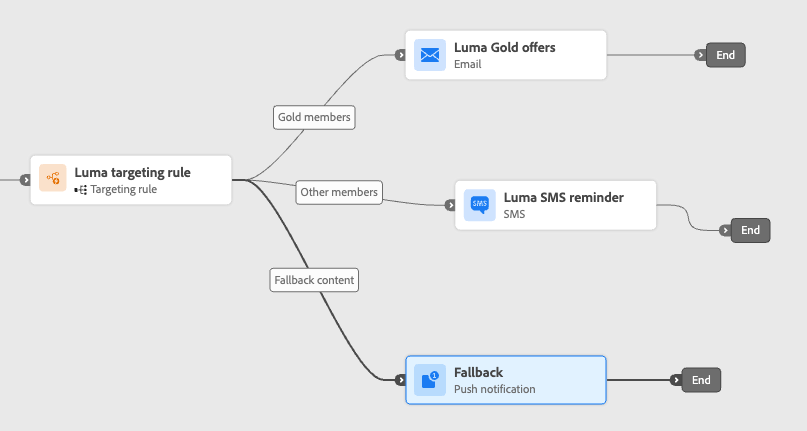{width=70%}

1. 如果逾時或發生錯誤，可選用&#x200B;**[!UICONTROL 新增替代路徑]**&#x200B;定義發生問題時的替代動作。 [了解更多](using-the-journey-designer.md#paths)

1. 針對目標規則設定所定義的每個群組，為每個動作設計適當的內容。 您可以順暢地為每個動作瀏覽不同的內容。

   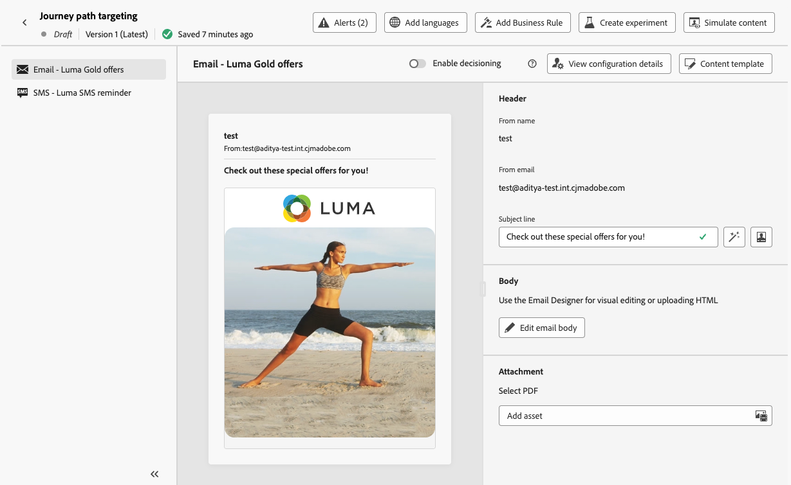

   在此範例中，設計一封電子郵件，內含金級會員的特殊優惠方案，以及其他會員的SMS提醒。

1. [發佈](publish-journey.md)您的歷程。

一旦歷程上線，系統就會處理為每個區段指定的路徑，以便Gold成員輸入有電子郵件選件的路徑，而其他成員輸入有簡訊提醒的路徑。

使用歷程報告追蹤您的歷程成功。 [了解更多](../reports/journey-global-report-cja.md#targeting)

### 鎖定目標規則使用案例 {#uc-targeting}

下列範例顯示如何搭配使用&#x200B;**[!UICONTROL 最佳化]**&#x200B;活動與&#x200B;**[!UICONTROL 鎖定目標規則]**&#x200B;方法來個人化不同子對象的路徑。

+++區段專用管道

金級狀態忠誠會員可以透過電子郵件接收個人化優惠，而所有其他會員則會導向簡訊提醒。

<!--➡️ Use the revenue per profile or conversion rate as the optimization metric.-->

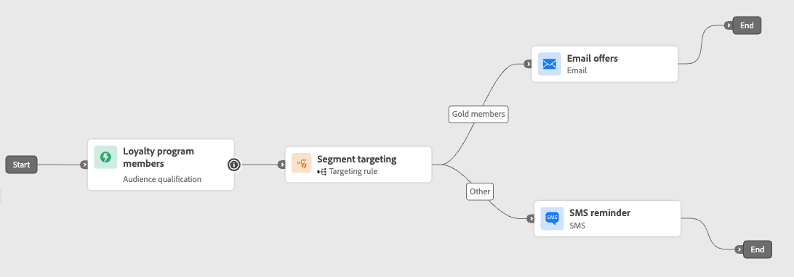

+++

+++行為型目標定位

已開啟電子郵件但未點按的客戶會收到推播通知，而完全未開啟的客戶則會收到簡訊。

<!--➡️ Use the click-through rate or downstream conversions as the optimization metric.-->

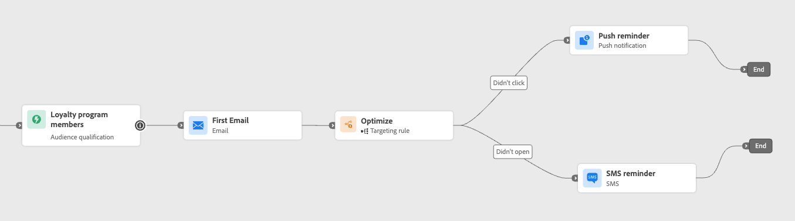

+++

+++購買記錄目標定位

最近購買過的客戶可以進入簡短的「感謝您+交叉銷售」路徑，而沒有購買記錄的客戶則會進入更長的培育歷程。

<!--➡️ Use the repeat purchase rate or engagement rate as the optimization metric.-->

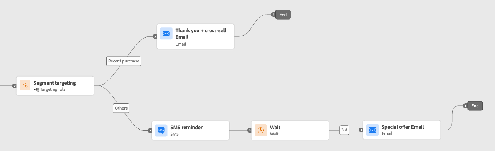

+++

### 新增條件。 {#conditions}

條件是一種[目標](#targeting)規則，可讓您根據特定條件建立多個路徑，以定義個人在您的歷程中如何前進。

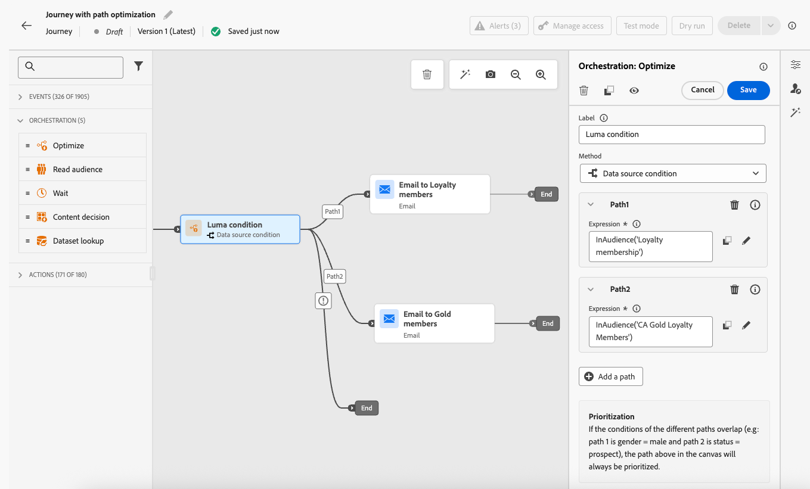

瞭解如何在[本節](conditions.md)中定義條件。

可使用下列型別的條件：

* [資料Source條件](condition-activity.md#data_source_condition)
* [時間條件](condition-activity.md#time_condition)
* [百分比分割](condition-activity.md#percentage_split)
* [日期條件](condition-activity.md#date_condition)
* [設定檔上限](condition-activity.md#profile_cap)
