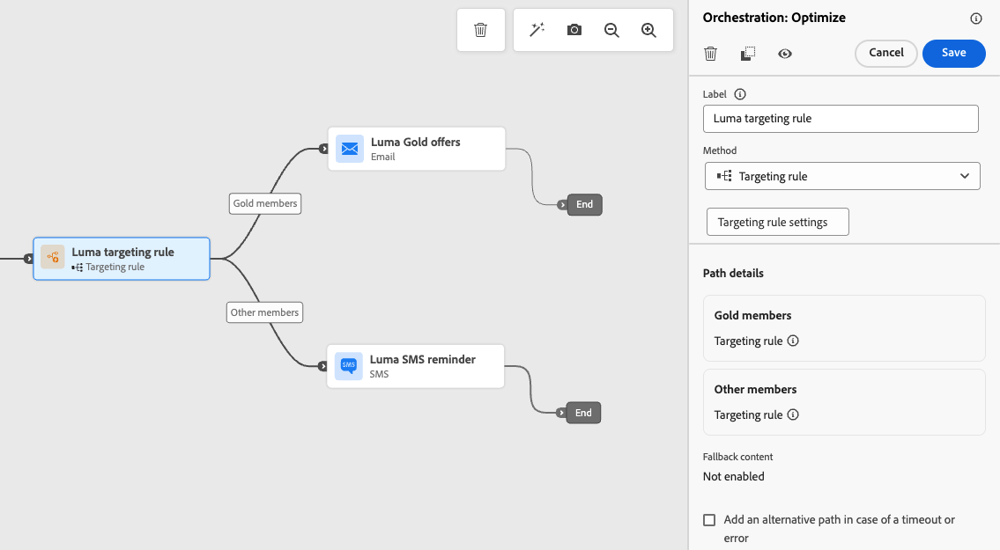

# 活動最佳化 {#journey-path-optimization}

>[!CONTEXTUALHELP]
>id="ajo_journey_optimize"
>title="活動最佳化"
>abstract="藉由將活動&#x200B;**最佳化**，您可以根據特定準則 (包括實驗、目標選擇和特定條件) 建立多條路徑，定義每個個體在您歷程中的進展方式。"

>[!AVAILABILITY]
>
>此功能為「有限可用性」的狀態。請聯絡您的 Adobe 代表以取得存取權。

**最佳化**&#x200B;活動可讓您根據特定條件（包括實驗、目標定位和特定條件）建立多個&#x200B;**路徑**，以定義個人在您的歷程中如何前進 — 確保最大程度的參與和成功，以建立高度自訂且有效的歷程。

**歷程路徑**&#x200B;可以包含下列任一專案：

* 通訊順序；
* 兩者之間的時間；
* 通訊次數；
* 或這三個變數的任意組合。

例如，一個路徑可能包含一封電子郵件，另一個路徑可能包含兩則簡訊，而第三個路徑可能包含一封電子郵件、兩個小時的[等待](wait-activity.md)節點，然後是簡訊。

<!--With this feature, [!DNL Journey Optimizer] empowers you with the tools to deliver personalized and optimized paths to your audience, ensuring maximum engagement and success to create highly customized and effective journeys.-->

透過&#x200B;**最佳化**&#x200B;活動，您可以：

* 執行[路徑實驗](#experimentation)
* 在每個歷程路徑中善用[目標定位](#targeting)規則
* 將[條件](#conditions)套用至您的路徑

歷程上線後，會根據定義的條件評估設定檔，並根據比對條件，將設定檔從歷程傳送至適當的路徑。

## 使用實驗 {#experimentation}

實驗可讓您根據隨機分割來測試不同路徑，以根據預先定義的成功量度來判斷哪些路徑的執行效果最佳。

若要設定歷程中的路徑實驗，請遵循下列步驟。

假設您想比較三個路徑：

* 一個路徑，一個電子郵件；
* **[!UICONTROL Wait]**&#x200B;節點為兩天的第二個路徑，以及一封電子郵件；
* 第三個路徑，其中包含電子郵件，然後是SMS訊息。

1. 從&#x200B;**[!UICONTROL 協調流程]**&#x200B;區段，將&#x200B;**[!UICONTROL 最佳化]**&#x200B;活動拖放至歷程畫布。

1. 新增選用標籤，這對於在報告和測試模式記錄中識別活動很有用。

1. 從&#x200B;**[!UICONTROL 方法]**&#x200B;下拉式清單中選取&#x200B;**[!UICONTROL 實驗]**。

   {width=75%}

1. 按一下&#x200B;**[!UICONTROL 建立實驗]**。

1. 選取您想要為實驗設定的&#x200B;**[!UICONTROL 成功量度]**。

   <!--Need to have the list of all default metrics + a description for each.
    Explain why the metric selection is important.
    Are there custom metrics? If so explain.
    If possible, add best practices and examples for each metrics (could even be a dedicated section).
    Consider adding an example in this step: For this example, select this metric to test xxx.
    -->

   {width=70%}

<!--1. Change the **[!UICONTROL Title]** of your treatment to better differentiate them.-->

1. 您可以選擇將&#x200B;**[!UICONTROL 保留]**&#x200B;群組新增至您的傳遞。 此群組將不會收到此實驗的任何內容。

   >[!NOTE]
   >
   >切換列會自動取用母體的10%。 您可以視需要調整此百分比。

   <!--
    [!IMPORTANT]
    >
    >DOES THIS APPLY TO PATH EXPERIMENT? When a holdout group is used in an action for path experimentation, the holdout assignment only applies to that specific action. After the action is completed, profiles in the holdout group will continue down the journey path and can receive messages from other actions. Therefore, ensure that any subsequent messages do not rely on the receipt of a message by a profile that might be in a holdout group. If they do, you may need to remove the holdout assignment.-->

1. 您可以為每個&#x200B;**[!UICONTROL 處理]**&#x200B;分配精確百分比，或直接開啟&#x200B;**[!UICONTROL 平均分配]**&#x200B;切換列。

   {width=80%}

1. 按一下&#x200B;**[!UICONTROL 建立]**。

1. 為從「實驗」產生的每個分支定義您想要的元素，例如：

   * 將[電子郵件](../email/create-email.md)活動拖放至第一個分支（**處理A**）。

   * 拖放兩天的[等待](wait-activity.md)活動到第一個分支，接著拖放[電子郵件](../email/create-email.md)活動（**處理B**）。

   * 將[電子郵件](../email/create-email.md)活動拖放至第三個分支，接著拖放[簡訊](../sms/create-sms.md)活動（**處理C**）。

   {width=100%}

1. 在逾時或發生錯誤時，可選擇使用&#x200B;**[!UICONTROL 新增替代路徑]**&#x200B;來定義遞補動作。 [了解更多](using-the-journey-designer.md#paths)

1. 選取管道動作，並使用&#x200B;**[!UICONTROL 編輯內容]**&#x200B;按鈕來存取設計工具。

   {width=70%}

1. 從那裡，您可以使用左窗格針對實驗中的每個動作，在不同的內容之間導覽。 視需要設計所有內容。

   {width=100%}

1. [發佈](publishing-the-journey.md)您的歷程。

歷程上線後，會隨機指派使用者沿著不同路徑前進。 [!DNL Journey Optimizer]追蹤哪個路徑執行效果最佳並提供可操作的深入分析。

使用最佳化/實驗[歷程報告](../reports/journey-global-report-cja.md)追蹤您的歷程成功。<!--Need a doc page on reporting specific to path experimentation in journey - [Path experimentation journey report](../xxx) such as what we have for [Experimentation campaign report](../reports/campaign-global-report-cja-experimentation.md)-->

### 實驗使用案例 {#uc-experiment}

下列範例說明如何將&#x200B;**[!UICONTROL 最佳化]**&#x200B;活動與&#x200B;**[!UICONTROL 實驗]**&#x200B;方法搭配使用，以決定哪一個路徑整體運作最好。

+++管道成效

測試透過電子郵件傳送第一條訊息還是透過簡訊傳送第一條訊息是否會提高轉換率。

* 使用轉換率作為最佳化量度（例如：購買、註冊）。

<!---->

+++

+++訊息頻率

執行實驗，檢查在一週內傳送一封電子郵件還是傳送三封電子郵件是否會造成更多購買。

* 使用購買或取消訂閱率作為最佳化量度。

+++

+++通訊之間的等待時間

比較24小時等待和後續追蹤前72小時的等待，以確定哪一個時間可最大化參與。

* 使用點進率或收入作為最佳化量度。

+++

## 善用目標定位 {#targeting}

目標定位可讓您根據特定受眾區段<!-- depending on profile attributes or contextual attributes-->，決定客戶必須符合哪些特定規則或資格，才能符合進入其中一個歷程路徑的資格。

實驗是指定路徑的隨機指派，而目標定位則是確定性的，可確保正確的對象或設定檔進入指定的路徑。

<!--With targeting, specific rules can be defined based on:

* **User profile attributes** such as location (eg. geo-targeting), age, or preferences. For example, users in the US receive a "Golden Gate" promotion, while users in France receive an "Eiffel Tower" promotion.

* **Contextual data** such as device type (eg. device-targeting), time of day, or session details. For example, desktop users receive desktop-optimized content, while mobile users receive mobile-optimized content.

* **Audiences** which can be used to include or exclude profiles that have a particular audience membership.-->

若要在歷程中設定鎖定目標，請遵循下列步驟。

1. 從&#x200B;**[!UICONTROL 協調流程]**&#x200B;區段，將&#x200B;**[!UICONTROL 最佳化]**&#x200B;活動拖放至歷程畫布。

1. 新增選用標籤，這對於在報告和測試模式記錄中識別活動很有用。

1. 從&#x200B;**[!UICONTROL 方法]**&#x200B;下拉式清單中選取&#x200B;**[!UICONTROL 目標規則]**。

   {width=75%}

1. 按一下&#x200B;**[!UICONTROL 建立目標規則]**。

1. 使用規則產生器來定義條件。 例如，定義忠誠度計畫的金會員規則(`loyalty.status.equals("Gold", false)`)，以及其他會員規則(`loyalty.status.notEqualTo("Gold", false)`)。

   

1. 視需要選取&#x200B;**[!UICONTROL 啟用遞補內容]**。 後援內容可讓您的對象在沒有符合目標規則時接收預設內容。 如果您未選取此選項，則不符合上述定義之目標定位規則的任何受眾都不會輸入遞補路徑。

1. 儲存您的目標規則設定。

1. 回到歷程中，拖放特定動作以自訂每個路徑。 例如，建立包含金級忠誠度會員個人化優惠方案的電子郵件，以及所有其他會員的簡訊提醒。

   

1. 在逾時或發生錯誤時，可選擇使用&#x200B;**[!UICONTROL 新增替代路徑]**&#x200B;來定義遞補動作。 [了解更多](using-the-journey-designer.md#paths)

1. 針對目標規則設定所定義之群組對應的每個動作，設計適當的內容。 您可以順暢地為每個動作瀏覽不同的內容。

   

   在此範例中，設計一封電子郵件，內含金級會員的特殊優惠方案，以及其他會員的SMS提醒。

1. [發佈](publishing-the-journey.md)您的歷程。

一旦歷程上線，系統就會處理為每個區段指定的路徑，以便Gold成員輸入有電子郵件選件的路徑，而其他成員輸入有簡訊提醒的路徑。

### 目標定位使用案例 {#uc-targeting}

下列範例顯示如何搭配使用&#x200B;**[!UICONTROL 最佳化]**&#x200B;活動與&#x200B;**[!UICONTROL 鎖定目標]**&#x200B;方法，為不同的子對象個人化路徑。

+++區段專用管道

金級狀態忠誠會員可以透過電子郵件接收個人化優惠，而所有其他會員則會導向簡訊提醒。

* 使用每個設定檔的收入或轉換率作為最佳化量度。

<!---->

+++

+++行為型目標定位

已開啟電子郵件但未點按的客戶會收到推播通知，而完全未開啟的客戶則會收到簡訊。

* 使用點進率或下游轉換作為最佳化量度。

+++

+++購買記錄目標定位

最近購買過的客戶可以進入簡短的「感謝您+交叉銷售」路徑，而沒有購買記錄的客戶則會進入更長的培育歷程。

* 使用重複購買率或參與率作為最佳化量度。

+++

## 新增條件。 {#conditions}

您可以新增條件，根據特定條件建立多個路徑，以定義個人在您的歷程中進度。 您也可以設定處理逾時或錯誤的替代路徑，確保提供順暢的體驗。

瞭解如何在[本節](conditions.md)中定義條件。

可使用下列型別的條件：

* [資料Source條件](condition-activity.md#data_source_condition)
* [時間條件](condition-activity.md#time_condition)
* [百分比分割](condition-activity.md#percentage_split)
* [日期條件](condition-activity.md#date_condition)
* [設定檔上限](condition-activity.md#profile_cap)
