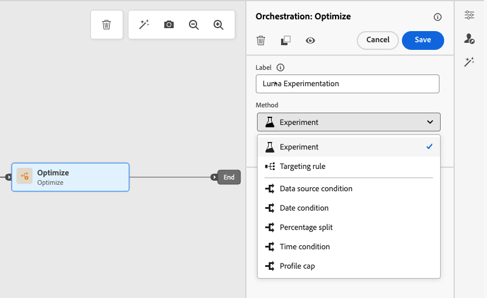
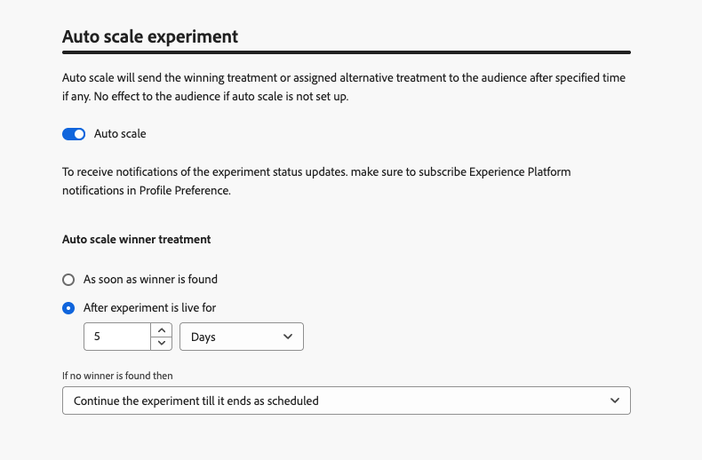

# 使用路徑實驗 {#experimentation}

>[!CONTEXTUALHELP]
>id="ajo_path_experiment_success_metric"
>title="成功量度"
>abstract="成功量度是用於追蹤和評估實驗中表現最佳的處理。"
>additional-url="https://experienceleague.adobe.com/zh-hant/docs/journey-optimizer/using/orchestrate-journeys/create-journey/success-metrics" text="設定並追蹤歷程量度"

實驗可讓您根據隨機分割來測試不同路徑，以根據預先定義的成功量度來判斷哪些路徑的執行效果最佳。

若要設定歷程中的路徑實驗，請遵循下列步驟。

假設您想比較三個路徑：

* 一個路徑，一個電子郵件；
* **[!UICONTROL Wait]**&#x200B;節點為兩天的第二個路徑，以及一封電子郵件；
* 第三個路徑，其中包含電子郵件，然後是SMS訊息。

1. 從&#x200B;**[!UICONTROL 協調流程]**&#x200B;區段，將&#x200B;**[!UICONTROL 最佳化]**&#x200B;活動拖放至歷程畫布。

1. 新增選用標籤，這對於在報告和測試模式記錄中識別活動很有用。

1. 從&#x200B;**[!UICONTROL 方法]**&#x200B;下拉式清單中選取&#x200B;**[!UICONTROL 實驗]**。

   {width=65%}

1. 按一下&#x200B;**[!UICONTROL 建立實驗]**。

1. 選取您想要為實驗設定的&#x200B;**[!UICONTROL 成功量度]**。 在[本節](success-metrics.md)中進一步瞭解可用的度量以及如何設定清單。

   {width=80%}的主要和額外量度選擇

1. 為您的路徑實驗選取&#x200B;**[!UICONTROL 實驗型別]**：

   * **[!UICONTROL A/B實驗]** — 在測試開始時定義處理間的流量分割。 績效是根據您選擇的主要量度進行評估；報告會顯示觀察到的處理之間的提升度。

   * **[!UICONTROL 多臂吃角子老虎機]** — 處理之間的流量分割會自動處理。 每7天會審視主要量度的效能，並據此調整權重。 報告會繼續顯示提升度，如同A/B測試。

   {width=80%}

   ➡️ [進一步瞭解A/B與Multi-armed Bandit實驗之間的差異](../content-management/mab-vs-ab.md)

1. 您可以選擇將&#x200B;**[!UICONTROL 保留]**&#x200B;群組新增至您的傳遞。 此群組將不會從此實驗輸入任何路徑。

   >[!NOTE]
   >
   >切換列會自動取用母體的10%。 您可以視需要調整此百分比。

   <!--
    DOES THIS APPLY TO PATH EXPERIMENT?
    IMPORTANT: When a holdout group is used in an action for path experimentation, the holdout assignment only applies to that specific action. After the action is completed, profiles in the holdout group will continue down the journey path and can receive messages from other actions. Therefore, ensure that any subsequent messages do not rely on the receipt of a message by a profile that might be in a holdout group. If they do, you may need to remove the holdout assignment.-->

1. 您可以為每個&#x200B;**[!UICONTROL 處理]**&#x200B;分配精確百分比，或直接開啟&#x200B;**[!UICONTROL 平均分配]**&#x200B;切換列。

   {width=80%}

1. 啟用自動縮放實驗以自動轉出實驗的成功變數。 [進一步瞭解如何縮放成功者](#scale-winner)

1. 按一下&#x200B;**[!UICONTROL 建立]**。

1. 為從「實驗」產生的每個分支定義您想要的元素，例如：

   * 將[電子郵件](../email/create-email.md)活動拖放至第一個分支（**處理A**）。

   * 拖放兩天的[等待](wait-activity.md)活動到第一個分支，接著拖放[電子郵件](../email/create-email.md)活動（**處理B**）。

   * 將[電子郵件](../email/create-email.md)活動拖放至第三個分支，接著拖放[簡訊](../sms/create-sms.md)活動（**處理C**）。

   {width=100%}

1. 可選擇在逾時或錯誤的情況下使用&#x200B;**[!UICONTROL 新增替代路徑]**&#x200B;來定義遞補動作。 [了解更多](using-the-journey-designer.md#paths)

1. [發佈](publish-journey.md)您的歷程。

<!--

    Select a channel action and use the **[!UICONTROL Edit content]** button to access the design tools.

    {width=70%}

    From there, using the left pane you can navigate between the different contents for each action in your experiment. Select each content and design it as needed.

    {width=100%}

-->

歷程上線後，會隨機指派使用者沿著不同路徑前進。 [!DNL Journey Optimizer]追蹤哪個路徑執行效果最佳並提供可操作的深入分析。

使用歷程路徑實驗報告追蹤您的歷程是否成功。 [了解更多](../reports/journey-global-report-cja-experimentation.md)

<!--REMOVED WITH GA

>[!CAUTION]
>
>Do not edit the metadata of a path experiment once it has been published. Editing the metadata will disrupt the calculation and reporting of experiment results.
-->

## 實驗使用案例 {#uc-experiment}

下列範例說明如何將&#x200B;**[!UICONTROL 最佳化]**&#x200B;活動與&#x200B;**[!UICONTROL 實驗]**&#x200B;方法搭配使用，以決定哪一個路徑整體運作最好。

+++管道成效

測試透過電子郵件傳送第一條訊息還是透過簡訊傳送第一條訊息是否會提高轉換率。

➡️使用轉換率作為成功量度（例如：購買、註冊）。

+++

+++訊息頻率

執行實驗，檢查在一週內傳送一封電子郵件還是傳送三封電子郵件是否會造成更多購買。

➡️使用購買或取消訂閱率作為成功量度。

+++

+++通訊之間的等待時間

比較24小時等待和後續追蹤前72小時的等待，以確定哪一個時間可最大化參與。

➡️使用點進率或收入作為成功量度。

+++

## 縮放成功者 {#scale-winner}

>[!AVAILABILITY]
>
>對於路徑實驗，「縮放成功者」功能僅在單一歷程（事件觸發和受眾資格）中可用。
>
>它不適用於讀取對象歷程。

Scale the Winner 讓您能透過自動或手動方式，將實驗的獲勝變化版本推廣給所有受眾。此功能可確保一旦確定獲勝者後，您就可以擴大其觸及範圍和有效性，而無需持續監控實驗。

您可以在兩種模式之間進行選擇：

* **自動縮放**：選擇縮放成功處理的時間與條件，或在沒有贏家出現時選擇遞補選項，在建立實驗時設定自動縮放設定。

* **手動縮放**：手動檢閱實驗結果，並啟動成功處理的轉出，以完整控制時間與決定。

### 自動縮放 {#autoscaling}

自動縮放可讓您根據實驗結果，設定何時推出成功處理或遞補專案的預先定義規則。

請注意，自動縮放一經發生，便無法再使用手動縮放。

若要在實驗中啟用自動縮放：

1. 視需要設定您的歷程並設定您的實驗。 [了解更多](#experimentation)

1. 設定實驗時啟用自動縮放選項。

   

1. 選取縮放成功者的時間：

   * 找到獲勝者之後。
   * 實驗在所選的時間內上線後。

   自動縮放時間必須排程在實驗的結束日期之前。 如果設定的時間晚於結束日期，則會出現驗證警告，且不會發佈歷程。

   中自動縮放時間選擇

1. 如果依時間比例找不到任何獲勝者，請選擇遞補行為：

   * 繼續實驗，直到其依排程結束。
   * 在指定時間後縮放替代處理。

在符合所有引數後，您的成功或替代處理方式就會傳送給您的對象。

### 手動縮放 {#manual-scaling}

手動縮放讓您能夠檢閱實驗結果，並決定何時根據自己的排程推出成功處理。

請注意，如果您在排程的自動縮放時間之前手動縮放成功者，則會取消自動縮放。

若要手動縮放實驗的獲勝者：

1. 視需要設定您的歷程並設定您的實驗。 [了解更多](#experimentation)

1. 讓實驗執行，直到識別出獲勝者或達到統計顯著性為止。

1. 開啟您的歷程並選取包含路徑實驗的&#x200B;**[!UICONTROL 最佳化]**&#x200B;活動。

   檢閱&#x200B;**[!UICONTROL 路徑實驗]**&#x200B;檢視中的結果，以識別表現最佳的處理。

   

1. 按一下&#x200B;**[!UICONTROL 縮放處理]**，將成功處理推送給其他對象。

   <!---->

1. 從下拉式選單中選取您要縮放的處理方式，然後按一下&#x200B;**[!UICONTROL 縮放]**。

   {width=80%}中縮放處理選擇

請注意，縮放處理可能需要長達一小時的時間。 手動縮放程式完成後，您將會收到通知。
