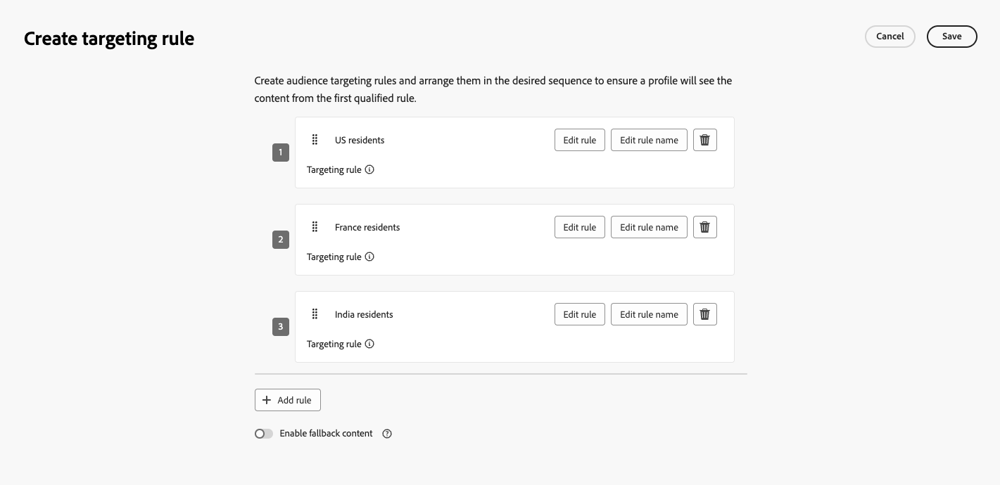

# 利用路徑目標鎖定 {#targeting}

>[!CONTEXTUALHELP]
>id="ajo_path_targeting_fallback"
>title="什麼是後備路徑？"
>abstract="透過後備路徑，在沒有任何目標選擇規則符合要求時，會讓您的客群進入替代路徑。  如果您未選取此選項，則任何不符合目標選擇規則的客群都不會進入後備路徑，並退出歷程。"

>[!AVAILABILITY]
>
>此功能目前處於「有限可用性」。 如欲請求存取權，請和您的 Adobe 代表聯絡。

目標規則可讓您根據特定受眾區段<!-- depending on profile attributes or contextual attributes-->，決定客戶必須符合哪些特定規則或資格，才能符合進入其中一個歷程路徑的資格。

實驗是指定路徑的隨機指派，而目標定位則是確定性的，可確保正確的對象或設定檔進入指定的路徑。

<!--
With targeting, specific rules can be defined based on:

* **User profile attributes** such as location (eg. geo-targeting), age, or preferences. For example, users in the US receive a "Golden Gate" promotion, while users in France receive an "Eiffel Tower" promotion.

* **Contextual data** such as device type (eg. device-targeting), time of day, or session details. For example, desktop users receive desktop-optimized content, while mobile users receive mobile-optimized content.

* **Audiences** which can be used to include or exclude profiles that have a particular audience membership.
-->

若要在歷程中設定鎖定目標，請遵循下列步驟。

1. 從&#x200B;**[!UICONTROL 協調流程]**&#x200B;區段，將&#x200B;**[!UICONTROL 最佳化]**&#x200B;活動拖放至歷程畫布。

1. 新增選用標籤，這對於在報告和測試模式記錄中識別活動很有用。

1. 從&#x200B;**[!UICONTROL 方法]**&#x200B;下拉式清單中選取&#x200B;**[!UICONTROL 目標規則]**。

   在最佳化活動中選取{width=60%}

1. 按一下&#x200B;**[!UICONTROL 建立目標規則]**。

1. 按一下「**[!UICONTROL 建立規則]**」>「**[!UICONTROL 新建]**」，然後使用規則產生器來定義您的條件。

   {width=100%}

   例如，定義忠誠度計畫的金會員規則(`loyalty.status.equals("Gold", false)`)，以及其他會員規則(`loyalty.status.notEqualTo("Gold", false)`)。

   金級與非金級會員的

1. 您也可以按一下「建立規則&#x200B;]**>**[!UICONTROL &#x200B;選取規則&#x200B;]**」，選取從**[!UICONTROL &#x200B;規則&#x200B;]**功能表建立的現有目標規則。**[!UICONTROL [了解更多](../experience-decisioning/rules.md)

   ![從[規則]功能表選取現有的鎖定目標規則](assets/journey-targeting-select-rule.png){width=70%}

   在此情況下，組成規則的公式只會複製到歷程活動中。 從&#x200B;**[!UICONTROL 規則]**&#x200B;選單對該規則所做的任何後續變更將不會影響歷程的副本。

   >[!AVAILABILITY]
   >
   >[使用專用的[!DNL Journey Optimizer]功能表建立鎖定目標規則](../experience-decisioning/rules.md#create)，目前可供已購買決策附加元件產品的組織使用，其他組織也可依需求使用（可用性限制）。
   >
   >此容量將逐步向所有客戶推出。 與此同時，請聯絡您的Adobe代表以取得存取權。

1. 新增規則後，您仍可加以修改。 選擇&#x200B;**[!UICONTROL 編輯內嵌]**，以使用規則產生器即時更新它，或選擇&#x200B;**[!UICONTROL 選取規則]**&#x200B;以挑選另一個現有的規則。

   {width=100%}

   >[!NOTE]
   >
   >Editing a rule inline does not affect the existing rule it originates from.

1. Select the **[!UICONTROL Enable fallback path]** option as needed. This action creates a fallback path for the audience that does not meet any of the targeting rules defined above.

   >[!NOTE]
   >
   >If you do not select this option, any audience that does not qualify for a targeting rule does not enter the fallback path and exits the journey.

1. Click **[!UICONTROL Create]** to save your targeting rule settings.

1. Back in the journey, drop specific actions to customize each path. For example, create an email with personalized offers for Gold Loyalty members, and an SMS reminder for all other members.

   

1. If you selected the **[!UICONTROL Enable fallback content]** option when defining the rule settings, define one or more actions for the fallback path that was automatically added.

   {width=70%}

1. Optionally, use the **[!UICONTROL Add an alternative path in case of a timeout or an error]** to define an alternate action if issues occur. [了解更多](using-the-journey-designer.md#paths)

1. Design appropriate content for each action corresponding to each group defined by your targeting rule settings.

   In this example, design an email with special offers for Gold members, and an SMS reminder for the other members.<!--You can seamlessly navigate between the different contents for each action. -->

1. [Publish](publish-journey.md) your journey.

Once the journey is live, the path that is specified for each segment is processed so that Gold members enter the path with the email offers, while the other members enter the path with the SMS reminder.

Follow the success of your journey with the Journey report. [了解更多](../reports/journey-global-report-cja.md#targeting)

## Targeting rule use cases {#uc-targeting}

The following examples show how to use the **[!UICONTROL Optimize]** activity with the **[!UICONTROL Targeting rule]** method to personalize paths for different sub-audiences.

+++Segment-specific channels

Gold status loyalty members can receive personalized offers via email, while all other members are directed to SMS reminders.

<!--➡️ Use the revenue per profile or conversion rate as the optimization metric.-->

+++

+++Behavior-based targeting

Customers who opened an email but didn&#39;t click can be sent a push notification, while those who didn&#39;t open at all receive an SMS.

<!--➡️ Use the click-through rate or downstream conversions as the optimization metric.-->

+++

+++購買記錄目標定位

最近購買過的客戶可以進入簡短的「感謝您+交叉銷售」路徑，而沒有購買記錄的客戶則會進入更長的培育歷程。

<!--➡️ Use the repeat purchase rate or engagement rate as the optimization metric.-->

+++
