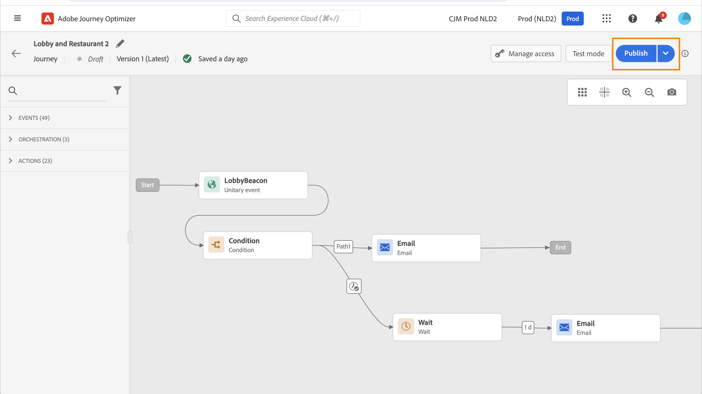
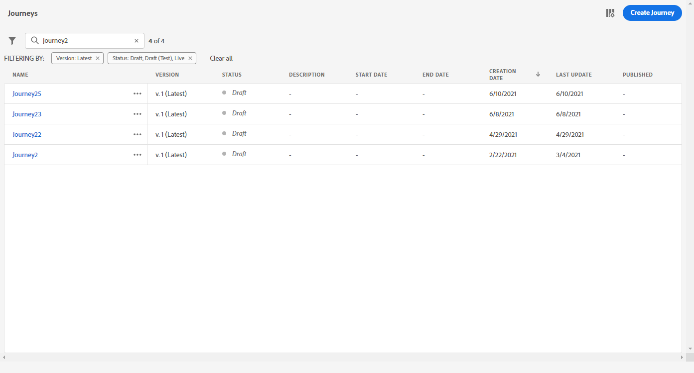
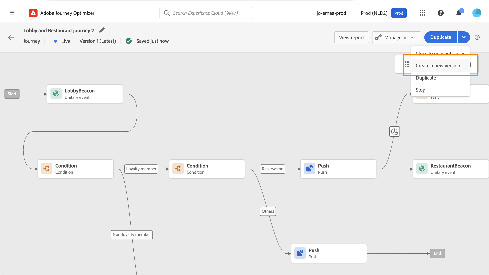

# 發佈您的歷程 {#publishing-the-journey}

您必須發佈歷程以將其啟動，並讓新設定檔可以進入歷程。 發佈歷程之前，請確認其有效且沒有錯誤。 您無法發佈含有錯誤的歷程。

>[!NOTE]
>
>當您儲存或發佈歷程時，Journey Optimizer會驗證歷程裝載總大小，如果您接近或超過限制，可能會警告或封鎖發佈。 深入瞭解[歷程裝載大小驗證](../start/guardrails.md#journey-payload-size)。

➡️ [在影片中探索此功能](#video)

## 發佈程式 {#journey-publication}

發佈歷程的步驟詳述如下：

1. 發佈歷程之前，請確認其有效且沒有錯誤。 您無法發佈含有錯誤的歷程。

   * 瞭解如何在[此頁面](testing-the-journey.md)上測試您的歷程。
   * 在[本節](../building-journeys/troubleshooting.md#activity-errors)中瞭解如何疑難排解您的歷程錯誤。

1. 若要發佈歷程，請按一下右上角下拉式功能表中的&#x200B;**[!UICONTROL 發佈]**&#x200B;選項。

   >[!NOTE]
   >
   > 如果您的歷程受核准政策的約束，您必須請求核准才能發佈您的歷程。 [了解更多](../test-approve/gs-approval.md)

   歷程工具列中的

發佈歷程時，它處於&#x200B;**唯讀**&#x200B;模式。 在唯讀模式中，您只能修改活動標籤和說明、歷程名稱和歷程說明。 如果您需要對已發佈的歷程進行額外的修改，請建立歷程的[新版本](journey-ui.md#journey-filter)。

當您停止歷程時，歷程會永久停止。 流經歷程的所有個人會永久停止，且歷程會停止允許新登入。 如果您需要再次執行歷程，請複製歷程並發佈新歷程。

>[!IMPORTANT]
>
>* 如果對歷程訊息中使用的優惠決定進行變更，您需要取消發佈歷程並重新發佈。 這可確保將變更納入歷程的訊息中，且訊息與最新更新一致。
>
>* Assets/影像在任何片段/內嵌訊息中的首次發佈後，最多可在2年（730天）的傳遞內容中存取。 在此到期日後（730天後的任何時間）必須重新發佈，才能在隨後2年內可供存取。 在首次發佈後730天內完成的任何重新發佈，都不會將資產/影像的到期日延長至接下來的730天。

## 歷程版本 {#journey-versions}

在歷程清單中，所有歷程版本都會連同版本號碼一起顯示。當您搜尋歷程時，最新版本會在應用程式首次開啟時出現在清單頂端。然後，您可以定義所需的排序，應用程式會將其保留為使用者偏好設定。歷程的版本也會顯示在畫布上方的歷程版本介面頂端。

>[!NOTE]
>
>通常，對於歷程的所有作用中版本，設定檔無法在同一歷程中同時出現多次。 如果啟用重新進入，輪廓可以重新進入歷程，但必須完全退出歷程的上一個執行個體，才能執行此動作。[閱讀全文](entry-management.md)。

### 建立歷程的新版本 {#journey-create-new-version}

如果您需要修改為即時歷程，請建立歷程的新版本。 若要建立現有歷程的新版本，請遵循下列步驟：

1. 開啟最新版本的即時歷程，按一下&#x200B;**[!UICONTROL 建立新版本]**&#x200B;並確認。

   

   >[!NOTE]
   >
   >您只能從歷程的最新版本建立新版本。

1. 進行修改，按一下&#x200B;**[!UICONTROL 發佈]**&#x200B;並確認。

從發佈歷程的那一刻起，個人就會開始進入歷程的最新版本。 已進入舊版本的人會保留在舊版本中，直到歷程結束。如果他們稍後重新進入相同的歷程，則會進入最新版本。

歷程版本可個別停止。所有版本的歷程都有相同的名稱。

當您發佈歷程的新版本時，舊版本會自動結束並切換到&#x200B;**已關閉**&#x200B;狀態。歷程無法進入。即使您停止最新版本，先前版本仍會保持關閉狀態。

>[!NOTE]
>
>特定護欄和限制適用於歷程的版本設定。 請在[此頁面](../start/guardrails.md#journey-versions-g)了解更多。

## 作法影片 {#video}

透過此影片瞭解如何發佈歷程：

>[!VIDEO](https://video.tv.adobe.com/v/3427942?captions=chi_hant&quality=12)