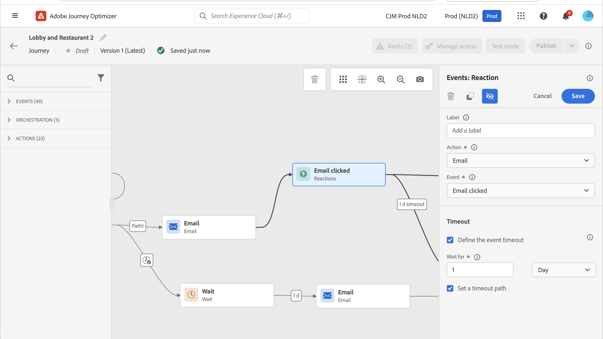

# 反應事件 {#reaction-events}

>[!CONTEXTUALHELP]
>id="ajo_journey_event_reaction"
>title="反應事件"
>abstract="本活動可讓您回應和同一歷程中傳送的訊息相關的追蹤資料。我們會在和 Adobe Experience Platform 共用時即時擷取此資訊。"

## 概觀 {#overview}

在浮動視窗中可用的不同事件活動中，您會找到內建的&#x200B;**[!UICONTROL 回應]**&#x200B;事件。 本活動可讓您回應和同一歷程中傳送的訊息相關的追蹤資料。我們會在和 Adobe Experience Platform 共用時即時擷取此資訊。

您可以對點按或開啟的訊息做出反應。

檢視[動作活動](../building-journeys/about-journey-activities.md#action-activities)。

當您的訊息沒有回應時，您可以使用&#x200B;**[!UICONTROL 回應]**&#x200B;活動來執行動作。 若要這麼做，請建立與&#x200B;**[!UICONTROL 回應]**&#x200B;活動平行的第二個路徑，並新增&#x200B;**[!UICONTROL 等待]**&#x200B;活動。 如果在&#x200B;**[!UICONTROL 等待]**&#x200B;活動中定義的期間內沒有反應，將會選擇第二個路徑。 舉例來說，您可以選擇傳送後續追蹤訊息。

## 如何設定反應事件 {#configure}

請依照下列步驟設定反應事件：

1. 在歷程畫布上的&#x200B;**[!UICONTROL 頻道動作活動]**&#x200B;後立即放置&#x200B;**回應**&#x200B;活動[&#128279;](journeys-message.md)。
1. 新增&#x200B;**[!UICONTROL 標籤]**&#x200B;至回應。 此步驟為選填。
1. 從下拉式清單中，選取您要回應的動作活動。 您可以選取位於路徑前幾個步驟中的任何動作活動。
1. 根據您選取的動作，選擇您要回應的專案。
1. 您可以定義事件逾時（40秒至90天之間）和逾時路徑。 這會為未在定義期間內回應的個人建立第二個路徑。 測試歷程的反應事件時，測試模式&#x200B;**[!UICONTROL 等待時間]**&#x200B;預設值及最小值為40秒。 請參閱[本節](../building-journeys/testing-the-journey.md)。

## 護欄與限制 {#guardrails-limitations}

* 在歷程畫布中的&#x200B;**[!UICONTROL 頻道動作活動]**&#x200B;之後，**回應**&#x200B;活動必須置於[立即](journeys-message.md)。
* 如果之前沒有管道動作活動，則無法使用&#x200B;**[!UICONTROL 回應]**&#x200B;活動。
* 不支援在頻道動作和&#x200B;**[!UICONTROL 回應]**&#x200B;活動之間放置&#x200B;**[!UICONTROL 等待]**&#x200B;活動或任何其他活動，並可能導致回應無法如預期運作。
* 反應事件只能追蹤相同歷程中傳送的訊息。 他們無法追蹤發生在不同歷程中的訊息。
* 反應事件會追蹤「已追蹤」型別連結的點按。 未考慮取消訂閱和映象頁面連結。
* 系統會使用電子郵件中包含的0畫素影像來追蹤電子郵件開啟次數。 如果電子郵件使用者端（例如Gmail）封鎖影像，系統不會將電子郵件開啟列入考量。
