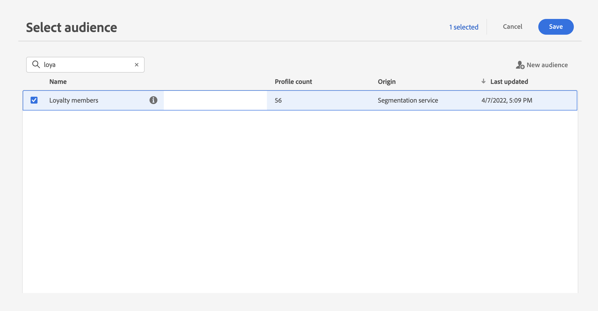
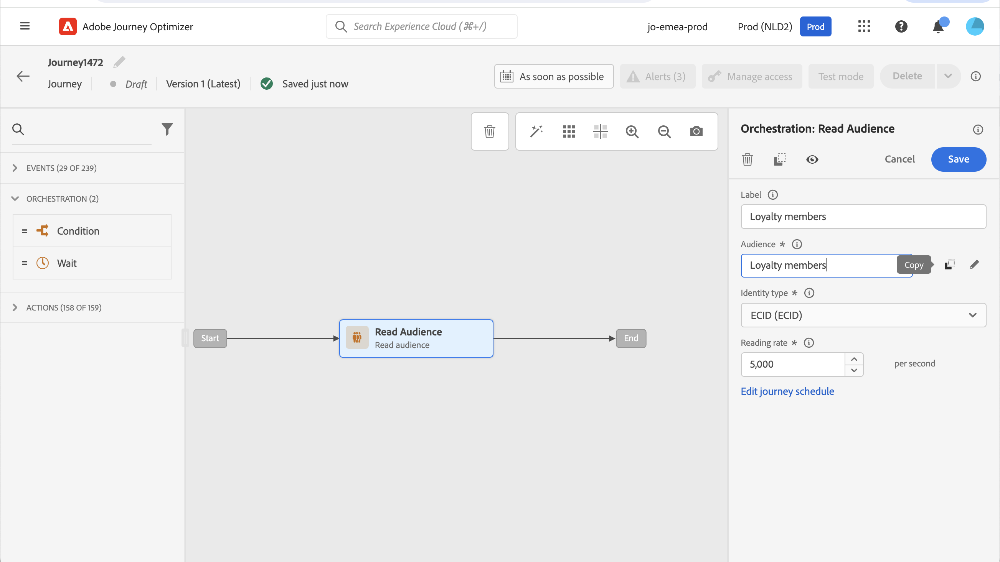
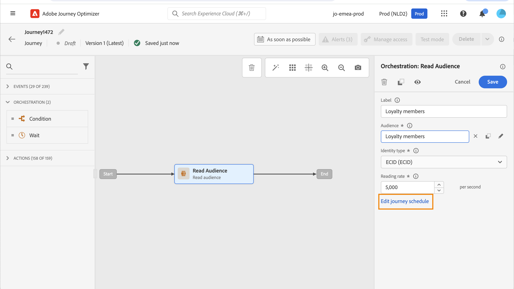
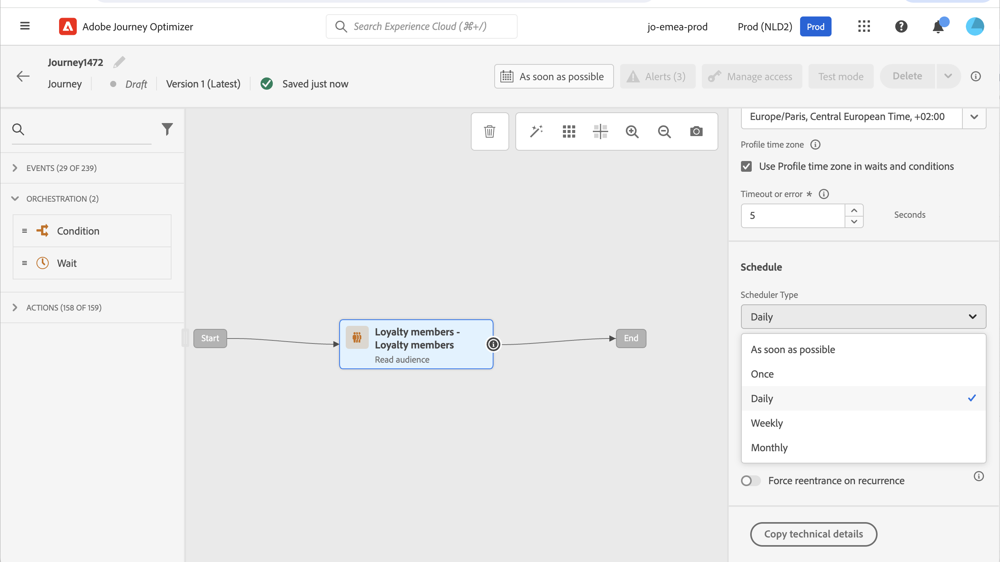
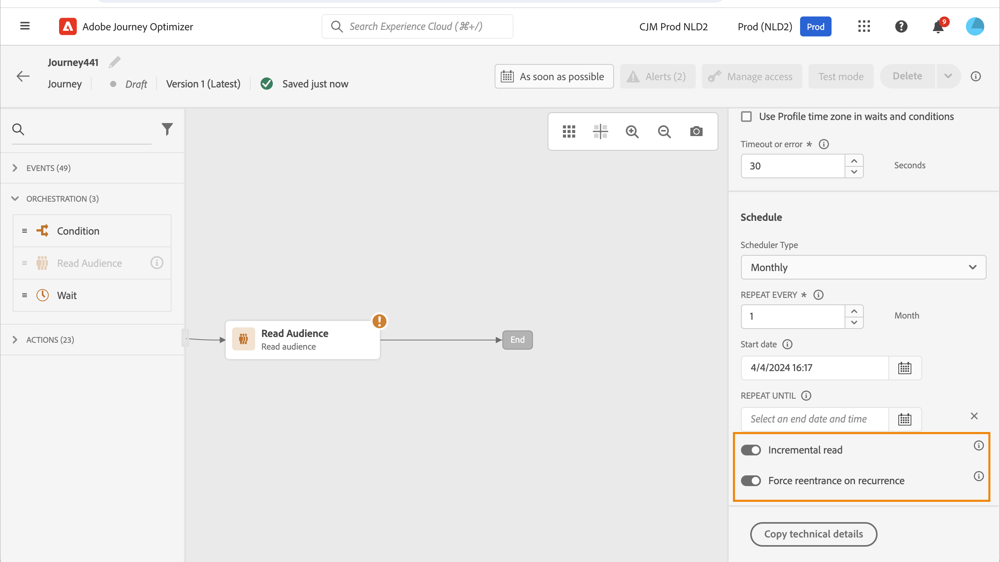
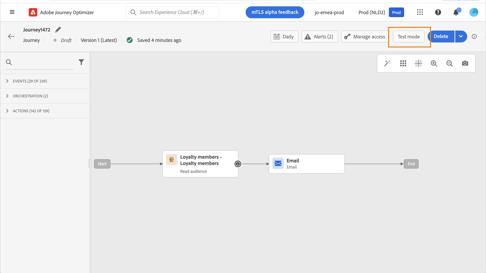
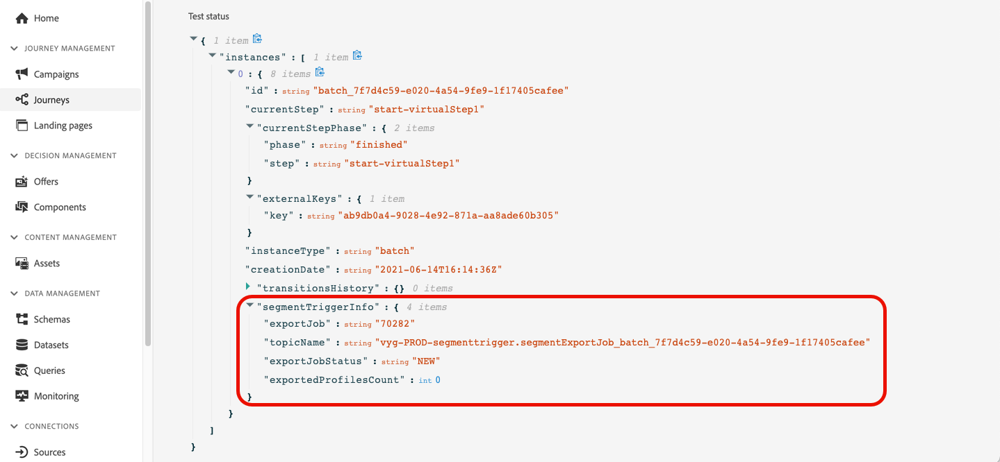
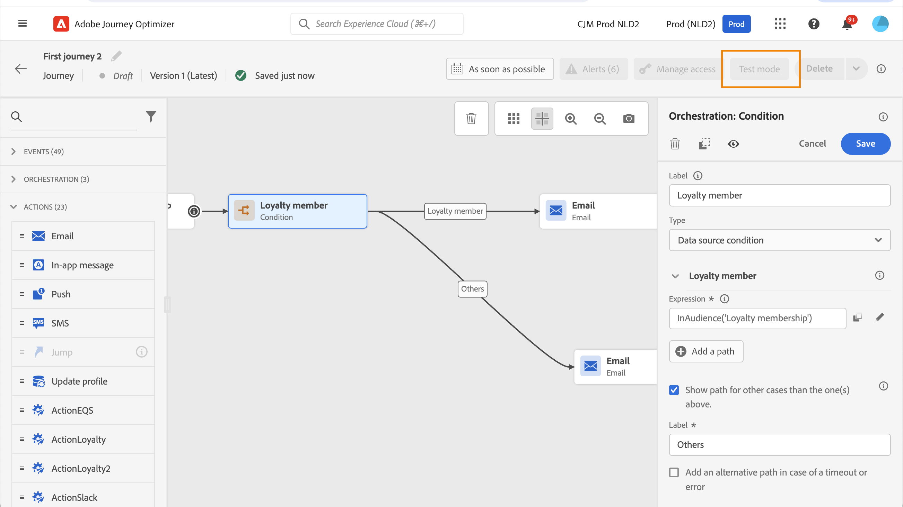
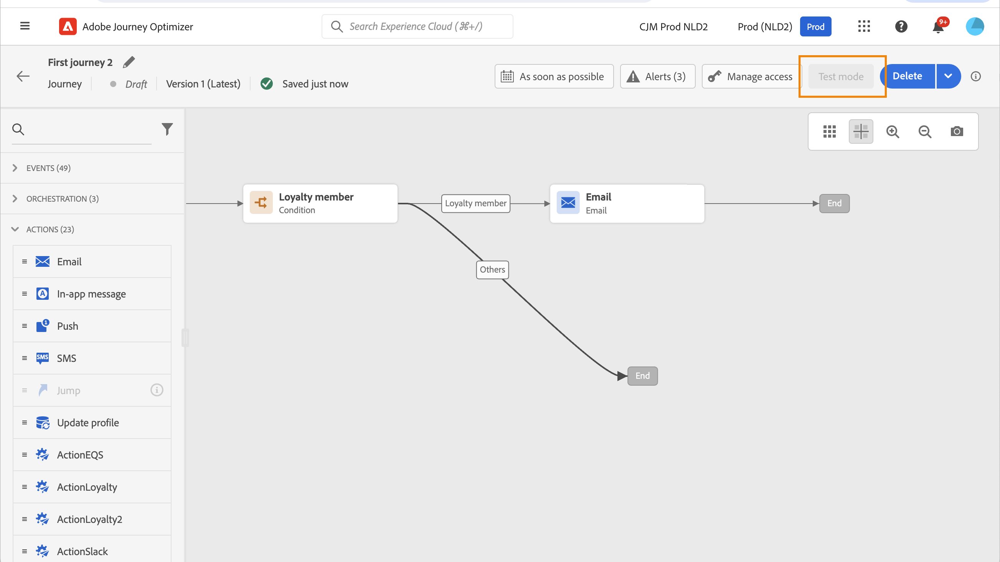
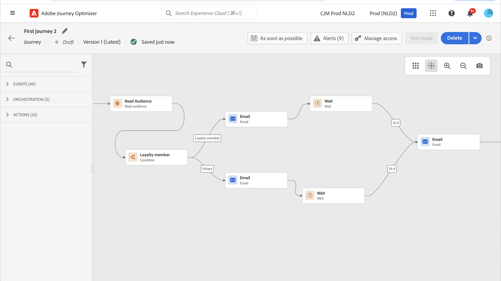

# 在歷程中使用對象 {#segment-trigger-activity}

## 關於讀取客群活動 {#about-segment-trigger-actvitiy}

>[!CONTEXTUALHELP]
>id="ajo_journey_read_segment"
>title="讀取客群活動"
>abstract="「讀取對象」活動可讓您將屬於[!DNL Adobe Experience Platform]對象的所有個人進入歷程。 進入歷程可以執行一次，也可以定期執行。"

使用&#x200B;**讀取對象**&#x200B;活動讓對象的所有個人進入歷程。 進入歷程可以執行一次，也可以定期執行。

以在[組建對象](../audience/about-audiences.md)使用案例中建立的「Luma應用程式開啟和簽出」對象為例。 透過讀取對象活動，您可以讓屬於此對象的所有個人進入歷程。 他們將會流入利用所有歷程功能（條件、計時器、事件、動作）的個人化歷程。

➡️ [在影片中探索此功能](#video)

>[!NOTE]
>
>當讀取對象活動執行時，系統會產生內部事件（稱為`segmentExportJob`事件）以追蹤對象匯出作業的生命週期。 這些事件會在活動層級記錄，而非個別設定檔，且可供查詢以用於監控和疑難排解目的。 深入瞭解[查詢讀取對象事件](../reports/query-examples.md#read-segment-queries)。

>[!CAUTION]
>
>* 在使用讀取對象活動之前，[先讀取護欄和限制](#must-read)。

## 設定活動 {#configuring-segment-trigger-activity}

設定「讀取對象」活動的步驟如下。

### 新增讀取對象活動並選取對象

1. 展開&#x200B;**[!UICONTROL 協調流程]**&#x200B;類別，並將&#x200B;**[!UICONTROL 讀取對象]**&#x200B;活動拖放到您的畫布中。

   活動必須定位為歷程的第一步。

1. 將&#x200B;**[!UICONTROL 標籤]**&#x200B;新增至活動（選擇性）。

1. 在&#x200B;**[!UICONTROL 對象]**&#x200B;欄位中，選擇將進入歷程的[!DNL Adobe Experience Platform]對象，然後按一下&#x200B;**[!UICONTROL 儲存]**。 您可以選取使用[!DNL Adobe Experience Platform]區段定義[產生的任何](../audience/creating-a-segment-definition.md)個對象。

   >[!NOTE]
   >
   >此外，您也可以鎖定使用[!DNL Adobe Experience Platform]對象組合[或從CSV檔案](../audience/get-started-audience-orchestration.md)上傳的[建立的](https://experienceleague.adobe.com/docs/experience-platform/segmentation/ui/overview.html?lang=zh-Hant#import-audience){target="_blank"}對象。 [進一步瞭解如何在Journey Optimizer中產生及鎖定對象](../audience/about-audiences.md)。

   請注意，您可以自訂清單中顯示的欄並加以排序。

   

   新增對象後，**[!UICONTROL 複製]**&#x200B;按鈕可讓您複製其名稱和ID：

   `{"name":"Luma app opening and checkout","id":"8597c5dc-70e3-4b05-8fb9-7e938f5c07a3"}`

   

   >[!NOTE]
   >
   >只有具有&#x200B;**已實現**&#x200B;對象參與狀態的個人才會進入歷程。 如需如何評估對象的詳細資訊，請參閱[Segmentation Service檔案](https://experienceleague.adobe.com/docs/experience-platform/segmentation/tutorials/evaluate-a-segment.html?lang=zh-Hant#interpret-segment-results){target="_blank"}。

1. 在&#x200B;**[!UICONTROL 名稱空間]**&#x200B;欄位中，選擇要使用的名稱空間，以識別個人。 依預設，此欄位會預先填入最後使用的名稱空間。 [進一步瞭解名稱空間](../event/about-creating.md#select-the-namespace)。

   >[!NOTE]
   >
   >如果屬於對象的個人在不同身分中沒有選取的身分（名稱空間），則無法進入歷程。 您只能選取以人物為基礎的身分名稱空間。 如果您已定義查閱表格的名稱空間（例如：產品查閱的ProductID名稱空間），它將無法在&#x200B;**名稱空間**&#x200B;下拉式清單中使用。

### 護欄和推薦 {#must-read}

* 歷程中只能使用一個&#x200B;**[!UICONTROL 讀取對象]**&#x200B;活動，而且必須是畫布中的第一個活動。

* **[!UICONTROL 讀取對象]**&#x200B;活動只能鎖定一個對象。 如果需要多個對象，請考慮在使用前將這些對象合併為單一對象。 [瞭解如何使用組合工作流程結合對象](../audience/get-started-audience-orchestration.md)

* 對於使用&#x200B;**讀取客群**&#x200B;活動的歷程，則可同時開始的歷程次數有其上限。 系統將執行重試。 但是，請避免同時開始超過五個歷程（具有&#x200B;**讀取對象**、排程或「儘快」）。 最佳實務建議將其分散一段時間，例如相隔5到10分鐘。

* 體驗事件欄位群組不能用於以&#x200B;**讀取對象**&#x200B;活動、**[對象資格](audience-qualification-events.md)**&#x200B;活動或業務事件活動開始的歷程。

* 根據最佳實務，建議您僅在&#x200B;**讀取對象**&#x200B;活動中使用批次對象。 這將為歷程中使用的對象提供可靠且一致的計數。 讀取對象是針對批次使用案例而設計。 如果您的使用案例需要即時資料，請使用&#x200B;**[對象資格](audience-qualification-events.md)**&#x200B;活動。

* 可在[讀取對象](https://experienceleague.adobe.com/docs/experience-platform/segmentation/ui/overview.html?lang=zh-Hant#import-audience)活動中選取從CSV檔案[匯入或從](../audience/get-started-audience-orchestration.md)組合工作流程&#x200B;**產生的對象**。 **對象資格**&#x200B;活動中沒有這些對象。

* 每個組織的同時讀取對象限制：每個組織最多可同時執行五個讀取對象例項。 這包括已排程的回合和業務事件觸發的回合。 此限制適用於所有沙箱和歷程。 此限制會強制執行，以確保所有組織的資源配置公平且平衡。

* 沙箱輸送量管理：系統以每秒最多20,000個設定檔為上限，動態管理每個沙箱的處理輸送量，並在所有讀取對象活動中共用。 個別讀取對象活動可設定為每秒500個設定檔的最低速率。 如果達到沙箱層級的輸送量限制，工作可能會排入佇列以確保公平的資源配置。

* 作業處理逾時：讀取由於護欄限制而無法在12小時內處理的對象作業，將自動清理且永不執行。 這可以防止工作累積並確保系統穩定性。

* 使用批次區段時，請確保您的內嵌和每日快照更新在歷程開始之前完成。 如果區段必須反映當天擷取的資料，請考慮額外的等候期間。 如果即時設定檔新鮮度至關重要，請使用事件型或串流方法，而非每日批次方法。 或者，插入等候機制，讓更新的資料在歷程評估之前傳播。

與&#x200B;**讀取對象**&#x200B;活動相關的護欄列於[此頁面](../start/guardrails.md#read-segment-g)。

>[!CAUTION]
>
>[即時客戶個人檔案資料和分段的護欄](https://experienceleague.adobe.com/docs/experience-platform/profile/guardrails.html?lang=zh-Hant){target="_blank"}也適用於[!DNL Adobe Journey Optimizer]。

### 管理歷程中的設定檔專案

設定&#x200B;**[!UICONTROL 讀取率]**。 這是每秒可以進入歷程的設定檔數目上限。 此費率僅適用於此活動，不適用於歷程中的其他活動。 例如，如果您想定義自訂動作的節流率，則需使用節流應用程式開發介面。 請參見此[頁面](../configuration/throttling.md)。

此值會儲存在歷程版本裝載中。 預設值為每秒5,000個設定檔。 您可以將此值從每秒500個設定檔修改為20,000個設定檔。

>[!NOTE]
>
>每個沙箱的整體讀取率設定為每秒20,000個設定檔。 因此，在相同沙箱中同時執行的所有讀取對象讀取率，每秒最多可新增20,000個設定檔。 您無法修改此上限。 在[本節](entry-management.md#journey-processing-rate)中進一步瞭解歷程處理速率和輸送量。

### 排程此歷程 {#schedule}

>[!CONTEXTUALHELP]
>id="ajo_journey_read_segment_scheduler_start_date"
>title="開始日期/時間"
>abstract="定義您想要觸發此歷程的日期和時間。"

>[!CONTEXTUALHELP]
>id="ajo_journey_read_segment_scheduler_repeat_until"
>title="重複直到"
>abstract="定義定期發生的結束日期。"

>[!CONTEXTUALHELP]
>id="ajo_journey_read_segment_scheduler_repeat_every"
>title="重複間隔"
>abstract="定義定期排程器的頻率。"

>[!CONTEXTUALHELP]
>id="ajo_journey_read_segment_scheduler_incremental_read"
>title="增量讀取"
>abstract="僅允許自上次讀取以來的新輪廓進入歷程。"

>[!CONTEXTUALHELP]
>id="ajo_journey_read_segment_scheduler_force_reentrance"
>title="強制重新進入"
>abstract="在每次讀取客群之前，移除所有歷程參與者。"

>[!CONTEXTUALHELP]
>id="ajo_journey_read_segment_scheduler_synchronize_audience"
>title="在進行批次客群評估後觸發"
>abstract="開啟此選項以在重新評估批次客群後觸發歷程執行。"

>[!CONTEXTUALHELP]
>id="ajo_journey_read_segment_scheduler_synchronize_audience_wait_time"
>title="新客群評估的等待時間"
>abstract="指定歷程將等待批次客群新評估的時間長度。等待期間限制為整數值，可以以分鐘或小時指定，並且必須介於 1 到 6 小時之間。"

歷程預設會設定為執行一次。 若要定義執行歷程的特定日期/時間和頻率，請遵循下列步驟。

>[!NOTE]
>
>單次讀取對象歷程在歷程執行91天（**歷程全域逾時**）後移至[已完成](journey-properties.md#global_timeout)狀態。 對於已排程的讀取對象，是在上次執行後的91天。

1. 在&#x200B;**[!UICONTROL 讀取對象]**&#x200B;活動屬性中，選取&#x200B;**[!UICONTROL 編輯歷程排程]**。

   在讀取對象活動屬性中

1. 歷程的屬性隨即顯示。 在&#x200B;**[!UICONTROL 排程器型別]**&#x200B;下拉式清單中，選取您要執行歷程的頻率。

   

對於週期性歷程，特定選項可協助您管理設定檔對歷程的進入。 展開下列各節，瞭解各個選項的詳細資訊。

+++**[!UICONTROL 增量讀取]**

當具有週期性&#x200B;**讀取對象**&#x200B;的歷程首次執行時，對象中的所有設定檔都會進入歷程。 此選項可讓您在第一次發生後，僅將目標設定為自上次執行歷程以來進入對象的個人。

使用此選項時，系統會從&#x200B;**的區段服務執行的上次對象評估工作開始，回顧** 24小時[!DNL Adobe Experience Platform]。

分段完成後，設定檔快照匯出作業會開始，允許Journey Optimizer偵測及處理新設定檔。 如果歷程是在這兩個工作之間排程，則增量讀取將不會擷取自上次執行歷程以來成為對象成員的設定檔。

若要將遺失設定檔的風險降至最低：
* 啟用&#x200B;**[!UICONTROL 批次對象評估後觸發]**&#x200B;選項，將回顧期間延長至上次成功執行歷程的時間，無論其發生在多久之前
* 排程歷程，以便在每日批次分段工作完成後順利執行（通常為2-3小時的緩衝）
* 對於需要立即包含設定檔的時間關鍵使用案例，請考慮改用具有串流對象的[對象資格](audience-qualification-events.md)活動

>[!CAUTION]
>
>如果您在歷程中鎖定為[自訂上傳對象](../audience/about-audiences.md#about-segments)，則只有在循環歷程中啟用此選項時，才會擷取第一次循環的設定檔，因為這些對象已修正。

+++

+++**[!UICONTROL 在週期時強制重新進入]**

此選項可讓您讓歷程中仍存在的所有設定檔在下次執行時自動退出。

例如，如果您在每日循環歷程中等待2天，透過啟用此選項，設定檔將一律會在下次歷程執行（也就是之後的那天）中移動，無論它們是否在下次執行的對象中。

如果此歷程中設定檔的生命週期可能超過週期頻率，請勿啟用此選項以確保設定檔可完成其歷程。

+++

+++**[!UICONTROL 批次對象評估後觸發]**

對於每日排程的歷程和目標鎖定批次對象，您可以定義最多6小時的時間視窗，讓歷程等待批次分段工作產生新的對象資料。 如果分段工作於時間範圍內完成，則歷程會觸發。 否則，會略過歷程，直到下一次發生為止。 此選項可確保歷程以準確且最新的對象資料執行。

例如，如果歷程排程為每日下午6點，您可以指定歷程執行前要等待的分鐘數或小時數。 當歷程下午6點醒來時，它會檢查是否有新的受眾，這表示受眾比上一個歷程執行中使用的受眾更新。 在指定的時間範圍內，當偵測到新的受眾時，將會立即執行歷程。 如果未偵測到新的受眾，將會略過當天的歷程執行。

+++

<!--

### Segment filters {#segment-filters}

[!CONTEXTUALHELP]
>id="jo_segment_filters"
>title="About segment filters"
>abstract="You can choose to target only the individuals who entered or exited a specific segment during a specific time window. For example, you can decide to only retrieve all the customers who entered the VIP segment since last week."

You can choose to target only the individuals who entered or exited a specific segment during a specific time window. For example, you can decide to only retrieve all the customers who entered the VIP segment since last week. Only the new VIP customers will be targeted. All the customers who were already part of the VIP segment before will be excluded.

To activate this mode, click the **Segment Filters** toggle. Two fields are displayed:

**Segment membership**: choose whether you want to listen to segment entrances or exits. 

**Lookback window**: define when you want to start to listen to entrances or exits. This lookback window is expressed in hours, starting from the moment the journey is triggered.  If you set this duration to 0, the journey will target all members of the segment. For recurring journeys, it will take into account all entrances/exits since the last time the journey was triggered.

-->

## 測試並發佈歷程 {#testing-publishing}

**[!UICONTROL 讀取對象]**&#x200B;活動可讓您在單一設定檔上測試歷程。

要執行此操作，請啟動測試模式。

照常設定並執行測試模式。 [瞭解如何測試歷程](testing-the-journey.md)。

測試執行後，**[!UICONTROL 顯示記錄]**&#x200B;按鈕可讓您檢視測試結果。 如需詳細資訊，請參閱[本節](testing-the-journey.md#viewing_logs)

測試成功後，您就可以發佈歷程（請參閱[發佈歷程](../building-journeys/publish-journey.md)）。 屬於對象的個人將在歷程的屬性&#x200B;**[!UICONTROL 排程器]**&#x200B;區段中指定的日期/時間進入歷程。

>[!NOTE]
>
>對於週期性對象型歷程，歷程將在執行其最後一次發生次數後自動關閉。 如果未指定結束日期/時間，您必須手動將歷程關閉至新入口，才能將其結束。

## 受眾型歷程中的受眾目標定位

以對象為基礎的歷程一律以&#x200B;**讀取對象**&#x200B;活動開始，以擷取屬於[!DNL Adobe Experience Platform]對象的個人。

系統會定期擷取一次屬於對象的對象。

進入歷程後，您可以建立受眾協調使用案例，讓個人從初始受眾流入歷程的不同分支。

**區段**

您可以使用&#x200B;**條件**&#x200B;活動來使用條件來執行分段。 例如，您可以讓VIP人員採用特定路徑，而非VIP人員則採用其他路徑。

區段可根據：

* 資料來源資料
* 歷程資料中事件內容的一部分，例如：某人點選了一小時前收到的訊息嗎？
* 日期，例如：某人瀏覽歷程時，我們是在6月嗎？
* 時間，例如：上午是在個人的時區嗎？
* 一種演演算法，根據百分比分割歷程中流動的對象，例如：90% - 10%以排除控制組

>[!NOTE]
>
>搭配&#x200B;**[!UICONTROL 讀取對象]**&#x200B;活動使用「每日」排程器型別時，您可以為歷程定義等待新對象資料的時間範圍。 這可確保準確定位，並防止批次分段工作延遲所造成的問題。 [瞭解如何排程歷程](#schedule)

**排除**

用於分段的相同&#x200B;**條件**&#x200B;活動（請參閱上文）也可讓您排除部分母體。 例如，您可以排除VIP人員，方法是讓該人員流入之後有結束步驟的分支。

此排除作業可能會在對象擷取之後發生、基於母體計數目的或沿著多步驟歷程發生。

使用結束活動的

**聯集**

歷程可讓您建立N個分支，並在分段後將其聯結。 因此，您可以讓兩個對象回到共同體驗。

例如，在歷程中追蹤十天內的不同體驗後，VIP和非VIP客戶可以回到相同路徑。 聯合後，您可以執行細分或排除來再次分割對象。

## 疑難排解受眾規模不相符 {#audience-count-mismatch}

如果您發現進入歷程的估計受眾規模、合格設定檔和實際設定檔之間存在差異，請考慮以下事項：

### 時間與資料傳播

* **批次分段工作完成**：對於批次對象，請確保在歷程執行之前完成每日批次分段工作並更新快照。 批次對象在細分工作完成約&#x200B;**2小時**&#x200B;後即可使用。 深入瞭解[對象評估方法](https://experienceleague.adobe.com/docs/experience-platform/segmentation/home.html?lang=zh-Hant#evaluate-segments){target="_blank"}。

* **資料擷取時間**：驗證在歷程執行之前，設定檔資料擷取是否已完全完成。 如果在歷程開始前不久擷取設定檔，這些設定檔可能不會反映在對象中。 深入瞭解Adobe Experience Platform[中的](https://experienceleague.adobe.com/docs/experience-platform/ingestion/home.html?lang=zh-Hant){target="_blank"}資料擷取。

* **使用「批次對象評估後觸發」選項**：對於使用批次對象的每日排程歷程，請考慮啟用&#x200B;**[!UICONTROL 批次對象評估後觸發]**&#x200B;選項。 這可確保歷程在執行之前會等待新的受眾資料（最多6小時）。 [進一步瞭解排程](#schedule)

* **新增等待活動**：對於具有最近擷取之資料的串流對象，請考慮在歷程開始時新增&#x200B;**等待**&#x200B;活動，以便有時間進行資料傳播和設定檔資格。 [進一步瞭解等待活動](wait-activity.md)

### 資料驗證和監控

* **檢查分段工作狀態**：在Adobe Experience Platform的[監視儀表板](https://experienceleague.adobe.com/docs/experience-platform/dataflows/ui/monitor-segments.html?lang=zh-Hant){target="_blank"}中監視批次分段工作完成時間，以驗證對象資料何時準備就緒。

* **驗證合併原則**：確定為對象設定的合併原則符合合併不同來源設定檔資料的預期行為。 深入瞭解Adobe Experience Platform[中的](https://experienceleague.adobe.com/docs/experience-platform/profile/merge-policies/overview.html?lang=zh-Hant){target="_blank"}合併原則。

* **檢閱區段定義**：確認區段定義已正確設定，並包含所有預期的資格條件。 深入瞭解[建立對象](../audience/creating-a-segment-definition.md)。 請特別注意：
   * 可能根據事件時間戳記排除設定檔的時間型條件
   * 取決於最近更新資料的屬性資格
   * 串流與批次評估方法

* **驗證名稱空間設定**：確定&#x200B;**讀取對象**&#x200B;活動中選取的名稱空間符合對象中設定檔使用的主要身分。 沒有所選名稱空間的設定檔將不會進入歷程。 深入瞭解[識別名稱空間](../event/about-creating.md#select-the-namespace)。

### 避免不相符的最佳實務

* **在分段後排程歷程**：對於批次對象，請將歷程執行排程在典型的批次分段工作完成時間後至少2-3小時。 [進一步瞭解歷程排程](#schedule)

* **將串流對象用於即時使用案例**：如果您需要立即的設定檔資格和歷程專案，請將[對象資格](audience-qualification-events.md)活動與串流對象搭配使用，而非&#x200B;**讀取對象**&#x200B;與批次對象。

* **先以較小的對象進行測試**：在啟動大規模歷程之前，請使用較小的子集進行測試，以驗證計數符合預期。 [瞭解如何測試歷程](testing-the-journey.md)

* **定期監視**：設定定期監視對象人數和歷程專案量度，以及早偵測差異。 深入瞭解[歷程處理率和專案管理](entry-management.md)。

如果完成這些步驟後計數不相符的情況持續存在，請聯絡Adobe支援，提供對象、歷程設定和觀察到的差異的詳細資訊。

## 重試次數 {#read-audience-retry}

擷取匯出工作時，預設會對對象觸發的歷程 (從&#x200B;**讀取客群**&#x200B;或&#x200B;**商業事件**&#x200B;開始) 套用重試。如果在匯出工作建立期間發生錯誤，將每隔 10 分鐘進行重試，最長為 1 小時。在這之後，我們會將其視為失敗。因此，這些類型的歷程可在排程時間後最多 1 小時執行。

已擷取失敗的&#x200B;**讀取對象**&#x200B;觸發器，並顯示在&#x200B;**警示**&#x200B;中。 如果&#x200B;**讀取對象**&#x200B;活動在排定的執行時間後10分鐘未處理任何設定檔，**讀取對象警報**&#x200B;會警告您。 此失敗可能是技術問題或對象空白所造成。 如果失敗是由技術問題引起的，請注意，根據問題型別，重試仍可能發生（例如：如果匯出作業建立失敗，我們將每10mn重試一次，最長為1h）。 [了解更多](../reports/alerts.md#alert-read-audiences)

## 相關主題

* [建立客群](../audience/about-audiences.md)
* [客群資格鑑定活動](audience-qualification-events.md)
* [歷程屬性和護欄](../start/guardrails.md#read-segment-g)
* [測試歷程](testing-the-journey.md)
* [發佈歷程](../building-journeys/publish-journey.md)

## 作法影片 {#video}

了解透過讀取客群活動所觸發歷程的適用使用案例。瞭解如何建立批次式歷程，以及套用哪些最佳實務。

>[!VIDEO](https://video.tv.adobe.com/v/3424997?quality=12)
