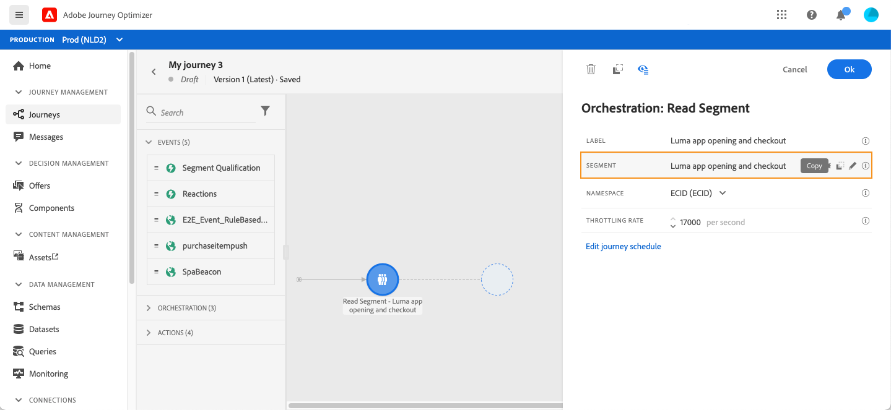
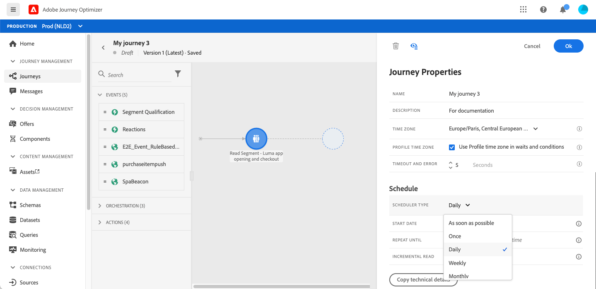
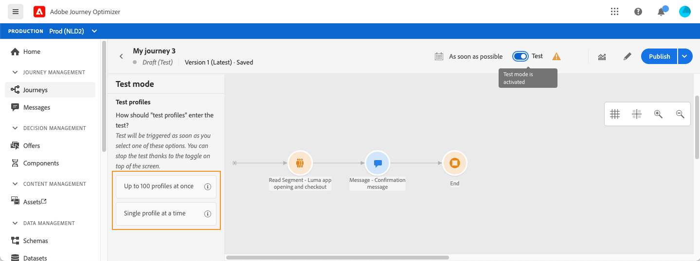
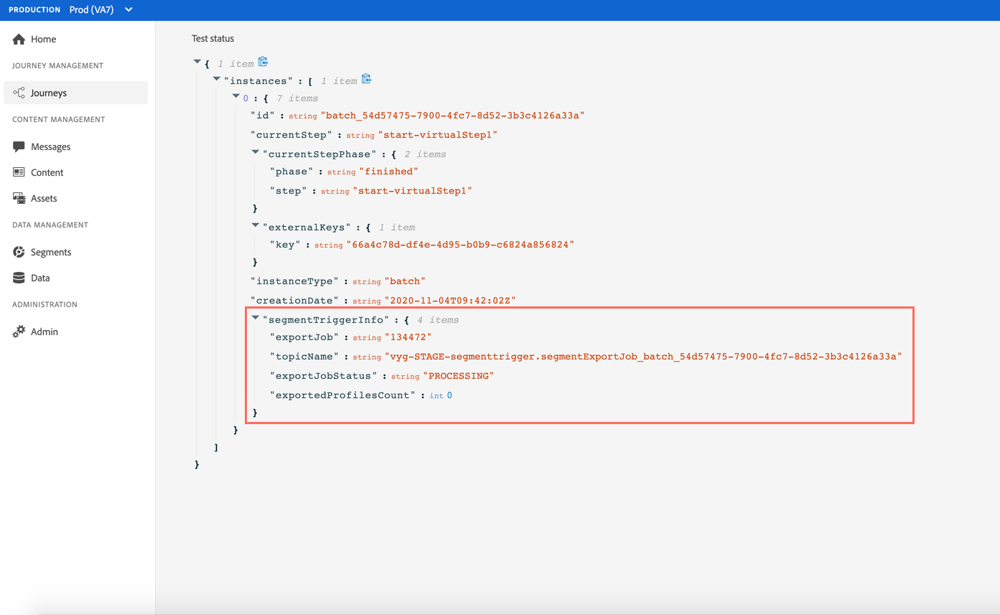

# 在歷程中使用區段 {#segment-trigger-activity}

## 關於讀取區段活動 {#about-segment-trigger-actvitiy}

「讀取區段」活動可讓您讓屬於Adobe Experience Platform區段的所有個人進入歷程。 進入歷程可以執行一次，也可以定期執行。

以[建立區段](../segment/about-segments.md)使用案例中建立的「Luma應用程式開啟和結帳」區段為例。 透過「讀取區段」活動，您可以讓屬於此區段的所有個人進入歷程，並讓他們流入將運用所有歷程功能的個別歷程：條件、計時器、事件、動作。

>[!NOTE]
>
>Burst付費附加元件允許以大流量發送非常快速的推送訊息，用於包含讀取區段和簡單推送訊息的簡單歷程。 如需詳細資訊，請參閱[此區段](../building-journeys/journey-gs.md#burst)

### 設定活動 {#configuring-segment-trigger-activity}

設定「讀取區段」活動的步驟如下：

1. 展開&#x200B;**[!UICONTROL Orchestration]**&#x200B;類別，並將&#x200B;**[!UICONTROL Read Segment]**&#x200B;活動拖曳至畫布中。

   活動必須定位為歷程的第一步。

1. 將&#x200B;**[!UICONTROL Label]**&#x200B;新增至活動（選用）。

1. 在&#x200B;**[!UICONTROL Segment]**&#x200B;欄位中，選擇將進入歷程的Adobe Experience Platform區段，然後按一下&#x200B;**[!UICONTROL Save]**。

   請注意，您可以自訂清單中顯示的欄，並加以排序。

   >[!NOTE]
   >
   >只有具有&#x200B;**Remailed**&#x200B;和&#x200B;**Existing**&#x200B;區段參與狀態的個人才會進入歷程。 如需如何評估區段的詳細資訊，請參閱[分段服務檔案](https://experienceleague.adobe.com/docs/experience-platform/segmentation/tutorials/evaluate-a-segment.html?lang=en#interpret-segment-results)。

   

   新增區段後， **[!UICONTROL Copy]**&#x200B;按鈕可讓您複製其名稱和ID:

   `{"name":"Luma app opening and checkout",”id":"8597c5dc-70e3-4b05-8fb9-7e938f5c07a3"}`

   

1. 在&#x200B;**[!UICONTROL Namespace]**&#x200B;欄位中，選擇要用於識別個人的命名空間。 [深入了解命名空間](../event/about-creating.md#select-the-namespace)。

   >[!NOTE]
   >
   >屬於某區段的個人若未在其不同身分之間選取身分（命名空間），便無法進入歷程。

1. **[!UICONTROL Read Segment]**&#x200B;活動可讓您指定區段進入歷程的時間。 若要這麼做，請按一下&#x200B;**[!UICONTROL Edit journey schedule]**&#x200B;連結以存取歷程的屬性，然後設定&#x200B;**[!UICONTROL Scheduler type]**&#x200B;欄位。

   

   依預設，區段會輸入歷程&#x200B;**[!UICONTROL As soon as possible]**。 如果您想讓區段以特定日期/時間或循環基準輸入歷程，請從清單中選取所需值。

   >[!NOTE]
   >
   >請注意，**[!UICONTROL Schedule]**&#x200B;區段僅在&#x200B;**[!UICONTROL Read Segment]**&#x200B;活動拖放至畫布時才可用。

   

### 測試並發佈歷程 {#testing-publishing}

**[!UICONTROL Read Segment]**&#x200B;活動可讓您在單一設定檔上，或在100個隨機測試從符合區段資格的設定檔中選取的設定檔上測試歷程。

要執行此操作，請啟動測試模式，然後從左窗格中選取所需選項。

然後，您可以照常設定及執行測試模式。 [了解如何測試歷程](testing-the-journey.md)。

測試執行後， **[!UICONTROL Show logs]**&#x200B;按鈕可讓您根據所選的測試選項查看測試結果：

* **[!UICONTROL Single profile at a time]**:測試日誌顯示與使用統一測試模式時相同的資訊。有關詳細資訊，請參閱[此部分](testing-the-journey.md#viewing_logs)

* **[!UICONTROL Up to 100 profiles at once]**:測試記錄可讓您追蹤從Adobe Experience Platform匯出的區段進度，以及所有進入歷程之人員的個別進度。

   請注意，一次使用最多100個設定檔來測試歷程，不允許您使用視覺流程來追蹤歷程中個人的進度。

   

測試成功後，您就可以發佈歷程（請參閱[發佈歷程](publishing-the-journey.md)）。 屬於區段的個人會在歷程的屬性&#x200B;**[!UICONTROL Scheduler]**&#x200B;區段中指定的日期/時間進入歷程。

>[!NOTE]
>
>對於循環性區段型歷程，一旦執行最後一次出現，歷程就會自動關閉。 如果未指定結束日期/時間，您必須手動關閉歷程至新入口，才能結束歷程。

## 區段型歷程中的受眾鎖定

以區段為基礎的歷程一律以&#x200B;**讀取區段**&#x200B;活動開頭，以擷取屬於Adobe Experience Platform區段的個人。

屬於區段的對象會定期擷取一次。

進入歷程後，您可以建立受眾協調使用案例，讓個人從初始區段流入歷程的不同分支。

**區段**

您可以使用條件來使用&#x200B;**Condition**&#x200B;活動執行分段。 例如，您可以讓VIP人員採取特定路徑，而非VIP流程進入其他路徑。

區段可以根據：

* 資料來源資料
* 歷程資料中事件部分的內容，例如：有人點擊了她一小時前收到的資訊嗎？
* 日期，例如：我們是在六月，一個人經歷這段旅程嗎？
* 例如，某次：是否是早上的時區？
* 根據百分比分割歷程中流動的受眾的演算法，例如：90% - 10%以排除控制組

**排除**

用於分段的相同&#x200B;**Condition**&#x200B;活動（請參閱上文）也可讓您排除部分母體。 例如，您可以排除VIP人員，方法是讓他們流入分支中，緊接在後面有結束步驟。

此排除可能會在區段擷取後、為了母體計數目的或沿著多步驟歷程進行。

**Union**

歷程可讓您建立N個分支，並在細分後將其連結在一起。

因此，您可以讓兩個對象回到共同體驗。

例如，在歷程的10天期間追蹤不同體驗之後，VIP和非VIP客戶可以返回相同的路徑。

聯合之後，您可以執行區段或排除來再次分割對象。

