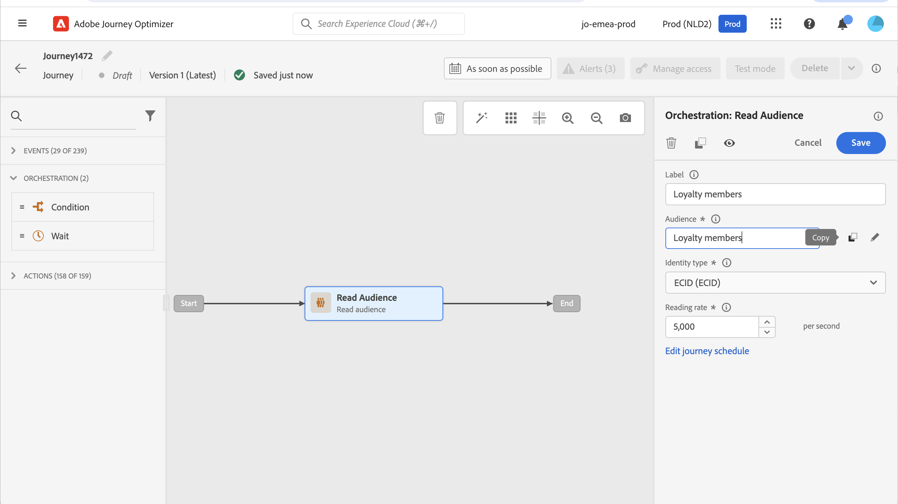

# 在歷程中使用區段 {#segment-trigger-activity}

## 新增讀取區段活動 {#about-segment-trigger-actvitiy}

>[!CONTEXTUALHELP]
>id="ajo_journey_read_segment"
>title="閱讀區段活動"
>abstract="「讀取區段」活動可讓您讓屬於Adobe Experience Platform區段的所有個人進入歷程。 進入歷程可以執行一次，也可以定期執行。"

使用 **讀取區段** 活動，讓區段的所有個人進入歷程。 進入歷程可以執行一次，也可以定期執行。

以中建立的「Luma應用程式開啟和結帳」區段為例 [建立區段](../segment/about-segments.md) 使用案例。 透過「讀取區段」活動，您可以讓屬於此區段的所有個人進入歷程，並讓他們流入將運用所有歷程功能的個別歷程：條件、計時器、事件、動作。

>[!NOTE]
>
>若為使用讀取區段活動的歷程，則有最多可同時開始的歷程次數。 系統將執行重試，但請避免在完全同時開始的五個歷程（具有讀取區段、排程或「盡快」），方法是隨著時間分散，例如5到10分鐘。
>
>從讀取區段、區段資格或業務事件活動開始的歷程中，無法使用體驗事件欄位群組。

### 設定活動 {#configuring-segment-trigger-activity}

設定「讀取區段」活動的步驟如下：

1. 展開 **[!UICONTROL 協調]** 類別和拖放 **[!UICONTROL 讀取區段]** 活動進入您的畫布。

   活動必須定位為歷程的第一步。

1. 新增 **[!UICONTROL 標籤]** 至活動（選用）。

1. 在 **[!UICONTROL 區段]** 欄位中，選擇要輸入歷程的Adobe Experience Platform區段，然後按一下 **[!UICONTROL 儲存]**.

   請注意，您可以自訂清單中顯示的欄，並加以排序。

   >[!NOTE]
   >
   >只有 **已實現** 和 **現有** 區段參與率狀態會進入歷程。 如需如何評估區段的詳細資訊，請參閱 [區段服務檔案](https://experienceleague.adobe.com/docs/experience-platform/segmentation/tutorials/evaluate-a-segment.html#interpret-segment-results){target=&quot;_blank&quot;}。

   

   新增區段後， **[!UICONTROL 複製]** 按鈕可讓您複製其名稱和ID:

   `{"name":"Luma app opening and checkout",”id":"8597c5dc-70e3-4b05-8fb9-7e938f5c07a3"}`

   

1. 在 **[!UICONTROL 命名空間]** 欄位中，選擇要用來識別個人的命名空間。 [進一步了解命名空間](../event/about-creating.md#select-the-namespace).

   >[!NOTE]
   >
   >屬於某區段的個人若未在其不同身分之間選取身分（命名空間），便無法進入歷程。

1. 設定 **[!UICONTROL 節流率]** 欄位至讀取區段活動的輸送量限制。

   此值會儲存在歷程版本裝載中。 預設值為每秒20,000條訊息。 您可以將此值從每秒500條修改為20,000條訊息。

   >[!NOTE]
   >
   >每個沙箱的整體節流速率設為每秒20,000條訊息。 因此，在同一沙箱中同時執行的所有讀取區段的限制速率每秒最多可達20,000則訊息。 不能修改此大寫。

1. 此 **[!UICONTROL 讀取區段]** 活動可讓您指定區段進入歷程的時間。 若要這麼做，請按一下 **[!UICONTROL 編輯歷程排程]** 連結以存取歷程的屬性，然後設定 **[!UICONTROL 排程器類型]** 欄位。

   

   依預設，區段會輸入歷程 **[!UICONTROL 盡快]**. 如果您想讓區段以特定日期/時間或循環基準輸入歷程，請從清單中選取所需的值。

   >[!NOTE]
   >
   >請注意， **[!UICONTROL 排程]** 區段僅在 **[!UICONTROL 讀取區段]** 活動已拖放至畫布中。

   

   **增量讀取** 選項：當具有循環的歷程 **讀取區段** 首次執行時，區段中的所有設定檔都會進入歷程。 在下一個發生次數中，所有設定檔會再次進入歷程，即使它們已在內部亦然。 歷程中設定檔的舊例項會停止，並建立新例項。 此 **增量讀取** 選項可讓您在首次發生後，定位自上次執行歷程以來進入區段的個人。

<!--

### Segment filters {#segment-filters}

[!CONTEXTUALHELP]
>id="jo_segment_filters"
>title="About segment filters"
>abstract="You can choose to target only the individuals who entered or exited a specific segment during a specific time window. For example, you can decide to only retrieve all the customers who entered the VIP segment since last week."

You can choose to target only the individuals who entered or exited a specific segment during a specific time window. For example, you can decide to only retrieve all the customers who entered the VIP segment since last week. Only the new VIP customers will be targeted. All the customers who were already part of the VIP segment before will be excluded.

To activate this mode, click the **Segment Filters** toggle. Two fields are displayed:

**Segment membership**: choose whether you want to listen to segment entrances or exits. 

**Lookback window**: define when you want to start to listen to entrances or exits. This lookback window is expressed in hours, starting from the moment the journey is triggered.  If you set this duration to 0, the journey will target all members of the segment. For recurring journeys, it will take into account all entrances/exits since the last time the journey was triggered.

-->

>[!NOTE]
>
>單次讀取區段歷程在歷程執行後30天移至已完成狀態。 對於已排程的讀取區段，是在上次執行該事件後的 30 天。 
>
>當重複讀取區段歷程中使用等待活動時，您必須小心，因為此類歷程的有效期限會到下次執行為止。 這表示如果歷程每日執行，則今天開始的歷程例項將持續到明天執行。 例如，如果您新增在該歷程中等候2天，則無論設定檔是否在下一個執行對象中，設定檔一律會在下一個歷程執行時移動（所以是在後一天）。 設定檔將無法在該歷程中停留2天。

### 測試並發佈歷程 {#testing-publishing}

此 **[!UICONTROL 讀取區段]** 活動可讓您在單一設定檔上，或在從符合區段資格的設定檔中隨機測試選取的設定檔上測試歷程。

要執行此操作，請啟動測試模式，然後從左窗格中選取所需選項。

然後，您可以照常設定及執行測試模式。 [了解如何測試歷程](testing-the-journey.md).

測試執行後， **[!UICONTROL 顯示日誌]** 按鈕可讓您根據所選測試選項查看測試結果：

* **[!UICONTROL 一次單一設定檔]**:測試日誌顯示與使用統一測試模式時相同的資訊。 有關詳細資訊，請參閱 [本節](testing-the-journey.md#viewing_logs)

* **[!UICONTROL 一次最多100個設定檔]**:測試記錄可讓您追蹤從Adobe Experience Platform匯出的區段進度，以及所有進入歷程之人員的個別進度。

   請注意，一次使用最多100個設定檔來測試歷程，不允許您使用視覺流程來追蹤歷程中個人的進度。

   

測試成功後，您就可以發佈歷程(請參閱 [發佈歷程](publishing-the-journey.md))。 屬於區段的個人會在歷程屬性中指定的日期/時間進入歷程 **[!UICONTROL 排程器]** 區段。

>[!NOTE]
>
>對於循環性區段型歷程，一旦執行最後一次出現，歷程就會自動關閉。 如果未指定結束日期/時間，您必須手動關閉歷程至新入口，才能結束歷程。

## 區段型歷程中的受眾鎖定

以區段為基礎的歷程一律以 **讀取區段** 擷取屬於Adobe Experience Platform區段之個人的活動。

屬於區段的對象會定期擷取一次。

進入歷程後，您可以建立受眾協調使用案例，讓個人從初始區段流入歷程的不同分支。

**區段**

您可以使用條件來執行分段，使用 **條件** 活動。 例如，您可以讓VIP人員採取特定路徑，而非VIP流程進入其他路徑。

區段可以根據：

* 資料來源資料
* 歷程資料中事件部分的內容，例如：有人點擊了一小時前收到的留言嗎？
* 日期，例如：我們是在六月，一個人經歷這段旅程嗎？
* 例如，某次：是否是早上的時區？
* 根據百分比分割歷程中流動的受眾的演算法，例如：90% - 10%以排除控制組

**排除**

相同 **條件** 用於分段的活動（請參閱上方）也可讓您排除部分母體。 例如，您可以排除VIP人員，方法是讓他們流入分支中，緊接在後面有結束步驟。

此排除可能會在區段擷取後、為了母體計數目的或沿著多步驟歷程進行。

**Union**

歷程可讓您建立N個分支，並在細分後將其連結在一起。

因此，您可以讓兩個對象回到共同體驗。

例如，在歷程的10天期間追蹤不同體驗後，VIP和非VIP客戶可以返回相同的路徑。

聯合之後，您可以執行區段或排除來再次分割對象。

