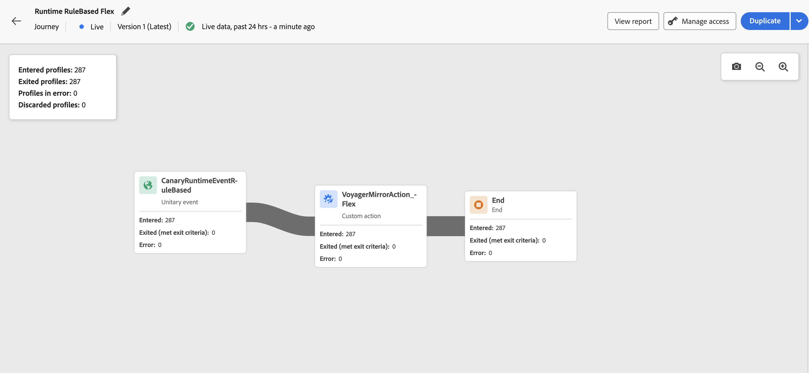

# 歷程畫布中的即時報告 {#report-journey}

>[!BEGINSHADEBOX]

**在此頁面上：**&#x200B;瞭解如何使用即時報告，直接在歷程畫布中監視過去24小時內的關鍵歷程量度。

>[!ENDSHADEBOX]

發佈您的歷程後，[試執行模式](journey-dry-run.md)啟動後，**即時報告**&#x200B;會直接在歷程畫布中提供過去24小時的量度。

>[!AVAILABILITY]
>
>如果您在歷程即時報告中看不到資料，則必須擴充存取許可權，以包含&#x200B;**[!UICONTROL 檢視歷程報告]**&#x200B;許可權。 [了解更多](../administration/permissions.md)

顯示的事件發生在過去24小時內，事件與其顯示之間至少間隔二分鐘，通常在五分鐘內。

對於您處於即時或[試執行模式](journey-dry-run.md)的歷程，您可以檢查：

* **[!UICONTROL 已進入設定檔]**：進入歷程的個人總數。
* **[!UICONTROL 已退出設定檔]**：已退出歷程的個人總數（包括錯誤）。
* **[!UICONTROL 發生錯誤的設定檔]**：歷程中發生錯誤的個人總數。
* **[!UICONTROL 捨棄的設定檔]**：由於下列其中一個原因而從歷程捨棄的個人總數：

   * 對於&#x200B;**對象資格**&#x200B;活動，如果對象資格的預期動詞與歷程已收到的動詞不符（例如，「已退出」而不是「已實現」），則可能會發生捨棄。
   * 對於&#x200B;**事件觸發的**&#x200B;歷程，如果個人太快嘗試重新進入歷程或不允許重新進入，則可能會發生捨棄。
   * 在&#x200B;**循環**&#x200B;歷程中，如果個人已在歷程中，且重新進入原則未設定為「強制重新進入」，則捨棄會計入每個循環。
   * 在&#x200B;**讀取對象**&#x200B;活動中，如果未設定匯出個人的身分，或是收到的身分名稱空間不符合歷程的預期身分名稱空間，則會發生捨棄。

對於處於即時或[試執行模式](journey-dry-run.md)的每個歷程中的每個活動，您都可以存取：

* **[!UICONTROL 已進入]**：進入此活動的個人總數。 對於&#x200B;**動作**&#x200B;活動，由於它們不是在練習模式中執行，因此此量度會指出通過的個人檔案。
* **[!UICONTROL 已退出（符合退出條件）]**：由於退出條件（包括錯誤），從該活動退出歷程的個人總數。
* **[!UICONTROL 已退出（強制退出）]**：由於歷程從業人員設定而暫停歷程時，已退出歷程的個人總數。 對於處於練習模式的歷程，此量度一律等於零。
* **[!UICONTROL 錯誤]**：在該活動中發生錯誤的個人總數。

## 疑難排解遺失的報表資料 {#troubleshooting-missing-data}

如果您的歷程報告中沒有看到預期的資料，請考慮下列事項：

* **歷程名稱同步**：確認[!DNL Adobe Journey Optimizer]中的歷程名稱符合儲存在報告資料集中的名稱。 這些名稱不符可能會妨礙報表資料正確顯示。

* **資料重新整理時間**：更新歷程名稱或設定後，請讓資料有足夠的時間重新整理。 報表資料通常會在幾分鐘內顯示，但在某些情況下可能需要更長的時間。

* **存取許可權**：確保您擁有檢視歷程報告的必要許可權。 如果您沒有看到任何資料，請洽詢您的管理員，確認您已啟用&#x200B;**[!UICONTROL 檢視歷程報告]**&#x200B;許可權。 [進一步瞭解許可權](../administration/permissions.md)

* **歷程狀態**：報告資料僅適用於在[試執行模式](journey-dry-run.md)中執行的已發佈歷程或歷程。 歷程草稿不會產生報告資料。

如果在驗證這些專案後問題仍然存在，請聯絡您的Adobe管理員或[Adobe支援](../start/user-interface.md#support-ticket-guidelines)以尋求協助。

>[!MORELIKETHIS]
>
>* [開始使用報告功能](../reports/gs-reports.md)
>* [發佈您的歷程](publish-journey.md)
>* [歷程練習](journey-dry-run.md)
>* [設定並追蹤您的歷程量度](success-metrics.md)
>* [自訂歷程報告](../reports/sharing-overview.md)

+++ AI知識參考

本節包含結構化知識，用於支援與本主題相關的解譯、擷取和問答。

如需完整瞭解，此資訊應結合本頁的檔案。 兩者皆非獨立來源；頁面說明功能，本節提供額外內容，以協助去除術語、意圖、適用性和限制條件的歧義。

* **TL；DR：**&#x200B;本頁說明如何檢視和解讀內嵌於歷程畫布中的即時報告，內容涵蓋在模擬執行模式中發佈歷程與歷程可用的關鍵設定檔流量量度。

**意圖：**
* 直接在歷程畫布中檢視即時歷程績效量度
* 解譯歷程和每個活動的已輸入、已退出、錯誤和已捨棄設定檔計數
* 瞭解為何從歷程捨棄設定檔
* 疑難排解歷程即時報告中的資料遺失或意外狀況
* 驗證存取歷程即時報告所需的許可權

**字彙表：**
* **即時報告**：直接顯示在歷程畫布上的即時量度，涵蓋過去24小時&#x200B;*（產品特定）*
* **試執行模式**：模擬歷程而不傳送真正訊息的歷程執行模式，其中也可使用即時報告&#x200B;*（產品特定）*
* **捨棄的設定檔**：嘗試進入歷程的設定檔，但由於資格不符、重新進入限制或身分問題而被拒絕&#x200B;*（產品特定）*
* **已退出（強制退出）**：歷程從業人員暫停時從歷程移除的設定檔；在練習模式&#x200B;*（產品專屬）*&#x200B;中一律為零

**護欄：**
* 即時報告資料僅涵蓋過去24小時。
* 事件顯示的間隔最少為兩分鐘，通常在五分鐘內。
* 必須有「檢視歷程」報表許可權才能檢視即時報表資料。
* 報告資料僅適用於已發佈的歷程或處於模擬執行模式的歷程；草稿歷程不會產生任何資料。
* 對於「動作」活動，「已輸入」量度會顯示在「練習」模式中通過（未執行）的設定檔。
* 「已退出（強制退出）」量度在「練習」模式中一律為零。

**術語：**
* 正式名稱：即時報告（歷程畫布） — 首字母縮寫：none — 變體：歷程即時報告，畫布內報告
* 同義字：「進入的設定檔」=「進入歷程的設定檔」
* 請勿混淆：「即時報告」≠「歷程全域報告」（即時報告是畫布中的最後24小時；全域報告在報告UI中涵蓋更廣的歷史時間範圍）

**常見問題集：**
* **問：即時報表中顯示的資料目前如何？**  — 會顯示過去24小時的事件，延遲時間最低為2分鐘，通常在5分鐘內。
* **問：為什麼在歷程即時報告中看不到任何資料？**  — 檢查您是否有檢視歷程報告許可權、歷程是否已發佈（非草稿），以及歷程名稱是否與報告資料集中的名稱相符。
* **問：導致設定檔被捨棄的原因是什麼？**  — 由於對象資格動詞不匹配、循環或事件觸發的歷程違反重新進入策略，或讀取對象活動上缺少/不匹配的身分名稱空間，可能會發生捨棄。
* **問：即時報告是否可在試執行模式期間使用？**  — 是；即時報告可用於已發佈的即時歷程和在練習模式下執行的歷程。
* **問：進入的量度對試執行模式中的「動作」活動有何意義？**  — 它表示通過活動的設定檔，因為動作實際上並非在練習模式中執行。

+++
