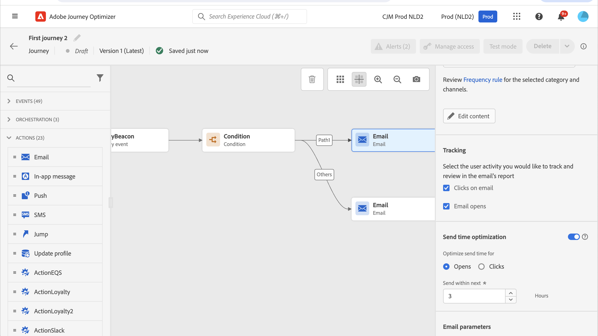
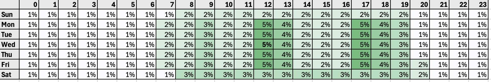
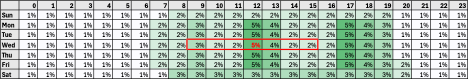

# 傳送時間最佳化{#send-time-optimization}

>[!CONTEXTUALHELP]
>id="jo_bestsendtime_disabled"
>title="關於傳送時間最佳化"
>abstract="Adobe Journey Optimizer 的傳送時間最佳化功能由 Adobe 的 AI 服務提供支援，可以預測傳送電子郵件或推播訊息的最佳時間，以根據歷史開啟率和點擊率將參與度提高至最大限度。"

>[!CONTEXTUALHELP]
>id="jo_bestsendtime_email"
>title="啟動傳送時間最佳化"
>abstract="透過選取適當的選項按鈕來選擇要將電子郵件開啟還是電子郵件點進最佳化。您還可以在「傳送時間在未來」輸入值，來涵蓋系統使用的時間區段。"

>[!CONTEXTUALHELP]
>id="jo_bestsendtime_push"
>title="啟動傳送時間最佳化"
>abstract="推播訊息預設為開啟選項，因為點擊不適用於推播訊息。您還可以在「傳送時間在未來」輸入值，來涵蓋系統使用的時間區段。"

Adobe Journey Optimizer的傳送時間最佳化功能採用Adobe的Journey AI服務，可根據客戶的歷史開啟和點按行為，選擇最佳的電子郵件和推播訊息傳送時間，以最大化客戶參與度。

傳送時間最佳化僅適用於Journey Optimizer的內建電子郵件和推播動作型別，目前不適用於透過自訂動作傳送的訊息或其他動作型別。 傳送時間最佳化僅適用於歷程中的電子郵件和推播動作，目前不適用於透過行銷活動傳送的訊息。

>[!AVAILABILITY]
>
>* Adobe Journey Optimizer客戶提出要求時，便會啟用傳送時間最佳化功能。 請聯絡 Adobe 客戶服務，或是您的 Adobe 代表，為貴組織啟用這項功能。
>
>* 傳送時間最佳化僅適用於&#x200B;**電子郵件**&#x200B;和&#x200B;**推播通知**&#x200B;頻道。
>

## 使用傳送時間最佳化{#use-send-time-optimization}

從動作引數開啟傳送時間最佳化引數，對電子郵件或推播動作使用傳送時間最佳化。

電子郵件通道設定中的

「傳送時間最佳化」不應用於緊急且有時效性的作業訊息，例如，訂單確認、密碼重設通知或航班閘道變更通知。 傳送時間最佳化最適合用於不太緊急的行銷通訊，例如，每週廣告、新產品的促銷資訊，或長達一個月的銷售資訊。

針對電子郵件訊息，選取適當的選項按鈕，以選擇最佳化電子郵件開啟次數或電子郵件點進次數。 推送訊息一律會針對開啟次數最佳化。

>[!TIP]
>
>為了獲得最佳結果，大部分的電子郵件訊息都應該針對點按次數最佳化。 如果您的電子郵件訊息本質上僅供參考，且並非直接用於推動動作，請選擇最佳化開啟。

針對電子郵件和推播訊息，設定「在下個時段內傳送」選項的值，選擇系統在傳送訊息之前等待的最大小時數。 您可以選擇1到168小時的值。

>[!TIP]
>
>為了獲得最佳結果，請選擇介於6到24小時之間的最長等待時間。 為最長等待時間選擇較低的值可減少可用的傳送時間，因此可能會減少傳送時間最佳化的潛在值。 若為最長等待時間選擇較高的值，可能導致訊息在傳送時過期或不相關。

當您的歷程已啟用且客戶達到歷程中的電子郵件或推播動作時，傳送時間最佳化將在您的指定限制內，選擇每個使用者的最佳預測傳送時間。

## 傳送時間最佳化的運作方式 {#how-send-time}

傳送時間最佳化模型會擷取您組織的Adobe Journey Optimizer客戶行為資料，並檢視使用者層級的開啟和點按事件，以判斷客戶何時最有可能參與您的傳訊。

傳送時間最佳化會根據三種行為資料，針對每位使用者預測一週中的每一小時：

1. 使用者的整體行為
1. 相同時區中相似使用者的行為
1. 該個別使用者的行為

這些預測會使用貝葉斯方法進行加權和組合，針對每個客戶產生每個量度（電子郵件開啟、電子郵件點按和推播開啟）的「熱度圖」，其指出每週聯絡該使用者最可能且最不可能導致所需參與結果（開啟/點按）的時數，如下例熱度圖所示：

如果在星期三上午9點，且開啟傳送時間最佳化且等待時間上限為7小時的情況下，將具有上述預測概率的使用者設為目標，則訊息的選定傳送時間將會是晚上12點：

## 傳送時間最佳化模型訓練和評分詳細資料  {#model-send-time}

為您的組織啟用傳送時間最佳化功能後，系統會針對過去16週您組織的所有歷程和動作，以電子郵件和推播傳送、開啟和點按事件來訓練Journey AI模型，不論這些動作是否使用傳送時間最佳化。 這可讓傳送時間最佳化受益於客戶產生的所有資料。

模型最初會接受培訓，並每週評分。 16週後，模型會每月重新訓練並重新掃描。 模型評分包括所有客戶設定檔 — 自上次評分執行以來，既有且新的。

「傳送時間最佳化」傳送的訊息會收到「探索」訊息傳送時間（選取以測試不同傳送時間並觀察客戶回應方式），或是「最佳化」訊息傳送時間（選取以最大化點按/開啟率）。 5%的傳送事件會收到「探索」傳送時間，而95%的傳送事件已「最佳化」。

探索傳送時間是從傳送時間中隨機選取，而該傳送時間可由您設定的最長等待時間提供。 例如，如果在星期三上午9點選取訊息，並開啟傳送時間最佳化且等待時間上限3小時，則訊息的Exploration傳送時間將平均分割為上午9點、上午10點、上午11點與下午12點。

## 常見問題 {#faq-send-time}

您可以在下方找到有關傳送時間最佳化的常見問題。

需要更多詳細資料？使用此頁面底部的意見回饋選項來提出您的問題，或與 [Adobe Journey Optimizer 社群](https://experienceleaguecommunities.adobe.com/t5/adobe-journey-optimizer/ct-p/journey-optimizer?profile.language=en){target="_blank"}聯絡。

+++使用傳送時間最佳化前需要等候多久？

貴組織應先在Journey Optimizer中使用「電子郵件」動作，至少30天後再在電子郵件中使用「傳送時間最佳化」 ，以收集一些電子郵件傳送、開啟和點按事件。

貴組織應先在Journey Optimizer內使用「推播」動作30天以上，再使用「推播」內的「傳送時間最佳化」來允許收集某些推播傳送和開啟事件。

如果您的組織已使用電子郵件及/或推播動作型別至少30天，則貴組織在Adobe啟用傳送時間最佳化後，不需要等候更久即可使用。 隨著您的組織收集資料長達16週，結果將會持續改善。

+++

+++我如何檢視特定使用者將在此收到訊息的傳送時間？

為了將模型對設定檔豐富度的影響降至最低，模型分數會壓縮儲存在`_experience.intelligentServices.journeyAI.sendTimeOptimization`中儲存的3個設定檔屬性中，且並非設計為人類看得懂的。

+++

+++傳送時間最佳化的平均效益為何？

傳送時間最佳化可在組織最佳化的所有郵件中，提高電子郵件點按率和推播開啟率，幅度約為2%至10%。

例如，如果組織傳送電子郵件時未將傳送時間最佳化，則平均點按率為5.0%，而同一組具有傳送時間最佳化的電子郵件平均可產生高達5.5%的點按率(5.0% * (1+10%) = 5.5%)。

由於小型樣本大小中的可變性，在傳送單一訊息時，可能無法觀察到傳送時間最佳化的好處。

組織在以下情況下更有可能從使用傳送時間最佳化中獲得更大的好處：

* 現有歷程使用的傳送時間是固定的且未妥善最佳化
* 客戶行為的可變性（點按和開啟）會對應至客戶地點和客戶偏好設定
* 組織對大部分電子郵件和推播訊息使用傳送時間最佳化
* 組織選擇建議的6-12小時範圍內的最大等待時間

+++

+++我總是會在中午12點按電子郵件或推送訊息，為什麼演演算法沒有在下午12點傳送訊息給我？

發生此問題的原因有多種：

* 您的訊息已選取為「探索」訊息傳送時間，而非「最佳化」訊息傳送時間。
* 相似使用者的行為影響了模型以建議另一個傳送時間。

+++

+++傳送時間最佳化如何知道使用者的時區？

傳送時間最佳化使用`timeZone`設定檔欄位來決定使用者的時區。 如果無法供該使用者使用，「傳送時間最佳化」會嘗試從使用者設定檔中的其他地理資訊（例如國家/地區和州）推斷使用者的時區。

+++

+++傳送時間最佳化是否會在使用者當地時區的夜間將推送訊息傳送給使用者？

傳送時間最佳化可在下列情況下，於使用者當地時區的夜間將推播訊息傳送給使用者：

* 當使用者表現出行為表示他們很可能會與夜間傳送的訊息互動時
* 模型選擇「探索」傳送時間時

為避免在夜間時段向客戶傳送推播訊息，請排程批次推播訊息傳送以在早上或午後發生，並選擇較短的持續時間以進行傳送時間最佳化。 （例如，上午9點的傳送時間與最長8小時的等候時間。）

+++

