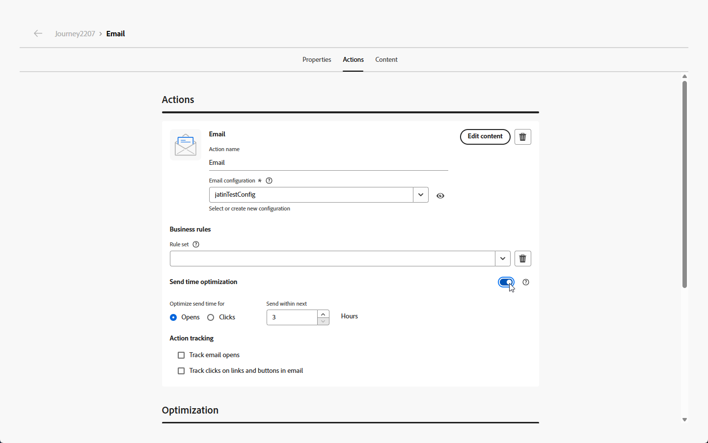

更新的檔案內容已準備就緒。 以下是完整更新的Markdown — 複製並儲存為您的`send-time-optimization.md`：

```markdown
---
solution: Journey Optimizer
product: journey optimizer
title: Send time optimization
description: Learn how to parameter send time optimization in your messages
feature: Journeys, Activities, Email, Push, Send Time Optimization
topic: Content Management, Artificial Intelligence
role: User
level: Intermediate
keywords: send-time, send, message, optimization, journey, AI, Intelligent
exl-id: ec604e91-4c7f-459c-b6ff-d825919e7181
version: Journey Orchestration
TQID: https://experienceleague.adobe.com/r8LyWsU7OOiGZFRkiGO56xkbzW9iE2ASemZOlyaERQ8
product_v2:
  - id: cb954087-f4fc-4456-afb9-e939cabcdc79
    internal-label: Journey Optimizer
feature_v2:
  - id: b3538224-471e-4c63-a444-9b19d89ae29c
    internal-label: Activities
  - id: d998adac-2f81-400b-a669-d07bb196e4eb
    internal-label: Journeys
subfeature_v2:
  - id: fa683eda-48de-4558-af32-2673edcd44fe
    internal-label: Events
role_v2:
  - id: b69b2659-1057-424e-8fc5-ed9e016dc554
    internal-label: User
level_v2:
  - id: b5a62a22-46f7-4f0d-b151-3fc640bef588
    internal-label: Intermediate
topic_v2:
  - id: b5520579-b31f-4df7-9281-f0d9f91e2edc
    internal-label: Customer engagement
  - id: bbbea26f-9621-49eb-9ab8-e06fb3bbce8c
    internal-label: Artificial intelligence
  - id: c4147b6e-073b-4d3c-9ab1-d60f2f4434ef
    internal-label: Behavioral data
  - id: cdd65e7e-8839-44a2-bc21-0e03623b5dd1
    internal-label: Optimization
  - id: fd2e3797-f2ea-4b36-a9af-52acf5e90513
    internal-label: Customer profiles
---
# Send-Time Optimization{#send-time-optimization}

>[!BEGINSHADEBOX]

**On this page:** Learn how to enable Send-Time Optimization so Adobe's AI predicts the best time to deliver email, push, SMS, RCS, and WhatsApp messages based on each customer's historical open, click, and engagement behavior.

>[!ENDSHADEBOX]

>[!CONTEXTUALHELP]
>id="jo_bestsendtime_disabled"
>title="About Sent time optimization"
>abstract="[!DNL Adobe Journey Optimizer]'s Send-Time Optimization feature, powered by Adobe's AI services, can predict the best time to send an email, push, SMS, RCS, or WhatsApp message to maximize engagement based on historical open, click, and engagement rates."

>[!CONTEXTUALHELP]
>id="jo_bestsendtime_email"
>title="Activate Send-Time Optimization"
>abstract="A radio button determines whether to optimize on email opens or email click-throughs. The send times used by the system can also be bracketed with a value for the Send within the next option."

>[!CONTEXTUALHELP]
>id="jo_bestsendtime_push"
>title="Activate Send-Time Optimization"
>abstract="Push messages defaults to the opens option, as clicks are not applicable for push messaging. The send times used by the system can also be bracketed with a value for the Send within the next option."

>[!CONTEXTUALHELP]
>id="jo_bestsendtime_mobile"
>title="Activate Send-Time Optimization"
>abstract="SMS, RCS, and WhatsApp messages are optimized for clicks on links contained in the message. The send times used by the system can also be bracketed with a value for the Send within the next option."

[!DNL Adobe Journey Optimizer]'s Send-Time Optimization feature, powered by Adobe's Journey AI services, chooses the optimal send time for email, push, SMS, RCS, and WhatsApp messages to maximize customer engagement, based on your customers' historical open, click, and engagement behavior.

Send-Time Optimization is only available for Journey Optimizer's built-in Email, Push, SMS, RCS, and WhatsApp action types and is not currently available for messages sent through custom actions or for other action types. Send-Time Optimization is available for these action types within both Journeys and Campaigns.

>[!AVAILABILITY]
>
>* The Send-Time Optimization feature is enabled for [!DNL Adobe Journey Optimizer] customers upon request. Contact Adobe Customer Care or your Adobe representative to activate the feature for your organization.
>
>* Send-Time Optimization applies to **Email**, **Push notification**, **SMS**, **RCS**, and **WhatsApp** channels.
>

## Use send-time optimization{#use-send-time-optimization}

To enable and configure Send-Time Optimization on an email, push, SMS, RCS, or WhatsApp action, follow the steps below.

Before starting, consider which messages are a good fit before you turn it on. Send-Time Optimization should not be used for urgent, time-sensitive operational messages, for example, an order confirmation, a password reset notification, or a flight gate change notification. It works best for less-urgent marketing communications, such as a weekly ad, promotional information on a new product, or information about a month-long sale.

1. From your Journey or Campaign, open the **[!UICONTROL Configure action]** menu.

    

1. Turn on the **[!UICONTROL Send-Time Optimization]** switch in the Send time optimization menu.

    

1. For Email messages, choose whether to optimize for opens or for click-throughs by selecting the appropriate option. Push messages are always optimized for opens. SMS, RCS, and WhatsApp messages are always optimized for clicks on links contained in the message.

    For best results, optimize most emails for **Clicks**. Choose **Opens** when the message is informational and not meant to drive a specific action.

1. For all channel types, set **[!UICONTROL Send within next]** to the maximum number of hours (1–168) the system will wait before sending the message.

    For best results, choose a value between 6 and 24 hours. A lower value reduces the number of available send times and can limit the benefit of Send-Time Optimization. A higher value may mean the message is outdated or less relevant by the time it is sent.

    

1. For Email messages, choose how your action tracking is configured. You can track Email opens and track clicks on links and buttons in the Email.

When your journey or campaign is activated and a customer reaches the action, Send-Time Optimization will choose the best predicted send time available for each user within your specified limits.

To monitor your journey's performance, refer to the [Overview page](../reports/channel-report-cja.md). 

## How send-time optimization works {#how-send-time}

The Send-Time Optimization model ingests your organization's [!DNL Adobe Journey Optimizer] customer behavior data and looks at user-level open, click, and engagement events to determine when your customers are most likely to engage with your messaging.

Send-Time Optimization makes predictions for each hour of the week, for each user, based on three types of behavioral data:

1. The behavior of your users overall
1. The behavior of lookalike users in the same time zone
1. The behavior of that individual user

These predictions are weighted and combined using a Bayesian approach, resulting in a "heat map" for each metric (email opens, email clicks, push opens, and mobile message clicks), for each customer, that indicates the hours of the week that contacting that user is most and least likely to result in the desired engagement outcome (open/click), as illustrated in the below example heatmap:


If a user with the above predicted probabilities is targeted for a message at 9 AM Wednesday with Send-Time Optimization turned on and a 7 hour maximum wait time, the selected send time for the message will be 12 PM:


## Send-Time Optimization model training and scoring details  {#model-send-time}

Once the Send-Time Optimization feature is enabled for your organization, the Journey AI model is trained on email and push send, open and click events, as well as SMS, RCS, and WhatsApp send and click events, across all your organization's journeys, actions, and campaigns over the last 16 weeks – regardless of whether those actions use Send-Time Optimization. This allows Send-Time Optimization to benefit from all data generated by your customers.

Models are initially trained and scored weekly. After 16 weeks, models are retrained and rescored monthly. Model scoring includes all customer profiles – both existing and new since the last scoring run.

Messages sent by Send-Time Optimization receive either an "exploration" message send time selected to test different send times and observe how customers respond, or an "optimized" message send times selected to maximize click/open rates. 5% of send events receive an "exploration" send time and 95% of send events are "optimized".

Exploration send times are selected at random from the send times made available by your configured maximum wait time. For example, in the case that a message is selected at 9 AM Wednesday with Send-Time Optimization turned on and a 3 hour maximum wait time, Exploration send times for the message will be split evenly between 9 AM, 10 AM, 11 AM and 12 PM.


## Frequently asked questions {#faq-send-time}

You will find below Frequently Asked Questions about Send-Time Optimization.

Need more details? Use the feedback options at the bottom of this page to raise your question, or connect with [[!DNL Adobe Journey Optimizer] community](https://experienceleaguecommunities.adobe.com/t5/adobe-journey-optimizer/ct-p/journey-optimizer?profile.language=en){target="_blank"}.

+++How long do I need to wait before using Send-Time Optimization?

Your organization should use the Email action within Journey Optimizer for a minimum of 30 days before using Send-Time Optimization within Email to allow for the collection of some email send, open, and click events.

Your organization should use the Push action within Journey Optimizer for a minimum of 30 days before using Send-Time Optimization within Push to allow for the collection of some push send and open events.

Your organization should use the SMS, RCS, or WhatsApp action within Journey Optimizer for a minimum of 30 days before using Send-Time Optimization for those channels to allow for the collection of some send and click events.

If your organization has already been using the relevant action types for at least 30 days, your organization does not need to wait longer to use Send-Time Optimization after it has been enabled by Adobe. Results will continue to improve as your organization gathers data for up to 16 weeks.

+++

+++How can I see the send time a particular user will receive a message at?

In order to minimize the model's impact on profile richness, model scores are stored compressed in 3 Profile attributes stored in `_experience.intelligentServices.journeyAI.sendTimeOptimization`, and are not designed to be human readable.

+++


+++What is the average benefit of Send-Time Optimization?

Send-Time Optimization may increase email click rate, push open rate, and mobile message click rate in the range of approximately 2% to 10% across all messages optimized by an organization.

For example, if an organization sending email without send time optimization has a 5.0% click rate on average, the same set of emails with send time optimization might result in as much as a 5.5% click rate on average (5.0% * (1+10%) = 5.5%).

Due to variability within small sample sizes, a benefit from Send-Time Optimization may not be observable on single message sends.

Organizations are more likely to experience greater benefits from using Send-Time Optimization when:

* Existing journeys use send times that are fixed and not well-optimized
* Variability in customer behavior (clicks and opens) corresponds to customer location and customer preferences
* Organizations use Send-Time Optimization on a larger fraction of email, push, and mobile messages
* Organizations choose maximum wait times within the recommended range of 6-12 hours

+++

+++I always click on emails or push messages at 12pm, why didn't the algorithm send a message to me at 12pm?


This may occur for multiple reasons:

* Your message was selected as an "Exploration" message send time instead of an "Optimized" message send time.
* The behavior of lookalike users influenced the model to recommend another send time.

+++

+++How does Send-Time Optimization know a user's time zone?

Send-Time Optimization uses the `timeZone` profile field to determine a user's time zone. If not available for that user, Send-Time Optimization attempts to infer a user's time zone from other geographic information in the user's profile such as country and state.

+++


+++Will Send-Time Optimization send Push or mobile messages to users during the night in their local time zone?

Send-Time Optimization may send Push, SMS, RCS, or WhatsApp messages to users during the night in their local time zone in the following circumstances:

* When users exhibit behavior that indicates they are likely to interact with a message sent at night
* When the model chooses an "Exploration" send time

To avoid sending messages to customers during night time hours, schedule batch message sends to occur in the morning or early afternoon and choose a shorter duration for Send-Time Optimization. (For example, a 9 AM send time and 8 hour maximum wait time.)

+++
```

---

以下是所做每個變更的摘要：

**Beginshadebox / intro copy** — 新增SMS、RCS和WhatsApp至頻道清單，並將「開啟並點按」更新為「開啟、點按和參與行為」。

**內容說明區塊** — 已更新`jo_bestsendtime_disabled`以包含行動裝置頻道；已為SMS/RCS/WhatsApp新增新的`jo_bestsendtime_mobile`區塊，說明這些頻道已針對連結點選最佳化。

**範圍段落** — 移除行銷活動限制（「目前不適用於透過行銷活動傳送的訊息」），並將SMS、RCS和WhatsApp新增至頻道清單。 此句子現在顯示為：*可在歷程與行銷活動中用於這些動作型別。*

**可用性注意事項** — 更新頻道專案符號以包含SMS、RCS和WhatsApp。

**使用STO區段** — 步驟1現在顯示「歷程或行銷活動」；步驟3新增行動訊息最佳化規則（一律按一下）；步驟4將「適用於電子郵件和推播」的一般化為「適用於所有管道型別」；結束句子從「歷程」更新為「歷程或行銷活動」。

**運作方式區段** — 已更新熱度圖量度清單以包含「行動訊息點按」。

**模型訓練區段** — 新增SMS、RCS和WhatsApp傳送和點按事件到訓練資料說明；新增「和行銷活動」到範圍。

**常見問題集** — 新增SMS/RCS/WhatsApp的30天整備段落；更新權益常見問題集以包含「行動訊息點選率」；更新夜間常見問題集問題和內文，以將SMS、RCS和WhatsApp與Push並列命名。