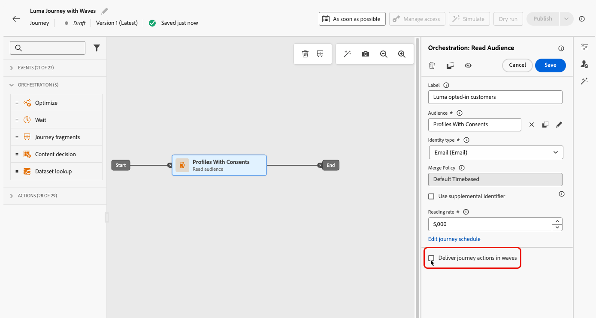
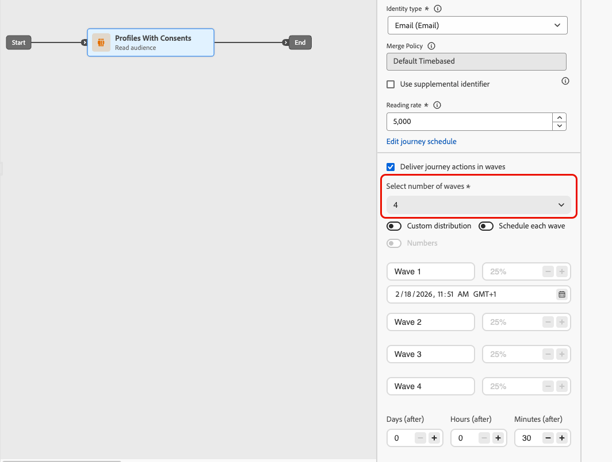
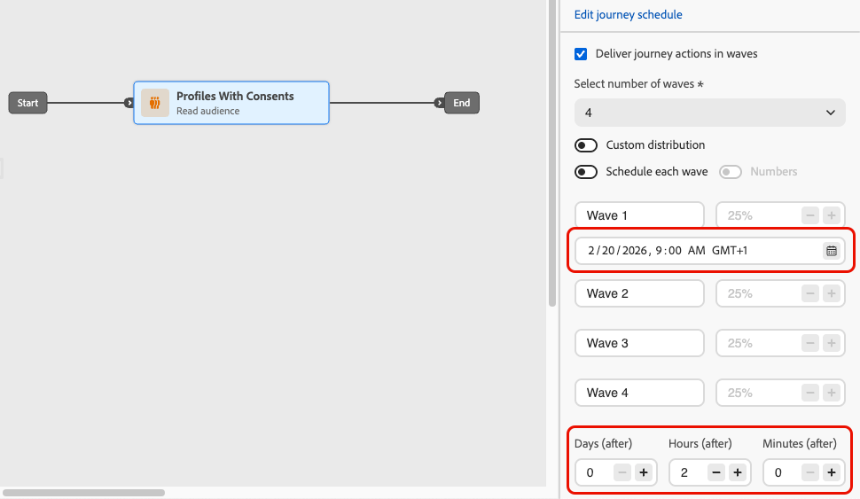
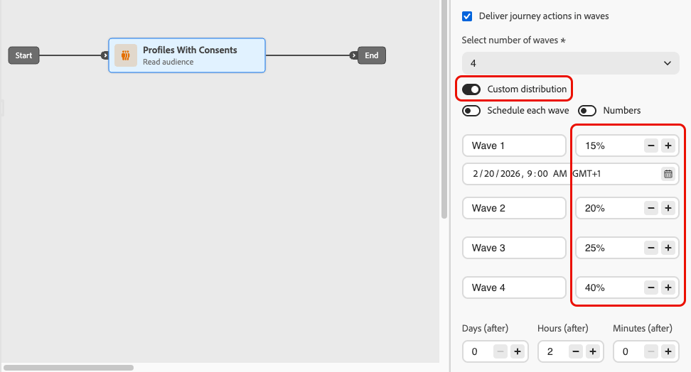
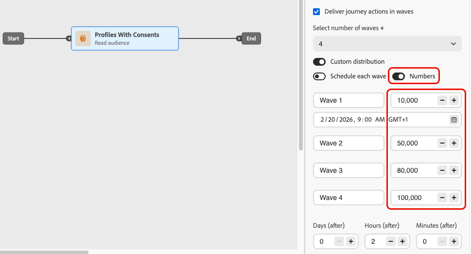
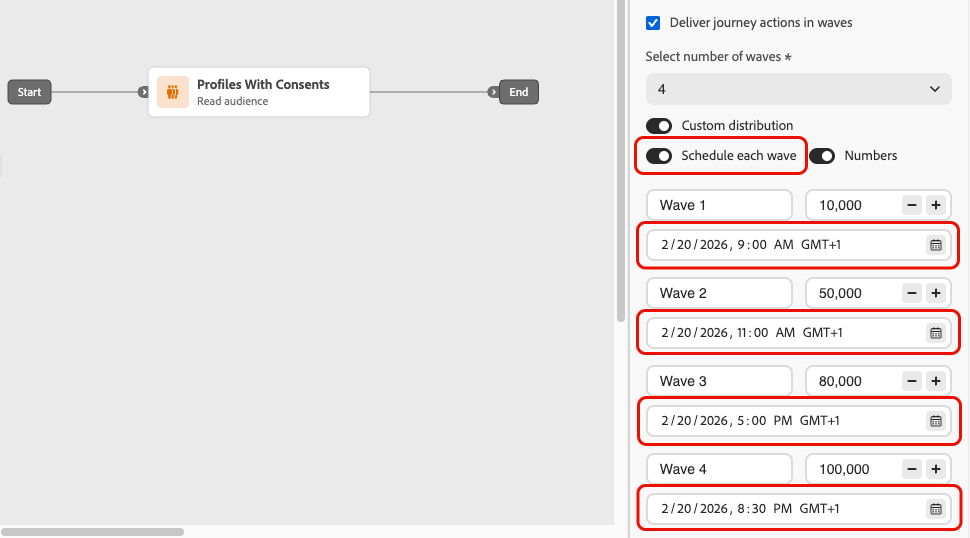
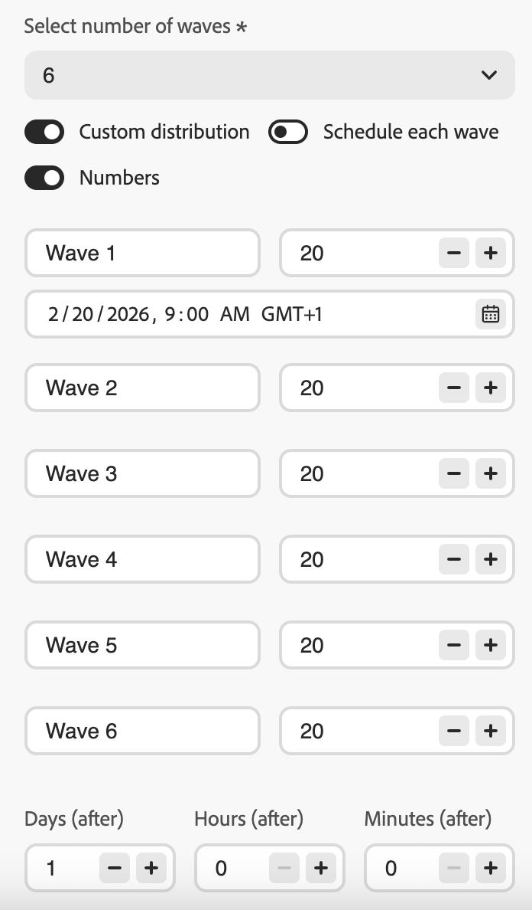
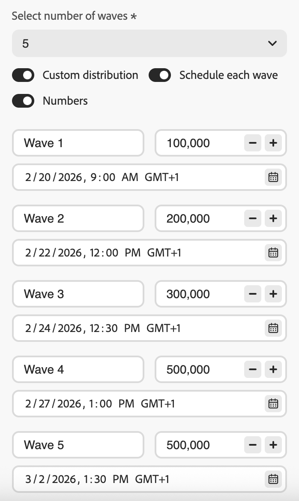
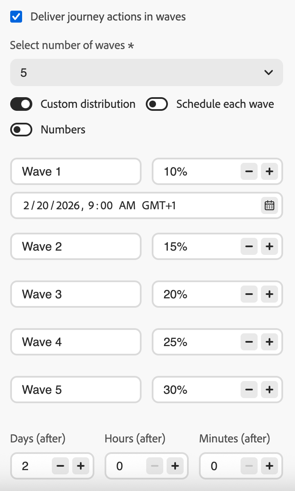

# 在歷程中使用波段傳送 {#send-using-waves-journeys}

>[!AVAILABILITY]
>
>此功能處於「有限可用性」。 請聯絡您的 Adobe 代表以取得存取權。

您可以在一段時間內以批次（波段）傳送歷程中的傳出訊息，而非一次傳送所有訊息。 Wave傳送有助於平衡負載、避免壓倒性的下游系統（例如呼叫中心或登陸頁面），並支援傳遞能力與傳送者信譽，尤其是對於高流量讀取對象歷程。

<!--
>[!CAUTION]
>
>Wave sending is available for read audience journeys only and applies to **outbound** actions only (Email, SMS, Push, Direct mail).-->

當您定義對象如何進入以及如何排程動作時，可在歷程層級進行設定。 您可以定義波段數量、波段大小（以對象百分比或絕對數字表示），以及每個波段執行的時機。

## 限制和護欄 {#limitations-guardrails}

* 波次傳送僅適用於具有&#x200B;**[!DNL As soon as possible]**&#x200B;和&#x200B;**[!UICONTROL 一次]**&#x200B;排程器型別的讀取對象歷程。 進一步瞭解[歷程排程](read-audience.md#schedule)。
* 波動傳送不適用於週期性、事件觸發、業務事件、測試模式或模擬執行歷程。
* 您必須定義至少&#x200B;**2個波段**，最多可新增&#x200B;**10個波段**。
* 兩個波段開始的最小間隔為&#x200B;**30分鐘**。
* 波段開始時間不能早於歷程開始時間或過去。
* 將對象分割成波段最多可能需要1小時。 在那之前，設定檔可能不會進入歷程。
* 在單一歷程版本中，兩個波段絕不會同時執行。 下一個波段只在上一個波段完成後開始。 例如，如果波段間隔1小時排程，但第一個波段執行2小時，則第二個波段會在第一個波段結束時開始，而不是在其排程時間開始。
* 當平台套用配額限制或系統容量負載較重時，波次啟動可能會延遲。

## 設定歷程中的波段傳送 {#configure-wave-sending}

1. 以[讀取對象](read-audience.md)活動開始您的歷程。

1. 連按兩下&#x200B;**[!UICONTROL 讀取對象]**&#x200B;活動以開啟其屬性，並選取&#x200B;**[!UICONTROL 以波形傳送歷程動作]**&#x200B;選項。

   {width="100%"}

1. 設定&#x200B;**波段數** （例如4）。

   {width="80%"}

   >[!NOTE]
   >
   >您至少必須定義2個波段，最多可新增10個波段。

1. 選擇如何定義波段大小和時間，如下所述。

### 等波 {#equal-waves}

依預設，對象會分割成大小相等的波段。 設定每個波段開始之間的固定間隔（例如2小時）。

{width="70%"}

>[!NOTE]
>
>兩個波段開始的最小間隔為&#x200B;**30分鐘**。

系統接著會自動排程後續波段（例如，第一個波段在早上9:00，第二個波段在晚上11:00，第三個波段在晚上1:00，第四個波段在晚上3:00）。

### 自訂分佈 {#custom-distribution}

選取&#x200B;**[!UICONTROL 自訂分佈]**&#x200B;選項，將每個波段的大小定義為總受眾的百分比（例如15%、20%、25%、40%）。

{width="70%"}

>[!NOTE]
>
>所有波段的總和必須等於100%。 如果不是這種情況，則會顯示警告訊息。<!--are the waves actually sent or does the system prevent user from saving the journey?-->

選取&#x200B;**[!UICONTROL 數字]**&#x200B;將每個波段的大小定義為設定檔的絕對數（例如10,000； 50,000）。

{width="70%"}

>[!NOTE]
>
>使用數字時，系統不會驗證總和是否涵蓋整個對象，您必須確保您的波段大小涵蓋您打算傳送的對象。 進一步瞭解[常見問題](#faq)。

### 自訂排程 {#custom-schedule}

選取&#x200B;**[!UICONTROL 排程每個波段]**&#x200B;以定義每個波段的特定開始日期和時間。 波段不需要平均間距（例如，上午9:00、上午11:00、下午5:00、下午8:30）。

{width="70%"}

>[!NOTE]
>
>兩個波段開始的最小間隔為&#x200B;**30分鐘**。

## 使用案例 {#use-cases}

Wave傳送可協助您控制傳送訊息的時間和數量，以改善傳遞能力、保護寄件者信譽，並使傳送訊息符合您的營運容量。 考慮在以下情況下使用波段：

* **客服中心或回應管理：**&#x200B;限制每天或每小時傳出的訊息數目，以便下游團隊（例如客戶服務）可以處理回應。 例如，每天傳送20則訊息以符合客服中心容量。

  {width="55%"}

* **高容量與傳遞能力：**&#x200B;請避免一次傳送非常大的歷程。 隨時間分散傳遞，以協助維持寄件者的信譽並降低被標籤為垃圾郵件的風險。

  {width="55%"}

* **提升：**&#x200B;使用新平台或IP時，逐步增加音量（例如，第一波增加10%，然後增加15%、20%等）以逐步建立聲譽。

  {width="55%"}

## 常見問題 {#faq}

+++ 如果波段大小的總和不等於您的總受眾，會發生什麼情況？

* 如果您的波段大小總和&#x200B;**超過**&#x200B;個對象（例如，您排程在第一個波段中為100,000個對象設定100,000），則第一個波段將傳送給整個對象，而其餘波段將沒有剩餘的人員可傳送，這些波段將不會執行。
* 如果&#x200B;**的總和小於受眾**（例如，您為總共100,000個受眾定義了四個波段，總共40,000個設定檔），則只有這些波段中包含的設定檔會收到訊息。 其餘對象將不會收到通訊，且不會在後續批次中重試。

+++

+++ 我可以指派不同的區段或條件給個別波段嗎？

您只能定義波段的大小和時間。 相同的對象會流經歷程；您無法將不同的區段或條件指派給個別波段。

+++

## 另請參閱 {#see-also}

* [在歷程中使用對象](read-audience.md) — 設定「讀取對象」活動。
